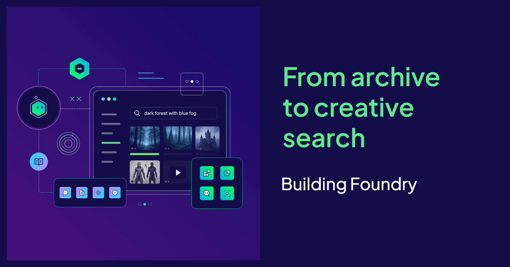
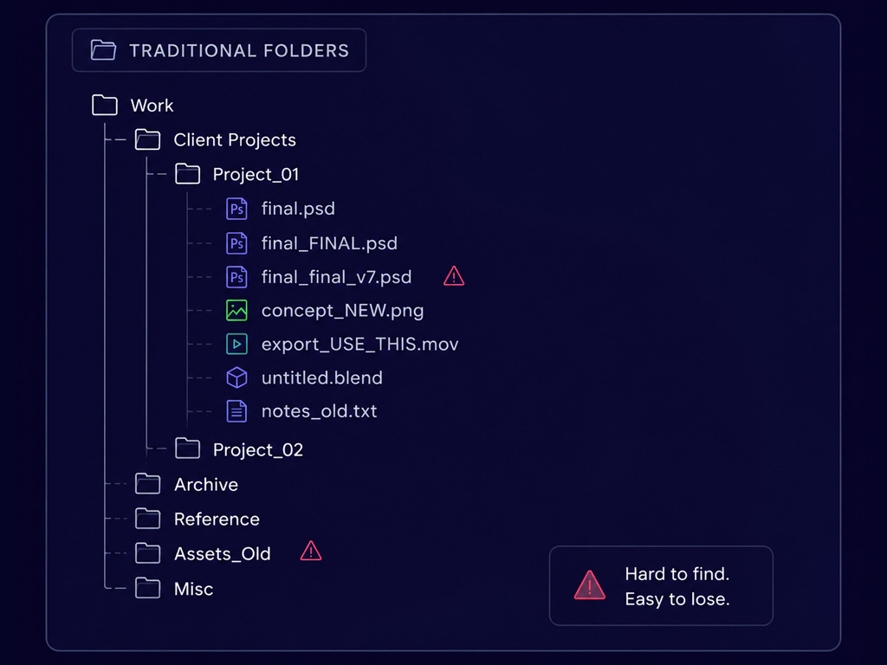
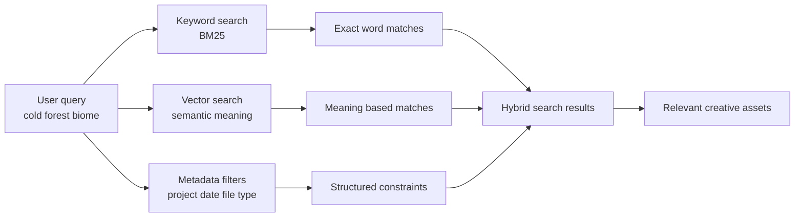
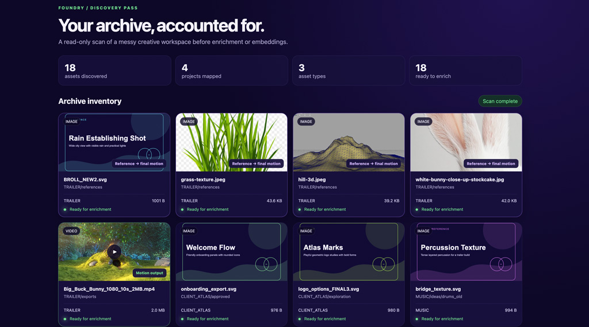
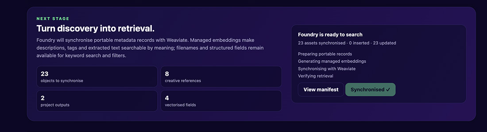
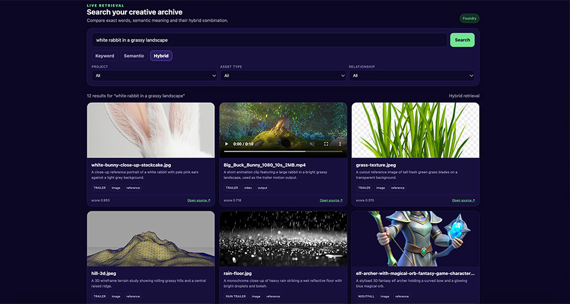

import foundryTestVideo from "./img/Foundry_test.mp4";

Creative teams accumulate work faster than they can retrieve it. Foundry is a practical prototype for turning that archive into a trustworthy search loop: discover what exists, enrich the records, ingest them into Weaviate, and retrieve assets by meaning as well as exact words.

The prototype currently scans 23 assets across five projects, including images, documents, references, and video. It then prepares those records for Weaviate and lets us compare keyword, semantic, and hybrid retrieval in one interface. This matters because messy folders, decaying tags, and vocabulary mismatches can make useful creative work effectively invisible.

## The real bottleneck

Most time disappears outside the moment of creation: in searching, re-creating lost work, and stitching together references. Traditional keyword search forces users to guess filenames or tags that may no longer exist. Folders tell you where something landed, not what it means. Tags decay under delivery pressure. The result: senior staff act as walking indexes and new hires rebuild context from scratch.



## What retrieval must do

Design retrieval for imperfect data: it should succeed when names are wrong, tags are incomplete, and users can only describe what they remember. That requires three signals combined:

- semantic similarity (meaning)
- keyword matching (exact identifiers)
- metadata filters (production constraints)

When blended, these signals return relevant assets while preserving production-safe constraints like project, rights, and file type.



## Discovery: the practical first step

Before any semantic layer, you must know what lives in the archive. A read-only discovery pass scans folders, records observable facts (filename, path, mime type, size, modified date), and generates a stable manifest using content hashes. This manifest is reviewable and idempotent: unchanged files keep the same identifier, changed files produce new hashes.



Why this matters: discovery makes uncertainty explicit (what was skipped, what lacks rights info, what changed), and it gives enrichment and ingestion stages a reliable surface to work from. A simplified manifest record looks like this:

```json
{
  "id": "1f020c98de36e792a4f82061",
  "fileName": "final_FINAL_v7.svg",
  "relativePath": "NIGHTFALL/01_CONCEPT/forest/final_FINAL_v7.svg",
  "mimeType": "image/svg+xml",
  "assetType": "image",
  "project": "NIGHTFALL",
  "folderPath": "NIGHTFALL/01_CONCEPT/forest",
  "contentHash": "1f020c98de36e792a4f820616c4fbcf0...",
  "enrichment": {
    "status": "pending",
    "description": null,
    "tags": [],
    "extractedText": null
  },
  "rights": { "status": "unknown", "expiresAt": null }
}
```

## Enrichment and ingestion

With a manifest in hand, enrich records per media type: image captions or visual tags, document OCR and extracted text, video transcripts and keyframes. Produce a prepared object that pairs descriptive text with structured fields and a stable source URI (for example, a foundry:// pointer). Write the prepared objects to an import file ready for ingestion.

Foundry does not upload the raw archive into Weaviate. The original files remain in their existing storage. Weaviate receives the searchable representation: descriptions, extracted text, metadata, embeddings, and a source URI that points back to the original asset.


Ingestion writes descriptive text and metadata into a vector-capable store (Weaviate in our prototype), where managed embeddings make semantic retrieval practical at scale. Keep the source files in place — Weaviate is the searchable layer, not the source of truth.



The completed sync is an important boundary in the workflow: the archive has been discovered, the records have been prepared, and the searchable layer is ready to answer queries.

## Hybrid search in practice

Expose three retrieval modes so teams can see differences and trust results:

- keyword → exact text matches for recallable identifiers
- semantic → meaning-based matches for described memories
- hybrid → combine both signals and apply metadata filters

Hybrid search lets a user describe an idea ("rainy neon alley, practical lighting") and find the exact shot, concept image, or related reference even when filenames contain no helpful words. Metadata filters keep results production-safe (project, date range, rights, asset type).



<figure>
  <video width="100%" controls>
    <source src={foundryTestVideo} type="video/mp4" />
    Your browser does not support the video tag.
  </video>
  <figcaption>
    Foundry: live hybrid retrieval and preview (demo video)
  </figcaption>
</figure>

## What this unlocks

- Faster iteration: teams spend less time hunting and more time making.
- Reuse becomes the norm: archives turn from opaque to valuable.
- Cross-media retrieval: images, video, and documents appear together as a coherent result set.

## Implementation checklist

1. Run a read-only discovery scan across your archive and produce a manifest.
2. Enrich records by media type (captions, transcripts, OCR, tags).
3. Prepare portable objects with `description`, structured metadata, and `sourceUri`.
4. Ingest into Weaviate (or another vector store) with managed embeddings.
5. Expose keyword, semantic, and hybrid queries with metadata filters.
6. Verify and iterate: review missed assets, refine enrichment, add rights info.

## Run the prototype & repo

The full demo, scanner, enrichment manifest, and ingestion flow are available in the Foundry repository. See the README to run the local scan or connect to Weaviate Cloud:

- [Foundry on GitHub](https://github.com/Shan-Weaviate/foundry)

```bash
git clone https://github.com/Shan-Weaviate/foundry.git
cd foundry
npm install
npm run demo
```

To enable cloud ingestion and live search, copy `.env.example` to `.env`, add your Weaviate Cloud credentials, and run:

```bash
npm run ingest:cloud
```

The full setup is documented in the [Foundry repository](https://github.com/Shan-Weaviate/foundry).

## What comes next

The current prototype uses deterministic enrichment so the workflow is repeatable. The next development stage is to replace those demo descriptions with automatic image captions, OCR, transcripts, keyframes, incremental rescans, and rights-aware filters.

The goal is not to replace the folders where creative work lives. It is to make the work inside those folders discoverable again.

import WhatsNext from "/_includes/what-next.mdx";

<WhatsNext />
