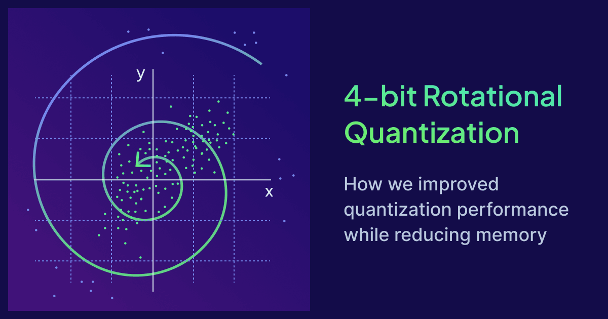

<br />

## Introduction

Last year we introduced [Rotational Quantization](https://weaviate.io/blog/8-bit-rotational-quantization) (or RQ) with 8-bit and 1-bit sizes. These quantization techniques allow for fast vector search, while reducing memory usage, and at better recall than comparable alternatives such as scalar and binary quantization.

Weaviate 1.39 extends RQ with 4-bit support, alongside a stack of quantization improvements in general. Rotations, distance kernels, encoding and the memory path have all been improved with net effect: 8-bit RQ is now *significantly faster* in 1.39 and 4-bit RQ provides similar recall with a **45%** heap reduction.

This post documents the story of that work, and along the way answers two questions people often ask: How does RQ hold up as datasets scale? And how does RQ compare to TurboQuant?

## Improvements

Rotational quantization is based on [Extended-RaBitQ](https://arxiv.org/abs/2409.09913) with a structured fast rotation and simplified per-vector interval fitting to speed up encoding. Fast encoding performance (converting the original vector into its quantized representation) is an important part of a good quantization algorithm as it can have significant impacts on import performance.

The first step in these approaches is to multiply the original vector by a random rotation matrix. It may seem counter-intuitive but a random rotation matrix gives [better properties](https://weaviate.io/blog/8-bit-rotational-quantization#the-universal-power-of-random-rotations-making-every-vector-well-suited-for-scalar-quantization) to the vector in particular distributing the dimension values over the entire length of the quantization interval.

To speed up the random rotation we use Fast Walsh-Hadamard Transforms (FWHT) to rotate the original vector. In 1.39, we added SIMD support for FWHT which led to the below improvements while being bit-identical to the Go reference:

| Transform | CPU | 1.38 (Go) | 1.39 (SIMD) | Speedup |
|-----------|-----|----------:|------------:|--------:|
| FWHT64  | Intel Xeon 8581C (amd64/AVX) | 81.3 ns | 26.5 ns | **3.1×** |
| FWHT256 | Intel Xeon 8581C (amd64/AVX) |  515 ns | 84.5 ns | **6.1×** |
| FWHT64  | Apple M1 (arm64/NEON)        | 67.4 ns | 21.6 ns | **3.1×** |
| FWHT256 | Apple M1 (arm64/NEON)        |  428 ns | 96.2 ns | **4.5×** |

Together with some other enhancements to SIMD encode kernels, this led to the following net increases in encoding performance across the whole RQ family:

| Quantizer | CPU | 1.38 | 1.39 | Speedup |
|-----------|-----|-----:|-----:|--------:|
| RQ8 | Intel Xeon 8581C (amd64/AVX) | 27.3 µs | 7.11 µs | **3.8×** |
| RQ1 | Intel Xeon 8581C (amd64/AVX) | 15.2 µs | 6.84 µs | **2.2×** |
| RQ4 (uncentered) | Intel Xeon 8581C (amd64/AVX) | — | 6.36 µs | **new in 1.39** |
| RQ4 (centered)   | Intel Xeon 8581C (amd64/AVX) | — | 8.08 µs | **new in 1.39** |
| RQ8 | Apple M1 (arm64/NEON)        | 14.7 µs | 6.18 µs | **2.4×** |
| RQ1 | Apple M1 (arm64/NEON)        | 13.0 µs | 6.18 µs | **2.1×** |
| RQ4 (uncentered) | Apple M1 (arm64/NEON) | — | 5.65 µs | **new in 1.39** |
| RQ4 (centered)   | Apple M1 (arm64/NEON) | — | 7.00 µs | **new in 1.39** |

### Distance kernels

The distance kernels were adapted to 4-bits via use of SIMD nibble (half byte) functions. We also switched to `UDOT` (arm64) and  `VPDPBUSD` (amd64) byte dot functions where possible, which also improved 8-bit quantization. Note the distance functions of 8-bit and 4-bit are similar but there is a big impact on memory bandwidth as explained in the following section.

Single query→code distance computation (cosine), 1.38 vs 1.39:

| Kernel | CPU | d | 1.38 | 1.39 | Speedup |
|--------|-----|---|-----:|-----:|--------:|
| RQ8 | Intel Xeon 8581C (amd64/AVX2) | 768  | 34.3 ns | 16.6 ns | 2.1× |
| RQ8 | Intel Xeon 8581C (amd64/AVX2) | 1024 | 42.8 ns | 19.8 ns | 2.2× |
| RQ4 (uncentered) | Intel Xeon 8581C (amd64/AVX2) | 768  | — | 16.0 ns | new in 1.39 |
| RQ4 (uncentered) | Intel Xeon 8581C (amd64/AVX2) | 1024 | — | 17.7 ns | new in 1.39 |
| RQ4 (centered)   | Intel Xeon 8581C (amd64/AVX2) | 768  | — | 21.9 ns | new in 1.39 |
| RQ4 (centered)   | Intel Xeon 8581C (amd64/AVX2) | 1024 | — | 23.4 ns | new in 1.39 |
| RQ8 | Apple M1 (arm64/NEON) | 768  | 24.9 ns | 17.0 ns | 1.5× |
| RQ8 | Apple M1 (arm64/NEON) | 1024 | 31.1 ns | 20.0 ns | 1.6× |
| RQ4 (uncentered) | Apple M1 (arm64/NEON) | 768  | — | 17.8 ns | new in 1.39 |
| RQ4 (uncentered) | Apple M1 (arm64/NEON) | 1024 | — | 21.0 ns | new in 1.39 |
| RQ4 (centered)   | Apple M1 (arm64/NEON) | 768  | — | 24.5 ns | new in 1.39 |
| RQ4 (centered)   | Apple M1 (arm64/NEON) | 1024 | — | 27.0 ns | new in 1.39 |

### Prefetching and memory access

To achieve sub 30ns distance kernels we also need the vectors to be cached effectively by the CPU cache. As graph ANN indices (like HNSW) have scattered DRAM access, memory bandwidth is often the *primary bottleneck* in performance - not the distance calculation itself.

To improve this in 1.39, we added efficient prefetching for both AMD64 and ARM64 architectures (and fixed a prefetching bug in AMD64 that was many years old). Prefetching helps by hinting to the processor what vectors will be used next. As HNSW expands to compute distances of neighbours we now prefetch or hint ahead of a batch of vector distance computations.

On a 1M-vector index (d=1536, ~800 MB of compressed codes, far beyond CPU cache), an A/B with only the prefetch hints removed shows they contribute **7–11% query throughput** (growing with ef) and **12% faster** imports.

### Centering and outliers

With the pipeline at hardware speed, we went looking for recall headroom at 4-bits. One open item was centering which we knew can add recall to many embedding datasets. Centering exploits the fact many embeddings have a non-zero mean vector. We compute this mean `μ` on a subset of the vectors and then encode `x − μ` against a single mean fitted at compression time, centering the query with the same mean, and add the cross-term back.

On many datasets centering showed significant recall improvements with recall@10 increasing by +0.1 to +6.1pp across several datasets, as embeddings tend to be [anisotropic](https://arxiv.org/abs/2401.12143v2), particularly [late-interaction models](https://huggingface.co/blog/lightonai/lateon-regularization). However some embedding models are regularized to remove this mean so we make the feature opt-in via a flag `centering=true`.

Additionally, when quantizing a vector the most extreme rotated coordinates add quantization noise to every dimension in that vector. By storing the largest two magnitude coordinates exactly, we managed to add +0.2 to +1.7pp recall on top of centering, and by careful packing of metadata bytes, we found we could store this in the standard 16 byte metadata header we already have.

## Results

### Recall

The below table shows the recall@10 achievable by each quantization method. This table shows *brute force* recall excluding the ANN index to isolate the effect on quantization itself.

| Dataset | RQ4 recall@10 / rescored@20 | RQ4c recall@10 / rescored@20 | RQ8 recall@10 / rescored@20 |
|---|---|---|---|
| dbpedia-ada002-1536-1M (cosine) | 93.5 / 100.0 | **96.8 / 100.0** | 99.0 / 100.0 |
| sphere-dpr-768-1M (dot) | 90.9 / 99.4 | **96.3 / 100.0** | 98.2 / 100.0 |
| sift-128-1M (l2) | 81.4 / 97.2 | **87.5 / 99.3** | 96.7 / 99.9 |
| glove-100-1.2M (cosine) | 87.0 / 99.2 | **89.9 / 99.8** | 98.5 / 100.0 |
| dbpedia-cohere-v2-4096-500k (dot) | 98.1 / 100.0 | **98.5 / 100.0** | 99.9 / 100.0 |
| msmarco-arctic-embed-m-768-1M (cosine) | 94.7 / 100.0 | **95.8 / 100.0** | 99.3 / 100.0 |
| nfcorpus-mlateon-mv-128 (maxsim) | 72.0 / 88.6 | **94.1 / 99.9** | 93.4 / 99.9 |
| scifact-mlateon-mv-128 (maxsim) | 77.7 / 94.0 | **94.5 / 100.0** | 94.9 / 100.0 |

Next and importantly, we show recall vs query performance in Weaviate using an HNSW index:

import ThemedImage from '@theme/ThemedImage';
import QpsRecallLight from './img/qps_recall.png';
import QpsRecallDark from './img/qps_recall_dark.png';

<ThemedImage
  alt="QPS vs recall@10 on dbpedia-openai-1M for RQ8, RQ4 and RQ4c in Weaviate 1.39, against RQ8 in 1.38"
  sources={{
    light: QpsRecallLight,
    dark: QpsRecallDark,
  }}
/>

It is quite visible the jump between 1.38 and 1.39 for the same 8-bit quantizer. Additionally the 4-bit performance to recall curves exceed 8-bit while using significantly less memory.

Here is the heap impact on the 1536 dimension vector dataset. Note you don't see half the memory usage (only 45%) because HNSW graph metadata (mainly the packed connections) also use memory. For reference storing this dataset unquantized would take 5.7GiB plus the graph metadata.

import HeapUsageLight from './img/heap_usage.png';
import HeapUsageDark from './img/heap_usage_dark.png';

<ThemedImage
  alt="Go heap in use on dbpedia-openai-1M: peak heap falls from 4.2 GiB with RQ8 in 1.38 to 2.3 GiB with RQ4 and RQ4c in 1.39"
  sources={{
    light: HeapUsageLight,
    dark: HeapUsageDark,
  }}
/>

Import times are also improved due to the faster encoding and distance functions. Imports on the same dataset drop 16% for RQ8 going from 1.38 to 1.39, and RQ4 and RQ4c come in 37% and 32% under the 1.38 baseline respectively.


import ImportTimeLight from './img/import_time.png';
import ImportTimeDark from './img/import_time_dark.png';

<ThemedImage
  alt="Import time on dbpedia-openai-1M: RQ8 is 16% faster in 1.39 than 1.38, and RQ4 and RQ4c are 37% and 32% faster than the 1.38 baseline"
  sources={{
    light: ImportTimeLight,
    dark: ImportTimeDark,
  }}
/>


### Does it hold at scale?

One interesting experiment we performed was to scale subsets of a shuffled sample of Meta's Sphere corpus (DPR, 768-dim, dot product) and then brute-force recall@10 against the exact ground truth, using 1,000 queries per point, from 1M to 250M vectors.

import RecallVsScaleLight from './img/recall_vs_scale.png';
import RecallVsScaleDark from './img/recall_vs_scale_dark.png';

<ThemedImage
  alt="RQ quantizer recall is constant from 1M to 250M vectors"
  sources={{
    light: RecallVsScaleLight,
    dark: RecallVsScaleDark,
  }}
/>

| Quantizer | Recall 1M | Recall 10M | Recall 100M | Recall 250M |
|---|---|---|---|---|
| rq8 | 97.15 | 97.09 | 97.09 | 96.90 |
| rq4c| 94.00 | 93.51 | 93.82 | 93.53 |
| rq4 | 84.58 | 83.41 | 84.63 | 85.02 |

The big result here is that recall is flat across a 1M-250M range. Even re-running with independent queries still produced a fairly tight band.

This graph also clearly shows the huge recall benefit that comes from rescoring (i.e. rescoring the top 20 vector distances with unquantized vectors), and how RQ4 centered can more accurately handle datasets with skewed mean.

A caveat of this result: although the quantizers can have close to scale free recall in this range, the ANN indices do have parameters that degrade with scale. One standard way to handle this is to shard the dataset appropriately (and sharding is usually recommended anyway when scaling to large datasets).

### How many vectors does the RQ4 mean need?

RQ4 centered fits the mean μ, from a sample capped at 10,000 vectors by default. This is automatically completed with async indexing enabled. By fitting the mean on the first N vectors of a dataset and measuring its distance to the full-corpus mean we can measure the spread the interval covers:

import MeanConvergenceLight from './img/mean_convergence.png';
import MeanConvergenceDark from './img/mean_convergence_dark.png';

<ThemedImage
  alt="Distance from the full-corpus mean as a function of the number of vectors used to fit it, on dbpedia-1M, for a random sample and for dataset order; both follow the sqrt(1/N - 1/M) sampling curve"
  sources={{
    light: MeanConvergenceLight,
    dark: MeanConvergenceDark,
  }}
/>

At the 10k default the fitted mean sits within ~1% of a corpus radius of where 100x more data would put it. Fitting on the whole corpus instead is worth nothing measurable (largest difference across seven datasets: 0.20pp, with two datasets *ahead* on the 10k fit). Hence for RQ4 the default training limit is 10,000 which enables memory savings to start earlier.

### Comparison with TurboQuant

One question we get about RQ is how it compares to [TurboQuant](https://arxiv.org/abs/2504.19874), another quantization technique using a random rotation but using Lloyd-Max codebooks instead of a uniform grid to quantize the vectors after rotation.

For the below comparison we ran a recall benchmark of our own implementation against a popular open-source TurboQuant [implementation](https://github.com/0xsero/turboquant). If you would like more details comparing RaBitQ with TurboQuant we also recommend [Revisiting RaBitQ and TurboQuant: A Symmetric Comparison of Methods, Theory, and Experiments](https://arxiv.org/abs/2604.19528), which goes further into details of comparing the two algorithms.

| Dataset | RQ8 | RQ4 | RQ4c | 4-bit TurboQuant (paper) | 4-bit TurboQuant (renorm) | 4-bit TurboQuant (centered+renorm) |
|---|---|---|---|---|---|---|
| dbpedia-ada002-1536-1M (cosine) | 99.0 | 93.5 | **96.8** | 87.4 | 94.5 | 96.4 |
| sphere-dpr-768-1M (dot) | 98.2 | 90.9 | **96.3** | 76.6 | 91.6 | 95.8 |
| sift-128-1M (l2) | 96.7 | 81.4 | **87.5** | 80.4 | 81.0 | 85.3 |
| glove-100-1.2M (cosine) | 98.5 | 87.0 | **89.9** | 79.0 | 85.4 | 86.9 |
| dbpedia-cohere-v2-4096-500k (dot) | 99.9 | 98.1 | **98.5** | 97.4 | 98.2 | 98.2 |
| msmarco-arctic-embed-m-768-1M (cosine) | 99.3 | 94.7 | 95.8 | 91.5 | 95.1 | **95.9** |
| nfcorpus-mlateon-mv-128 (maxsim) | 93.4 | 72.0 | **94.1** | 26.8 | 76.2 | 93.2 |
| scifact-mlateon-mv-128 (maxsim) | 94.9 | 77.7 | **94.5** | 36.7 | 81.1 | 94.1 |

Here TurboQuant (paper) is the stock TurboQuant MSE variant in the paper, (renorm) adds renormalization which has been found to be important in improving the base TurboQuant, and (centered+renorm) also adds mean centering to make things comparable with centered RQ4.

Paper-faithful TurboQuant loses on every dataset (and notably collapses with highly anisotropic multi-vector models like mLateOn). When adding centering and renormalization, the gap is closer but RQ4c wins on 7/8 datasets.

Finally, you may have noticed there is no "8-bit" TurboQuant in most public implementations. This is because the SIMD codebook trick that works at 2 or 4 bits no longer works at 8 bits (with large performance decreases). RQ is more adaptable here and usable across the full range.

## Using 4-bit RQ

4-bit RQ ships in Weaviate 1.39 as a `bits` setting on the existing RQ quantizer.

```json
"vectorIndexConfig": {
  "rq": {
    "enabled": true,
    "centering: true,
    "bits": 4
  }
}
```

In the Python client:

```python
from weaviate.classes.config import Configure, Property, DataType

client.collections.create(
    name="Recipes",
    vector_config=Configure.Vectors.text2vec_openai(
        quantizer=Configure.VectorIndex.Quantizer.rq(
            bits=4,
            centering=True,
        )
    ),
    properties=[
        Property(name="title", data_type=DataType.TEXT),
    ],
)
```


## Conclusion

We are excited to announce the suite of performance improvements we have done to Rotational Quantization, along with the new 4-bit size. Rotational quantization is tuned for fast encoding and distance calculations, achieving competitive recall and saving significant memory usage. Although we are keeping our default of 8-bit in Weaviate Cloud, we invite you to [try out 4-bit RQ](https://docs.weaviate.io/weaviate/configuration/compression/rq-compression#4-bit-rq) for cost savings and lower RAM usage.

---


