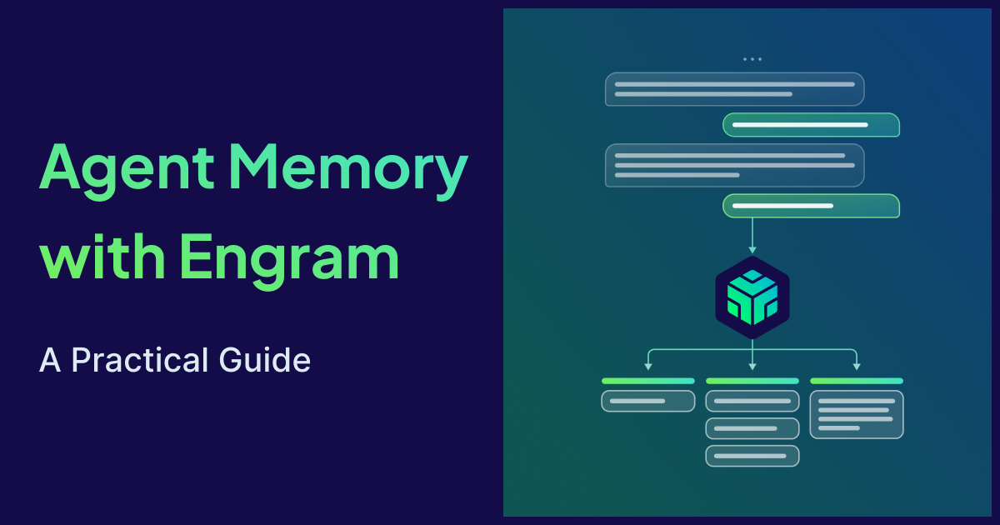
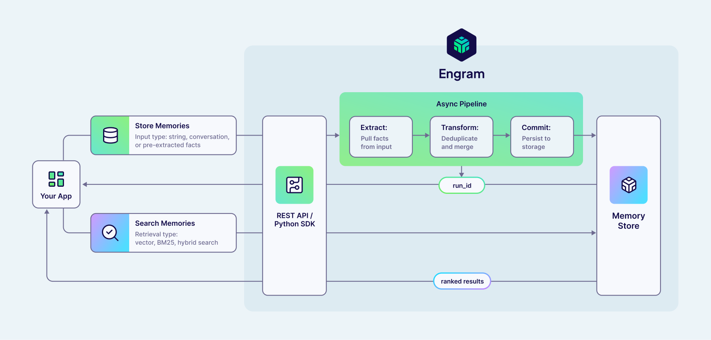
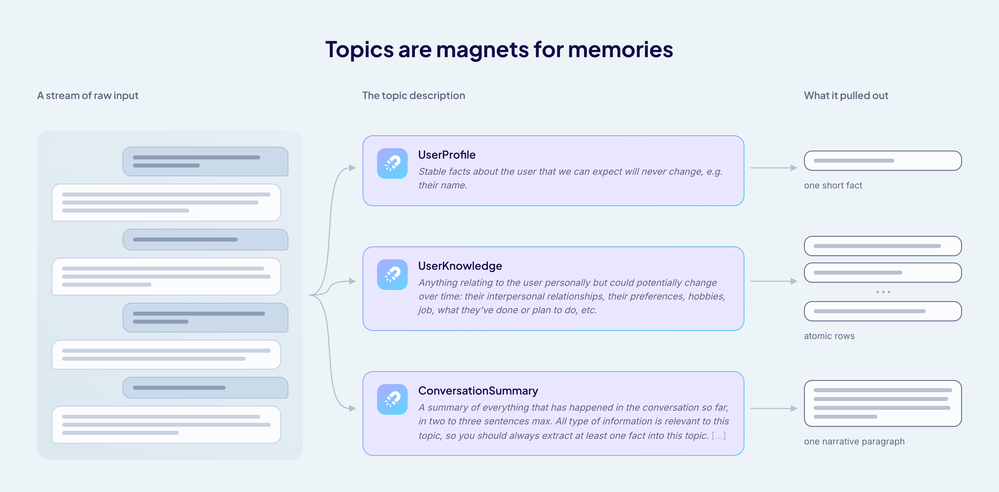
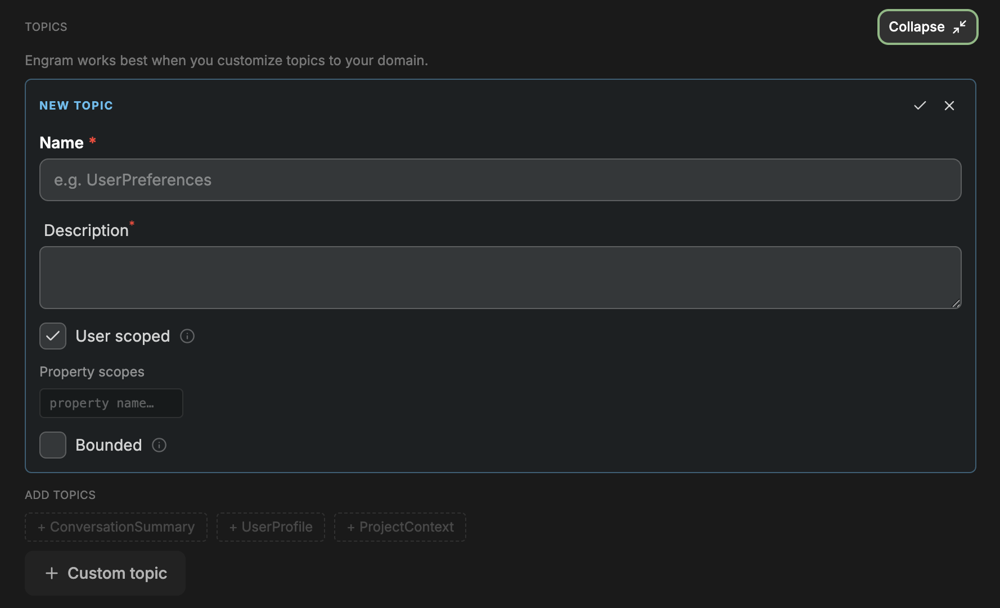
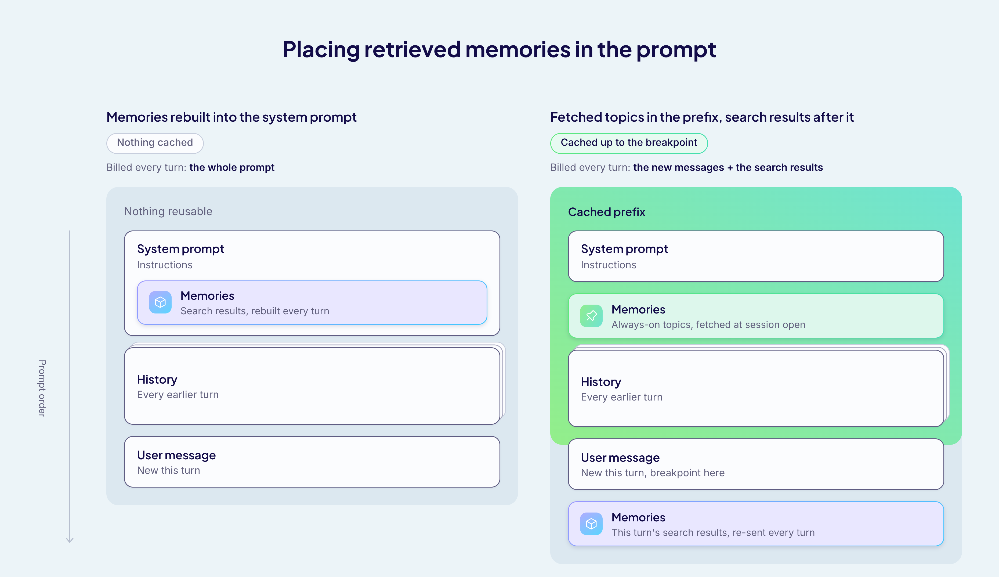

Every tool you've ever set up has an onboarding screen you just straight click past. Usually the defaults are chosen by someone who thought about them harder than you have time to.

Engram's setup has one of those screens too, and it takes a couple of minutes to get through:

name a project → pick a template → click past topics that are already filled in for you → generate an API key.

:::note

**[Engram](/product/engram) is our fully managed memory and context service purpose-built to help agents remember, learn, and improve over time.**

:::

Then you call `memories.add` with your raw conversation data, `memories.search` before your model call, and it works.

It keeps working, too. That's the interesting part, because nothing ever nudges you back to that screen. But somewhere between "it works" and "it works the way I meant it to", four decisions turn out to be yours rather than Engram's:

1. **[What gets remembered](#topic-descriptions)** (the topic descriptions)
2. **[How many memories, and whose](#bounded-and-scope)** (bounded topics and scope)
3. **[What comes back](#retrieval)** (the retrieval mode)
4. **[Where it goes](#prompt-placement)** (placement in your prompt)

In this post we walk through all four, with real outputs from a project mostly running the stock personalization template.

## How Engram turns a conversation into memories



Engram runs an asynchronous pipeline over whatever raw data you send it. By default, it:

1. extracts the memories that matter,
2. transforms them against what's already stored,
3. commits the result.

Victoria's walkthrough video covers that end-to-end, including the console setup and the SDK:

<div className="youtube" style={{ display: 'flex', justifyContent: 'center' }}>
    <iframe
        src="//youtube.com/embed/kX9IhyltvuQ"
        frameBorder="0"
        width="700"
        height="400"
        allowFullScreen>
    </iframe>
</div>

<br />

`memories.add` hands back a run, not a memory, and nothing you send is searchable until that run finishes. The [run status guide](https://docs.weaviate.io/engram/guides/check-run-status) covers the states, and why you usually shouldn't wait on one.

For how the pipeline itself works, the [Engram: Memory by Weaviate](/blog/engram-deep-dive) blog goes through it step by step. Which memories it pulls out of the data you send, though, is decided by your topic descriptions, so that is where we start.

## How topic descriptions decide what gets remembered {#topic-descriptions}

When you create a new Engram project in the console, the `User Personalization` template sets up `UserProfile` and `UserKnowledge` for you, and offers `ConversationSummary` as an optional third. I took all three, then sent it something about me:

> *"I'm Prajjwal, a developer advocate at Weaviate. I write all my demos in Python, and I have a hard rule that they stay under 100 lines."*

Five memories came back across the three topics:

```
[UserProfile]         The user's name is Prajjwal.
[UserKnowledge]       Prajjwal works as a developer advocate at Weaviate.
[UserKnowledge]       Prajjwal writes all his demos in Python.
[UserKnowledge]       Prajjwal enforces a hard rule that his demos stay under 100 lines.
[ConversationSummary] Prajjwal introduced himself as a developer advocate at Weaviate,
                      mentioned that he writes demos in Python, and follows a rule to
                      keep demos under 100 lines.
```

:::note

Other ready-to-use project templates exist as well, like `Coding Assistant` and `Personal Claw Agent`. And you can always start from a blank slate and fully customise the topics to your domain.

:::

`UserKnowledge` broke that one sentence into three atomic facts, each retrievable on its own. `ConversationSummary` kept it whole as a flowing narrative. Same input, same pipeline, same moment, and two completely different shapes, because the two topics describe themselves differently.



We didn’t write any routing logic or a formatter. The descriptions did both, because a topic description is the memory extraction prompt, and it controls three things:

### What to leave out

`UserKnowledge` is the template's catch-all topic, and anything personal about the user that might change over time belongs there. That makes it useful when you want broad coverage. But when you want a focused, niche memory, the description needs to do more than say what belongs - **it also needs to define what *doesn't***.

Take a throwaway message like:

> *"Two hours lost to a Docker rebuild, my headphones died mid-call, and it started raining right as I stepped out. Anyway, I finally swapped the demo over to qwen3-embedding-8b."*

Four memories came back. Three were weather, hardware, and other passing events. The agent now knows it rained on Thursday, and short of a delete call, that fact can stick around indefinitely.

To fix this, the broad topic can be replaced with a focused one by just specifying what you don't want to be remembered. I created a new topic called `UserFacts` to replace `UserKnowledge` and its description ends with a new rule:

> *"Do not record events, incidents, or passing conditions."*

That one line made the difference as it gives the model general criteria for what to ignore. I tested it with three new messages: a late train, a cat on the keyboard, and a stolen lunch, each paired with one lasting decision. Across 24 runs, none of the noisy incidents reached memories created by `UserFacts`, and the decisions were captured in all of them.

So, for a focused topic, a rule about what to exclude does more work than a list of what to include. Name the kind of thing you want left out, rather than every example you can think of, and the rule can generalise to cases you never anticipated. Also, `UserFacts` was created only for this experiment and from here on, I switched back to the stock `UserKnowledge` topic.

### What shape to write it in

You're almost certainly going to read your memories into a prompt, so you should describe the form you want, not just the subject. For example, *"Two or three sentences of plain prose, second person, no headings or bullet points"* gives you something you can drop into context untouched. Or ask for atomic facts instead, and you can get rows you can retrieve one at a time.

### When something is worth remembering

A description is applied to one input at a time, alongside whatever related memories the pipeline pulls in for it. That makes it good at judgements it can settle on the spot, but it cannot help with anything that depends on what came before.

Accumulating is a separate step. A pipeline chains extract, transform and commit step by default, and a fourth kind of step, a buffer, can sit anywhere among them. It holds memories or raw inputs back until a trigger fires which could be a count, or a timer. A rule about something building up over time belongs there, not in the wording of your description.

:::note

A default project runs extract, transform and commit. Adding a buffer, or reordering the steps around it, is configured per project and is currently available on enterprise plans.

:::

Also, topics are editable in the console at any time, so they can be added, removed, or reworded without recreating the project. This makes it easy to iterate until they work as expected.

## The other config fields

Description is one field. The rest are configuration rather than wording, and they carry their own effects. This is the form you see when you add a topic of your own in the console:



| Field | What it decides | If you get it wrong |
| --- | --- | --- |
| **Name** | how you address the topic in code, `topics=["UserProfile"]` | - |
| **Description** | the extraction prompt: what gets pulled out, and how it's written | the topic keeps everything, or nothing you can use |
| **User scoped** | memories belong to one `user_id` | uncheck it and every user shares one pool |
| **Property scopes** | extra partition keys like `conversation_id` or `repo` | every write must carry them, or nothing reaches the topic |
| **Bounded** | at most one memory per scope | leave it off and nothing guarantees a single memory to read back |

The [topics docs](https://docs.weaviate.io/engram/concepts/topics) cover all these concepts in more depth.

## What bounded topics and scope guarantee {#bounded-and-scope}

Bounded caps how many memories a topic may hold. Scope decides which of them a given read or write request can reach. Both are about what happens when a new message arrives for a topic that already holds memories.

Continuing the 100-line demo example from earlier, let's say four days later I send:

> "Update: the demo is 400 lines now. The 100-line rule is officially dead."

Zero memories created, two updated. `UserKnowledge` memories afterwards:

```
[UserKnowledge] Prajjwal works as a developer advocate at Weaviate.
[UserKnowledge] Prajjwal writes all his demos in Python.
[UserKnowledge] Prajjwal no longer enforces his previous hard rule of keeping demos
                under 100 lines; as of 5 Sep 2026 his demos are 400 lines long.
```

The memory about the 100-line rule was rewritten in place and the rule is gone. The other two were left alone, since nothing in the new message contradicted them. That is the transform step from the Engram pipeline doing its job, and every topic gets it, bounded or not. Note that `deleted` was zero, as reconciliation generally supersedes rather than erases. If you want a memory gone explicitly, you delete it with `memories.delete()`.

### Bounded

What bounded adds is a promise about the count. A bounded topic holds at most one memory per unique scope. Engram derives the memory's ID from the topic name and the scope, so every later write lands on that same ID and updates it instead of adding another.

The update above was one run. Send the introduction and then the update message to five fresh users, each starting from an empty store, and count how many memories land:

```
                              run 0  run 1  run 2  run 3  run 4
UserKnowledge (unbounded)         2      4      4      3      3
UserProfile (bounded)             1      1      1      1      1
```

The unbounded topic landed anywhere between two and four memories: sometimes the retraction became one memory, sometimes two, and so on. `UserProfile` always held exactly one memory, five times out of five, because it is bounded. So if your code needs to read a single standing memory for a topic, you should always bound the topic rather than trusting the count. The template bounds `ConversationSummary` for the same reason. A conversation should have one running summary that gets rewritten, not a new one per message.

### Scope

Scope partitions a topic, and there are two kinds. User scope is a hard wall as every write and every read has to carry a `user_id`. Property scopes like `conversation_id` or `repo` are required on writes but optional on reads, so you can read one partition or all of them at once.

That optionality is the reason to use a property. The template scopes `ConversationSummary` by `conversation_id`, so each thread keeps its own summary and you can still ask for every summary a user has. If two partitions are never meant to be read together, don't use a property and give them separate `user_id`s instead. And if a fact should follow the user everywhere, leave it at user scope and add nothing.

A write has to carry every key the topic declares, or it's rejected like this:

```
insufficient scope: missing required scope properties [conversation_id] to write memories
insufficient scope: missing required user_id to write memories
invalid scope property: [repo] not configured on any topic (configured properties: [conversation_id])
```

An empty string counts as missing, and a property no topic declares gets an error naming the ones the project has. Reads only insist on `user_id`. An empty `conversation_id` is treated as absent and searches every conversation, even though a write would have rejected it, and a `conversation_id` that was never written simply returns nothing from the conversation-scoped topic.

## How to read memories back {#retrieval}

There are four retrieval modes. `vector`, `bm25` and `hybrid` all are for search: you give them a query, they score every memory against it, and you get the best ones back in ranked order. `hybrid` is what runs if you don't pick one, while `fetch` is designed for direct, non-ranked memory retrieval.

### Search

`search` ranks by relevance to a query. In a chat app, that query is usually the user's current message:

```python
from engram import HybridRetrieval

hits = client.memories.search(
    query=user_message,
    retrieval_config=HybridRetrieval(limit=3),
    user_id=uid, properties=props,
)
context = "\n".join(f"- {m.content}" for m in hits)
```

Set `limit` to the number of memories you actually want in the prompt. The default is ten, and you get ten whether or not the tenth has anything to do with the question. Ask for too many, and you pay for irrelevant memories on every turn. Ask for too few, and the agent misses the one fact that mattered.

### Fetch

`fetch` is closer to a listing operation than a search: name the topic, get its memories back, no ranking involved.

```python
from engram import FetchRetrieval

profile = client.memories.search(
    query="unused", # fetch ignores this, but the API insists
    retrieval_config=FetchRetrieval(limit=1),
    topics=["UserProfile"],
    user_id=uid, properties=props,
)
```

Nothing comes back with a score as the results are not ranked. It suits bounded topics well, as "which memory" has only one answer there.

### Get

If you already hold a memory's ID, use `get` to simply read it back:

```python
memory = client.memories.get(
    memory_id,
    user_id=uid,
)
```

So, to read memories from Engram: `search` when you want what is relevant to a query, `fetch` when you want everything a topic holds, and `get` when you need to view a memory by its ID.

The API specifics can change, therefore, always refer to the current definitions in the [search memories](https://docs.weaviate.io/engram/guides/search-memories) and [manage memories](https://docs.weaviate.io/engram/guides/manage-memories) docs. The latter also covers deletion, which is permanent.

## Where retrieved memories belong in your prompt {#prompt-placement}

The obvious thing to do with search results is to paste them into the system prompt - search memories on every turn, rebuild the system prompt, send. It works fine, and in a short chat you will never notice anything wrong with it.

The bill shows up in long sessions as most LLM providers cache prompts from the front. If a request starts with the same text as an earlier one, that shared opening is read from cache at a fraction of the price. The cached part runs up to a breakpoint. Change anything before that breakpoint, and everything from the change onward is billed in full again.

Memory search results can change every turn, and when you paste them into the system prompt, they sit in front of everything else. So the history behind them is almost never read from cache, and you pay for the whole prompt on every turn.

That means a prompt can have memory in two places:

- Before the breakpoint, for text that stays the same for the whole session.
- After the breakpoint, for text that changes every turn.

Engram's two reads line up with them: `fetch` returns a whole topic without a query, `search` returns what matches the current message (or query).

### Search results go last

A better option is to move the search results to the end of the prompt, after the user's message, in a message of their own. On the next turn, you replace that message with the new search results rather than keeping both. Put the breakpoint on the user message just before it. Now the system prompt and the whole history are read from cache, and you pay in full only for the new messages and the memory block.

The breakpoint is the important part here because if you don't place it, the provider puts it at the end of the last message, which in this layout is the memory block. And if that block is different next turn, the prefix doesn't match. In this situation, GPT-5.6 models end up caching only the system prompt, and Claude models don't get a cache hit at all.

The field for placing the breakpoint also differs by provider:

- on [GPT-5.6](https://developers.openai.com/api/docs/guides/prompt-caching) and later, `prompt_cache_breakpoint` on the user message's content block
- on [Claude](https://platform.claude.com/docs/en/build-with-claude/prompt-caching) models, `cache_control` on the same block

### Always-on topics go first

Some memories are needed on every turn, whatever the user asks. Like, in one of our internal agents I built, those were the user's profile and writing preferences. If someone says they write in British English or introduces themselves, every reply in the session should know that, not just the replies where the search happens to bring it back.

Searching for those every turn is wasted work, and it puts text that never changes inside the block that does. The alternative is to `fetch` them once when the session opens and put the result in a user message right after the system prompt. It stays identical all session, so it is read from cache from the second turn on.

Which topics go in front depends on how often they get rewritten, not on whether they are bounded. In our example, `UserProfile` rarely changes, so it can sit at the front. `ConversationSummary` is bounded too, but it is rewritten on every message, so it stays in the per-turn search.

Also, name the topics explicitly in both calls, or the same memory can appear twice. A plain `search` may return the user’s profile alongside everything else, so in our running example the split would become:

- a `fetch` with `topics=["UserProfile"]` when the session opens
- a `search` with `topics` set to the rest, on every turn

The trade-off here is freshness. Whatever the user says in the current session is in the history anyway, but if another session rewrites one of the fetched memories, the current session won't see the change until the next one opens.



If the whole store is small enough to fit in the prompt, you can also just skip the search entirely and fetch everything at the start. Cached tokens still cost something on every turn, so that only pays off while the store stays relatively small.

These are the four layouts from the test runs behind this post - 25 turns each on `gpt-5.6-luna`, and what you pay for on every turn after the first:

| Layout | Fully billed every turn |
| --- | --- |
| memories pasted into the system prompt | the whole prompt |
| memories sent last, no breakpoint placed | everything after the system prompt |
| memories sent last, breakpoint on the user message | the new messages and the memories, including always-on ones |
| always-on topics fetched at start, search results sent last | the new messages and the search results only |

With the always-on topics fetched at the start and the search results sent last, the final request was about 3,500 tokens and only around 100 of them were not read from cache.

So, how much you save depends on how much sits in front of the memory block and how long the session runs. Always measure the efficiency on your own stack and check the cached-token count whenever you touch prompt layout, as nothing errors when caching breaks, the bill just goes up.

## Summary

The fastest way to fix what your agent remembers isn't more application code. It's opening the topics you clicked past during setup and writing down what you actually want kept - what to leave out, what shape to write it in, and what isn't worth recording at all (unless your setup works just fine using one of our templates).

Then bound the topics that must be singular, scope the ones that need partitioning, set a `limit` to the number of memories you actually want in the prompt, and keep what you fetched at the front of the prompt and what you searched for at the end. A few minutes on that config screen is usually all it takes! Otherwise you get an agent that remembers your name and not much else.

> **Get started with [Engram](/product/engram) in [Weaviate Cloud](https://console.weaviate.cloud/) and create your free project today.**

For any questions, ideas, or to just chat, feel free to join the conversation on our [community forum](https://forum.weaviate.io/).

Happy building!
