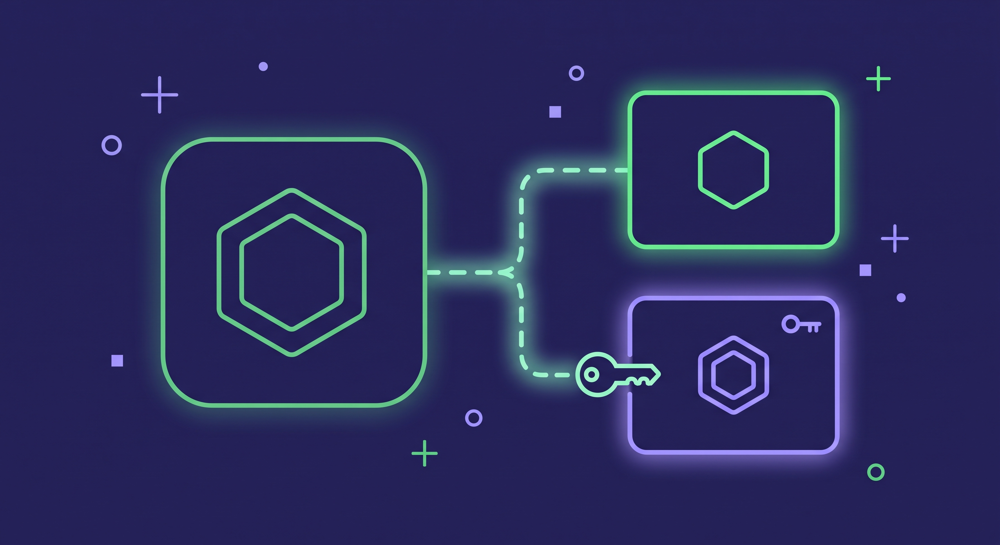
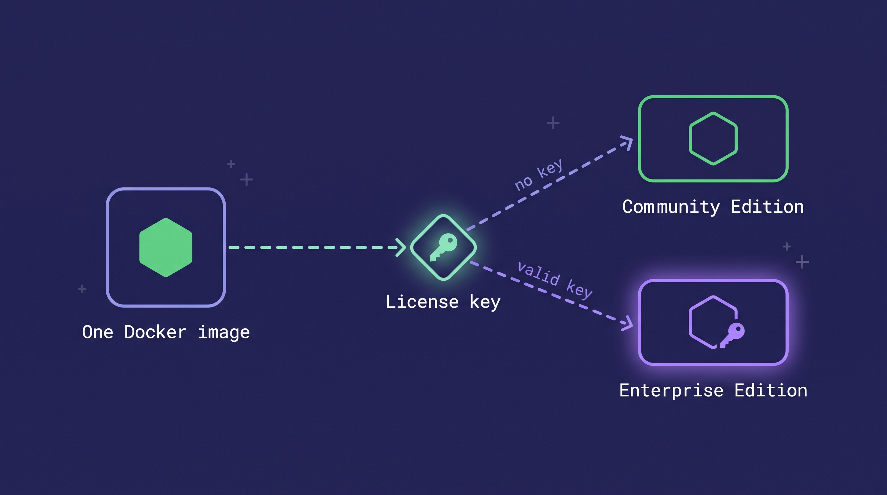

With **Weaviate 1.40**, we're introducing the **Weaviate Enterprise Edition**, a set of features for teams that run Weaviate at scale. It sits alongside the Community Edition, which is the open-source Weaviate you already use, licensed under BSD-3-Clause.

**This change has no impact on how you use Weaviate today. The Community Edition stays open source under BSD-3-Clause, stays complete, and stays free. There are also no changes for Weaviate Cloud users.**

## What isn't changing

Weaviate is open source under the [BSD-3-Clause License](https://github.com/weaviate/weaviate/blob/main/LICENSE-BSD), and that isn't changing. You get the same Docker image and the same download, and there's no registration.

The open-source Weaviate you run now has a name: the **Community Edition**. You can use it, modify it, and redistribute it, including commercially and in production, at no charge. When you upgrade to Weaviate 1.40, you don't have anything new to configure. Without a license key, Weaviate starts as the Community Edition.

We aren't moving any existing open-source feature into the Enterprise Edition, and we aren't adding artificial limits to the Community Edition.

## What we're adding and why

**The Enterprise Edition is optional**. It adds advanced features under a commercial license, next to the open-source Community Edition, and it's meant for organizations that run Weaviate at scale. Its features fall into three areas: security, scaling, and stability.

Work in those areas doesn't fit in a single release. A feature that automates cluster operations has to be built, and then kept working as the rest of Weaviate changes around it. Security hardening and resilience for large clusters take the same kind of steady engineering work across many releases. Revenue from support and Weaviate Cloud doesn't cover investment at that depth on its own, and the Enterprise Edition goes a long way toward funding this kind of work.

The same investment pays for work you get in the Community Edition:

- **Security fixes and responsible disclosure:** When someone reports a vulnerability, we fix it in the Community Edition too.
- **The regular release and patch cadence:** You get the same releases and patches on the Community Edition.
- **Performance work:** Improvements to features like indexing and search ship in the Community Edition.
- **Dependency maintenance:** We keep libraries and toolchains current, including their security patches.

The first Enterprise Edition feature is [Shard Self-Recovery](https://docs.weaviate.io/deploy/enterprise), which automates operations on top of the replication the Community Edition already includes for free. It's one feature, and that's where we're starting. More Enterprise Edition features will arrive in upcoming releases.

## How the Enterprise Edition works

Both editions ship in one Docker image and one binary. When Weaviate starts, the license key decides which edition runs:

- **Without a license key, Weaviate runs as the open-source Community Edition.**
- **A valid license key enables Enterprise Edition features at runtime.**

To move from the Community Edition to the Enterprise Edition, you get a license key and restart Weaviate with it. There's no new image and no new download. You pass the key in the `LICENSE_KEY` or `LICENSE_KEY_FILE` environment variable, and the [Enterprise Edition docs](https://docs.weaviate.io/deploy/enterprise#activate-the-enterprise-edition) cover the details. License keys apply to self-hosted deployments only.

{/* TODO(ivan): license request link */}

**If you use Weaviate Cloud, this change has no impact on you. You don't need a license key.**

The Enterprise Edition code is source-visible. It lives in the [`wl/` directory](https://github.com/weaviate/weaviate/tree/main/wl) of the [`weaviate/weaviate`](https://github.com/weaviate/weaviate) repository, where anyone can inspect it. We keep it in the same public repository for transparency and auditability, so you can read exactly what the Enterprise Edition adds. Reading the code doesn't give you a license to use it, though. That code is licensed under the Weaviate License and requires a commercial agreement. Everything outside `wl/` is the Community Edition, under BSD-3-Clause. The repository's top-level [`LICENSE`](https://github.com/weaviate/weaviate/blob/main/LICENSE) file says which license covers which code, and the Weaviate License terms are in [`wl/LICENSE-WEAVIATE`](https://github.com/weaviate/weaviate/blob/main/wl/LICENSE-WEAVIATE).

{/* TODO(ivan): legal page link */}

## Our commitments

We'd rather spell our commitments out than leave you to infer them. Here's what we're committing to with this change:

- The Community Edition is open source under BSD-3-Clause.
- No existing open-source feature moves to a paid tier.
- The Community Edition has no artificial limits.
- Both editions ship in one image, with no registration required.
- Enterprise Edition code is clearly separated in the `wl/` directory and marked with its own license.

**No feature that is open source today moves to the Enterprise Edition.**

If you run the open-source Community Edition and have questions about this change, or anything else, open a [GitHub issue](https://github.com/weaviate/weaviate/issues) in the `weaviate/weaviate` repository. That's also where bug reports go. Enterprise Edition customers can reach us through the [Weaviate support portal](https://support.weaviate.io/).

To discuss this change or ask questions in the open, join the dedicated thread on the [Weaviate forum](https://forum.weaviate.io/). We'll be there answering. {/* TODO(ivan): forum thread link before publish */}

The [Enterprise Edition docs](https://docs.weaviate.io/deploy/enterprise) explain both editions, activation, and the feature list. We're also writing a licensing FAQ, and it's coming soon.

{/* TODO(ivan): FAQ link when live */}

import WhatsNext from '/_includes/what-next.mdx';

<WhatsNext />
