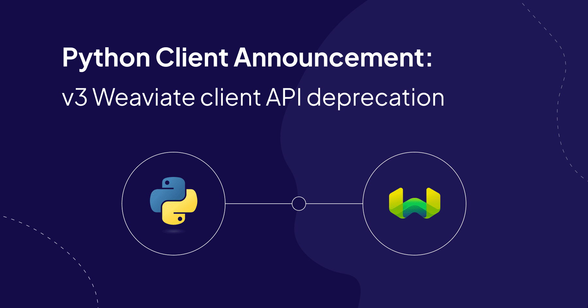

import Tabs from '@theme/Tabs';
import TabItem from '@theme/TabItem';


{/* TODO(ivan): Placeholder hero copied from the Python v3 deprecation post. Replace with the real image. */}

GraphQL was Weaviate's [first query API](/blog/graphql-api-design). As of October 12, 2026, it is deprecated. This affects anyone who sends GraphQL to Weaviate, whether through direct HTTP calls, an older client generation, or the Go client. The [GraphQL migration guide](https://docs.weaviate.io/weaviate/api/graphql/migration) has the details, and this post covers the decision, the dates and your options.

<!-- truncate -->

**In short:**

- The GraphQL API is deprecated as of October 12, 2026. Nothing breaks on that day.
- Weaviate Cloud switches GraphQL off on all clusters on April 1, 2027.
- Self-hosted Weaviate disables GraphQL by default in an upcoming minor release, and removes it later.
  {/* TODO(ivan): Q1. Replace "an upcoming minor release" with the version once Dirk confirms. */}
- If your application searches through a current Python, TypeScript, Java or C# client against Weaviate v1.29 or later, you are most likely already off GraphQL.
- Everyone else should follow the [migration guide](https://docs.weaviate.io/weaviate/api/graphql/migration).

## Timeline

| Date | Weaviate Cloud | Self-hosted Weaviate |
| --- | --- | --- |
| Already true | New clusters are created with GraphQL disabled | `DISABLE_GRAPHQL` lets you turn GraphQL off to test |
| October 12, 2026 | GraphQL deprecated. Existing clusters keep working | GraphQL deprecated. Nothing changes |
| April 1, 2027 | GraphQL switched off on all clusters | No change |
| An upcoming minor release | n/a | GraphQL disabled by default. You can switch it back on |
| A later release | n/a | GraphQL removed |

{/* TODO(ivan): Q1. Replace "An upcoming minor release" in the table with the version once Dirk confirms. */}

## Are you affected?

You are most likely **not affected** if every search in your application goes through one of these clients:

| Client | Version | Condition |
| --- | --- | --- |
| Python `weaviate-client` | v4.11 and later | Weaviate v1.29 or later. `graphql_raw_query()` still uses GraphQL |
| TypeScript `weaviate-client` | v3.4 and later | Weaviate v1.29 or later. The bundled `weaviateV2` client still uses GraphQL |
| Java `io.weaviate:client6` | 6.0.0 and later | None |
| C# client | 1.0.0 and later | None |

On Weaviate older than v1.29, the Python and TypeScript clients fall back to GraphQL for aggregations.

You **are affected** if any of these apply:

- You send HTTP requests to `/v1/graphql` directly.
- You use a raw GraphQL helper in a client, such as `graphql_raw_query()` in Python or `client.graphql.*` in the TypeScript `weaviateV2` client.
- You run an older client generation: the Python v3 API (`weaviate.Client`), `weaviate-ts-client` v2, or the Java client v5 and earlier.
- You use the Go client. The current stable Go client, v5, queries over GraphQL. Go client v6 uses gRPC, but it is a pre-release today.
- Browser code in your application posts GraphQL queries.
- A no-code or BI tool sends GraphQL to your cluster.

The guide explains how to [find your GraphQL usage](https://docs.weaviate.io/weaviate/api/graphql/migration#find-your-graphql-usage).

## Why we are deprecating GraphQL

**It is slow:** GraphQL sends JSON over HTTP. The client libraries use gRPC, which sends binary Protocol Buffers over HTTP/2. We measured the difference when we moved the clients over, and the [gRPC performance post](/blog/grpc-performance-improvements) has the results.

**It is inflexible:** A GraphQL query is a string that you assemble by hand. Errors come back with HTTP `200` inside an `errors` array, so a failed query can look like a successful request. Search metadata such as distance or score sits under a separate `_additional` field.

**It fits client libraries poorly:** GraphQL results are untyped JSON. Every client had to parse nested responses back into objects, which is the work gRPC's typed messages now do for us.

**Two query APIs cost twice as much:** Every search feature had to be built, tested and documented for both GraphQL and gRPC. Dropping GraphQL lets us put that effort into one API.

{/* TODO(ivan): Invite Dirk to add engineering specifics to the four reasons above. Do not add performance numbers (Q6). */}

## What to use instead

### Client libraries (recommended)

The current Python, TypeScript, Java and C# clients search over gRPC, and they are the path we recommend. For Go, the gRPC-based client is v6, which is in beta today. The stable Go client v5 still queries over GraphQL. See [client libraries](https://docs.weaviate.io/weaviate/api/graphql/migration#client-libraries-recommended) in the guide.

### TypeScript web client

For browsers and edge runtimes that cannot open a native gRPC connection, the TypeScript web client (`@weaviate/web`) uses gRPC-Web. It is in alpha today. See the [TypeScript client for web](https://docs.weaviate.io/weaviate/api/graphql/migration#typescript-client-for-web).

### REST Search API

For stacks that cannot run a client at all, the [REST Search API](https://docs.weaviate.io/weaviate/api/graphql/migration#rest-search-api) offers plain JSON endpoints for search and aggregation. It is in Preview today. It is a subset of what GraphQL offers, so check the [queries without a REST equivalent yet](https://docs.weaviate.io/weaviate/api/graphql/migration#queries-without-a-rest-equivalent-yet) before you start.

{/* TODO(ivan): Q5. Confirm the release status of the Go client v6, @weaviate/web and the REST Search API on October 12 and update the labels. */}

A few GraphQL-only features have no equivalent today. The guide lists them under [GraphQL features without an equivalent](https://docs.weaviate.io/weaviate/api/graphql/migration#graphql-features-without-an-equivalent).

{/* TODO(ivan): Q3. Say what happens to the GraphQL-only features once decided. */}

## One query, three ways

Here is one near-text search on a `Movie` collection: five "space opera" movies from 1980 or later in the `scifi` category, with title, year and distance.

<Tabs groupId="languages">
<TabItem value="graphql" label="GraphQL (deprecated)">

```graphql
{
  Get {
    Movie(
      nearText: { concepts: ["space opera"] }
      limit: 5
      where: {
        operator: And
        operands: [
          { path: ["year"], operator: GreaterThanEqual, valueInt: 1980 }
          { path: ["category"], operator: Equal, valueText: "scifi" }
        ]
      }
    ) {
      title
      year
      _additional {
        distance
      }
    }
  }
}
```

</TabItem>
<TabItem value="py" label="Python client">

```python
from weaviate.classes.query import Filter, MetadataQuery

movies = client.collections.use("Movie")

response = movies.query.near_text(
    query="space opera",
    limit=5,
    filters=(
        Filter.by_property("year").greater_or_equal(1980)
        & Filter.by_property("category").equal("scifi")
    ),
    return_properties=["title", "year"],
    return_metadata=MetadataQuery(distance=True),
)

for o in response.objects:
    print(o.properties, o.metadata.distance)
```

</TabItem>
<TabItem value="rest" label="REST Search API">

`POST /v1/search/Movie/near-text`

```json
{
  "query": ["space opera"],
  "limit": 5,
  "where": {
    "operator": "And",
    "operands": [
      { "path": ["year"], "operator": "GreaterThanEqual", "valueInt": 1980 },
      { "path": ["category"], "operator": "Equal", "valueText": "scifi" }
    ]
  },
  "returnProperties": ["title", "year"],
  "returnMetadata": ["distance"]
}
```

</TabItem>
</Tabs>

The REST `where` object is the same JSON you pass in GraphQL. The response is a flat list of results instead of the nested `data.Get.Movie` shape.

## How to migrate

1. **Find your GraphQL calls.** Search your code, proxies and tools for `/v1/graphql` and raw GraphQL helpers. See [find your GraphQL usage](https://docs.weaviate.io/weaviate/api/graphql/migration#find-your-graphql-usage).
2. **Pick a path.** Use a client library where you can, the TypeScript web client in the browser, and the REST Search API where neither fits. The guide starts with [what is changing and when](https://docs.weaviate.io/weaviate/api/graphql/migration#what-is-changing-and-when).
3. **Convert your queries.** Use the [GraphQL to REST cheat sheet](https://docs.weaviate.io/weaviate/api/graphql/migration#graphql-to-rest-cheat-sheet) and read the [differences to check before you convert](https://docs.weaviate.io/weaviate/api/graphql/migration#differences-to-check-before-you-convert).
4. **Verify with GraphQL disabled.** Run your application against a Weaviate instance with GraphQL turned off. See [test with GraphQL disabled](https://docs.weaviate.io/weaviate/api/graphql/migration#test-with-graphql-disabled).

## Self-hosted Weaviate

You can test today. Set the `DISABLE_GRAPHQL` environment variable to `true` and GraphQL is off. It is also available as the runtime-config key `disable_graphql`.

With GraphQL disabled, `POST /v1/graphql` and `POST /v1/graphql/batch` return HTTP `422`:

```json
{"error":[{"message":"graphql api is disabled"}]}
```

Authorization runs first, so a caller without read permission gets `403` instead. The Python client raises `UnexpectedStatusCodeError` and the Go v5 client returns a `WeaviateClientError`, both carrying this status and message.

When an upcoming minor release turns GraphQL off by default, you will be able to switch it back on while you finish migrating. GraphQL is removed in a later release.

{/* TODO(ivan): Q1. Replace "an upcoming minor release" with the version once Dirk confirms. */}

## Weaviate Cloud

GraphQL is switched off on all Weaviate Cloud clusters on April 1, 2027. New clusters are already created with GraphQL disabled.

After that date, GraphQL requests to your cluster will fail the same way they do with `DISABLE_GRAPHQL` set: HTTP `422` with `graphql api is disabled`. To see how your application behaves before then, test it against a self-hosted instance or a new cluster with GraphQL disabled.

{/* TODO(ivan): Q7. Confirm Cloud uses the DISABLE_GRAPHQL mechanism after the switch-off, whether existing clusters can turn GraphQL off early, and whether extensions exist. */}

Weaviate Cloud and Enterprise customers who need help planning the move can contact us through the [support portal](https://support.weaviate.io/).

## Get help

- Ask migration questions on the [Weaviate forum](https://forum.weaviate.io/).
- If you have a query that you cannot convert, [open a GitHub issue](https://github.com/weaviate/weaviate/issues) with the GraphQL query and what it is for.
- Weaviate Cloud and Enterprise customers can reach us through the [support portal](https://support.weaviate.io/).
