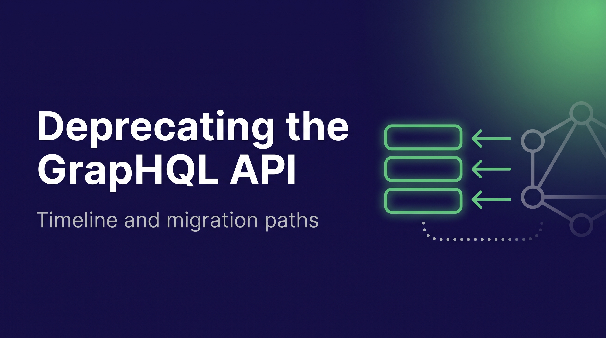

import Tabs from "@theme/Tabs";
import TabItem from "@theme/TabItem";



GraphQL was Weaviate's [first query API](/blog/graphql-api-design), and many of you have built on it since our earliest releases. On October 12, 2026, we are deprecating it. **Nothing will break or change until April 2027**, when Weaviate Cloud switches GraphQL off. Weaviate Cloud already creates new clusters without GraphQL. The [GraphQL migration guide](https://docs.weaviate.io/weaviate/api/graphql/migration) walks you through the move, and this post explains why we made the decision, when things happen and what your options are.

<!-- truncate -->

:::info In short

- The GraphQL API is deprecated as of October 12, 2026. Nothing breaks on that day.
- Weaviate Cloud switches GraphQL off on November 1, 2026 for clusters that do not use it, and on April 1, 2027 for all remaining clusters. New Weaviate Cloud clusters already have GraphQL turned off.
- Open-source Weaviate keeps GraphQL working until at least April 1, 2027. The first minor release after that date disables it by default, and you can switch it back on. It is removed in a later release.
- If your application searches through a current Python, TypeScript, Java or C# client, you are most likely not affected. Everyone else should follow the [migration guide](https://docs.weaviate.io/weaviate/api/graphql/migration).

:::

## Timeline

![Timeline: September 30, 2026, new Weaviate Cloud clusters are created with GraphQL disabled. October 12, 2026, GraphQL is deprecated and nothing changes in Weaviate Cloud or self-hosted Weaviate. November 1, 2026, GraphQL is switched off on Weaviate Cloud clusters that do not use it. April 1, 2027, GraphQL is switched off on all remaining Cloud clusters. The first minor release after April 1, 2027 disables GraphQL by default in self-hosted Weaviate, where you can switch it back on. A later release fully removes GraphQL from Weaviate.](./img/timeline.png)
{/* TODO(ivan): Regenerate timeline.png: the self-hosted "Disabled by default" box belongs to the first minor release after April 1, 2027, not to the date itself, and a November 1, 2026 milestone (Cloud clusters not using GraphQL switched off) is missing. */}

## Are you affected?

You are most likely **not affected** if every search in your application goes through one of these clients:

| Client                       | Version         | Condition                                                         |
| ---------------------------- | --------------- | ----------------------------------------------------------------- |
| Python `weaviate-client`     | v4.11 and later | Weaviate v1.29 or later. `graphql_raw_query()` still uses GraphQL |
| TypeScript `weaviate-client` | v3.4 and later  | Weaviate v1.29 or later.                                          |
| Java `io.weaviate:client6`   | 6.0.0 and later | None                                                              |
| C# client                    | 1.0.0 and later | None                                                              |

On Weaviate older than v1.29, the Python and TypeScript clients fall back to GraphQL for aggregations.

You **are affected** if any of these apply:

- You send HTTP requests to `/v1/graphql` directly.
- You use a raw GraphQL helper in a client, such as `graphql_raw_query()` in Python.
- You run an older client generation: the Python v3 API (`weaviate.Client`), `weaviate-ts-client` v2, or the Java client v5 and earlier.
- You use the Go client. The current stable Go client, v5, queries over GraphQL. Go client v6 uses gRPC and is a release candidate today.
- Browser code in your application posts GraphQL queries.
- A no-code or BI tool sends GraphQL to your cluster.

The guide explains how to [find your GraphQL usage](https://docs.weaviate.io/weaviate/api/graphql/migration#find-your-graphql-usage).

## Why we are deprecating GraphQL

GraphQL served Weaviate and its users well for a long time. It gave you one readable language for every kind of search, and a lot of what you built on Weaviate went through it. We are proud of that work. We are moving on because the APIs we built since then do the same job better. These are some of the reasons:

- **It is slow:** GraphQL sends JSON over HTTP. The client libraries use gRPC, which sends binary Protocol Buffers over HTTP/2. We measured the difference when we moved the clients over, and the [gRPC performance post](/blog/grpc-performance-improvements) has the results.

- **It is inflexible:** A GraphQL query is a string that you assemble by hand. Errors come back with HTTP `200` inside an `errors` array, so a failed query can look like a successful request. Search metadata such as distance or score sits under a separate `_additional` field.

- **It fits client libraries poorly:** GraphQL results are untyped JSON. Every client had to parse nested responses back into objects, which is the work gRPC's typed messages now do for us.

## What to use instead

### Client libraries (recommended)

The current Python, TypeScript, Java and C# clients search over gRPC, and they are the path we recommend. For Go, the gRPC-based client is v6, which is a release candidate today. The stable Go client v5 still queries over GraphQL. See [client libraries](https://docs.weaviate.io/weaviate/api/graphql/migration#client-libraries-recommended) in the guide.

### TypeScript web client

For browsers and edge runtimes that cannot open a native gRPC connection, the TypeScript web client (`@weaviate/web`) uses gRPC-Web. It is in alpha today. See the [TypeScript client for web](https://docs.weaviate.io/weaviate/api/graphql/migration#typescript-client-for-web).

### REST Search API

For stacks that cannot run a client at all, the [REST Search API](https://docs.weaviate.io/weaviate/api/graphql/migration#rest-search-api) offers plain JSON endpoints for search and aggregation (see the [REST API reference](https://docs.weaviate.io/weaviate/api/rest#tag/search)). It is in Preview today. It is a subset of what GraphQL offers, so check the [queries without a REST equivalent yet](https://docs.weaviate.io/weaviate/api/graphql/migration#queries-without-a-rest-equivalent-yet) before you start.

{/* TODO(ivan): Q5. Confirm the release status of the Go client v6, @weaviate/web and the REST Search API on October 12 and update the labels. */}

A few GraphQL-only features have no equivalent today. The guide lists them under [GraphQL features without an equivalent](https://docs.weaviate.io/weaviate/api/graphql/migration#graphql-features-without-an-equivalent). If one of them is essential to you, tell us through the channels at the end of this post, and we will look at adding it.

{/* TODO(ivan): Q3. Say what happens to the GraphQL-only features once decided. */}

## How to migrate

The [migration guide](https://docs.weaviate.io/weaviate/api/graphql/migration) maps GraphQL queries to their replacements. There are almost six months between the deprecation and the Cloud switch-off, so you can plan the move around your own releases. And you can switch GraphQL off on your own instance today, so you find out if anything breaks.

1. **Find your GraphQL calls:** Search your code, proxies and tools for `/v1/graphql` and raw GraphQL helpers. See [find your GraphQL usage](https://docs.weaviate.io/weaviate/api/graphql/migration#find-your-graphql-usage).
2. **Pick a path:** Use a client library where you can, the TypeScript web client in the browser, and the REST Search API where neither fits. The guide starts with [what is changing and when](https://docs.weaviate.io/weaviate/api/graphql/migration#what-is-changing-and-when).
3. **Convert your queries:** Use the [Migration guide](https://docs.weaviate.io/weaviate/api/graphql/migration) to map existing GraphQL queries to alternative methods.
4. **Verify with GraphQL disabled:** Run your application against a Weaviate instance with GraphQL turned off. See [test with GraphQL disabled](https://docs.weaviate.io/weaviate/api/graphql/migration#test-with-graphql-disabled).

<details>
  <summary>One query, three ways</summary>

Here is one near-text search on a `Movie` collection: five "space opera" movies from 1980 or later in the `scifi` category, with title, year and distance.

<Tabs groupId="languages">
<TabItem value="graphql" label="GraphQL (deprecated)">

```graphql
{
  Get {
    Movie(
      nearText: { concepts: ["space opera"] }
      limit: 5
      where: {
        operator: And
        operands: [
          { path: ["year"], operator: GreaterThanEqual, valueInt: 1980 }
          { path: ["category"], operator: Equal, valueText: "scifi" }
        ]
      }
    ) {
      title
      year
      _additional {
        distance
      }
    }
  }
}
```

</TabItem>
<TabItem value="py" label="Python client">

```python
from weaviate.classes.query import Filter, MetadataQuery

movies = client.collections.use("Movie")

response = movies.query.near_text(
    query="space opera",
    limit=5,
    filters=(
        Filter.by_property("year").greater_or_equal(1980)
        & Filter.by_property("category").equal("scifi")
    ),
    return_properties=["title", "year"],
    return_metadata=MetadataQuery(distance=True),
)

for o in response.objects:
    print(o.properties, o.metadata.distance)
```

</TabItem>
<TabItem value="rest" label="REST Search API">

`POST /v1/search/Movie/near-text`

```json
{
  "query": ["space opera"],
  "limit": 5,
  "where": {
    "operator": "And",
    "operands": [
      { "path": ["year"], "operator": "GreaterThanEqual", "valueInt": 1980 },
      { "path": ["category"], "operator": "Equal", "valueText": "scifi" }
    ]
  },
  "returnProperties": ["title", "year"],
  "returnMetadata": ["distance"]
}
```

</TabItem>
</Tabs>
</details>

### Self-hosted Weaviate

You can test today. Set the `DISABLE_GRAPHQL` environment variable to `true` and GraphQL is off. It is also available as the runtime-config key `disable_graphql`.

With GraphQL disabled, `POST /v1/graphql` and `POST /v1/graphql/batch` return HTTP `422`:

```json
{ "error": [{ "message": "graphql api is disabled" }] }
```

Authorization runs first, so a caller without read permission gets `403` instead. The Python client raises `UnexpectedStatusCodeError` and the Go v5 client returns a `WeaviateClientError`, both carrying this status and message.

GraphQL keeps working in open-source Weaviate until at least April 1, 2027. The first minor release after that date disables it by default, and you can switch it back on while you finish migrating. We will remove it in a later release, and we have not set that date yet.

### Weaviate Cloud

Weaviate Cloud switches GraphQL off in two steps. On November 1, 2026, clusters that have not been using GraphQL get it switched off, since nothing on them depends on it. On April 1, 2027, it is switched off on all remaining clusters. New clusters are already created with GraphQL disabled.

After that date, GraphQL requests to your cluster will fail the same way they do with `DISABLE_GRAPHQL` set: HTTP `422` with `graphql api is disabled`. To see how your application behaves before then, test it against a self-hosted instance or a new cluster with GraphQL disabled.

{/* TODO(ivan): Q7. Confirm Cloud uses the DISABLE_GRAPHQL mechanism after the switch-off, whether existing clusters can turn GraphQL off early, and whether extensions exist. */}

Weaviate Cloud and Enterprise customers who need help planning the move can contact us through the [support portal](https://support.weaviate.io/).

## Get help

If something in your setup does not fit the paths above, tell us early so we can assist you with the migration.

We will help with the move. We are running office hours and webinars for the migration, and the support portal is open for migration tickets. If your use case is not possible with the current paths, tell us. If possible we will add what is missing, for example additional parameters on the REST Search API.

{/* TODO(ivan): Add dates or links for the office hours and webinars once scheduled. */}

- Ask migration questions on the [Weaviate forum](https://forum.weaviate.io/).
- If you have a query that you cannot convert, [open a GitHub issue](https://github.com/weaviate/weaviate/issues) with the GraphQL query and what it is for.
- Weaviate Cloud and Enterprise customers can reach us through the [support portal](https://support.weaviate.io/).

import WhatsNext from "/_includes/what-next.mdx";

<WhatsNext />
