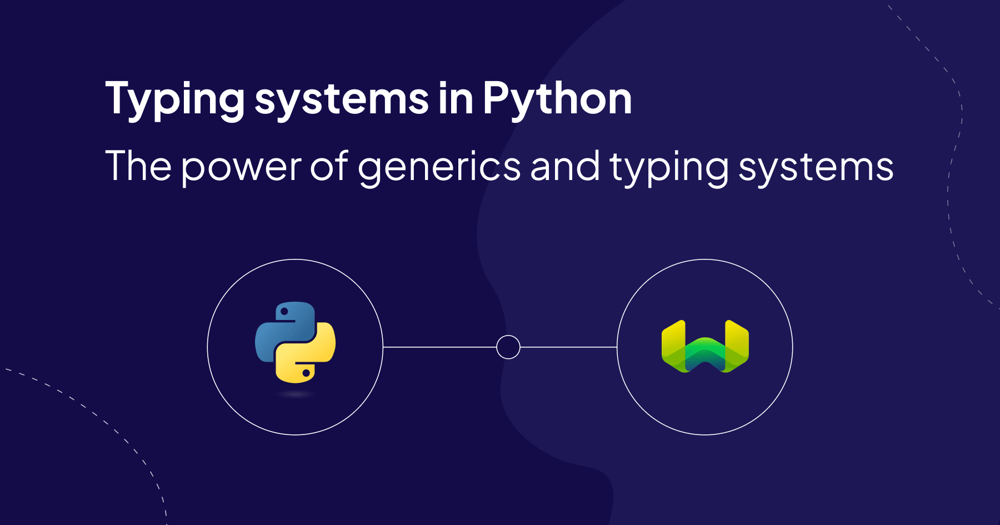
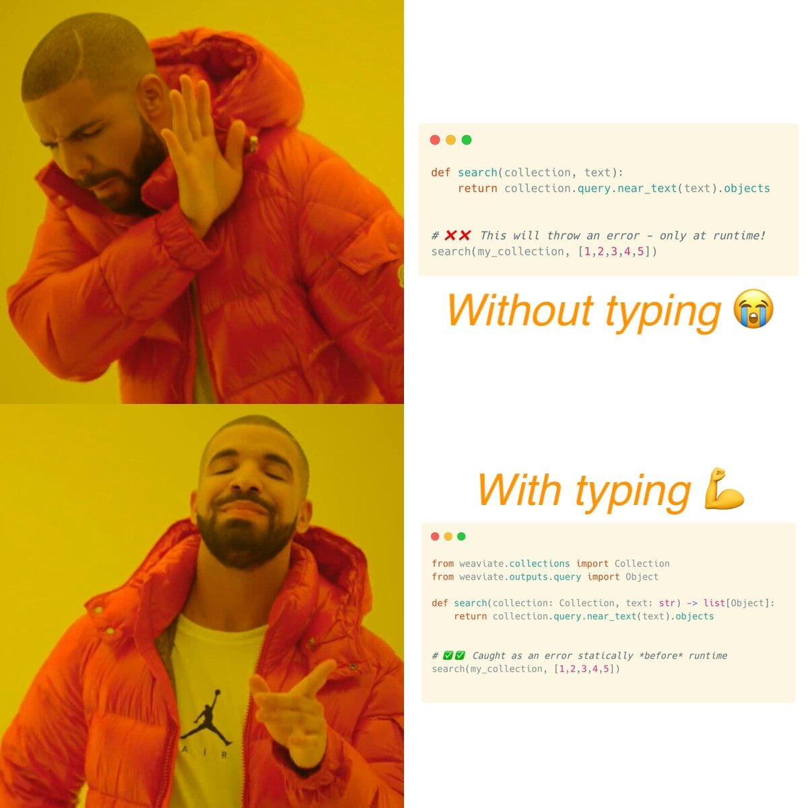

## Introduction

Both *generics* and *typing systems* are powerful tools that often spark heated debates in the software development world.

To some, they add little value while creating noise in a codebase, leading to bloat and an additional maintenance burden for developers. To others, they're powerful tools that empower cleaner, safer code with fewer bugs. We see both perspectives, but tend to agree with the latter camp.

Generics allow for flexible, reusable code that works with different data types, while typing systems help catch errors before a program runs. But these concepts also often evoke strong reactions among developers. We see both perspectives, but tend to agree with the latter camp.

In fact, generics and typing systems have helped us make important developer experience improvements in our [v4 Python client](/developers/weaviate/client-libraries/python). In this article, we’ll present the story of Python’s typing system since its inception in `v3.5`, which is now 9 years ago 👴 to the current landscape of `v3.12` wherein the typing system has undergone a significant improvement in usability and readability.

Hopefully, we can convince any naysayers of their benefit and, for those already aboard the hype-train, you’ll learn some nifty tricks to utilize generics when working with Weaviate’s `v4` Python client!

> Generics allow for flexible, reusable code that works with different data types, while typing systems help catch errors before a program runs.

## Python’s Typing System

Typing system (and generics) address a significant gap that is inherent to Python.

At its core, Python is a weakly duck-typed programming language. A duck-typed language does not require the developer to specify how the computer should interpret their code outside of the basic syntax and semantics.

The computer interprets and executes machine code by converting the source into bytecode at runtime through the Python interpreter.

This conciseness is a double-edged sword. Take a look at the following code in Python:

```python
def square(x):
    return x ** 2

print(square(2))
print(square("circle"))
```

When run, this  will happily print out `4` before throwing a runtime error: `TypeError: unsupported operand type(s) for ** or pow(): 'str' and 'int'`. A statically typed language like Go, TypeScript, or Rust would catch this with the compiler before the code was ever executed, enhancing the security of our runtime by avoiding unexpected exceptions.

In recent years, Python has begun to address this gap to static languages by introducing typing and thus robustness of static compile-time checking. In modern (>3.5) Python, the above example can be rewritten as:

```python
def square(x: int) -> int:
    return x ** 2

print(square(2))
print(square("circle"))
```

hints to developers that the argument supplied to the `square` function should be of integer type and therefore help to avoid such errors as `square("circle")`. In addition, the return type is hinted using `-> int` signifying that any variable assigned to the return of the function will have an `int` type.

As such, the type of `x` here `x = square(2)` will be `int`. Importantly, however, the type of `x` in  `x = square("circle")` will be `Any`, as the function has been used inappropriately with arguments not hinted at! This inconsistency would alert the user that they may not be using `square` appropriately.

We say "would", because doing so would require that the developer review the function signature, or the inferred type through their IDE. After all, these are type *hints*, not assigned types. However, as many readers are keenly aware, not all developers read the documentation of the tools that they use (although both you and we do, of course 😉). As such, automated static type checkers have emerged, like `mypy` and `pyright`, that perform the checks for youand provide any pre-runtime indication that your code may contain a bug. Using `pyright` as an example, the above code will produce: `error: Argument of type "Literal['circle']" cannot be assigned to parameter "x" of type "int" in function "square"`.

In other words, type hinting with type checkers bring order and robustness of statically typed languages to the flexible, sometimes chaotic duck-typed world of Python. That's why we leveraged the typing system extensively when re-writing the Weaviate Python client for the `v4` release.

## Type Hinting in Weaviate’s `v4` Python Client

This type hinting syntax is a core basis for the API surface of the [`weaviate-python-client` v4](/developers/weaviate/client-libraries/python). It enables us as developers to iterate faster, since the type hinting in functions allow them to be treated as logical black boxes that can be knitted together at a higher level of abstraction. In addition, through the use of the `mypy` and `pyright` static type checkers, subtle bugs are avoided and any feature regressions are minimised before any runtime tests occur. This means more robustness for you, the end user.

But the improvements aren't just under-the-hood. These changes also helped us improve the public API surface that you, the user, interacts with. The `v4` Client API is also fully typed and available to use with static type checking and IDE auto-completion ready to rock!

Here’s an example.

### A Simple Search Function

Let’s say you’re implementing a function `search` across your Weaviate collection. In its first iteration, it’s going to do a `near_text` query based on a string and will return the objects of the query. Without typing, we would write this as:

```python
def search(collection, text):
    return collection.query.near_text(text).objects
```

Calling `search(my_collection, [1,2,3,4,5])` here would only throw an error at runtime, potentially introducing bugs into the code if not caught with a specific unit/integration test targeting this usage. In addition, a developer using the `search` function would have to look at its internal implementation to understand what the expected types of `collection` and `text` are since we didn’t write a docstring for the function! So, we can improve everyone’s life by adding types:

```python
from weaviate.collections import Collection
from weaviate.outputs.query import Object

def search(collection: Collection, text: str) -> list[Object]:
    return collection.query.near_text(text).objects
```

This is a small, but powerful change. We haven’t added any value to the actual runtime environment. At this point, the only added benefit is that we can call `mypy` on this code and not get any errors. But if we code it right the first time then this shouldn’t be an issue, right? This might be a view held by many but [studies](https://www.microsoft.com/en-us/research/wp-content/uploads/2017/09/gao2017javascript.pdf) show that  static typing systems do reduce the number of bugs in code by a statistically significant amount!



### The Power of Static Type Checking in Refactoring

Yet another powerful aspect of static type checking comes when refactoring code. Let’s say that we want to change our `search` function to perform a `near_vector` search instead of `near_text`. We update the function itself easily:

```python
from weaviate.collections import Collection
from weaviate.outputs.query import Object

def search(collection: Collection, vector: list[float]) -> list[Object]:
    return collection.query.near_vector(vector).objects
```

but there are two parts to refactoring: the function, which is usually the easy bit, and *everywhere else* where the function is called. This is where the static type checkers come in clutch as a sweep of your codebase will call out every single location where `search` is being called with `str` as the second argument instead of the new `list[float]` implementation. Without it, you would have to search the codebase manually for each function call, making sure to change the type appropriately. If you miss even one and that isn’t covered by a unit/integration test, then you’ve introduced a refactoring bug. With a type checker, the bug gets found instantly with a single sweep of the codebase!

Perhaps we have another function that calls `search` with some additional context, like handling the client lifecycle:

```python
import weaviate

def search_records(text: str) -> list[Object]:
    with weaviate.connect_to_local() as client:
        collection = client.collections.get("MyCol")
        return search(collection, text)
```

> With a type checker, the bug gets found instantly with a single sweep of the codebase!

Calling `mypy` on `search_records` given the refactor to `search` would yield the following error **`error:** Argument 2 to **"search"** has incompatible type **"str"**; expected **"list[float]"**  [arg-type]` in the CLI, catching the bug without any other tests. In addition, if you accidentally mislabel your type hints (which is a common occurrence even for us!) like so (note the `vector` parameter type is incorrect):

```python
from weaviate.collections import Collection
from weaviate.outputs.query import Object

def search(collection: Collection, vector: str) -> list[Object]:
    return collection.query.near_vector(vector).objects
```

Here, `mypy` will flag the error at the typing of the `.near_vector` method with the following errors: **`error:** Returning Any from function declared to return **"list[Object[Any, Any]]"**  [no-any-return]` and **`error:** No overload variant of **"near_vector"** of **"_NearVectorQuery"** matches argument type **"str"**  [call-overload]`. Signifying first that the type inference cannot detect the type of `collection.query.near_vector(vector).objects` due to the misconfiguration that `vector: str` here and second that the actual type of `vector: str` is not expected by the v4 client.

Improvements like these have been made throughout the v4 Client codebase. As a result, we think you will benefit from fewer bugs, and write fewer bugs yourself.

## Nothing's Perfect: Type Hinting's Limitations

While we've seen the many benefits of type hinting, it's important to acknowledge that no system is without its limitations.

All of the above is great for types that are known specifically at the static stage of the code's lifecycle, meaning before any runtime invocation. But what happens when we're writing code that depends on data coming from some third-party external source?

When working with a database like Weaviate, this is what we end up doing most of the time. So how can we provide the client, and therefore the type checker, with the types of data that we have stored in Weaviate?

*Generics have entered the chat*

## Generics in Python

In short, *generic types* or just *generics* (which is just a bit of jargon describing placeholder values like symbols in algebra: `F=ma` or `E=mc^2`) are types that are not known by client when we package it together and release to you but can be specified dynamically by you when writing your applications. They provide a way for the you, the user, to annotate your client with the data types that you expect to load into and query from Weaviate. So, if you have a collection that has a property like `Property(name="title", data_type=DataType.TEXT)` then you can annotate your collection so that accessing the `title` property of an object from that collection will be fully typed as so: `x: str = obj.properties["title"]`.

The v4 Weaviate client API comes with full support for generics when defining collections and the types of the objects within the collections. But details on how we implemented it and some nifty tricks on getting the best out of it will come in a later post.

> Generics provide a way for the you, the user, to annotate your client with the data types that you expect to load into and query from Weaviate. The v4 Weaviate client API comes with full support for generics.

## Conclusions

We really hope our guide on the typing system in Python was both interesting and useful, especially in the context of Weaviate's v4 Python client. We are confident that the client itself is much better for it, and your code written with the client will be better too. Even outside of the Weaviate client, adding these best practices to your own coding habits can make your codebase much stronger and easier to maintain. Stay tuned for future posts where we'll dive into detailed implementations and share cool tips to make your development process even better!

import WhatNext from '/_includes/what-next.mdx';

<WhatNext />
