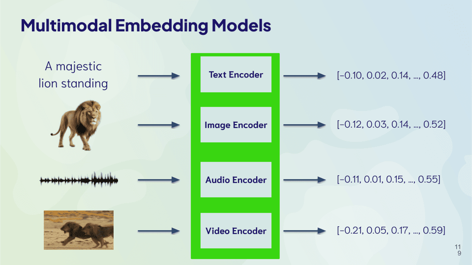

import Tabs from '@theme/Tabs';
import TabItem from '@theme/TabItem';
import FilteredTextBlock from '@site/src/components/Documentation/FilteredTextBlock';
import PyCode from '!!raw-loader!./_snippets/10_strengths.py';

## <i class="fa-solid fa-square-chevron-right"></i> Overview

These different search types are offered because they each have different characteristics, and therefore different strengths.

Let's explore the relative strengths of each search type.

## <i class="fa-solid fa-square-chevron-right"></i> Strengths of vector search

### <i class="fa-solid fa-chalkboard"></i> Robustness

A vector is a numerical representation of the underlying object's meaning. As a result, a vector search is robust to any changes that don't affect the meaning of the object.

More concretely, a vector of "cat", for example, will be similar to a vector of "kitten", "feline", and "pet", even though their spellings are very different.

See this in action below, where we search for "cat" and "kitten" using vector search.

<Tabs groupId="languages">

 <TabItem value="py" label="Python">
    <FilteredTextBlock
      text={PyCode}
      startMarker="# START robustnessExampleWords"
      endMarker="# END robustnessExampleWords"
      language="py"
    />
  </TabItem>

</Tabs>

You see that the results for "cat" and "kitten" are very similar.

In other words, the vectors for "cat" and "kitten" are similar in meaning, because the model can "understand" meaning.

<FilteredTextBlock
  text={PyCode}
  startMarker="# START responseRobustnessExampleWords"
  endMarker="# END responseRobustnessExampleWords"
  language="json"
/>

Similarly, a vector of "cat" is similar to the vector of "cat" with a spelling mistake, such as "caat", or "catt".

<Tabs groupId="languages">

 <TabItem value="py" label="Python">
    <FilteredTextBlock
      text={PyCode}
      startMarker="# START robustnessExampleSpelling"
      endMarker="# END robustnessExampleSpelling"
      language="py"
    />
  </TabItem>

</Tabs>

Here, the results are basically identical.

<FilteredTextBlock
  text={PyCode}
  startMarker="# START responseRobustnessExampleSpelling"
  endMarker="# END responseRobustnessExampleSpelling"
  language="json"
/>

This robustness is a key strength of vector search, as it means that the searcher does not need to know the exact words used in the dataset. This is particularly useful when the concepts being searched for are not well-defined, or when the searcher is not familiar with the dataset.

### <i class="fa-solid fa-chalkboard"></i> Versatility

A vector search is also versatile. It can be used to search multiple data modalities (e.g. text, images, audio, etc.), and across multiple languages.

This is because the vector is a numerical representation of the underlying object's meaning, and therefore the same vector can be used to represent the same meaning, regardless of the data modality or language.

In fact, some models are capable of search across multiple data modalities, or multiple languages (or both!). This is made possible by using a model that can convert the data into comparable vectors, regardless of the data modality or language.

## <i class="fa-solid fa-square-chevron-right"></i> Strengths of keyword search

### <i class="fa-solid fa-chalkboard"></i> Exactitude

Keyword search is ideal for situations where locating precise matches are required. This is particularly useful in scenarios where there exist exact terms to search for, such as academic research, searches through domain-specific data or technical troubleshooting.

The ability to return results that precisely match the search terms ensures that users receive the most relevant information for their specific queries.

More concretely, take a look at the example below, where we search for "imaging".

<Tabs groupId="languages">

 <TabItem value="py" label="Python">
    <FilteredTextBlock
      text={PyCode}
      startMarker="# START bm25Example"
      endMarker="# END bm25Example"
      language="py"
    />
  </TabItem>

</Tabs>

And when we inspect the results:

<FilteredTextBlock
  text={PyCode}
  startMarker="# START bm25Results"
  endMarker="# END bm25Results"
  language="json"
/>

A search for "imaging" using a keyword search returns the one result that contains that specific word.

## <i class="fa-solid fa-square-chevron-right"></i> Strengths of hybrid search

A key strength of hybrid search is its resiliency. Let's explore this in more detail.

### <i class="fa-solid fa-chalkboard"></i> Resiliency

A hybrid search is resilient as it combines top results from both vector and keyword search. This helps to mitigate either search's shortcomings.

Take a look at the hybrid search example below.

<Tabs groupId="languages">

 <TabItem value="py" label="Python">
    <FilteredTextBlock
      text={PyCode}
      startMarker="# START hybridExample"
      endMarker="# END hybridExample"
      language="py"
    />
  </TabItem>

</Tabs>

We can inspect the results here:

<FilteredTextBlock
  text={PyCode}
  startMarker="# START hybridResults"
  endMarker="# END hybridResults"
  language="json"
/>

You can see that as well as the keyword search result above (for "imaging"), we get a semantically relevant result (for "X-rays").

Because hybrid search combines the results of both vector and keyword search, it will find objects that score well on at least one of the search types. This approach has the effect of complementing each search type.

<!-- ## <i class="fa-solid fa-square-chevron-right"></i> Review

<Quiz questions={varName} />

Any quiz questions

### <i class="fa-solid fa-pen-to-square"></i> Review exercise

:::note <i class="fa-solid fa-square-terminal"></i> Exercise
Try out ...
:::

### <i class="fa-solid fa-lightbulb-on"></i> Key takeaways

:::info
Add summary
:::

import { GiscusDocComment } from '/src/components/GiscusComment';

<GiscusDocComment />

import Quiz from '/src/components/Academy/quiz.js'
const varName = [{
  questionText: 'questionText',
  answerOptions: [
    {
      answerText: 'answerOne',
      isCorrect: false,
      feedback: 'feedbackOne',
    },
    {
      answerText: 'answerTwo',
      isCorrect: false,
      feedback: 'feedbackTwo',
    },
    {
      answerText: 'answerThree',
      isCorrect: false,
      feedback: 'feedbackThree',
    },
  ]
}]; -->
