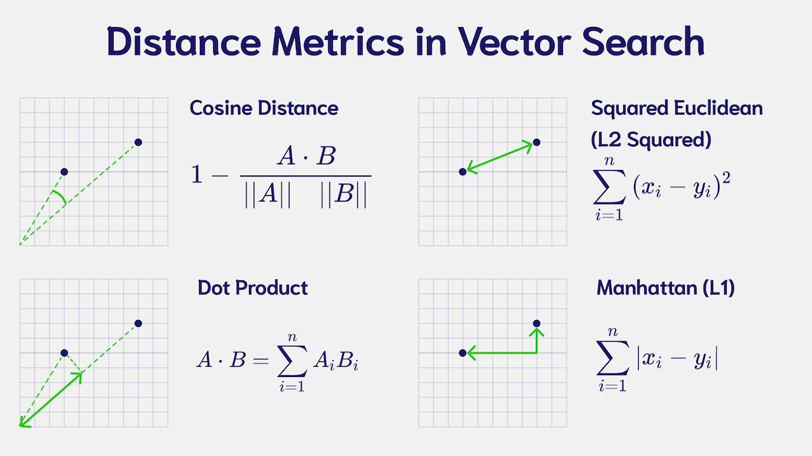

import Tabs from '@theme/Tabs';
import TabItem from '@theme/TabItem';
import FilteredTextBlock from '@site/src/components/Documentation/FilteredTextBlock';
import PyCode from '!!raw-loader!./_snippets/100_config.py';

The "dyanmic" index is a "best of both worlds" approach that combines the benefits of the `hnsw` and `flat` indexes.

## <i class="fa-solid fa-square-chevron-right"></i> Key ideas

Simply put, the `dynamic` index is a `flat` index that is automatically converted to an `hnsw` index when the number of vectors in the collection exceeds a predetermined threshold (10,000 by default).

The motivation for this is that the `flat` index is very efficient for small collections, but its search time increases linearly with the number of vectors in the collection. The `hnsw` index, on the other hand, is more efficient for large collections, but includes a memory overhead with little benefit for small collections.

The `dynamic` index is a good choice if you do not know how big the size of each collection will be, or if you expect some tenants to grow much larger than others.

In a multi-tenancy configuration, this will mean that all tenants will start with the `flat` index, but will automatically switch to the `hnsw` index when the number of vectors in the collection exceeds the threshold.

Currently, this is a one-way conversion, meaning that once the index is converted to `hnsw`, it will not be converted back to `flat` if it subsequently falls below the threshold.

### <i class="fa-solid fa-chalkboard"></i> Distance metric

The distance metric used in the index determines how the distance between vectors is calculated. In an HNSW index, it impacts where each vector is placed in the graph.

You must choose a metric that suits the vectors in your collection. To find this, consult the documentation of the model that generated your vectors.

Weaviate's default metric is cosine, but you can also use any number of [other available metrics](/developers/weaviate/config-refs/distances.md).

If you are unsure, the cosine distance is a good, robust, default choice that is used by a majority of models.

## <i class="fa-solid fa-square-chevron-right"></i> Configure dynamic index in Weaviate

Each of these parameters can be provided when creating a collection in Weaviate. Note that the `vector_cache_max_objects` is only used if quantization is enabled with vector caching enabled within it.

### <i class="fa-solid fa-code"></i> Basic configuration

Set a collection to use the dynamic index as shown below.

<FilteredTextBlock
  text={PyCode}
  startMarker="# START ConfigDynamic"
  endMarker="# END ConfigDynamic"
  language="py"
/>

### <i class="fa-solid fa-code"></i> Custom configuration

You can set the threshold at which the `flat` index will be converted to `hnsw`.

Additionally, you can specify any of the `flat` and `hnsw` index parameters that will be used depending on the state of the index.

<FilteredTextBlock
  text={PyCode}
  startMarker="# START CustomConfigDynamic"
  endMarker="# END CustomConfigDynamic"
  language="py"
/>

## <i class="fa-solid fa-square-chevron-right"></i> Further resources

- [Concepts: Vector index](/developers/weaviate/concepts/vector-index.md)
- [References: Vector index parameters](/developers/weaviate/config-refs/schema/vector-index.md)
- [How-to manage collections](/developers/weaviate/manage-data/collections.mdx)
- [Weaviate Academy: Compression](../compression/index.md)

## Questions and feedback

import DocsFeedback from '/_includes/docs-feedback.mdx';

<DocsFeedback/>

