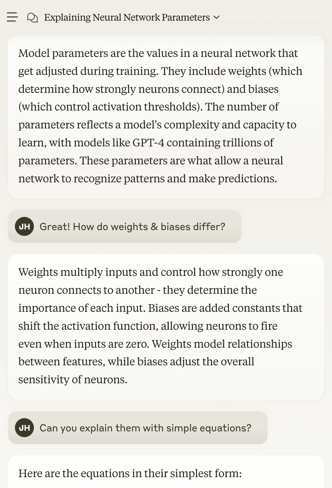
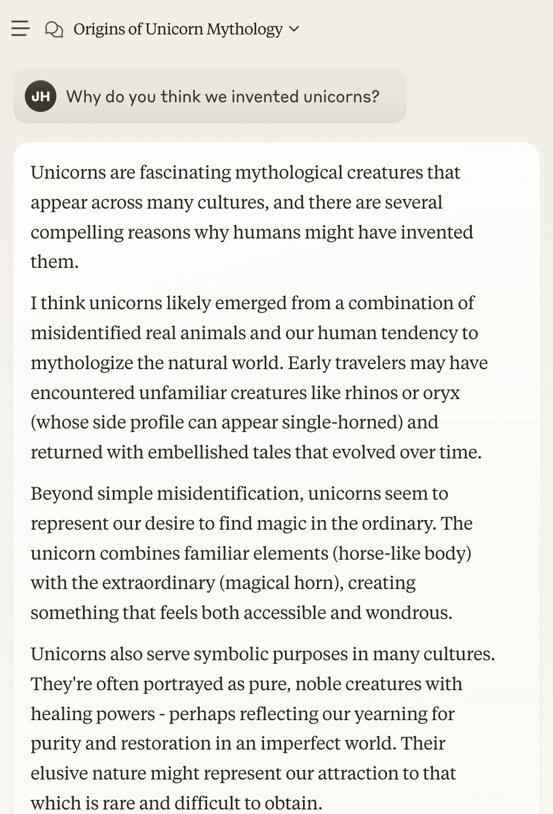

## <i class="fa-solid fa-chalkboard-user"></i> Examples of AI model use

We know that AI models can tackle tasks that were previously seen as exclusively human activities. Let's take a few concrete examples.

### Image generation

AI models can generate images matching your text description, according to your imagination.

<figure>

| Prompt | Generated image |
| --- | --- |
| `a sleek looking robot cowboy riding on a big, cute, cartoon unicorn, on the moon.` |  |

<figcaption>Image generated by DALL-E, an AI model by OpenAI</figcaption>
</figure>

### Language understanding

They can also engage in conversations with us on matters big and small:

<figure>

| A technical conversation with AI | A casual conversation with AI |
| --- | --- |
|  |  |

<figcaption>Conversations with claude, an AI model by Anthropic</figcaption>
</figure>

### Code completion

In fact, many of us already use them as a companion in our day-to-day workflow, even with tasks as complex as coding.

<figure>

<figcaption>Using Microsoft Copilot in VSCode</figcaption>
</figure>

### Table: Types of AI models

Here’s a broader overview of AI models, summarizing their inputs and output types, with concrete examples.

<figure>

| Type | Inputs | Output format | Output significance | Example models / use | Example input | Example output |
| --- | --- | --- | --- | --- | --- | --- |
| Large (or vision) language model | Text (or text + image) | Text | Answers the input text | claude-3-7-sonnet, gemini-2.0 | Where is the capital of France? | The capital of France is Paris |
| Image generation model | Text | Image | Image of the input | Stable diffusion, Dall-E | Image of a cute red dog |  |
| Embedding model | Text | Array of numbers | Capture semantic meaning | Word2vec, sentence-transformers | Image of a cute red dog | [0.0149, 0.8932, …, 0.0589] |
| Image classifier  | Image | Array of numbers | Likelihood of category | ResNet, disease detection models |  | [0.958, 0.042] |
| Regression model | Numbers | Number | Numerical prediction | Housing price prediction, Electricity demand forecasting | [4, 950, 1985, 2010, 10011, 0] | 2585913 |

<figcaption>Overview of AI models</figcaption>
</figure>

## <i class="fa-solid fa-chalkboard-user"></i> Do AI models think like humans?

In this day and age, AI models indeed can perform all these amazing tasks (and more), many at a human level quality, and at breakneck speed. But AI models are very different to humans in one key way.

AI *loves* statistics. Or, more accurately, it’s powered entirely by the magic of statistics.

At its core, AI models rely on statistics to turn these different types of inputs into outputs. Before we discuss any of the internals, it may be useful to think of AI models’ jobs as doing (incredibly complex) pattern-matching. This is why some have even described large language models as [stochastic parrots](https://en.wikipedia.org/wiki/Stochastic_parrot).

But there’s no doubt that they are very impressive tools. And to get the most out of these models, some understanding of their internals will be very useful.

## <i class="fa-solid fa-chalkboard-user"></i> What is an "AI model"?

Once you begin to navigate the world of AI models, you will come across more than a few different jargon. Even at the very top level, you will hear about terms like “machine learning”, “deep learning” and “neural network”, as well as “AI models” which we’ve been using.

So - what are the differences between these? Here’s one way to look at these terms:

- **Artificial Intelligence (AI)** is a broad term, encompassing any technology that enables machines to mimic human intelligence.
- **Machine Learning (ML)** is a specific technique to build AI systems. ML systems are not rule-based. Instead, they learn from data to identify patterns which derives its predictive capabilities.
- **Deep Learning (DL)** is a subset of machine learning based on artificial neural networks with multiple (hence "deep") layers. Most recent AI models in areas like computer vision and natural language processing were driven by deep learning models.
- **Neural Networks (NN)** describes the architecture of deep learning models. They are made up of layers of interconnected nodes (neurons) that process information through the network, before producing an answer.

As you can see, they vary in terms of technical specificity as well as depth. For our course, we will use “AI model” as an umbrella term for our course. Think of ML, DL and NN as specific tools with which AI functionality is provided.

In our context, the most common AI model types to use are generative models and embedding models. Generative models help us to analyze and transform information, and embedding models help us to retrieve the best contextual information to analyze and transform. (As a note, these models will almost always be deep learning models.)

Don’t let this possible simplicity fool you though. There is a lot of nuance even within these model types, and a lot of potential pitfalls as builders.

This also means a lot of opportunity to get it right, and get them to work for you and your tasks. Soon, we will take a look at these model types (and some others that you may come across).

But, there is also a lot that these models have in common. Let’s take a look at some of those aspects.

## Questions and feedback

import DocsFeedback from '/_includes/docs-feedback.mdx';

<DocsFeedback/>
