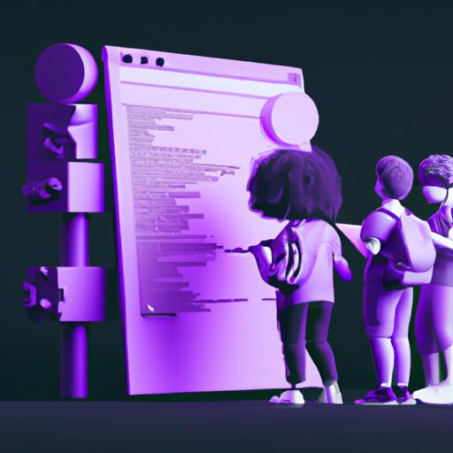

import imageUrl from '../../tmp_images/academy_placeholder.jpg';

## <i class="fa-solid fa-square-chevron-right"></i>&nbsp;&nbsp;TOP LEVEL HEADING

H2 headings come with an **intro video** - probably 1-3 minutes. 

A section like this introduces the topic at hand.

- Each unit to contain 3-6 pages.
- Each page to contain 2-3 sections.
- Each section will likely have two or three lower level topics.

### <i class="fa-solid fa-code"></i>&nbsp;&nbsp;Practical sub-topic

Use an **image to break up content, and also provide some visual cues** for what it is that they are leaning. Placeholder images generated with DallE at the moment.

Lorem ipsum dolor sit amet, consectetur adipiscing elit. Integer euismod fringilla est, id vestibulum sem consectetur a. Sed commodo mauris libero, eu sollicitudin eros elementum id. Nam congue, nibh at aliquam placerat, mi lectus vehicula elit, id commodo est orci vel erat. Sed vel nibh vel ipsum eleifend viverra. Sed euismod purus vel lectus molestie commodo.

Vestibulum ante ipsum primis in faucibus orci luctus et ultrices posuere cubilia Curae; Sed sit amet faucibus ligula. Aliquam erat volutpat. Aliquam eget nisl sit amet mi sollicitudin ullamcorper. Fusce vel eleifend velit. Integer id euismod dui. Morbi vitae auctor ligula. Donec tristique, lectus non sagittis aliquet, magna mauris faucibus velit, euismod commodo neque orci vel velit.

### <i class="fa-solid fa-chalkboard"></i>&nbsp;&nbsp;Theory sub-topic

Use an image to break up content, and also provide some visual cues for what it is that they are leaning. 

Lorem ipsum dolor sit amet, consectetur adipiscing elit. Integer euismod fringilla est, id vestibulum sem consectetur a. Sed commodo mauris libero, eu sollicitudin eros elementum id. Nam congue, nibh at aliquam placerat, mi lectus vehicula elit, id commodo est orci vel erat. Sed vel nibh vel ipsum eleifend viverra. Sed euismod purus vel lectus molestie commodo.

Vestibulum ante ipsum primis in faucibus orci luctus et ultrices posuere cubilia Curae; Sed sit amet faucibus ligula. Aliquam erat volutpat. Aliquam eget nisl sit amet mi sollicitudin ullamcorper. Fusce vel eleifend velit. Integer id euismod dui. Morbi vitae auctor ligula. Donec tristique, lectus non sagittis aliquet, magna mauris faucibus velit, euismod commodo neque orci vel velit.

Each section ends with at least one MCQ, so that the user gets immediate feedback on their learnings. (These could also be all moved to the bottom of the page.)

<Quiz questions={varName} />

## <i class="fa-solid fa-square-chevron-right"></i>&nbsp;&nbsp;TOP LEVEL HEADING

H2 headings come with an intro video - probably 1-3 minutes. 

A section like this introduces the topic at hand.

### <i class="fa-solid fa-code"></i>&nbsp;&nbsp;Practical sub-topic

Use an image to break up content, and also provide some visual cues for what it is that they are leaning. 

Lorem ipsum dolor sit amet, consectetur adipiscing elit. Integer euismod fringilla est, id vestibulum sem consectetur a. Sed commodo mauris libero, eu sollicitudin eros elementum id. Nam congue, nibh at aliquam placerat, mi lectus vehicula elit, id commodo est orci vel erat. Sed vel nibh vel ipsum eleifend viverra. Sed euismod purus vel lectus molestie commodo.

Vestibulum ante ipsum primis in faucibus orci luctus et ultrices posuere cubilia Curae; Sed sit amet faucibus ligula. Aliquam erat volutpat. Aliquam eget nisl sit amet mi sollicitudin ullamcorper. Fusce vel eleifend velit. Integer id euismod dui. Morbi vitae auctor ligula. Donec tristique, lectus non sagittis aliquet, magna mauris faucibus velit, euismod commodo neque orci vel velit.

### <i class="fa-solid fa-chalkboard"></i>&nbsp;&nbsp;Theory sub-topic

Use an image to break up content, and also provide some visual cues for what it is that they are leaning. 

Lorem ipsum dolor sit amet, consectetur adipiscing elit. Integer euismod fringilla est, id vestibulum sem consectetur a. Sed commodo mauris libero, eu sollicitudin eros elementum id. Nam congue, nibh at aliquam placerat, mi lectus vehicula elit, id commodo est orci vel erat. Sed vel nibh vel ipsum eleifend viverra. Sed euismod purus vel lectus molestie commodo.

Vestibulum ante ipsum primis in faucibus orci luctus et ultrices posuere cubilia Curae; Sed sit amet faucibus ligula. Aliquam erat volutpat. Aliquam eget nisl sit amet mi sollicitudin ullamcorper. Fusce vel eleifend velit. Integer id euismod dui. Morbi vitae auctor ligula. Donec tristique, lectus non sagittis aliquet, magna mauris faucibus velit, euismod commodo neque orci vel velit.

<Quiz questions={varName} />

## <i class="fa-solid fa-square-chevron-right"></i>&nbsp;&nbsp;Review

Each section should have a quick recap/review video of about a minute.

### <i class="fa-solid fa-pen-to-square"></i>&nbsp;&nbsp;Review exercise

**Aspirational section.** Would like to have the user provide a freeform input, and get back a similarity score and our definition.

:::info TODO
Can you describe, in your own sentence, XXX?

Input box -> vectorizer -> compare to model answer.
:::

### <i class="fa-solid fa-lightbulb-on"></i>&nbsp;&nbsp;Key takeaways

:::info
Add summary
:::

import Quiz from '/src/components/Academy/quiz.js'
const varName = [{
  questionText: 'questionText',
  answerOptions: [
    {
      answerText: 'answerOne',
      isCorrect: false,
      feedback: 'feedbackOne',
    },
    {
      answerText: 'answerTwo',
      isCorrect: false,
      feedback: 'feedbackTwo',
    },
    {
      answerText: 'answerThree',
      isCorrect: false,
      feedback: 'feedbackThree',
    },
  ]
}];