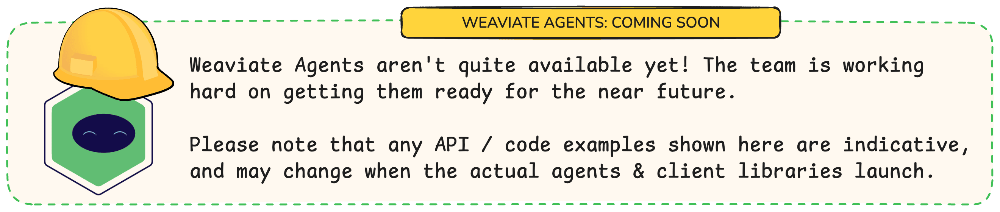
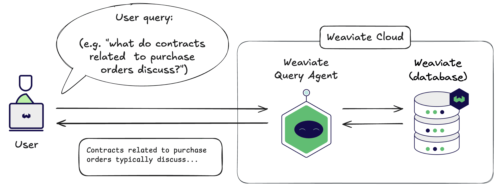
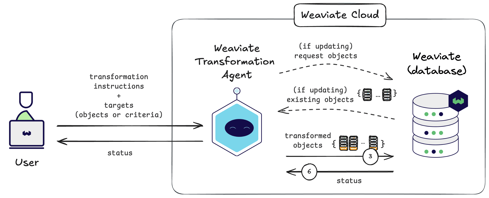
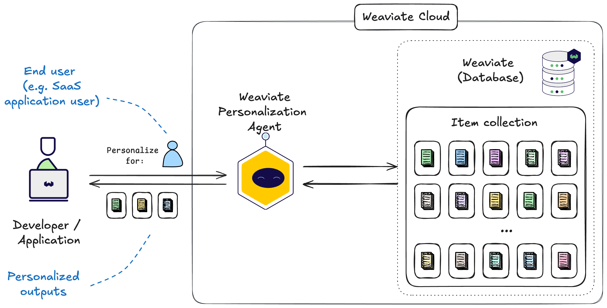

# Weaviate Agents - Introduction

Weaviate Agents are pre-built agentic workflows that are available out-of-the-box for Weaviate Cloud users. Weaviate Agents interact with your data in Weaviate to simplify data engineering and AI development workflows.

## How Weaviate Agents work

Weaviate Agents have been pre-trained on Weaviate’s APIs, making them experts in performing Weaviate-specific data tasks.

All you need to do is provide inputs to use the pre-built workflow, and the particular Agent will perform the required task using your data.

:::info Weaviate Agents is not an agent framework
Weaviate Agents is not a framework for building agents. It is a set of pre-built agentic workflows for Weaviate.
:::

## Query Agent

The [Query Agent](./query.md) provides an answer to your natural language questions, by querying your stored data.

[Read more about the Query Agent](./query.md)

## Transformation Agent

The [Transformation Agent](./transformation.md) enhances your data by manipulating it based on your instructions.

[Read more about the Transformation Agent](./transformation.md)

## Personalization Agent

The [Personalization Agent](./personalization.md) customizes outputs based on persona-specific information, which can even be learned over time.

[Read more about the Personalization Agent](./personalization.md)

## Questions and feedback

import DocsFeedback from '/_includes/docs-feedback.mdx';

<DocsFeedback/>
