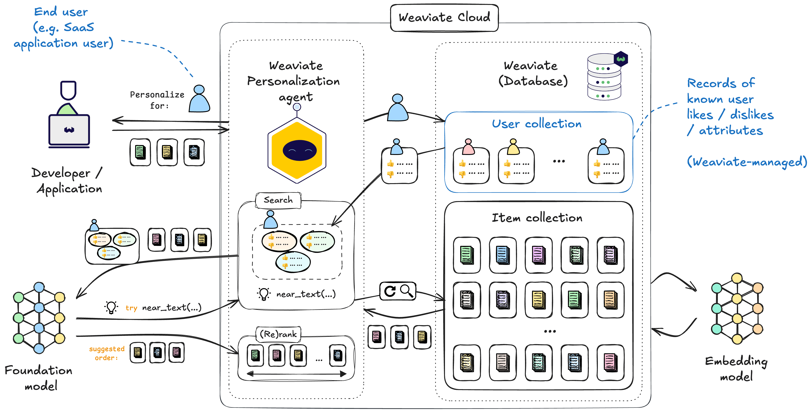
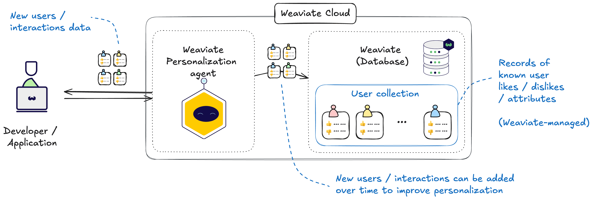
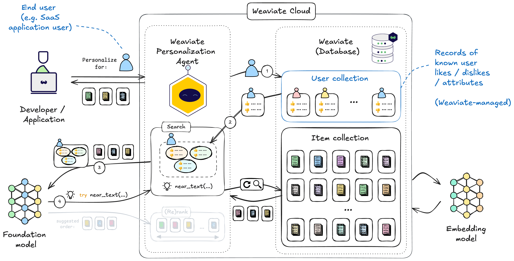

import Tabs from '@theme/Tabs';
import TabItem from '@theme/TabItem';
import FilteredTextBlock from '@site/src/components/Documentation/FilteredTextBlock';
import PyCode from '!!raw-loader!/developers/agents/_includes/personalization_agent.py';

# Weaviate Personalization Agent

The Weaviate Personalization Agent is a pre-built agentic workflow for returning personalized recommendations tailored to each user. The Personalization Agent uses data from the associated Weaviate Cloud instance to provide these recommendations.

:::tip User vs Developer
The Personalization Agent is all about providing personalized recommendations tailored to a particular person. In this context, that person will be referred to as the `user`. The developer is the person who is using the Personalization Agent to provide these recommendations.
:::

The developer would simply provide a user profile, and the Personalization Agent takes care of all intervening steps to provide a set of personalized recommendations from Weaviate. The resulting workflow for the developer looks as follows:

## Architecture

:::tip Details for the curious
You do not need to know the below technical details to use the Personalization Agent. The Personalization Agent simply returns a set of personalized recommendations.
 

The below details are provided for the curious minds who want to know more about the inner workings of the Agent.
:::

The Personalization Agent is provided as a service on Weaviate Cloud.

When a user-specific recommendations request is made, the Personalization Agent analyses the user profile and any other known context to autonomously carry out the searches itself. The context may include data about the previous user interactions, information about the user themselves, and any other relevant information.

The Personalization Agent uses the contextual information to not only retrieve the most relevant recommendations, but also to rank them as the

A high-level view of the Personalization Agent is shown below:

The Personalization Agent works as follows at a high level (the actual implementation may vary):

- Create a Weaviate-managed user collection, which will store each user's profiles & previous interactions for each user.
- When a request for personalized recommendations is made, the Personalization Agent fetches the user data, and analyze it to determine patterns and preferences.
- Perform initial searches in Weaviate based on the analysis to retrieve the most relevant recommendations.
- Use appropriate foundation models to determine any additional search strategies, and to re-rank fetched data as required.
- Perform additional searches in Weaviate as needed to retrieve the final set of recommendations.
- Combine and rank the recommendations based on the user's profile and preferences.

Then, the Personalization Agent returns the user-specific recommendations in the response. The response will also include intermediate outputs, such as the underlying search results from Weaviate.

Let's dive into a little more detail about the Personalization Agent.

### User profiles

The Personalization Agent uses user profiles to provide personalized recommendations. This information is stored in a collection in your Weaviate instance under a specific name. The user profile may include the user's preferences and previous interactions, such as their likes and dislikes.

A high-level view of the user data collection is shown below:

As shown here, the user data collection can be updated over time. It can be updated with information about new users, or with new information about existing users.

This will help the Personalization Agent continue to learn and provide the most relevant, up-to-date recommendations to each user.

### Recommendations

There are two major components to the Personalization Agent's recommendations, the searches it performs to retrieve the recommendations, and the ranking of the recommendations.

#### Searches

rank")

## Usage

### Prerequisites

The Personalization Agent is tightly integrated with Weaviate Cloud. As a result, the Personalization Agent connects to an Weaviate Cloud instance, and a supported version of the client library.

### Connect to Personalization Agent

Provide the following to the Personalization Agent:

- Your Weaviate Cloud instance details (e.g. the `WeaviateClient` object in Python) to the Personalization Agent.
- A list of the collections that the Personalization Agent may use to produce recommendations.

<Tabs groupId="languages">

<TabItem value="py_agents" label="Python[agents]">
    <FilteredTextBlock
        text={PyCode}
        startMarker="# START InstantiateTransformationAgent"
        endMarker="# END InstantiateTransformationAgent"
        language="py"
    />
</TabItem>

</Tabs>

## Questions and feedback

import DocsFeedback from '/_includes/docs-feedback.mdx';

<DocsFeedback/>

