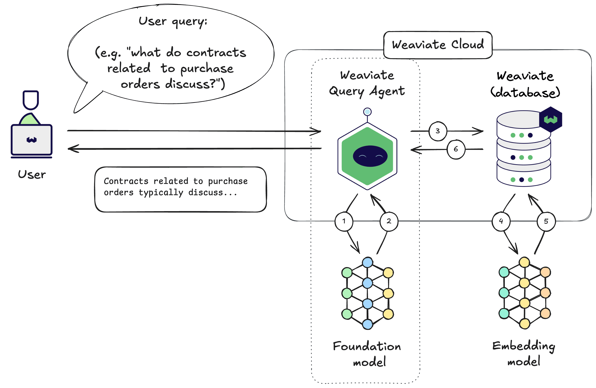

import Tabs from '@theme/Tabs';
import TabItem from '@theme/TabItem';
import FilteredTextBlock from '@site/src/components/Documentation/FilteredTextBlock';
import PyCode from '!!raw-loader!/developers/agents/_includes/query_agent.py';

# Weaviate Query Agent

<!-- The Weaviate Query Agent is a pre-built agentic service for answering natural language queries using data from the associated Weaviate Cloud instance. -->
The Weaviate Query Agent is an agentic service designed to answer natural language queries based on the data stored in Weaviate Cloud.

<!-- The developer would simply provide a prompt, or question, in natural language, and the Query Agent takes care of all intervening steps to provide an answer. -->
The user simply provides a prompt/question in natural language, and the Query Agent takes care of all intervening steps to provide an answer.

<!-- TODO: do we need this sentece? -->
<!-- The resulting workflow for the developer looks as follows:  -->

<!-- TODO: update the image -->
<!-- remove (3)/(6) -->
<!-- simplify output, remove Searches executed..., only keep the first 2 lines -->

## Architecture

<!-- TODO: do we need this tip? if yes, can we make it a one-liner? -->
<!-- :::tip Details for the curious
You do not need to know the below technical details to use the Query Agent. The Query Agent simply returns an answer to the user's query.
 

The below details are provided for the curious minds who want to know more about the inner workings of the Agent.
::: -->

The Query Agent is provided as a service on Weaviate Cloud.

<!-- TODO: thoughts? -->
<!-- When a user provides a query, the query agent analyses it and any other known context to autonomously carry out the searches itself. The context may include what is known about the available Weaviate collections, previous conversation history, and any other relevant information. -->
When a user provides a prompt/query, the query agent analyses it and any other known context to autonomously carry out the searches itself.

<!-- TODO: what do you think of this updated tip? -->
:::tip Query Agent context
The Query agent analyses collection and property descriptions to better undestand how to construct relevant queries. The context may also include previous conversation history, and any other relevant information.
:::

<!-- TODO: thoughts on adding the below anchor? -->
## Query Agent in steps

<!-- TODO: the felt a bit redundant, so I commented it out. -->
<!-- A high-level view of the Query Agent is shown below: -->

<!-- The Query Agent works as follows at a high level (the actual implementation may vary): -->
The Query Agent runs in the following high-level steps (the actual implementation may vary):

- Use appropriate foundation models (e.g. large language models) to analyze the task & the required queries. Determine the exact queries to perform. (Steps 1 & 2)
<!-- TODO: question? do we need to talk about the vectorizing here? Isn't it enough to say that a query happens? Sometimes this could be a keyword search or even a fetch with a filter. -->
- Send queries to Weaviate. Weaviate vectorizes the queries as needed using the specified vectorizer integration. (Steps 3-5)

<!-- - Receive the results from Weaviate, and use appropriate foundation models to analyse the results (Step 6) -->
- Receive the results from Weaviate, and use appropriate foundation models to generate the final respone to the user prompt/query (Step 6)

<!-- TODO: -->
Then, the Query Agent returns the answer to the user, as well as intermediate outputs, such as the underlying search results from Weaviate.

Note that the term `Query Agent` refers to the entire system. The Query Agent may comprise multiple subsystems, such as microservices and/or agents under the hood, each responsible for a specific task.

## Usage

### Prerequisites

The Query Agent is tightly integrated with Weaviate Cloud. As a result, the Query Agent connects to a instance, and a supported version of the client library.

### Connect to Query Agent

Provide the following to the Query Agent:

- Your Weaviate Cloud instance details (e.g. the `WeaviateClient` object in Python) to the Query Agent.
- A list of the collections that the Query Agent may use to answer queries.

<!-- TODO: can we remove headers? I am not sure if that adds any value at this stage. -->

<Tabs groupId="languages">
    <TabItem value="py_agents" label="Python[agents]">
        <FilteredTextBlock
            text={PyCode}
            startMarker="# START InstantiateQueryAgent"
            endMarker="# END InstantiateQueryAgent"
            language="py"
        />
    </TabItem>

</Tabs>

### Queries

Provide a natural language query to the Query Agent. The Query Agent will process the query, perform the necessary searches in Weaviate, and return the answer.

This is a synchronous operation. The Query Agent will return the answer to the user as soon as it is available.

:::tip Consider your query carefully
The Query Agent will formulate its strategy based on your query. So, aim to be unambiguous, complete, yet concise in your query as much as possible.
:::

<Tabs groupId="languages">
    <TabItem value="py_agents" label="Python[agents]">
        <FilteredTextBlock
            text={PyCode}
            startMarker="# START BasicQuery"
            endMarker="# END BasicQuery"
            language="py"
        />
    </TabItem>

</Tabs>

The Query Agent can even handle follow-up queries, using the previous response as additional context.

<Tabs groupId="languages">
    <TabItem value="py_agents" label="Python[agents]">
        <FilteredTextBlock
            text={PyCode}
            startMarker="# START FollowUpQuery"
            endMarker="# END FollowUpQuery"
            language="py"
        />
    </TabItem>

</Tabs>

### Inspect responses

The above examples display the final answers only. The response from the Query Agent will contain additional information, such as the various search results and aggregations.

You can inspect these to verify the answer, or as the basis for further analysis.

<!-- TODO: Does the first sentece repeat what we said in the first paragraph of this segment? :p -->
<!-- Can we skip it, and marge the second sentence to the line above? -->
Note that the response includes various components used for the answer. The examples below show multiple ways to inspect the response.

#### Summarized elements

This format may be useful for a quick overview of the response.

<Tabs groupId="languages">
    <TabItem value="py_agents" label="Python[agents]">
        <FilteredTextBlock
            text={PyCode}
            startMarker="# START InspectResponseShort"
            endMarker="# END InspectResponseShort"
            language="py"
        />
    </TabItem>

</Tabs>

#### Detailed response

This format goes into further depth, including the Query Agent's feedback on whether some desired information was found or not.

<Tabs groupId="languages">
    <TabItem value="py_agents" label="Python[agents]">
        <FilteredTextBlock
            text={PyCode}
            startMarker="# START InspectResponseFull"
            endMarker="# END InspectResponseFull"
            language="py"
        />
    </TabItem>

</Tabs>

## Questions and feedback

import DocsFeedback from '/_includes/docs-feedback.mdx';

<DocsFeedback/>

