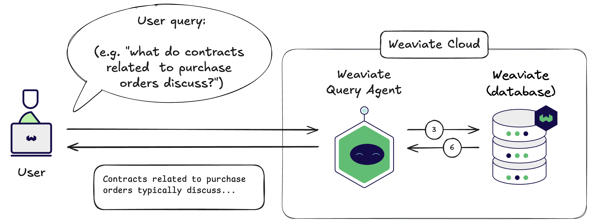

import Tabs from '@theme/Tabs';
import TabItem from '@theme/TabItem';
import FilteredTextBlock from '@site/src/components/Documentation/FilteredTextBlock';
import PyCode from '!!raw-loader!/developers/agents/_includes/query_agent.py';

# Weaviate Query Agent

The Weaviate Query Agent is a pre-built agentic service designed to answer natural language queries based on the data stored in Weaviate Cloud.

The user simply provides a prompt/question in natural language, and the Query Agent takes care of all intervening steps to provide an answer.

## Architecture

The Query Agent is provided as a service on Weaviate Cloud.

When a user provides a prompt/query, the query agent analyses it and any other known context to autonomously carry out the searches itself.

:::tip Query Agent context
The Query agent analyses collection and property descriptions to better understand how to construct relevant queries. 

The context may also include previous conversation history, and any other relevant information.
:::

## Query Agent: visualized workflow

The Query Agent follows these high-level steps:

- Use appropriate foundation models (e.g. large language models) to analyze the task & the required queries. Determine the exact queries to perform. (Steps 1 & 2)
- Send queries to Weaviate. Weaviate vectorizes the queries as needed using the specified vectorizer integration. (Steps 3-5)
- Receive the results from Weaviate, and use appropriate foundation models to generate the final respond to the user prompt/query. (Step 6)

Then, the Query Agent returns the answer to the user, as well as intermediate outputs, such as the underlying search results from Weaviate.

Note that the term `Query Agent` refers to the entire system. The Query Agent may comprise multiple subsystems, such as microservices and/or agents under the hood, each responsible for a specific task.

## Usage

### Prerequisites

The Query Agent is tightly integrated with Weaviate Cloud. As a result, the Query Agent is available exclusively for use with a Weaviate Cloud instance, and a supported version of the client library.

### Connect to Query Agent

Provide the following to the Query Agent:

- Your Weaviate Cloud instance details (e.g. the `WeaviateClient` object in Python) to the Query Agent.
- A list of the collections that the Query Agent may use to answer queries.

<Tabs groupId="languages">
    <TabItem value="py_agents" label="Python[agents]">
        <FilteredTextBlock
            text={PyCode}
            startMarker="# START InstantiateQueryAgent"
            endMarker="# END InstantiateQueryAgent"
            language="py"
        />
    </TabItem>

</Tabs>

### Queries

Provide a natural language query to the Query Agent. The Query Agent will process the query, perform the necessary searches in Weaviate, and return the answer.

This is a synchronous operation. The Query Agent will return the answer to the user as soon as it is available.

:::tip Consider your query carefully
The Query Agent will formulate its strategy based on your query. So, aim to be unambiguous, complete, yet concise in your query as much as possible.
:::

<Tabs groupId="languages">
    <TabItem value="py_agents" label="Python[agents]">
        <FilteredTextBlock
            text={PyCode}
            startMarker="# START BasicQuery"
            endMarker="# END BasicQuery"
            language="py"
        />
    </TabItem>

</Tabs>

The Query Agent can even handle follow-up queries, using the previous response as additional context.

<Tabs groupId="languages">
    <TabItem value="py_agents" label="Python[agents]">
        <FilteredTextBlock
            text={PyCode}
            startMarker="# START FollowUpQuery"
            endMarker="# END FollowUpQuery"
            language="py"
        />
    </TabItem>

</Tabs>

### Inspect responses

The above examples display the final answers only. The response from the Query Agent will contain additional information, such as the various search results and aggregations.

You can inspect these to verify the answer, or as the basis for further analysis. The examples below show multiple ways to inspect the response.

#### Summarized elements

This format may be useful for a quick overview of the response.

<Tabs groupId="languages">
    <TabItem value="py_agents" label="Python[agents]">
        <FilteredTextBlock
            text={PyCode}
            startMarker="# START InspectResponseShort"
            endMarker="# END InspectResponseShort"
            language="py"
        />
    </TabItem>

</Tabs>

#### Detailed response

This format goes into further depth, including the Query Agent's feedback on whether some desired information was found or not.

<Tabs groupId="languages">
    <TabItem value="py_agents" label="Python[agents]">
        <FilteredTextBlock
            text={PyCode}
            startMarker="# START InspectResponseFull"
            endMarker="# END InspectResponseFull"
            language="py"
        />
    </TabItem>

</Tabs>

## Questions and feedback

import DocsFeedback from '/_includes/docs-feedback.mdx';

<DocsFeedback/>

