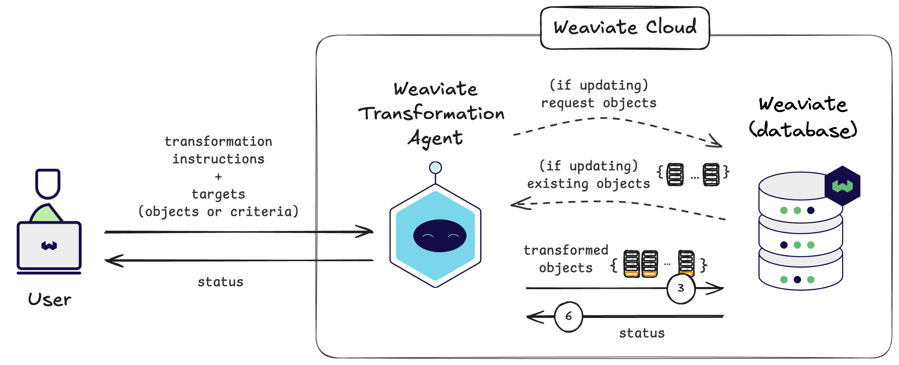

import Tabs from '@theme/Tabs';
import TabItem from '@theme/TabItem';
import FilteredTextBlock from '@site/src/components/Documentation/FilteredTextBlock';
import PyCode from '!!raw-loader!/developers/agents/_includes/transformation_agent.py';

# Weaviate Transformation Agent


The Weaviate Transformation Agent is an agentic service designed to augment and transform data using foundation models.

The Transformation Agent can be used to append new properties and/or update existing properties of data, for new or existing objects in Weaviate.

This can help you to improve the quality of your objects in your Weaviate collections, ready for further use in your applications.



## Architecture

<!-- TODO: can we trim or remove this tip? -->
:::tip Details for the curious
You do not need to know the below technical details to use the Personalization Agent. The Personalization Agent simply returns a set of personalized recommendations.
<br/>

The below details are provided for the curious minds who want to know more about the inner workings of the Agent.
:::

The Transformation Agent is provided as a service on Weaviate Cloud.

The Transformation Agent can be called upon to perform one or more transformation operations at a time. Each operation is performed:

- On new data being imported into Weaviate, or on existing data in Weaviate.
- To create a new property, or update an existing property.
- Based on the context of one or more existing properties and a specified set of instructions.

The Transformation Agent can thus be used to enhance the data at import time, or to update properties on existing objects.

<!-- TODO: thoughts? -->
## Transformation Agent in steps

<!-- TODO: can we skip this sentence? -->
<!-- A high-level view of the Transformation Agent is shown below: -->

<!-- TODO: This feels like we shared this image twice by mistake -->
<!--  -->

Let's dive into a little more detail about the Transformation Agent, using a few example workflows:

### Add new properties to data at import time

In this example, the Transformation Agent is used to add new properties to data at import time. The Transformation Agent is provided with a set of instructions for creating new properties, and the set of new objects to be added to Weaviate.

The figure below shows the workflow:


The Transformation Agent works as follows at a high level (the actual implementation may vary):

- The Transformation Agent works with a foundation model to create the new property, based on the instructions provided and the context of the specified existing properties (steps 1-2).
- Insert the transformed objects to Weaviate. Weaviate vectorizes the data as needed using the specified vectorizer integration. (Steps 3-5)
- Receive the job status from Weaviate, which is returned to the user (Step 6).

As a result, Weaviate is populated with transformed versions of the input data provided by the user.

### Update properties on existing objects

In this example, the Transformation Agent is used to update existing properties on objects that already exist in Weaviate. The Transformation Agent is provided with a set of instructions for how to update the existing properties, and which of the existing objects to update.

The figure below shows the workflow:


The Transformation Agent works as follows at a high level (the actual implementation may vary):

- The Transformation Agent retrieves the existing objects from Weaviate, based on the specified criteria (steps 1-2).
- The Transformation Agent works with a foundation model to create new versions of the property, based on the instructions provided and the context of the specified existing properties (steps 3-4).
- Update the transformed objects in Weaviate. Weaviate vectorizes the data as needed using the specified vectorizer integration. (Steps 5-7)
- Receive the job status from Weaviate, which is returned to the user (Step 8).

As a result, the specified objects in Weaviate are updated, with the new versions of the specified properties. For clarity, this would not change the number of objects in Weaviate, but would update the properties of the specified objects.

## Usage


Transformation operations are asynchronous, and the Transformation Agent will return a job ID to the user. The user can then use this job ID to check the status of the job, and retrieve the results when the job is complete.

To use the Transformation Agent, you must provide the following:

- The Weaviate Cloud instance details (e.g. the `WeaviateClient` object in Python) to the Transformation Agent.
- Either new objects to be added to Weaviate, or existing objects to be updated.
- A list of the transformation operations to be performed.

### Prerequisites

The Transformation Agent is tightly integrated with Weaviate Cloud. As a result, the Transformation Agent connects to a Weaviate Cloud instance, and a supported version of the client library.

### Connect to Weaviate

You must connect to the Weaviate Cloud instance to use the Transformation Agent. Connect to the Weaviate Cloud instance using the Weaviate client library.

<Tabs groupId="languages">
    <TabItem value="py_agents" label="Python[agents]">
        <FilteredTextBlock
            text={PyCode}
            startMarker="# START ConnectToWeaviate"
            endMarker="# END ConnectToWeaviate"
            language="py"
        />
    </TabItem>
</Tabs>

### Define transformation operations

A transformation operation requires:

- Type
- Targets (e.g. objects to be updated, or new objects to be added)
- Instructions
- Context (e.g. existing properties to be used as context)

Here are a few examples of transformation operations:

#### Append new properties to data

Properties of various types can be added to the data, based on one or more existing properties. See the following example operations:

<Tabs groupId="languages">
    <TabItem value="py_agents" label="Python[agents]">
        <FilteredTextBlock
            text={PyCode}
            startMarker="# START DefineOperationsAppend"
            endMarker="# END DefineOperationsAppend"
            language="py"
        />
    </TabItem>

</Tabs>

#### Update existing properties

Existing properties can be updated based on the context of one or more existing properties. See the following example operations:

<!-- TODO: the code example is missing ;) -->

<Tabs groupId="languages">
    <TabItem value="py_agents" label="Python[agents]">
        <FilteredTextBlock
            text={PyCode}
            startMarker="# START QueryParameters"
            endMarker="# END QueryParameters"
            language="py"
        />
    </TabItem>

</Tabs>

<!-- TODO: we should add an example of transform at insert -->
### Transform at insert

Once the transformation operations are defined, you can create a Transformation Agent, and use it to transform new data at insert. This way the data will only get vectorized once, after the transformation.

```python
# [!NOTE!] This Weaviate Agent is not available just yet.
# These snippets are placeholders only, and may change when it is released.

from weaviate.agents.transformation import TransformationAgent

ta = TransformationAgent(
    client=client,
    collection="ecommerce",
    operations=[
        is_premium_product_op,
        product_descriptors_op,
        name_update_op,
    ],
)

ta.data.insert_many([
    { "name": "Foo", "description": "...", "reviews": ["...", "..."] "price": 25, "rating": 3 },
    { "name": "Bar", "description": "...", "reviews": ["...", "..."] "price": 50, "rating": 4 },
])
```
<!-- TODO: what do you think of this title -->
<!-- ### Start transformation operations -->
### Transform collection data

Once the transformation operations are defined, you can start the transformation operations. The Transformation Agent will return a job ID when the operations are started.

<Tabs groupId="languages">
    <TabItem value="py_agents" label="Python[agents]">
        <FilteredTextBlock
            text={PyCode}
            startMarker="# START StartTransformationOperations"
            endMarker="# END StartTransformationOperations"
            language="py"
        />
    </TabItem>

</Tabs>

### Monitor job status

<!-- A job ID is returned when the transformation operations are initiated. This job ID can be used to monitor the status of the job, and retrieve the results when the job is complete. -->
You can use the job ID to monitor the status of the job, and retrieve the results when the job is complete.

<Tabs groupId="languages">
    <TabItem value="py_agents" label="Python[agents]">
        <FilteredTextBlock
            text={PyCode}
            startMarker="# START MonitorJobStatus"
            endMarker="# END MonitorJobStatus"
            language="py"
        />
    </TabItem>

</Tabs>

## Questions and feedback

import DocsFeedback from '/_includes/docs-feedback.mdx';

<DocsFeedback/>

