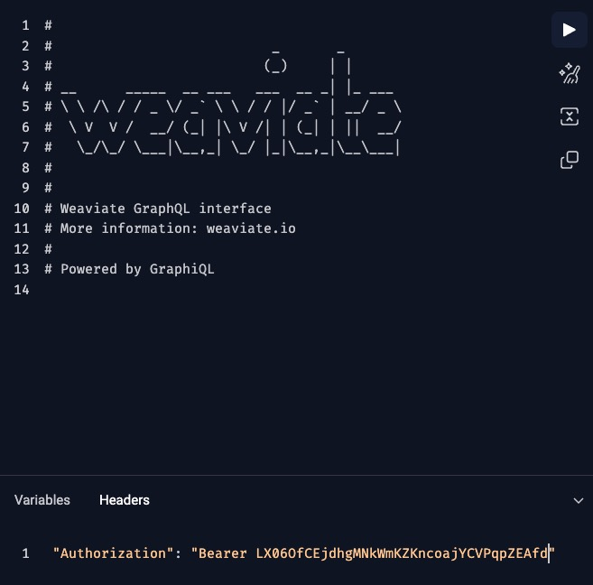
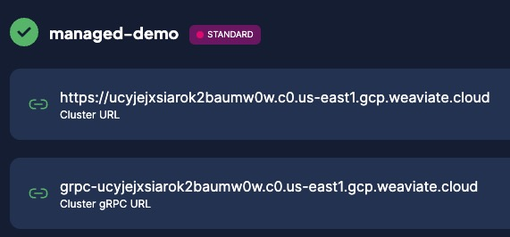

There are two ways to connect to a [Weaviate Cloud (WCD)](https://console.weaviate.cloud/) instance:

- [Connect through the WCD console.](/developers/wcs/connect#connect-with-a-browser)

   - The WCD console is a multi-purpose tool. Login to manage your clusters, users, and billing.
   - The built-in [Query app](./console.mdx) is useful to connect without a client application.

- [Connect with APIs.](/developers/wcs/connect#connect-with-an-api)

   - Use one of the [client libraries](/developers/weaviate/client-libraries) to connect to a WCD instance.

The WCD console uses a username and password for authentication. The Weaviate clients use API keys to authenticate.

## Connect with a browser

The WCD dashboard lets you monitor and control your Weaviate clusters from your browser. It also provides account management tools and a [GraphQL query app](./console.mdx).

To connect to WCD with a browser, follow these steps:

1. Open the [WCD login page](https://console.weaviate.cloud/) in a browser.
1. Click `Login to Weaviate Cloud`.
1. Enter your email address and password to authenticate.

## Connect with an API

By default, API keys are enabled for all WCD clusters. Managed clusters have an administrator key and a read-only key. Sandbox clusters only have an administrator key.


### Retrieve your API keys

To retrieve your API keys, follow these steps:

1. Open the WCD console and find the panel for your cluster.
1. Click the `Details` button.


3. Click the `API keys` button.
1. Copy the key and store it in a safe location.


### Authenticate a client application

The Weaviate server authenticates every request.

If you use a tool like cURL, add your API key to the request header.

If you use a Weaviate client library, pass the API key when you instantiate the client connection. After the connection is established, you do not have to pass the API key when you make requests.

Do not hard-code your API key in your client code. Consider passing the API key as an environment variable or using a similar secure coding technique.

```bash
export WEAVIATE_API_KEY="replaceThisPartWithYourAPIKey"
```

import WCDAuthenticationApiKey from '/_includes/code/wcs.authentication.api.key.mdx';

<WCDAuthenticationApiKey/>

## Connect via the query app

The built in [GraphQL query app](./console.mdx) connects to clusters in your organization without any additional authentication.

If you use the GraphQL query app to connect to a Weaviate instance that is not part of your organization, provide an API key for the remote instance.

To pass the API key, add it to the `Headers` at the bottom of the GraphQL query app.



## Troubleshooting

This section has solutions for some common problems. For additional help, [contact support](#support).

### Reset your password

To reset your WCD password, follow these steps:

1. Go to the WCD [login page](https://console.weaviate.cloud).
1. Click on click the login button.
1. Click `Forgot Password`.
1. Check your email account for a password reset email from WCD.
1. Click the link and follow the instructions to reset your password. The link is only valid for five minutes.

### Connection timeouts

The new Python client uses the gRPC protocol to connect to WCD. The gRPC protocol improves query performance, but the protocol is sensitive to network speeds. If you run into timeout errors, increase the connection timeout value in your connection code.

import Tabs from '@theme/Tabs';
import TabItem from '@theme/TabItem';
import FilteredTextBlock from '@site/src/components/Documentation/FilteredTextBlock';
import PyCodeSupp from '!!raw-loader!/_includes/code/client-libraries/python_slow_connection.py';

<Tabs groupId="languages">
<TabItem value="py4" label="Python Client v4">

   <FilteredTextBlock
     text={PyCodeSupp}
     startMarker="# START ConnectWithLongTimeOut"
     endMarker="# END ConnectWithLongTimeOut"
     language="py"
   />

</TabItem>
</Tabs>

Alternatively, leave the default timeout values, but skip the initial connection checks.

<Tabs groupId="languages">
<TabItem value="py4" label="Python Client v4">

   <FilteredTextBlock
     text={PyCodeSupp}
     startMarker="# START ConnectWithSkipChecks"
     endMarker="# END ConnectWithSkipChecks"
     language="py"
   />

</TabItem>
</Tabs>

### gRPC health check error

**Problem**: gRPC returns a health check error after you update a managed cluster.

```
weaviate.exceptions.WeaviateGRPCUnavailableError: gRPC health check could not be completed.
```

**Solution**: Verify the cluster URL is correct and update the URL if needed.

When a managed cluster is updated, the cluster URL may change slightly. WCD still routes the old URL, so some connections work, however the new gRPC and the old HTTP URLS are different so connections that require gRCP fail.

To check the URLs, open the WCD Console and check the details panel for your cluster. If you prefix Cluster URL with `grpc-`, the Cluster URL and the Cluster gRPC URL should match.



Compare the Cluster URL with the connection URL in your application. The old URL and the new URL are similar, but the new one may have an extra subdomain such as `.c0.region`.

If the URLs are different, update your application's connection code to use the new Cluster URL.

## More resources

To authenticate with a Weaviate client library, see the following:

- [Python](/developers/weaviate/client-libraries/python/index.md#authentication)
- [TypeScript/JavaScript](/developers/weaviate/client-libraries/typescript#authentication)
- [Go](/developers/weaviate/client-libraries/go.md#authentication)
- [Java](/developers/weaviate/client-libraries/java.md#authentication)

## Support

import SupportAndTrouble from '/_includes/wcs/support-and-troubleshoot.mdx';

<SupportAndTrouble />

import CustomScriptLoader from '/src/components/scriptSwitch';

<CustomScriptLoader/>
