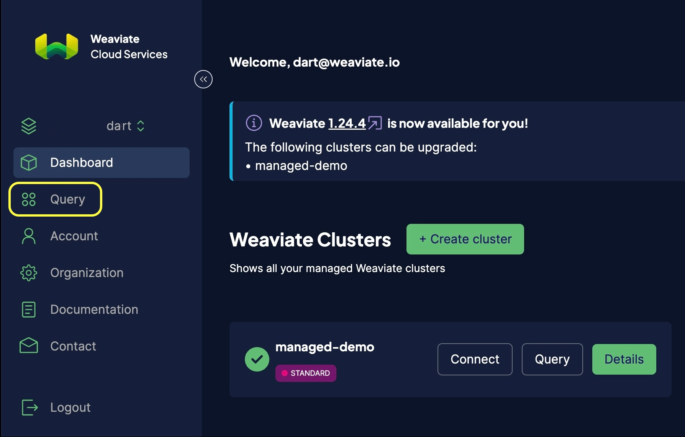

import WCSConsoleButton from './img/wcs-console-button.png';
import WCSConnectedInstances from './img/wcs-connected-instances.png';
import WCSQueryDropdown from './img/wcs-query-dropdown.png';
import WCSInferenceApiKey from './img/wcs-console-inference-key.png';
import WCSManyInferenceApiKeys from './img/wcs-console-many-inference-keys.png';

The Weaviate Cloud Services (WCS) query console is a browser-based GraphQL IDE. use the console to work interactively with your WCS clusters.

The query console connects directly to your WCS clusters. The query console can also connect to other Weaviate instances if you have the proper authorization credentials.

[GraphiQL](https://github.com/graphql/graphiql/tree/main/packages/graphiql) is built into the query console. GraphiQL provides many features to make GraphQL easier to use:

- Syntax highlighting
- Intelligent type ahead
- Automatic completion for queries and variables
- Real-time error highlighting and reporting for queries and variables

## Open the query console

To open the query console, connect to your WCS [WCS Dashboard](https://console.weaviate.cloud). In the left-hand menu, click the stacked circle icon.

### Select an instance

The GraphQL query console can connect to any Weaviate instance, including external instances, as long as it is connected through the WCS Dashboard.

In this example, the WCS Dashboard is connected to an external instance as well as the two WCS instances.

The GraphQL console can be used to query any of the three instances.

Click the `Query` button for a cluster to open a console window connected to that cluster.

Alternatively, the query window includes a drop-down menu at the top of the screen which can be used to choose the desired instance.

  

### Authentication

If you are querying a WCS instance that you own through the WCS console, your queries will automatically include the appropriate authentication information in the header.

This is the case for both WCS sandboxes as well as managed clusters.

### Inference key(s)

If you need to provide any inference service API keys for modules such as `text2vec-cohere`, `text2vec-cohere`, or `text2vec-openai`, you can do so through the "Header" tab located towards the bottom of the query screen. An example is shown below, where the `X-OpenAI-Api-Key` header has been set with the OpenAI API key (actual value hidden).

The header can contain multiple keys if needed (e.g. if `text2vec-cohere` is used with `generative-openai`).

The image below shows the syntax to do so (you must provide the actual values).

:::tip Check your Weaviate version
If you are having any issues providing additional headers on a WCS instance, check that your Weaviate server version is `1.18.3` or higher. We added a [fix in v1.18.3](https://github.com/weaviate/weaviate/pull/2840) which might affect this capability.
:::

## More resources

- [GraphiQL library](https://github.com/graphql/graphiql/tree/main/packages/graphiql)
- [Vectorizer modules](/developers/weaviate/modules/retriever-vectorizer-modules/) (e.g. Cohere / HuggingFace / OpenAI)
