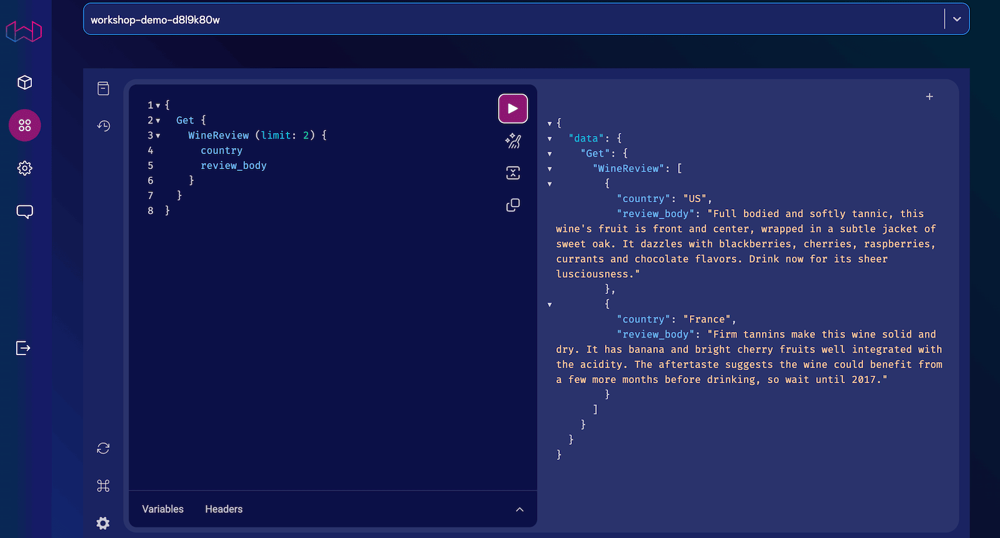

import WCDConsoleButton from './img/wcs-console-button.png';
import WCDConnectedInstances from './img/wcs-connected-instances.png';
import WCDQueryDropdown from './img/wcs-query-dropdown.png';
import WCDInferenceApiKey from './img/wcs-console-inference-key.png';
import WCDManyInferenceApiKeys from './img/wcs-console-many-inference-keys.png';
import WCDQueryConsoleLocation from './img/wcs-query-console-location.jpg';

The Weaviate Cloud (WCD) query application (query app) is a browser-based GraphQL IDE. Use the query app to work interactively with your WCD clusters.

[GraphiQL](https://github.com/graphql/graphiql/tree/main/packages/graphiql) is built into the query app. GraphiQL provides many features that make GraphQL easier to use interactively:

- Syntax highlighting
- Intelligent type ahead
- Automatic completion for queries and variables
- Real-time error highlighting and reporting for queries and variables

## Open the query app

To open the query app, connect to your WCD [WCD Dashboard](https://console.weaviate.cloud).

In the left-hand menu, click the Query app icon.

## Select a Weaviate instance

The query app connects directly to your WCD clusters. The query app can also connect to other Weaviate instances if you have the proper authorization credentials.

### Connect to a WCD cluster

In this example, the WCD Dashboard is connected to an external instance as well as the two WCD instances.

The GraphQL console can query any of the instances.

To select a cluster, click the `Query` button and chose a cluster from the list that appears.

### Authentication

The query app connects to WCD instances, sandboxes and serverless clusters, without any additional authentication details. The query app can also connect to external Weaviate instances if you have anonymous access enabled or authentication credentials.

### Pass authentication details

import ExternalAuth from '/_includes/wcs/query-auth-details.mdx';

<ExternalAuth/>

### Pass inference keys

To pass API keys for inference modules, use request headers. The `Header` tab is at bottom of the query screen. Add the service inference key to the query headers.

In this example, the `X-OpenAI-Api-Key` header sets the OpenAI API key.

The header can pass multiple keys.

## More resources

- [GraphiQL library](https://github.com/graphql/graphiql/tree/main/packages/graphiql)
- [Vectorizer modules](/developers/weaviate/modules/retriever-vectorizer-modules/)

## Support

import SupportAndTrouble from '/_includes/wcs/support-and-troubleshoot.mdx';

<SupportAndTrouble />
