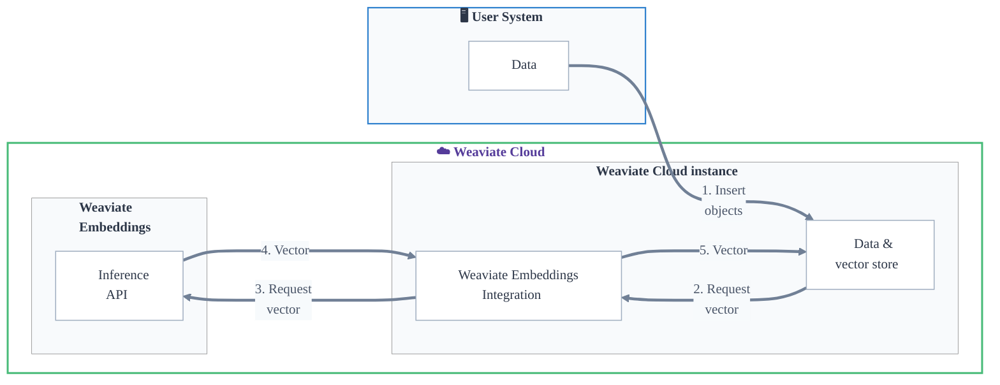

:::tip Quickstart
Follow the **[Quickstart guide](/developers/wcs/embeddings/quickstart)** to get started with Weaviate Embeddings.
:::

Weaviate Embeddings provides secure, scalable embedding generation as a fully managed service.

Weaviate Embeddings integrates with Weaviate Cloud instances to generate, store, and search embeddings without managing infrastructure.

With Weaviate Embeddings, you can generate embeddings for your data and queries directly from a Weaviate Cloud database instance.

This means you can perform semantic, vector and hybrid searches without the need to externally generate vector embeddings, or manage additional model providers.

Weaviate Embeddings is fully integrated with Weaviate Cloud, so you can manage your data and embeddings in one place.

## Key Features

Weaviate Embeddings offers a fully managed service for embedding generation that is integrated with Weaviate Cloud instances.

- **Single authentication**: Your Weaviate Cloud credentials are used for authorization and access to Weaviate Embeddings.
- **Unified billing**: Your billing and usage can be managed in one place through Weaviate Cloud.
- **Model selection**: Choose from our hand-picked selection of embedding models to generate embeddings that suit your use case.

## Availability

Weaviate Embeddings is a part of Weaviate Cloud, and available for Weaviate Cloud instances. It is currently not available for open-source Weaviate users.

## Additional resources

- [Model provider integrations: Weaviate Embeddings](/developers/weaviate/model-providers/weaviate/embeddings)
