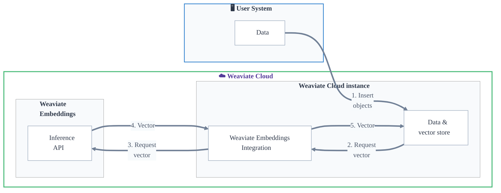
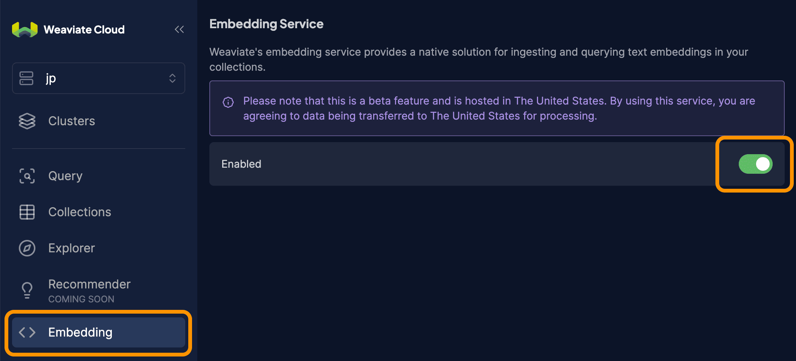

## Overview

Weaviate Embeddings provides secure, scalable embedding generation as a fully managed service.

Weaviate Embeddings integrates with Weaviate Cloud instances to generate, store, and search embeddings without managing infrastructure.

With Weaviate Embeddings, you can generate embeddings for your data and queries directly from a Weaviate Cloud database instance.

This means you can perform semantic, vector and hybrid searches without the need to externally generate vector embeddings, or manage additional model providers.

Weaviate Embeddings is fully integrated with Weaviate Cloud, so you can manage your data and embeddings in one place.

:::info Weaviate Embeddings is in technical preview
Weaviate Embeddings is in technical preview. This means that the service is still in development and may have limited functionality.
 

During the technical preview, you can use Weaviate Embeddings for free. However, the service may be subject to change.
 

To try out Weaviate Embeddings, please [contact us](/embeddings) to request access.
:::

### Key Features

Weaviate Embeddings offers a fully managed service for embedding generation that is integrated with Weaviate Cloud instances.

- **Single authentication**: Your Weaviate Cloud credentials are used for authorization and access to Weaviate Embeddings.
- **Unified billing**: Your billing and usage can be managed in one place through Weaviate Cloud.
- **Model selection**: Choose from our hand-picked selection of embedding models to generate embeddings that suit your use case.

### Availability

Weaviate Embeddings is a part of Weaviate Cloud, and available for Weaviate Cloud instances. It is currently not available for open-source Weaviate users.

## Service Details

### Models

The following models are available for use with Weaviate Embeddings:

- `arctic-embed-m-v1.5`
    - A 109M parameter, 768-dimensional model for enterprise retrieval tasks in English.
    - Trained with Matryoshka Representation Learning to allow vector truncation with minimal loss.
    - Quantization-friendly: Using scalar quantization and 256 dimensions provides 99% of unquantized, full-precision performance.
    - Read more at the [Snowflake blog](https://www.snowflake.com/engineering-blog/arctic-embed-m-v1-5-enterprise-retrieval/), and the Hugging Face [model card](https://huggingface.co/Snowflake/snowflake-arctic-embed-m-v1.5)
    - Allowable `dimensions`: 768 (default), 512, 256, 128

Additional models will be added in the future.

:::info Input truncation
Currently, input exceeding the model's context windows is truncated from the right (i.e. the end of the input).
:::

### Parameters

- `model` (optional): The name of the model to use for embedding generation.
- `dimensions` (optional): The number of dimensions to use for the generated embeddings. Only available for models that support Matryoshka Representation Learning.
- `base_url` (optional): The base URL for the Weaviate Embeddings service. (Not required in most cases.)

### Rate Limits

Weaviate Embeddings does not impose rate limits on requests.

### Pricing and Billing

During the technical preview, Weaviate Embeddings is free to use.

Pricing and billing details will be provided in the future.

### Data Privacy

Weaviate Embeddings is a stateless service that does not store any data.

The data provided to Weaviate Embeddings is used solely for the purpose of generating embeddings.

We do not store or use your data for any other purpose, including training or model improvement.

#### Service and Data Location

Weaviate Embeddings makes use of infrastructure located in the United States. Note that by using Weaviate Embeddings, you are agreeing to have your data transferred to the United States for processing.

We may expand the service to other regions in the future.

### Administration

Weaviate Embeddings can be enabled from the Weaviate Cloud console, at the organization level.

Once enabled, all clusters within the organization can access Weaviate Embeddings.

Authentication is managed through your existing Weaviate Cloud API key.

## Get Started

### Prerequisites

To use Weaviate Embeddings, you need a Weaviate Cloud account, and a Weaviate Cloud Serverless instance. If you do not have an account, you can sign up for free at the [Weaviate Cloud console](https://console.weaviate.cloud/).

### Usage

To use Weaviate Embeddings, log into the Weaviate Cloud console, and enable the Weaviate Embeddings service for your organization.

Once the service is enabled, you can use Weaviate Embeddings to generate embeddings for your data and queries.

Refer to the [Model Provider Integrations page](/developers/weaviate/model-providers/weaviate-embeddings/embeddings) for code examples, on:
- [How to configure a vectorizer](/developers/weaviate/model-providers/weaviate-embeddings/embeddings#configure-the-vectorizer)
- [Import data](/developers/weaviate/model-providers/weaviate-embeddings/embeddings#data-import)
- [Perform searches](/developers/weaviate/model-providers/weaviate-embeddings/embeddings#searches)

## Additional Resources

- [Model provider integrations: Weaviate Embeddings](/developers/weaviate/model-providers/weaviate-embeddings/embeddings)
