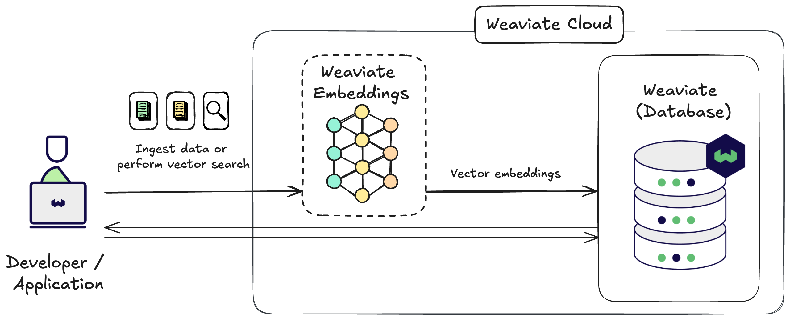

Weaviate Embeddings is a managed embedding inference service for Weaviate Cloud users. It helps generate embeddings for your data and queries conveniently and directly from a Weaviate Cloud database instance.

:::info
Weaviate Embeddings is a paid service and only available for use with Weaviate Cloud instances.  
You can try it out **for free by using a Sandbox cluster**.
:::

With Weaviate Embeddings, you can generate embeddings for your data and queries directly from a Weaviate Cloud database instance.

This means you can perform [keyword](/developers/weaviate/search/bm25), [vector](/developers/weaviate/search/similarity) and [hybrid searches](/developers/weaviate/search/hybrid) without the need to externally generate vector embeddings, or manage additional model providers.

:::tip Quickstart
Follow the **[quickstart guide](/developers/wcs/embeddings/quickstart)** to get started with Weaviate Embeddings.
:::

<!--
## Key Features

Simplified embedding management through:

- **[Model selection](/developers/wcs/embeddings/models)**: Choose from our hand-picked selection of embedding models to generate embeddings that suit your use case.
- **[Single authentication](#authentication)**: Your Weaviate Cloud credentials are used for authorization.
- **[Unified billing](/developers/wcs/embeddings/administration#pricing-and-billing)**: Your billing and usage can be managed in one place through Weaviate Cloud.
-->

## Available models

The following models are available for use with Weaviate Embeddings:

- **[`Snowflake/snowflake-arctic-embed-m-v1.5`](/developers/wcs/embeddings/models#snowflake-arctic-embed-m-v1.5)**
- **[`Snowflake/snowflake-arctic-embed-l-v2.0`](/developers/wcs/embeddings/models#snowflake-arctic-embed-l-v2.0)**

## Authentication

In order to use Weaviate Embeddings you only need a [connection to your Weaviate Cloud cluster](/developers/wcs/manage-clusters/connect). 
No additional authentication is specifically needed, and the Weaviate Embeddings service is enabled by default for all clusters. You can use the service no matter if you connect with a [client library](/developers/weaviate/client-libraries) or, for example, via [OIDC](/developers/weaviate/configuration/authentication#oidc).

## Usage limits

<!-- TODO[g-despot] Don't hardcode these values here if possible -->
Weaviate Embeddings only imposes usage limits on requests for free Sandbox clusters. 
The rate limit for Sandbox clusters is `2000` requests per cluster. 

:::info
If you use a [batch import](/developers/weaviate/manage-data/import) to vectorize your data, the maximum size is `200` objects per batch. 
This means that you can generate up to a maximum of `400 000` embeddings (`2000 (requests) * 200 (objects per request)`) within your free Sandbox cluster.
:::

## Requirements

import Requirements from '/_includes/weaviate-embeddings-requirements.mdx';

<Requirements />

## Data privacy

Weaviate Embeddings is a stateless service that does not store any data.

The data provided to Weaviate Embeddings is used solely for the purpose of generating embeddings. We do not store or use your data for any other purpose, including training or model improvement.

### Service and data location

Weaviate Embeddings makes use of infrastructure located in the United States. Note that by using Weaviate Embeddings, you are agreeing to have your data transferred to the United States for processing.

We may expand the service to other regions in the future.

## Additional resources

- [Weaviate Embeddings: Quickstart](/developers/wcs/embeddings/quickstart)
- [Weaviate Embeddings: Choose a model](/developers/wcs/embeddings/models)
- [Weaviate Embeddings: Administration](/developers/wcs/embeddings/administration)
- [Model provider integrations: Weaviate Embeddings](/developers/weaviate/model-providers/weaviate/embeddings)

## Support

import SupportAndTrouble from '/_includes/wcs/support-and-troubleshoot.mdx';

<SupportAndTrouble />
