## Overview

:::info Weaviate Embeddings is in technical preview
Weaviate Embeddings is in technical preview. This means that the service is still in development and may have limited functionality.
 

During the technical preview, you can use WES for free. However, the service may be subject to change, and we may introduce pricing in the future.
:::

Weaviate Embeddings provides secure, scalable embedding generation as a fully managed service.

WES integrates with Weaviate Cloud instances to generate, store, and search embeddings without managing infrastructure.

```mermaid
%%{init: {
  'theme': 'base',
  'themeVariables': {
    'primaryColor': '#4a5568',
    'primaryTextColor': '#2d3748',
    'primaryBorderColor': '#718096',
    'lineColor': '#718096',
    'secondaryColor': '#f7fafc',
    'tertiaryColor': '#edf2f7',
    'fontFamily': 'Inter, system-ui, sans-serif',
    'fontSize': '14px',
    'lineHeight': '1.4',
    'nodeBorder': '1px',
    'mainBkg': '#ffffff',
    'clusterBkg': '#f8fafc'
  }
}}%%

flowchart LR
    %% Style definitions
    classDef systemBox fill:#f8fafc,stroke:#3182ce,stroke-width:1.5px,color:#2d3748,font-weight:bold
    classDef weaviateBox fill:#f8fafc,stroke:gray,stroke-width:0.5px,color:#2d3748,font-weight:bold
    classDef cloudBox fill:white,stroke:#48bb78,stroke-width:2px,color:#553c9a,font-weight:bold
    classDef providerBox fill:#f8fafc,stroke:gray,stroke-width:0.5px,color:#2d3748,font-weight:bold
    classDef component fill:white,stroke:#a0aec0,stroke-width:1px,color:#2d3748
    classDef edgeLabel fill:white,stroke:#e2e8f0,stroke-width:1px,color:#4a5568

    %% Weaviate Cloud container
    subgraph cloud["☁️ Weaviate Cloud\n "]
        %% WES section
        subgraph provider["WES"]
            inference["🤖 Inference\nAPI"]
        end

        %% Weaviate section
        subgraph weaviate["Weaviate"]
            vectorizer["🔌 WES\nIntegration"]
            core["💾 Data &\nvector store"]
        end
    end

    %% User System
    subgraph user["🖥️ User System"]
        data["📄 Data"]
    end

    %% Connections with curved edges
    data --->|"1. Insert\nobjects"| core
    core --->|"2. Request\nvector"| vectorizer
    vectorizer --->|"3. Request\nvector"| inference
    inference --->|"4. Vector"| vectorizer
    vectorizer --->|"5. Vector"| core

    %% Apply styles
    class user systemBox
    class weaviate weaviateBox
    class cloud cloudBox
    class provider providerBox
    class data,core,vectorizer,inference component

    %% Linkstyle for curved edges
    linkStyle default stroke:#718096,stroke-width:3px,fill:none,background-color:white
```

### Key Features

WES offers a fully managed service for embedding generation that is integrated with Weaviate Cloud instances.

- **Single authentication**: Your Weaviate Cloud credentials are used to authorize your Weaviate Cloud instance's access to WES.
- **Unified billing**: Weaviate Embeddings is integrated with Weaviate Cloud, so you can manage your billing and usage in one place.
- **Model selection**: Choose from our hand-picked selection of embedding models to generate embeddings that suit your use case.

### Availability

:::caution TODO
- Who can use this service
:::

## Getting Started

:::caution TODO
- Prerequisites
  - Weaviate Cloud Account
  - Required Permissions
- Enabling Weaviate Embeddings
  - Will this be enabled by default?
- Service Configuration
  - Embedding Models
  - API Keys and Authentication
- Usage instructions
  - Snippets for collection config; import & search (or link to model provider doc)
  - QuickStart?
:::

## Service Details

### Models

:::caution TODO
At this time, the following models are available for use with WES:

- `snowflake-arctic-embed` (xx, yy parameters)
:::

### Rate Limits

:::caution TODO
- Should we say anything during the technical preview?
:::

### Pricing and Billing

:::caution TODO
Preview limits
:::

### Security

:::caution TODO
- Should we have a security section?
- e.g. data privacy, access control (i.e. no access from outside of Weaviate Cloud)
:::

### Administration

:::caution TODO
- User management? (How does this interact with WCD users/projects)
- API Key Management
:::

## Support

:::caution TODO
- How to get help
- Troubleshooting
:::

## Additional Resources

- [Model provider integrations: WES embeddings](/developers/weaviate/model-providers/wes/embeddings.md)
