import Tabs from '@theme/Tabs';
import TabItem from '@theme/TabItem';
import FilteredTextBlock from '@site/src/components/Documentation/FilteredTextBlock';
import PyConnect from '!!raw-loader!/developers/weaviate/model-providers/_includes/provider.connect.weaviate.py';
import TSConnect from '!!raw-loader!/developers/weaviate/model-providers/_includes/provider.connect.weaviate.ts';
import GoConnect from '!!raw-loader!/_includes/code/howto/go/docs/model-providers/1-connect-weaviate-embeddings/main.go';
import JavaConnect from '!!raw-loader!/_includes/code/howto/java/src/test/java/io/weaviate/docs/model_providers/ConnectWeaviateEmbeddings.java';
import PyCode from '!!raw-loader!/developers/weaviate/model-providers/_includes/provider.vectorizer.py';
import TSCode from '!!raw-loader!/developers/weaviate/model-providers/_includes/provider.vectorizer.ts';
import GoCode from '!!raw-loader!/_includes/code/howto/go/docs/model-providers/2-usage-text/main.go';
import JavaCode from '!!raw-loader!/_includes/code/howto/java/src/test/java/io/weaviate/docs/model_providers/UsageWeaviateTextEmbeddings.java';
import JavaImportQueries from '!!raw-loader!/_includes/code/howto/java/src/test/java/io/weaviate/docs/model_providers/ImportAndQueries.java';

Expected time: 30 minutes Prerequisites: None
  

:::info What you will learn

This quickstart shows you how to combine Weaviate Cloud and the **Weaviate Embeddings** service to:

1. Set up a Weaviate Cloud instance. (10 minutes)
2. Add and vectorize your data using Weaviate Embeddings. (10 minutes)
3. Perform a semantic search and retrieval augmented generation (RAG). (10 minutes)

```mermaid
flowchart LR
    %% Define nodes with white backgrounds and darker borders
    A1["Create Weaviate\nSandbox"] --> A2["Install client\nlibrary"]
    A2 --> A3["Connect to\nWeaviate"]
    A3 --> B1["Define collection\n(with an inference API)"]
    B1 --> B2["Batch import\nobjects"]
    B2 --> C1["Semantic search\n(nearText)"]
    C1 --> C2["RAG\n(Generate)"]

    %% Group nodes in subgraphs with brand colors
    subgraph sg1 ["1. Setup"]
        A1
        A2
        A3
    end

    subgraph sg2 ["2. Populate"]
        B1
        B2
    end

    subgraph sg3 ["3. Query"]
        C1
        C2
    end

    %% Style nodes with white background and darker borders
    style A1 fill:#ffffff,stroke:#B9C8DF,color:#130C49
    style A2 fill:#ffffff,stroke:#B9C8DF,color:#130C49
    style A3 fill:#ffffff,stroke:#B9C8DF,color:#130C49
    style B1 fill:#ffffff,stroke:#B9C8DF,color:#130C49
    style B2 fill:#ffffff,stroke:#B9C8DF,color:#130C49
    style C1 fill:#ffffff,stroke:#B9C8DF,color:#130C49
    style C2 fill:#ffffff,stroke:#B9C8DF,color:#130C49

    %% Style subgraphs with brand colors
    style sg1 fill:#ffffff,stroke:#61BD73,stroke-width:2px,color:#130C49
    style sg2 fill:#ffffff,stroke:#130C49,stroke-width:2px,color:#130C49
    style sg3 fill:#ffffff,stroke:#7AD6EB,stroke-width:2px,color:#130C49
```

Notes:

- The code examples here are self-contained. You can copy and paste them into your own environment to try them out.
:::

## Prerequisites

To use Weaviate Embeddings, you need a Weaviate Cloud account, and a Weaviate Cloud Serverless instance. If you do not have an account, you can sign up for free at the [Weaviate Cloud console](https://console.weaviate.cloud/).

To use Weaviate Embeddings, you need:

- A Weaviate Cloud instance running at least Weaviate `1.27.6`
- A Weaviate client library that supports Weaviate Embeddings:
    - Python client version `4.9.5` or higher
    - JavaScript/TypeScript client version `3.2.5` or higher
    - Go/Java clients are not yet officially supported; you must pass the `X-Weaviate-Api-Key` and `X-Weaviate-Cluster-Url` headers manually upon instantiation as shown below.

## Step 1: Connect to Weaviate Cloud

Weaviate Embeddings is integrated with Weaviate Cloud. Your Weaviate Cloud credentials will be used to authorize your Weaviate Cloud instance's access for Weaviate Embeddings.

<Tabs groupId="languages">

 <TabItem value="py" label="Python API v4">
    <FilteredTextBlock
      text={PyConnect}
      startMarker="# START WeaviateInstantiation"
      endMarker="# END WeaviateInstantiation"
      language="py"
    />
  </TabItem>

 <TabItem value="js" label="JS/TS API v3">
    <FilteredTextBlock
      text={TSConnect}
      startMarker="// START WeaviateInstantiation"
      endMarker="// END WeaviateInstantiation"
      language="ts"
    />
  </TabItem>

  <TabItem value="go" label="Go">
    <FilteredTextBlock
      text={GoConnect}
      startMarker="// START WeaviateInstantiation"
      endMarker="// END WeaviateInstantiation"
      language="goraw"
    />
  </TabItem>

  <TabItem value="java" label="Java">
    <FilteredTextBlock
      text={JavaConnect}
      startMarker="// START WeaviateInstantiation"
      endMarker="// END WeaviateInstantiation"
      language="javaraw"
    />
  </TabItem>

</Tabs>

## Step 2: Configure the vectorizer

You can specify one of the [available models](/developers/wcs/embeddings/configuration) for the vectorizer to use, as shown in the following configuration example.

<Tabs groupId="languages">
  <TabItem value="py" label="Python API v4">
    <FilteredTextBlock
      text={PyCode}
      startMarker="# START FullVectorizerWeaviate"
      endMarker="# END FullVectorizerWeaviate"
      language="py"
    />
  </TabItem>

  <TabItem value="js" label="JS/TS API v3">
    <FilteredTextBlock
      text={TSCode}
      startMarker="// START FullVectorizerWeaviate"
      endMarker="// END FullVectorizerWeaviate"
      language="ts"
    />
  </TabItem>

  <TabItem value="go" label="Go">
    <FilteredTextBlock
      text={GoCode}
      startMarker="// START FullVectorizerWeaviate"
      endMarker="// END FullVectorizerWeaviate"
      language="goraw"
    />
  </TabItem>

  <TabItem value="java" label="Java">
    <FilteredTextBlock
      text={JavaCode}
      startMarker="// START FullVectorizerWeaviate"
      endMarker="// END FullVectorizerWeaviate"
      language="java"
    />
  </TabItem>

</Tabs>

For more information about the available model options visit the [Configure models](/developers/wcs/embeddings/configuration) page.

## Step 3: Populate the database

After configuring the vectorizer, [import data](../../manage-data/import.mdx) into Weaviate. Weaviate generates embeddings for text objects using the specified model.

<Tabs groupId="languages">

  <TabItem value="py" label="Python API v4">
    <FilteredTextBlock
      text={PyCode}
      startMarker="# START BatchImportExample"
      endMarker="# END BatchImportExample"
      language="py"
    />
  </TabItem>

  <TabItem value="js" label="JS/TS API v3">
    <FilteredTextBlock
      text={TSCode}
      startMarker="// START BatchImportExample"
      endMarker="// END BatchImportExample"
      language="ts"
    />
  </TabItem>

  <TabItem value="go" label="Go">
    <FilteredTextBlock
      text={GoCode}
      startMarker="// START BatchImportExample"
      endMarker="// END BatchImportExample"
      language="goraw"
    />
  </TabItem>

  <TabItem value="java" label="Java">
    <FilteredTextBlock
      text={JavaImportQueries}
      startMarker="// START BatchImportExample"
      endMarker="// END BatchImportExample"
      language="java"
    />
  </TabItem>

</Tabs>

## Step 4: Queries

Once the vectorizer is configured, Weaviate will perform vector and hybrid search operations using the specified model.

### 4.1 Vector (near text) search

When you perform a [vector search](../../search/similarity.md#search-with-text), Weaviate converts the text query into an embedding using the specified model and returns the most similar objects from the database.

The query below returns the `n` most similar objects from the database, set by `limit`.

<Tabs groupId="languages">

  <TabItem value="py" label="Python API v4">
    <FilteredTextBlock
      text={PyCode}
      startMarker="# START NearTextExample"
      endMarker="# END NearTextExample"
      language="py"
    />
  </TabItem>

  <TabItem value="js" label="JS/TS API v3">
    <FilteredTextBlock
      text={TSCode}
      startMarker="// START NearTextExample"
      endMarker="// END NearTextExample"
      language="ts"
    />
  </TabItem>

 <TabItem value="go" label="Go">
    <FilteredTextBlock
      text={GoCode}
      startMarker="// START NearTextExample"
      endMarker="// END NearTextExample"
      language="goraw"
    />
  </TabItem>

  <TabItem value="java" label="Java">
    <FilteredTextBlock
      text={JavaImportQueries}
      startMarker="// START NearTextExample"
      endMarker="// END NearTextExample"
      language="java"
    />
  </TabItem>

</Tabs>

### 4.2 Hybrid search

:::info What is a hybrid search?
A hybrid search performs a vector search and a keyword (BM25) search, before [combining the results](../../search/hybrid.md#change-the-ranking-method) to return the best matching objects from the database.
:::

When you perform a [hybrid search](../../search/hybrid.md), Weaviate converts the text query into an embedding using the specified model and returns the best scoring objects from the database.

The query below returns the `n` best scoring objects from the database, set by `limit`.

<Tabs groupId="languages">

 <TabItem value="py" label="Python API v4">
    <FilteredTextBlock
      text={PyCode}
      startMarker="# START HybridExample"
      endMarker="# END HybridExample"
      language="py"
    />
  </TabItem>

 <TabItem value="js" label="JS/TS API v3">
    <FilteredTextBlock
      text={TSCode}
      startMarker="// START HybridExample"
      endMarker="// END HybridExample"
      language="ts"
    />
  </TabItem>

 <TabItem value="go" label="Go">
    <FilteredTextBlock
      text={GoCode}
      startMarker="// START HybridExample"
      endMarker="// END HybridExample"
      language="goraw"
    />
  </TabItem>

  <TabItem value="java" label="Java">
    <FilteredTextBlock
      text={JavaImportQueries}
      startMarker="// START HybridExample"
      endMarker="// END HybridExample"
      language="java"
    />
  </TabItem>
</Tabs>

## Additional resources

Refer to the [Model Provider Integrations page](/developers/weaviate/model-providers/weaviate/embeddings) for further examples, on:
- [How to use custom parameters](/developers/weaviate/model-providers/weaviate/embeddings#vectorizer-parameters)
- [Import data](/developers/weaviate/model-providers/weaviate/embeddings#data-import)
- [Perform searches](/developers/weaviate/model-providers/weaviate/embeddings#searches)
