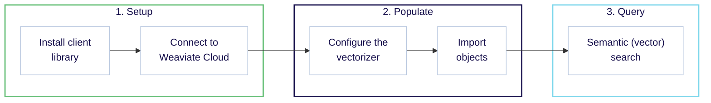

import Tabs from '@theme/Tabs';
import TabItem from '@theme/TabItem';
import FilteredTextBlock from '@site/src/components/Documentation/FilteredTextBlock';
import PyConnect from '!!raw-loader!/developers/weaviate/model-providers/_includes/provider.connect.weaviate.py';
import TSConnect from '!!raw-loader!/developers/weaviate/model-providers/_includes/provider.connect.weaviate.ts';
import GoConnect from '!!raw-loader!/_includes/code/howto/go/docs/model-providers/1-connect-weaviate-embeddings/main.go';
import JavaConnect from '!!raw-loader!/_includes/code/howto/java/src/test/java/io/weaviate/docs/model_providers/ConnectWeaviateEmbeddings.java';
import PyCode from '!!raw-loader!/developers/weaviate/model-providers/_includes/provider.vectorizer.py';
import TSCode from '!!raw-loader!/developers/weaviate/model-providers/_includes/provider.vectorizer.ts';
import GoCode from '!!raw-loader!/_includes/code/howto/go/docs/model-providers/2-usage-text/main.go';
import JavaCode from '!!raw-loader!/_includes/code/howto/java/src/test/java/io/weaviate/docs/model_providers/UsageWeaviateTextEmbeddings.java';
import JavaImportQueries from '!!raw-loader!/_includes/code/howto/java/src/test/java/io/weaviate/docs/model_providers/ImportAndQueries.java';

Expected time: 30 minutes
 
 

:::info What you will learn

This quickstart shows you how to combine Weaviate Cloud and the **Weaviate Embeddings** service to:

1. Set up a Weaviate Cloud instance. (10 minutes)
2. Add and vectorize your data using Weaviate Embeddings. (10 minutes)
3. Perform a semantic (vector) search and hybrid search. (10 minutes)

Notes:

- The code examples here are self-contained. You can copy and paste them into your own environment to try them out.

:::

## Prerequisites

To use Weaviate Embeddings, you will need:
<!-- TODO[g-despot]: Update prerequisites with correct client versions -->
- A **[Weaviate Cloud instance](/developers/wcs/create-instance)** running at least Weaviate `1.29`
- A Weaviate client library that supports Weaviate Embeddings:
  - **Python** client version `4.9.5` or higher
  - **JavaScript/TypeScript** client version `3.2.5` or higher
  - **Go/Java** clients are not yet officially supported; you must pass the `X-Weaviate-Api-Key` and `X-Weaviate-Cluster-Url` headers manually upon instantiation as shown below.

## Step 1: Set up Weaviate

### 1.1 Install a client library

We recommend using a [client library](/developers/weaviate/client-libraries) to work with Weaviate. Follow the instructions below to install one of the official client libraries, available in [Python](/developers/weaviate/client-libraries/python), [JavaScript/TypeScript](/developers/weaviate/client-libraries/typescript), [Go](/developers/weaviate/client-libraries/go), and [Java](/developers/weaviate/client-libraries/java).

import CodeClientInstall from '/_includes/code/quickstart/clients.install.mdx';

<CodeClientInstall />

### 1.2 Connect to Weaviate Cloud

Weaviate Embeddings is integrated with Weaviate Cloud. Your Weaviate Cloud credentials will be used to authorize your Weaviate Cloud instance's access for Weaviate Embeddings.

<Tabs groupId="languages">
  <TabItem value="py" label="Python API v4">
    <FilteredTextBlock
      text={PyConnect}
      startMarker="# START WeaviateInstantiation"
      endMarker="# END WeaviateInstantiation"
      language="py"
    />
  </TabItem>
  <TabItem value="js" label="JS/TS API v3">
    <FilteredTextBlock
      text={TSConnect}
      startMarker="// START WeaviateInstantiation"
      endMarker="// END WeaviateInstantiation"
      language="ts"
    />
  </TabItem>
  <TabItem value="go" label="Go">
    <FilteredTextBlock
      text={GoConnect}
      startMarker="// START WeaviateInstantiation"
      endMarker="// END WeaviateInstantiation"
      language="goraw"
    />
  </TabItem>
  <TabItem value="java" label="Java">
    <FilteredTextBlock
      text={JavaConnect}
      startMarker="// START WeaviateInstantiation"
      endMarker="// END WeaviateInstantiation"
      language="javaraw"
    />
  </TabItem>
</Tabs>

## Step 2: Populate the database

### 2.1 Define a collection

Now we can define a collection that will store our data. When creating a collection, you need to specify one of the [available models](/developers/wcs/embeddings/models) for the vectorizer to use. This model will be used to create vector embeddings from your data.

<Tabs groupId="languages">
  <TabItem value="py" label="Python API v4">
    <FilteredTextBlock
      text={PyCode}
      startMarker="# START SnowflakeArcticEmbedLV20"
      endMarker="# END SnowflakeArcticEmbedLV20"
      language="py"
    />
  </TabItem>
  <TabItem value="js" label="JS/TS API v3">
    <FilteredTextBlock
      text={TSCode}
      startMarker="// START SnowflakeArcticEmbedLV20"
      endMarker="// END SnowflakeArcticEmbedLV20"
      language="ts"
    />
  </TabItem>
  <TabItem value="go" label="Go">
    <FilteredTextBlock
      text={GoCode}
      startMarker="// START SnowflakeArcticEmbedLV20"
      endMarker="// END SnowflakeArcticEmbedLV20"
      language="goraw"
    />
  </TabItem>
  <TabItem value="java" label="Java">
    <FilteredTextBlock
      text={JavaCode}
      startMarker="// START SnowflakeArcticEmbedLV20"
      endMarker="// END SnowflakeArcticEmbedLV20"
      language="java"
    />
  </TabItem>
</Tabs>

For more information about the available model options visit the [Choose a model](/developers/wcs/embeddings/models) page.

### 2.2 Import objects

After configuring the vectorizer, [import data](/developers/weaviate/manage-data/import.mdx) into Weaviate. Weaviate generates embeddings for text objects using the specified model.

<Tabs groupId="languages">
  <TabItem value="py" label="Python API v4">
    <FilteredTextBlock
      text={PyCode}
      startMarker="# START BatchImportExample"
      endMarker="# END BatchImportExample"
      language="py"
    />
  </TabItem>
  <TabItem value="js" label="JS/TS API v3">
    <FilteredTextBlock
      text={TSCode}
      startMarker="// START BatchImportExample"
      endMarker="// END BatchImportExample"
      language="ts"
    />
  </TabItem>
  <TabItem value="go" label="Go">
    <FilteredTextBlock
      text={GoCode}
      startMarker="// START BatchImportExample"
      endMarker="// END BatchImportExample"
      language="goraw"
    />
  </TabItem>
  <TabItem value="java" label="Java">
    <FilteredTextBlock
      text={JavaImportQueries}
      startMarker="// START BatchImportExample"
      endMarker="// END BatchImportExample"
      language="java"
    />
  </TabItem>
</Tabs>

## Step 3: Query your data

Once the vectorizer is configured, Weaviate will perform vector search operations using the specified model.

### Vector (near text) search

When you perform a [vector search](/developers/weaviate/search/similarity.md#search-with-text), Weaviate converts the text query into an embedding using the specified model and returns the most similar objects from the database.

The query below returns the `n` most similar objects from the database, set by `limit`.

<Tabs groupId="languages">
  <TabItem value="py" label="Python API v4">
    <FilteredTextBlock
      text={PyCode}
      startMarker="# START NearTextExample"
      endMarker="# END NearTextExample"
      language="py"
    />
  </TabItem>
  <TabItem value="js" label="JS/TS API v3">
    <FilteredTextBlock
      text={TSCode}
      startMarker="// START NearTextExample"
      endMarker="// END NearTextExample"
      language="ts"
    />
  </TabItem>
  <TabItem value="go" label="Go">
    <FilteredTextBlock
      text={GoCode}
      startMarker="// START NearTextExample"
      endMarker="// END NearTextExample"
      language="goraw"
    />
  </TabItem>
  <TabItem value="java" label="Java">
    <FilteredTextBlock
      text={JavaImportQueries}
      startMarker="// START NearTextExample"
      endMarker="// END NearTextExample"
      language="java"
    />
  </TabItem>
</Tabs>

## Next steps

import NextSteps from '/src/components/NextSteps';

export const cardsData = [
  {
    title: (
      
        <i className="fa fa-list-alt" aria-hidden="true"></i> Choose a model
      
    ),
    description: 'Check out which additional models are available through Weaviate Embeddings.',
    link: '/developers/wcs/embeddings/models',
  },
  {
    title: (
      
        <i className="fa fa-search" aria-hidden="true"></i> Explore hybrid search
      
    ),
    description: 'Discover how hybrid search combines keyword matching and semantic search.',
    link: '/developers/weaviate/search/hybrid',
  },
  {
    title: (
      
        <i className="fa fa-user-friends" aria-hidden="true"></i> Join the community
      
    ),
    description: 'Connect with other developers and contribute to our forums.',
    link: '/community',
  },
];

<NextSteps cards={cardsData} />

## Support

import SupportAndTrouble from '/_includes/wcs/support-and-troubleshoot.mdx';

<SupportAndTrouble />
