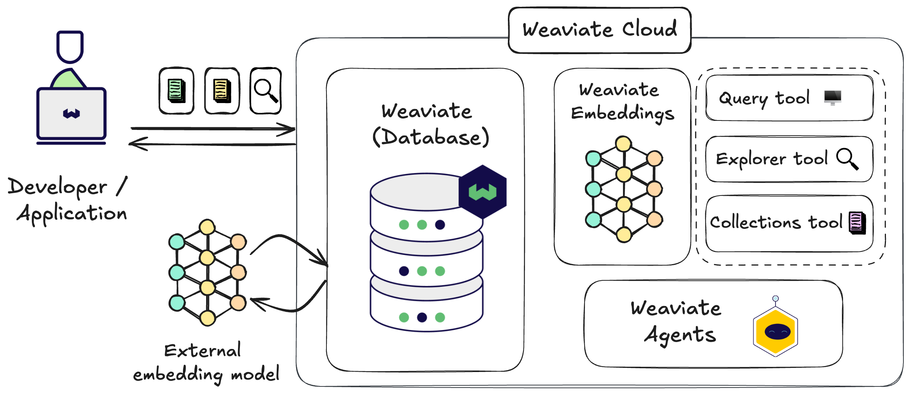

import WCDLandingIntro from '/_includes/wcs/wcs-landing-intro.mdx'

<WCDLandingIntro/>

:::tip Quickstart
Follow the **[quickstart guide](/developers/wcs/quickstart)** to get started with Weaviate Cloud.
:::

## Weaviate Cloud and Weaviate open-source

import WCDLandingOpenSource from '/_includes/wcs/wcs-landing-open-source.mdx'

<WCDLandingOpenSource/>

## Weaviate Cloud solutions

import WCDLandingSolutions from '/_includes/wcs/wcs-landing-solutions.mdx'

<WCDLandingSolutions/>

<!-- TODO[g-despot]: Fix cards in dark mode -->

## Get started

import WCDLandingGetStarted from '/_includes/wcs/wcs-landing-get-started.mdx'

<WCDLandingGetStarted/>

## Support

import SupportAndTrouble from '/_includes/wcs/support-and-troubleshoot.mdx';

<SupportAndTrouble />

import CustomScriptLoader from '/src/components/scriptSwitch';

<CustomScriptLoader/>
