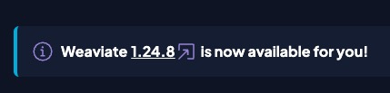
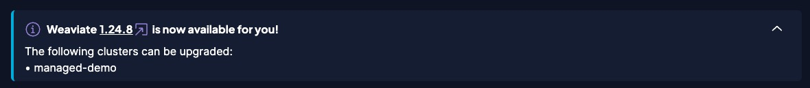
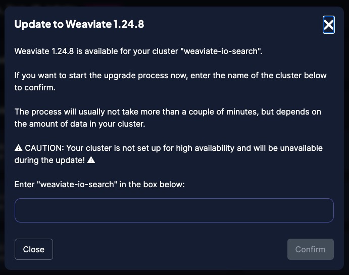
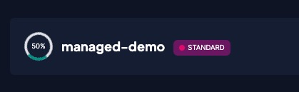

import WCSUpdateIntro from '/_includes/wcs/update-intro.mdx';

<WCSUpdateIntro />

## Check the server version

Check for a Weaviate server update.

### Details panel

To check if you are running the latest version of Weaviate, follow these steps. 

1. Connect to the WCS console, and find your cluster in the Dashboard tab.
1. Click the "Details" button.
1. Find the version tile in the details panel. 

The tile has an "Update!" button when a newer version is available.

<WCSUpdateIntro />

### Console message

The console displays a notification message in the console when a new version is available.

Click to expand the notification. The notification displays a list of clusters that can be upgraded.

## Update the server version

 WCS restarts your cluster during an upgrade. To avoid downtime, consider using high availability (HA) clusters for production workloads. A standard cluster is unavailable during upgrade. An HA cluster upgrades one node at a time so the cluster is available during the update.

 To update a cluster, follow these steps:
 
 1. Click the "Upgrade!" button on the cluster details tile.
 1. Enter your cluster name in the text entry box.
 1. Click confirm.
 

During the update, the console displays a status indicator.

The indicator goes way when the cluster is ready.

## Support

import SupportAndTrouble from '/_includes/wcs/support-and-troubleshoot.mdx';

<SupportAndTrouble />
