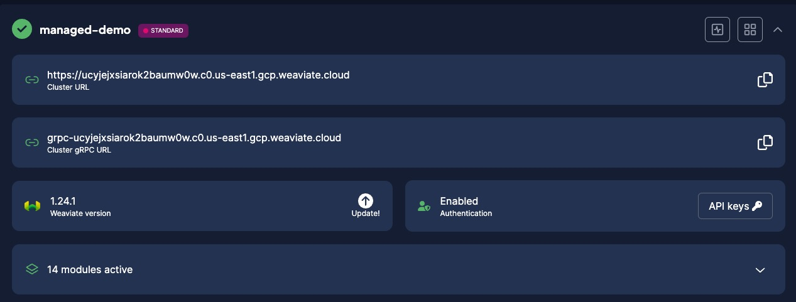

[Weaviate Cloud (WCD)](https://console.weaviate.cloud/) hosts clusters that run the Weaviate core database server. WCS runs the current production version of Weaviate core.

## New clusters

When you provision a new cluster, WCS uses the current version of Weaviate core to set up the new cluster. You cannot select another Weaviate core version when you create a new cluster.

## Upgrade

WCS does not automatically update existing clusters when a new version of Weaviate core is released.

The WCS console informs you when a newer version is available. Consider your business needs, and [upgrade your cluster](/developers/wcs/platform/version) when you have a suitable maintenance window.

## Security upgrades

 WCS does not automatically update clusters, however if an existing cluster has a security vulnerability, WCS upgrades the cluster when a fix is released.

 For security updates, WCS upgrades the cluster to the most current production release unless there are known compatibility issues. If there are compatibility issues, WCS upgrades the cluster to the most recent compatible version.

## Additional considerations

- **Billing**. If your cluster's Weaviate core version cannot support the billing requirements for your pricing plan, WCS upgrades your cluster to the current production version or the most recent compatible version.
- **Data integrity**. If your cluster's Weaviate core version has a known risk of data loss or corruption, WCS upgrades the cluster when a fix is released.
- **Downgrade**. You cannot downgrade your WCS cluster to an earlier version of Weaviate core.
- **Enterprise customers**. If you are an enterprise customer and you require a specific version of Weaviate core, contact your support representative. In some circumstances, WCS can install a specific Weaviate core version.

## Support

import SupportAndTrouble from '/_includes/wcs/support-and-troubleshoot.mdx';

<SupportAndTrouble />

import CustomScriptLoader from '/src/components/scriptSwitch';

<CustomScriptLoader/>
