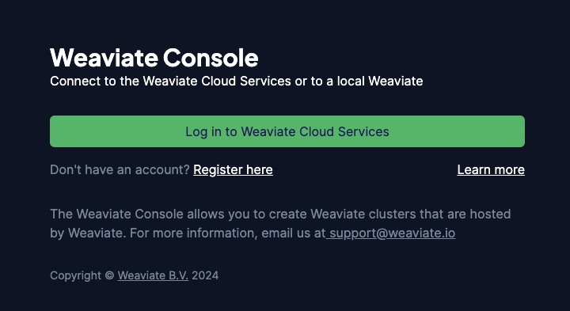
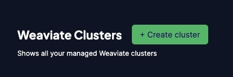
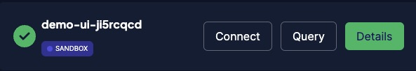
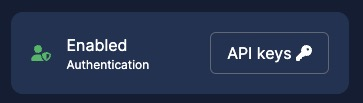
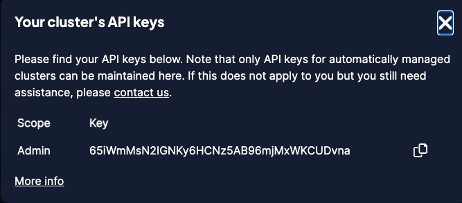
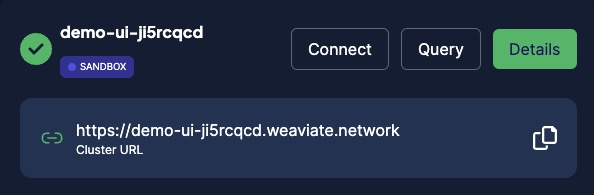

This Quickstart guide shows you how to get started with Weaviate Cloud Services (WCS).

## Create a WCS account

1. Go the [WCS homepage](https://console.weaviate.cloud).
1. Click, "Register here".

3. Provide an email address and password.
1. After you confirm your email address, return to the login page.
1. Log in to the WCS console.

## Create a Weaviate Cluster

When you log into the WCS web console, the Dashboard tab lists your clusters. There are no clusters when you log in to a new account.

To create a cluster, follow these steps:

1. Click the "Create cluster" button.

2. Select the "Free sandbox" tab.
1. Give your cluster a name. WCS adds a random suffix to ensure uniqueness.
1. Verify that "Enable Authentication?" is set to "Yes".
1. Click create.

It takes a minute or two to create the new cluster. When the cluster is ready, WCS displays a check mark (`✔️`) next to the cluster name.

The process is similar to create a managed cluster. However, you have to add your billing details first.

import SandBoxExpiry from '/_includes/sandbox.expiry.mdx';

<SandBoxExpiry/>

## Explore the Details panel

The Details panel lists cluster metrics, authorization details, and other useful information. To access your cluster, you need the cluster URL and authentication details.

To get the cluster URL and authentication details, follow these steps:

1. Click the `Details` button to open the Details panel.

2. To get the API key, click the `API keys` button.

3. Copy the API key for the `Admin` user to a safe place.

4. The cluster URL begins with the cluster name. Copy it to a safe place.

## Install a client library

The WCS console includes a query interface, but most most WCS interactions rely on a [Weaviate client](/developers/weaviate/client-libraries/index.md). Clients are available in several programming languages. Chose one that makes sense for your project.

To install a client, follow these steps for your language:

import CodeClientInstall from '/_includes/code/quickstart/clients.install.mdx';

<CodeClientInstall />

## Connect to your WCS instance

These code samples demonstrate how to connect use a Weaviate client to your WCS cluster.

To connect to your cluster, follow these steps for your language:

1. Replace the endpoint URL and the API key with the values you got on the Details panel.
1. Run the client code.

import WCSClientIsReady from '/_includes/code/wcs.client.is_ready.mdx';

<WCSClientIsReady/>

If you are connected, the server returns `True`.

## Next steps

- If you just want to try Weaviate, continue with a sandbox cluster.
- If you want to work with Weaviate or need a persistent cluster, enter your billing details so you can create managed clusters.
- To learn how Weaviate can help you build your project, review the [Weaviate documentation](../weaviate/index.md).

## Support

import SupportAndTrouble from '/_includes/wcs/support-and-troubleshoot.mdx';

<SupportAndTrouble />