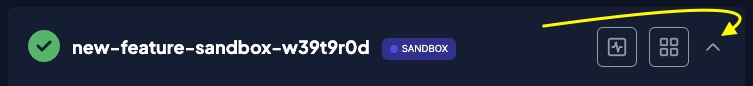

This Quickstart guide shows you how to get started with Weaviate Cloud Services (WCS).

## Create a WCS account

1. Go the [WCS homepage](https://console.weaviate.cloud).
1. Click, "Register here".

3. Provide an email address and password.
1. After you confirm your email address, return to the login page.
1. Log in to the WCS console.

## Create a Weaviate Cluster

When you log into the WCS web console, the Dashboard tab lists your clusters. There are no clusters when you log in to a new account. WCS has short-term, sandbox clusters and permanent, managed clusters.

To create a cluster, click the 'Create cluster' button on the WCS Dashboard page.

Follow the steps to create a cluster:

- [Sandbox clusters](#sandbox-clusters)
- [Managed clusters](#managed-clusters).

### Sandbox clusters

To create a sandbox cluster, follow these steps:

import CreateSandboxCluster from '/_includes/wcs/create-cluster-sandbox.mdx'

<CreateSandboxCluster />

import SandBoxExpiry from '/_includes/sandbox.expiry.mdx';

<SandBoxExpiry/>

### Managed clusters

Managed clusters require billing details. WCS prompts you to add billing details if you have not already added them.

To create a managed cluster, follow these steps:

import CreateManagedCluster from '/_includes/wcs/create-cluster-managed.mdx'

<CreateManagedCluster />

## Explore the Details panel

The Details panel lists cluster metrics, authorization details, and other useful information. To access your cluster, you need the cluster URL and authentication details.

To get the cluster URL and authentication details, follow these steps:

1. Click the `Details` button to open the Details panel.

2. To get the API keys, click the `API keys` button.

3. Copy the API key for the `Admin` user to a safe place.

4. The cluster URL begins with the cluster name. Copy it to a safe place.

## Install a client library

The WCS console includes a query interface, but most most WCS interactions rely on a [Weaviate client](/developers/weaviate/client-libraries/index.md). Clients are available in several programming languages. Chose one that makes sense for your project.

To install a client, follow these steps for your language:

import CodeClientInstall from '/_includes/code/quickstart/clients.install.mdx';

<CodeClientInstall />

## Connect to your WCS instance

These code samples demonstrate how to connect a Weaviate client to your WCS cluster.

To connect to your cluster, follow these steps for your language:

1. Copy the sample client code to a file.
1. Find your WCS cluster URL and API key in the WCS Console.
1. Create environment variables, or edit the sample code, to pass the URL and API keys to your client.
1. Run the client code.

import WCSClientIsReady from '/_includes/code/wcs.client.is_ready.mdx';

<WCSClientIsReady/>

If you are connected, the server returns `True`.

## Define a collection

Weaviate stores objects in collections. Every collection has a [schema](/developers/weaviate/config-refs/schema). Collection schemas are highly configurable, but some properties cannot be changed after you create the collection. For best results, define a collection schema before you import your data.

To create a schema for the `Question` collection, follow these steps in your client code:

1. Create a [client connection](#connect-to-your-wcs-instance). 
1. Add the collection definition code after the client creation code.
1. Run the code.

import CodeAutoschemaMinimumSchema from '/_includes/code/quickstart/collection.definition.mdx'

<CodeAutoschemaMinimumSchema />

The collection has these properties: 

  - Collection name: `Question`
  - Vectorizer module: `text2vec-openai`
  - Generative module: `generative-openai`

## Load data

This example code downloads a small data set and uploads it to your WCS instance. The example assumes your collection [has a schema](#define-a-collection) already defined.

To upload the data, follow these steps in your client code:

1. Create a [client connection](#connect-to-your-wcs-instance).
1. Add the batch import code after the client creation code.
1. Run the code.

import CodeAutoschemaImport from '/_includes/code/quickstart/import.mdx'

<CodeAutoschemaImport />

## Query your data

Weaviate supports a variety of [search methods](/developers/weaviate/search). A `near_text` search vectorizes the search string and returns objects that have vectors that are most similar to it. This example performs a `nearText` search on the `Question` [data collection](#load-data).

To search for objects in the `Question` collection that have vectors that are similar to the vector for `biology`, run this example code:

import CodeAutoschemaNeartext from '/_includes/code/quickstart/neartext.mdx'

<CodeAutoschemaNeartext />

The results are similar to this:

import BiologyQuestionsJson from '/_includes/code/quickstart/response.biology.questions.mdx'

<BiologyQuestionsJson />

## Next steps

- If you want to try out Weaviate and don't need to save your work, continue with a sandbox cluster.
- If you want to build with Weaviate or if you need a persistent cluster, enter your billing details and create a managed cluster.
- To learn how Weaviate can help you build your project, review the [Weaviate documentation](../weaviate/index.md).

## Support

import SupportAndTrouble from '/_includes/wcs/support-and-troubleshoot.mdx';

<SupportAndTrouble />