import Tabs from '@theme/Tabs';
import TabItem from '@theme/TabItem';


<span class="badge badge--secondary">Expected time: 30 minutes</span>
<br/><br/>

:::info What you will learn

This quickstart shows you how to combine Weaviate Cloud and [Weaviate Embeddings](/developers/wcs/embeddings) to:

1. Set up a Weaviate instance. (10 minutes)
1. Add and vectorize your data. (10 minutes)
1. Perform a semantic search and retrieval augmented generation (RAG). (10 minutes)


Notes:

- The code examples here are self-contained. You can copy and paste them into your own environment to try them out.
:::

## Prerequisites

In order to perform Retrieval Augmented Generation (RAG) in [`Step 4.2`](#42-retrieval-augmented-generation), you will need a [Cohere](https://dashboard.cohere.com/) account. You can use a free Cohere trial API key. If you have another preferred [model provider](/developers/weaviate/model-providers), you can use that instead of Cohere.

<hr/>

## Step 1: Set up Weaviate Cloud

### 1.1 Create a Weaviate Cloud account

import Register from '/developers/wcs/img/weaviate-cloud-register.png';

<div class="row">
  <div class="col col--6">
    <ol>
      <li>
        <a href="https://console.weaviate.cloud">Open Weaviate Cloud</a>.
      </li>
      <li>
        Click on <code>Sign up</code>.
      </li>
      <li>Provide an email address and password.</li>
      <li>
        After you confirm your email address, open the{' '}
        <a href="https://console.weaviate.cloud">login page</a>.
      </li>
      <li>Log in to Weaviate Cloud.</li>
    </ol>
  </div>
  <div class="col col--6">
    <div class="card">
      <div class="card__image">
        
      </div>
      <div class="card__body">
        Fill in the info and register a new Weaviate Cloud account.
      </div>
    </div>
  </div>
</div>

### 1.2 Create a cluster

When you log into the Weaviate Cloud web console, the Dashboard tab lists your clusters. There are no clusters when you log in to a new account.

import CreateCluster from '/developers/wcs/img/weaviate-cloud-create-cluster.png';
import SandboxCluster from '/developers/wcs/img/weaviate-cloud-sandbox-cluster.png';
import ServerlessCluster from '/developers/wcs/img/weaviate-cloud-serverless-cluster.png';

<div class="row">
  <div class="col col--6">
    <ol>
      <li>
        To <b>create a cluster</b>, click the <code>Create cluster</code> button
        on the Weaviate Cloud homepage.
      </li>
    </ol>
  </div>
  <div class="col col--6">
    <div class="card">
      <div class="card__image">
        
      </div>
      <div class="card__body">Click on this button to create a cluster.</div>
    </div>
  </div>
</div>

Weaviate offers the following cluster options:

- **Sandbox clusters**: free short-term cluster for development purposes.
- **Serverless clusters**: permanent production-ready environment.

<Tabs groupId="cluster">
  <TabItem value="sandbox" label="Sandbox">
    <div class="row">
      <div class="col col--6">
        <ol>
          <li>
            Select the <code>Sandbox</code> tab.
          </li>
          <li>Choose a name for your cluster.</li>
          <li>Select a cloud region from the dropdown.</li>
          <li>
            Click the <code>Create</code> button.
          </li>
        </ol>
      </div>
      <div class="col col--6">
        <div class="card">
          <div class="card__image">
            
          </div>
          <div class="card__body">
            Choose a name and a cloud region to create a cluster.
          </div>
        </div>
      </div>
    </div>
  </TabItem>
  <TabItem value="serverless" label="Serverless">
    <div class="row">
      <div class="col col--6">
        <ol>
          <li>
            Select the <code>Serverless</code> tab.
          </li>
          <li>Choose a name for your cluster.</li>
          <li>Select a cloud region from the dropdown.</li>
          <li>
            Click the <code>Create</code> button.
          </li>
        </ol>
      </div>
      <div class="col col--6">
        <div class="card">
          <div class="card__image">
            
          </div>
          <div class="card__body">
            Choose a name and a cloud region to create a cluster.
          </div>
        </div>
      </div>
    </div>
  </TabItem>
</Tabs>

It takes a minute or two to create the new cluster. When the cluster is ready, there will be a checkmark (`✔️`) next to the cluster name.

import SandBoxExpiry from '/_includes/sandbox.expiry.mdx';

<SandBoxExpiry />

<hr />

## Step 2: Connect to your cluster

### 2.1 Install a client library

The Weaviate Cloud console includes a query interface, but most interactions rely on a [Weaviate client](/developers/weaviate/client-libraries/index.md). Clients are available in several programming languages. Choose one that makes sense for your project.

To install a client, follow these steps for your language:

import CodeClientInstall from '/_includes/code/quickstart/clients.install.mdx';

<CodeClientInstall />

### 2.2 Connect to your Weaviate Cloud instance

Now, you can connect to your Weaviate instance. Get the instance **REST Endpoint URL** and the **Administrator API Key** from the Weaviate Cloud console as shown below.

import WCDClusterURL from '/developers/weaviate/quickstart/img/cluster_url.png';

import WCDClusterAdminKey from '/developers/weaviate/quickstart/img/cluster_admin_key.png';

<div class="row">
  <div class="col col--6">
    <div class="card-demo">
      <div class="card">
        <div class="card__image">
          
        </div>
        <div class="card__body">
          Grab the <code>REST Endpoint</code> URL.
        </div>
      </div>
    </div>
  </div>
  <div class="col col--6">
    <div class="card-demo">
      <div class="card">
        <div class="card__image">
          
        </div>
        <div class="card__body">
          Grab the <code>Admin</code> API key.
        </div>
      </div>
    </div>
  </div>
</div>

<br />

:::info REST vs gRPC endpoints
Weaviate supports both REST and gRPC protocols. For Weaviate Cloud deployments, you only need to provide the REST endpoint URL - the client will automatically configure gRPC.
:::

Once you have the **REST Endpoint URL** and the **Admin API key**, you can connect to the Sandbox instance and work with Weaviate.

The example below shows how to connect to Weaviate and perform a basic operation, like checking the cluster status.

import ConnectIsReady from '/_includes/code/quickstart/quickstart.is_ready.mdx';

<ConnectIsReady />

If you did not see any errors, you are ready to proceed. We will replace the simple cluster status check with more meaningful operations in the next steps.

<hr />

## Step 3: Populate your database

### 3.1 Define a collection

The following example creates a _collection_ called `Question` with:

- The [Weaviate Embeddings model integration](/developers/weaviate/model-providers/weaviate/embeddings.md) to create vectors during ingestion & queries.
- Cohere [generative AI integrations](/developers/weaviate/model-providers/cohere/generative.md) for retrieval augmented generation (RAG).

import CreateCollection from '/_includes/code/quickstart/quickstart.create_collection.mdx';

<CreateCollection />

Run this code to create the collection to which you can add data.

:::info What models are being used?
You can optionally specify the model in the collection definition. As we did not specify models in the collection definition above, these integrations will use the Weaviate-defined default models.

<br />

See the [model providers integration](/developers/weaviate/model-providers/index.md) section for more information.
:::

### 3.2 Load the data

We can now add data to our collection.

The following example:

- Loads objects, and
- Adds objects to the target collection (`Question`) using a batch process.

:::tip Batch imports
([Batch imports](/developers/weaviate/manage-data/import.mdx)) are the most efficient way to add large amounts of data, as it sends multiple objects in a single request. See the [How-to: Batch import](/developers/weaviate/manage-data/import.mdx) guide for more information.
:::

import ImportObjects from '/_includes/code/quickstart/quickstart.import_objects.mdx';

<ImportObjects />

Run this code to add the demo data.

<hr />

## Step 4: Query your data

Weaviate provides a wide range of query tools to help you find the right data. We will try a few searches here.

### 4.1 Semantic search

Semantic search finds results based on meaning. This is called `nearText` in Weaviate.

The following example searches for 2 objects whose meaning is most similar to that of `biology`.

import QueryNearText from '/_includes/code/quickstart/quickstart.query.neartext.mdx';

<QueryNearText />

Run this code to perform the query. Our query found entries for `DNA` and `species`.

<details>
  <summary>Example full response in JSON format</summary>

```json
{
  {
    "answer": "DNA",
    "question": "In 1953 Watson & Crick built a model of the molecular structure of this, the gene-carrying substance",
    "category": "SCIENCE"
  },
  {
    "answer": "species",
    "question": "2000 news: the Gunnison sage grouse isn't just another northern sage grouse, but a new one of this classification",
    "category": "SCIENCE"
  }
}
```

</details>

If you inspect the full response, you will see that the word `biology` does not appear anywhere.

Even so, Weaviate was able to return biology-related entries. This is made possible by _vector embeddings_ that capture meaning. Under the hood, semantic search is powered by vectors, or vector embeddings.

Here is a diagram showing the workflow in Weaviate.

```mermaid
flowchart LR
    Query["🔍 Search:\n'biology'"]

    subgraph sg1 ["Vector Search"]
        direction LR
        VS1["Convert query\nto vector"] --> VS2["Find similar\nvectors"]
        VS2 --> VS3["Return top\nmatches"]
    end

    subgraph sg2 ["Results"]
        R1["Most similar\ndocuments"]
    end

    Query --> VS1
    VS3 --> R1

    %% Style nodes with white background and darker borders
    style Query fill:#ffffff,stroke:#B9C8DF,color:#130C49
    style VS1 fill:#ffffff,stroke:#B9C8DF,color:#130C49
    style VS2 fill:#ffffff,stroke:#B9C8DF,color:#130C49
    style VS3 fill:#ffffff,stroke:#B9C8DF,color:#130C49
    style R1 fill:#ffffff,stroke:#B9C8DF,color:#130C49

    %% Style subgraphs with brand colors
    style sg1 fill:#ffffff,stroke:#61BD73,stroke-width:2px,color:#130C49
    style sg2 fill:#ffffff,stroke:#130C49,stroke-width:2px,color:#130C49
```



:::info Where did the vectors come from?
Weaviate used the [Weaviate Embeddings](/developers/wcs/embeddings) service to generate a vector embedding for each object during import. During the query, Weaviate similarly converted the query (`biology`) into a vector.

As we mentioned above, this is optional. See [Starter Guide: Bring Your Own Vectors](/developers/weaviate/starter-guides/custom-vectors.mdx) if you would prefer to provide your own vectors.
:::

:::tip More search types available

Weaviate is capable of many types of searches. See, for example, our how-to guides on [similarity searches](/developers/weaviate/search/similarity.md), [keyword searches](/developers/weaviate/search/bm25.md), [hybrid searches](/developers/weaviate/search/hybrid.md), and [filtered searches](/developers/weaviate/search/filters.md).

:::

### 4.2 Retrieval augmented generation

Retrieval augmented generation (RAG), also called generative search, combines the power of generative AI models such as large language models (LLMs) with the up-to-date truthfulness of a database.

RAG works by prompting a large language model (LLM) with a combination of a _user query_ and _data retrieved from a database_.

This diagram shows the RAG workflow in Weaviate.

```mermaid
flowchart LR
    subgraph sg0 ["Weaviate Query"]
        direction TB
        Search["🔍 Search: \n'biology'"]
        Prompt["✍️ Prompt: \n'Write a\ntweet...'"]
    end

    subgraph sg1 ["Vector Search"]
        direction LR
        VS1["Convert query\nto vector"] --> VS2["Find similar\nvectors"]
        VS2 --> VS3["Return top\nmatches"]
    end

    subgraph sg2 ["Generation"]
        direction LR
        G1["Send\n(results + prompt)\nto LLM"]
        G1 --> G2["Generate\nresponse"]
    end

    subgraph sg3 ["Results"]
        direction TB
        R1["Most similar\ndocuments"]
        R2["Generated\ncontent"]
    end

    Search --> VS1
    VS3 --> R1
    Prompt --> G1
    VS3 --> G1
    G2 --> R2

    %% Style nodes with white background and darker borders
    style Search fill:#ffffff,stroke:#B9C8DF,color:#130C49
    style Prompt fill:#ffffff,stroke:#B9C8DF,color:#130C49
    style VS1 fill:#ffffff,stroke:#B9C8DF,color:#130C49
    style VS2 fill:#ffffff,stroke:#B9C8DF,color:#130C49
    style VS3 fill:#ffffff,stroke:#B9C8DF,color:#130C49
    style G1 fill:#ffffff,stroke:#B9C8DF,color:#130C49
    style G2 fill:#ffffff,stroke:#B9C8DF,color:#130C49
    style R1 fill:#ffffff,stroke:#B9C8DF,color:#130C49
    style R2 fill:#ffffff,stroke:#B9C8DF,color:#130C49

    %% Style subgraphs with brand colors
    style sg0 fill:#ffffff,stroke:#130C49,stroke-width:2px,color:#130C49
    style sg1 fill:#ffffff,stroke:#61BD73,stroke-width:2px,color:#130C49
    style sg2 fill:#ffffff,stroke:#7AD6EB,stroke-width:2px,color:#130C49
    style sg3 fill:#ffffff,stroke:#130C49,stroke-width:2px,color:#130C49
```



The following example combines the same search (for `biology`) with a prompt to generate a tweet.

import QueryRAG from '/_includes/code/quickstart/quickstart.query.rag.mdx';

<QueryRAG />

:::info Cohere API key in the header
Note that this code includes an additional header for the Cohere API key. Weaviate uses this key to access the Cohere generative AI model and perform retrieval augmented generation (RAG).
:::

Run this code to perform the query. Here is one possible response (your response will likely be different).

```text
🧬 In 1953 Watson & Crick built a model of the molecular structure of DNA, the gene-carrying substance! 🧬🔬

🦢 2000 news: the Gunnison sage grouse isn't just another northern sage grouse, but a new species! 🦢🌿 #ScienceFacts #DNA #SpeciesClassification
```

The response should be new, yet familiar. This is because you have seen the entries above for `DNA` and `species` in the [semantic search](#semantic-search) section.

The power of RAG comes from the ability to transform your own data. Weaviate helps you in this journey by making it easy to perform a combined search & generation in just a few lines of code.

<hr />

## Next steps

Try these additional resources to learn more about Weaviate:

import NextSteps from '/src/components/NextSteps';

export const cardsData = [
  {
    title: (
      <span>
        <i className="fa fa-server" aria-hidden="true"></i> Serverless Cloud
      </span>
    ),
    description: (
      <span>
        If you need a production-ready and persistent cluster, check out <b>Serverless Cloud</b>.
      </span>
    ),
    link: '/developers/wcs/create-instance#serverless-clusters',
  },
  {
    title: (
      <span>
        <i className="fa fa-book" aria-hidden="true"></i> Weaviate Core: Documentation
      </span>
    ),
    description:
      'To learn how Weaviate can help you build your AI project, check out the Weaviate documentation.',
    link: '/developers/weaviate',
  },
  {
    title: (
      <span>
        <i className="fa fa-user-friends" aria-hidden="true"></i> Join the community
      </span>
    ),
    description: 'Connect with other developers and contribute to our forum and Slack discussions.',
    link: '/community',
  },
];

<NextSteps cards={cardsData} />

## Support

import SupportAndTrouble from '/_includes/wcs/support-and-troubleshoot.mdx';

<SupportAndTrouble />
