## Overview

Weaviate Embedding Service (WES) provides secure, scalable embedding generation as a fully managed service.

WES integrates with Weaviate Cloud instances to generate, store, and search embeddings without managing infrastructure.

```mermaid
%%{init: {
  'theme': 'base',
  'themeVariables': {
    'primaryColor': '#4a5568',
    'primaryTextColor': '#2d3748',
    'primaryBorderColor': '#718096',
    'lineColor': '#718096',
    'secondaryColor': '#f7fafc',
    'tertiaryColor': '#edf2f7'
  }
}}%%

flowchart LR
    %% Style definitions
    classDef systemBox fill:#f7fafc,stroke:#3182ce,stroke-width:2px,color:#2d3748,padding:10px
    classDef weaviateBox fill:#f7fafc,stroke:#2d3748,stroke-width:0.5px,color:#2d3748,padding:20px
    classDef cloudBox fill:#f7fafc,stroke:#805ad5,stroke-width:2px,color:#2d3748,padding:40px
    classDef providerBox fill:#f7fafc,stroke:#48bb78,stroke-width:0.5px,color:#2d3748,padding:20px
    classDef component fill:white,stroke:#718096,stroke-width:1px,color:#2d3748,rx:6

    %% Weaviate Cloud container
    subgraph cloud["Weaviate Cloud\n "]
        %% WES section
        subgraph provider["WES"]
            inference["🤖 Inference\nAPI"]
        end

        %% Weaviate section
        subgraph weaviate["Weaviate"]
            vectorizer["🔌 WES\nIntegration"]
            core["⚡️ Data &\nvector store"]
        end
    end

    %% User System
    subgraph user["User System"]
        data["📄 Data"]
    end

    %% Connections
    data -->|"1. Insert\nobjects"| core
    core -->|"2. Request\nvector"| vectorizer
    vectorizer -->|"3. Request\nvector"| inference
    inference -->|"4. Vector"| vectorizer
    vectorizer -->|"5. Vector"| core

    %% Apply styles
    class user systemBox
    class weaviate weaviateBox
    class cloud cloudBox
    class provider providerBox
    class data,core,vectorizer,inference component
```

### Key Features and Capabilities

### Availability

- Regions
- Who can use this service

## Getting Started

- Prerequisites
  - Weaviate Cloud Account
  - Required Permissions
- Enabling Weaviate Embedding Service
  - Will this be enabled by default?
- Service Configuration
  - Embedding Models
  - API Keys and Authentication
- Usage instructions

## Service Details

### Rate Limits

### Security and Compliance

## Service Management

### Administration
- Project Settings
- User Management
- API Key Management
- Service Configuration

### Operations
- Service Status
- Maintenance Windows

## Pricing and Billing

### Pricing Model

### Billing

## Support and Resources

## Reference

- Error Codes
- Best Practices
