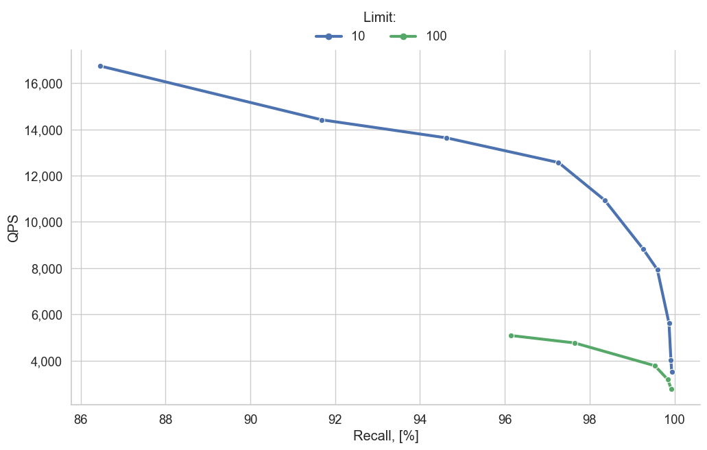
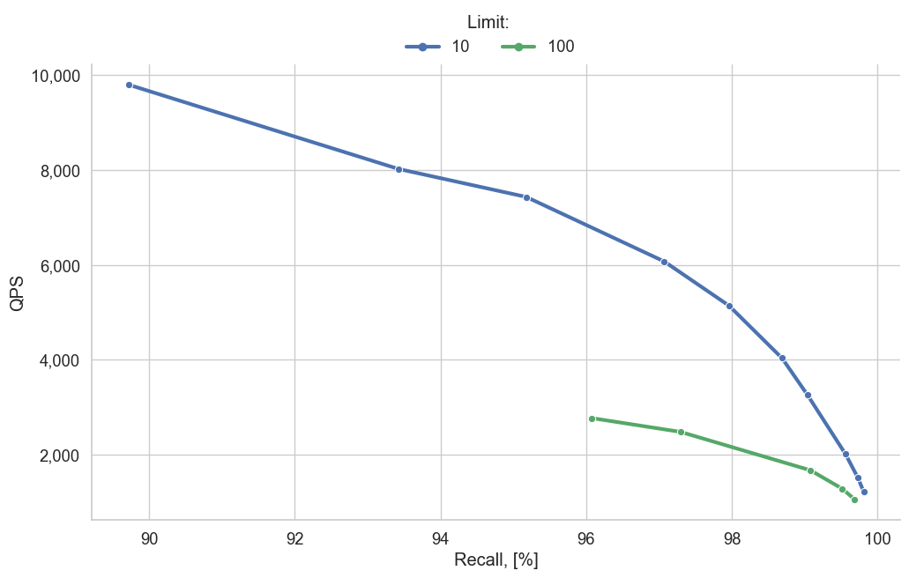
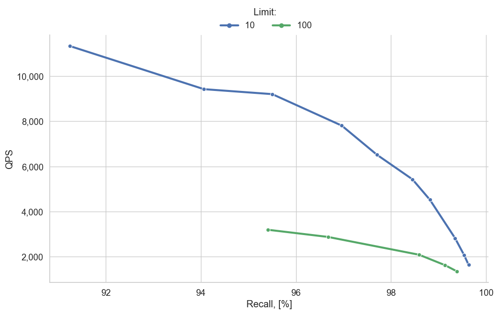
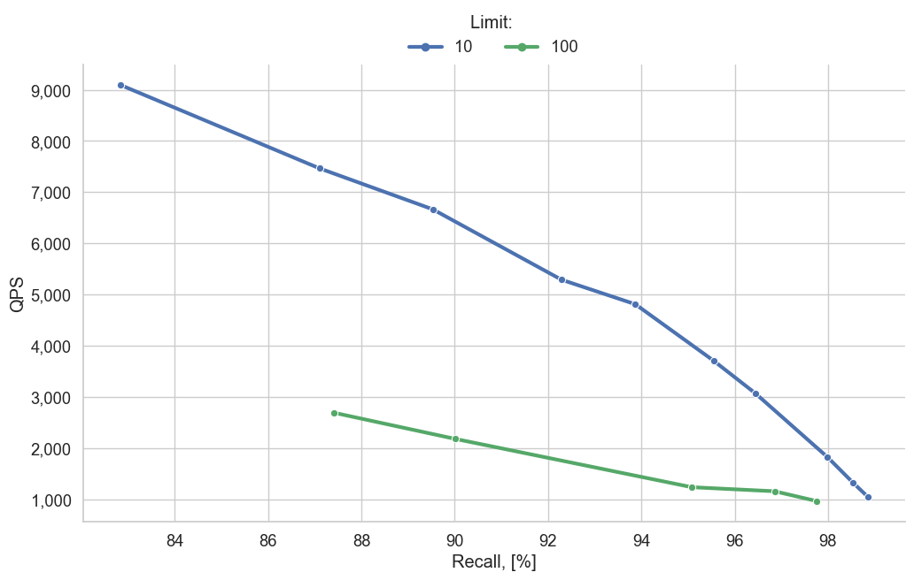

import Tabs from '@theme/Tabs';
import TabItem from '@theme/TabItem';

# ANN Benchmark

This vector database benchmark is designed to measure and illustrate Weaviate's Approximate Nearest Neighbor (ANN) performance for a range of real-life use cases.

:::note
This is not a comparative benchmark that runs Weaviate against competing vector database solutions.   
To discuss trade-offs with other solutions, [contact sales](https://weaviate.io/pricing#contact-sales).
:::

To make the most of this vector database benchmark, you can look at it from different perspectives:

- **The overall performance** – Review the [benchmark results](#benchmark-results) to draw conclusions about what to expect from Weaviate in a production setting.
- **Expectation for your use case** – Find the dataset closest to your production use case, and estimate Weaviate's expected performance for your use case.
- **Fine Tuning** – If you don't get the results you expect. Find the optimal combinations of the configuration parameters (`efConstruction`, `maxConnections` and `ef`) to achieve the best results for your production configuration. (See [HNSW Configuration Tips](https://weaviate.io/developers/weaviate/config-refs/schema/vector-index#hnsw-configuration-tips))

<!---
:::warning TODO
Add some more info related to our philosophy / [DuckDB blog post](https://motherduck.com/blog/perf-is-not-enough/)
:::
--->

## Measured Metrics

For each benchmark test, we set these HNSW parameters:
- **`efConstruction`** - Controls the search quality at build time.
- **`maxConnections`**	 - The number of outgoing edges a node can have in the HNSW graph.
- **`ef`** - Controls the search quality at query time.

:::info HNSW Parameter Configuration Guide
For good starting point values and performance tuning advice, see [HNSW Configuration Tips](https://weaviate.io/developers/weaviate/config-refs/schema/vector-index#hnsw-configuration-tips).
:::

<!---
:::warning TODO
Add a note about how many runs there were. Or, if there's only one run because of cost, let's add a note about that instead.
:::
--->

For each set of parameters, we've run 10,000 requests, and we measured the following metrics:

- The **Recall@10** and **Recall@100** - by comparing Weaviate's results to the ground truths specified in each dataset.
- **Multi-threaded Queries per Second (QPS)** - The overall throughput you can
  achieve with each configuration.
- **Individual Request Latency (mean)** - The mean latency over all 10,000 requests.
- **P99 Latency** - 99% of all requests (9,900 out of 10,000) have a latency that is lower than or equal to this number
- **Import time** - Since varying build parameters has an effect on import time, the import time is also included.

By request, we mean:
An unfiltered vector search across the entire dataset for the given test. All
latency and throughput results represent the end-to-end time that your
users would also experience. In particular, these means:

* Each request time includes the network overhead for sending the results over the
  wire. In the test setup, the client and server machines were located in the
  same VPC.
* Each request includes retrieving all the matched objects from disk. This is
  a significant difference from `ann-benchmarks`, where the embedded libraries
  only return the matched IDs.

:::info
This benchmark is [open source](https://github.com/weaviate/weaviate-benchmarking), so you can reproduce the results yourself.
:::

## Benchmark Results
<!---
**Last updated: MM 20YY with Version**
:::warning TODO
Update information
:::
--->

This section contains datasets modeled after the [ANN Benchmarks](https://github.com/erikbern/ann-benchmarks). Pick a dataset that is closest to your production workload:

| **Dataset** | **Number of Objects** | **Vector Dimensions** | **[Distance metric](https://weaviate.io/blog/distance-metrics-in-vector-search)** | **Use case** |
| --- | --- | --- | --- | --- |
| [SIFT1M](http://ann-benchmarks.com/sift-128-euclidean.hdf5) | 1 M | 128 | l2-squared | This dataset reflects a common use case with a small number of objects. |
| [OpenAI-Ada002-DBPedia](https://storage.googleapis.com/ann-datasets/ann-benchmarks/dbpedia-openai-1000k-angular.hdf5) | 1 M | 1536 | cosine |  |
| [Snowflake-MTEB](https://storage.googleapis.com/ann-datasets/custom/snowflake-msmarco-arctic-embed-m-v1.5-angular.hdf5) | 8.8 M | 768 | l2-squared |  |
| [Sphere-DPR](https://storage.googleapis.com/ann-datasets/custom/sphere-10M-meta-dpr.hdf5) | 10 M | 768 | dot |  |

#### Benchmark Datasets
These are the results for each dataset:

<Tabs groupId="datasets">
<TabItem value="1" label="SIFT1M">

#### QPS vs Recall for SIFT1M

import AnnSift128 from '/_includes/ann-sift-128-euclidean.mdx';

<AnnSift128/>

import AnnReadResultsTable from '/_includes/ann-read-results-table.mdx';

<AnnReadResultsTable/>

#### Recommended configuration for SIFT1M
import RecommendedConfig from '/_includes/ann-recommended-config.mdx';

<RecommendedConfig/>

| `efConstruction` | `maxConnections` | `ef` | **Recall@10** | **QPS (Limit 10)** | **Mean Latency (Limit 10**) | **p99 Latency (Limit 10)** |
| ----- | ----- | ----- | ----- | ----- | ----- | ----- |
| 256 | 32 | 64 | 98.35% | 10940 | 1.44ms | 3.13ms |

</TabItem>
<TabItem value="10" label="OpenAI-Ada002-DBPedia">

#### QPS vs Recall for OpenAI-Ada002-DBPedia

import AnnDBPedia from '/_includes/ann-dbpedia-openai-1000k-angular.mdx';

<AnnDBPedia/>

<AnnReadResultsTable/>

#### Recommended configuration for OpenAI-Ada002-DBPedia
<RecommendedConfig/>

| `efConstruction` | `maxConnections` | `ef` | **Recall@10** | **QPS (Limit 10)** | **Mean Latency (Limit 10**) | **p99 Latency (Limit 10)** |
| ----- | ----- | ----- | ----- | ----- | ----- | ----- |
| 256 | 16 | 96 | 97.24% | 5639 | 2.80ms | 4.43ms |

</TabItem>
<TabItem value="100" label="Snowflake-MTEB">

#### QPS vs Recall for Snowflake-MTEB

import AnnSnowflakeMTEB from '/_includes/ann-snowflake-msmarco-arctic-embed-m-v1.5-angular.mdx';

<AnnSnowflakeMTEB/>

<AnnReadResultsTable/>

#### Recommended configuration for Snowflake-MTEB
<RecommendedConfig/>

| `efConstruction` | `maxConnections` | `ef` | **Recall@10** | **QPS (Limit 10)** | **Mean Latency (Limit 10**) | **p99 Latency (Limit 10)** |
| ----- | ----- | ----- | ----- | ----- | ----- | ----- |
| 256 | 64 | 48 | 97.43% | 7016 | 2.26ms | 4.01ms |

</TabItem>
<TabItem value="1000" label="Sphere-DPR">

#### QPS vs Recall for Sphere-DPR

import AnnSphereDPR from '/_includes/ann-sphere-10M-meta-dpr.mdx';

<AnnSphereDPR/>

<AnnReadResultsTable/>

#### Recommended configuration for Sphere-DPR
<RecommendedConfig/>

| `efConstruction` | `maxConnections` | `ef` | **Recall@10** | **QPS (Limit 10)** | **Mean Latency (Limit 10**) | **p99 Latency (Limit 10)** |
| ----- | ----- | ----- | ----- | ----- | ----- | ----- |
| 384 | 64 | 64 | 96.23% | 3725 | 4.23ms | 7.10ms |

</TabItem>
</Tabs>

## Benchmark Setup

### Scripts

This benchmark is [open source](https://github.com/weaviate/weaviate-benchmarking), so you can reproduce the results yourself.

### Hardware

This benchmark test uses one GCP instances to run both Weaviate and the Benchmark scripts:

* a `n4-highmem-16` instance with 16 vCPU cores and 128 GB memory.

:::info Here's why we chose the `n4-highmem-16`:

* It is large enough to show that Weaviate is a highly concurrent [vector search engine](https://weaviate.io/blog/what-is-a-vector-database).
* It scales well while running thousands of searches across multiple threads.
* It is small enough to represent a typical production case without inducing
  high costs.
:::

Based on your throughput requirements, it is very likely that you will run Weaviate
on a considerably smaller or larger machine in production.

We have outlined in the [Benchmark FAQs](#what-happens-if-i-run-with-fewer-or-more-cpu-cores-than-on-the-example-test-machine)
 what you should expect when altering the configuration or
setup parameters.

### Experiment Setup

We modeled our dataset selection after
[ann-benchmarks](https://github.com/erikbern/ann-benchmarks). The same test
queries are used to test speed, throughput, and recall. The provided ground
truths are used to calculate the recall.

We use Weaviate's Golang client to import data.
We use Go to measure the concurrent (multi-threaded) queries.
Each language has its own performance characteristics.
You may get different results if you use a different language to send your queries.

For maximum throughput, we recommend using the [Go](/developers/weaviate/client-libraries/go.md) or
[Java](/developers/weaviate/client-libraries/java.md) client libraries.

The complete import and test scripts are available [here](https://github.com/weaviate/weaviate-benchmarking).

## Benchmark FAQ

### How can I get the most performance for my use case?
If your use case is similar to one of the benchmark tests, use the recommended HNSW parameter configurations to start tuning.

For more instructions on how to tune your configuration for best performance, see [HNSW Configuration Tips](https://weaviate.io/developers/weaviate/config-refs/schema/vector-index#hnsw-configuration-tips).

### What is the difference between latency and throughput?

The latency refers to the time it takes to complete a single request. This
is typically measured by taking a mean or percentile distribution of all
requests. For example, a mean latency of 5ms means that a single request takes, on average, 5ms to complete. This does not say anything about how many queries
can be answered in a given timeframe.

If Weaviate were single-threaded, the throughput per second would roughly equal
to 1s divided by mean latency. For example, with a mean latency of 5ms, this
would mean that 200 requests can be answered in a second.

However, in reality, you often don't have a single user sending one query after
another. Instead, you have multiple users sending queries. This makes the
querying side concurrent. Similarly, Weaviate can handle concurrent incoming
requests. We can identify how many concurrent requests can be served by measuring
the throughput.

We can take our single-thread calculation from before and multiply it with the
number of server CPU cores. This will give us a rough estimate of what the
server can handle concurrently. However, it would be best never to trust this
calculation alone and continuously measure the actual throughput. This is because
such scaling may not always be linear. For example, there may be synchronization
mechanisms used to make concurrent access safe, such as locks. Not only do
these mechanisms have a cost themselves, but if implemented incorrectly, they
can also lead to congestion, which would further decrease the concurrent
throughput. As a result, you cannot perform a single-threaded benchmark and
extrapolate what the numbers would be like in a multi-threaded setting.

All throughput numbers ("QPS") outlined in this benchmark are actual
multi-threaded measurements on a 30-core machine, not estimations.

### What is a p99 latency?

The mean latency gives you an average value of all requests measured. This is a
good indication of how long a user will have to wait on average for
their request to be completed. Based on this mean value, you cannot make any
promises to your users about wait times. 90 out of 100 users might see a
considerably better time, but the remaining 10 might see a significantly worse
time.

Percentile-based latencies are used to give a more precise indication. A
99th-percentile latency - or "p99 latency" for short - indicates the slowest
request that 99% of requests experience. In other words, 99% of your users will
experience a time equal to or better than the stated value. This is a much
better guarantee than a mean value.

In production settings, requirements - as stated in SLAs - are often a
combination of throughput and a percentile latency. For example, the statement
"3000 QPS at p95 latency of 20ms" conveys the following meaning.

- 3000 requests need to be successfully completed per second
- 95% of users must see a latency of 20ms or lower.
- There is no assumption about the remaining 5% of users, implicitly tolerating
  that they will experience higher latencies than 20ms.

The higher the percentile (e.g. p99 over p95) the "safer" the quoted
latency becomes. We have thus decided to use p99-latencies instead of
p95-latencies in our measurements.

### What happens if I run with fewer or more CPU cores than on the example test machine?

The benchmark outlines a QPS per core measurement. This can help you make a
rough estimation of how the throughput would vary on smaller or larger
machines. If you do not need the stated throughput, you can run with fewer CPU
cores. If you need more throughput, you can run with more CPU cores.

Adding more CPUs reaches a point of diminishing returns because of synchronization mechanisms, disk, and memory bottlenecks. Beyond that point, you  should scale horizontally instead of vertically. Horizontal scaling with replication will be [available in Weaviate soon](/developers/weaviate/roadmap/index.md).

### What are `ef`, `efConstruction`, and `maxConnections`?

These parameters refer to the [HNSW build and query
parameters](/developers/weaviate/config-refs/schema/vector-index.md#how-to-configure-hnsw).
They represent a trade-off between recall, latency & throughput, index size, and
memory consumption. This trade-off is highlighted in the benchmark results.

### I can't match the same latencies/throughput in my own setup. How can I debug this?

If you are encountering other numbers in your own dataset, here are a couple of
hints to look at:

* What CPU architecture are you using? The benchmarks above were run on a GCP
  `c2` CPU type, which is based on `amd64` architecture. Weaviate also supports
  `arm64` architecture, but not all optimizations are present. If your machine
  shows maximum CPU usage but you cannot achieve the same throughput, consider
  switching the CPU type to the one used in this benchmark.

* Are you using an actual dataset or random vectors? HNSW is known to perform
  considerably worse with random vectors than with real-world datasets. This is due
  to the distribution of points in real-world datasets compared to randomly
  generated vectors. If you cannot achieve the performance (or recall)
  outlined above with random vectors, switch to an actual dataset.

* Are your disks fast enough? While the ANN search itself is CPU-bound, the objects
  must be read from disk after the search has been completed. Weaviate
  uses memory-mapped files to speed this process up. However, if not enough
  memory is present or the operating system has allocated the cached pages
  elsewhere, a physical disk read needs to occur. If your disk is slow,
  it could then be that your benchmark is bottlenecked by those disks.

* Are you using more than 2 million vectors? If yes, make sure to set the
  [vector cache large enough](/developers/weaviate/concepts/resources.md#vector-cache)
  for maximum performance.

### Where can I find the scripts to run this benchmark myself?

The [repository is located here](https://github.com/weaviate/weaviate-benchmarking).

## Questions and feedback

import DocsFeedback from '/_includes/docs-feedback.mdx';

<DocsFeedback/>