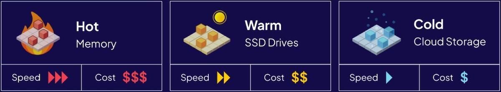

# Best practices for using Weaviate

This page covers what we consider general best practices for using Weaviate. They are based on our experience and the feedback we have received from our users.

:::info Consider this a hub for best practices
We will update this page over time as Weaviate evolves and we learn more about how our users are using it. Please check back regularly for updates.
:::

## Resource management

### Use multi-tenancy for data subsets

If your use cases involves multiple subsets of data which:

- Have the same data structure (i.e. data schema)
- Can share the same settings (e.g. vector index, inverted index, vectorizer models, etc.)
- Do not need to be queried together

Then consider enabling multi-tenancy, and assigning each subset of data to a separate tenant. This will reduce the resource overhead on Weaviate, and allow you to scale more effectively.

<p align="center"></p>

Then consider enabling multi-tenancy, and assigning each subset of data to a separate tenant. This will reduce the resource overhead on Weaviate, and allow you to scale more effectively.

:::tip Further resources
- [How-to: Perform multi-tenancy operations](manage-data/multi-tenancy.md)
- [How to: Manage tenant states](manage-data/tenant-states.mdx)
- [Concepts: Multi-tenancy](concepts/data.md#multi-tenancy)
:::

### Use the right vector index type

For many cases, the default, HNSW index type is a good starting point. However, in some cases, using `flat` indexes, or `dynamic` indexes may be more appropriate.

- `flat` indexes are useful when you know that each collection will only ever contain a small number of vectors (e.g. fewer than 100,000).
    - They use very little memory, but can be slow for large datasets.
- `dynamic` indexes start with a `flat` index, and automatically switch to an HNSW index when the number of vectors in the collection exceeds a certain threshold.
    - They are a good compromise between memory usage and query performance.

Typically, multi-tenant setups can benefit from using `dynamic` indexes, as they can automatically switch to HNSW indexes when the number of vectors in a tenant exceeds a certain threshold.

:::tip Further resources
- [How-to: Set the vector index type](manage-data/collections.mdx#set-vector-index-type)
- [Concepts: Vector indexes](concepts/vector-index.md)
:::

### Consider vector quantization

As the size of your dataset grows, the (HNSW) vector index can lead to high memory requirements and thus significant costs.

If you have a large number of vectors, consider using vector quantization to reduce the memory footprint of the vector index. This will reduce the required memory, and allow you to scale more effectively at lower costs.

For HNSW indexes, we suggest enabling product quantization (PQ) as a starting point. It provides a good set of default trade-offs between memory usage and query performance, as well as tunable parameters to optimize for your specific use case.

:::tip Further resources
- [How-to: Configure vector quantization](configuration/compression/index.md)
- [Concepts: Vector quantization](concepts/vector-quantization.md)
:::

### Adjust readonly/warning thresholds

Weaviate is configured to emit warnings, or to even go into read-only mode when certain thresholds (in percentage) are exceeded for memory or disk usage.

These thresholds can be adjusted to better fit your use case. For example, if you are running Weaviate on a machine with a large amount of memory, you may want to increase the memory threshold before Weaviate goes into read-only mode. This is because the same percentage of memory usage will represent a larger amount of memory on a machine with more memory.

Set `DISK_USE_WARNING_PERCENTAGE` and `DISK_USE_READONLY_PERCENTAGE` to adjust the disk usage thresholds, and `MEMORY_WARNING_PERCENTAGE` and `MEMORY_READONLY_PERCENTAGE` to adjust the memory usage thresholds.

:::tip Further resources
- [References: Environment variables](config-refs/env-vars.md#general)
:::

### Memory requirements - rules of thumb

When running Weaviate, memory a common bottleneck. As a rule of thumb, you can expect to need:

- 6GB of memory for 1 million, 1024-dimensional vectors
- 1.5GB of memory for 1 million, 256-dimensional vectors
- 2GB of memory 1 million, 1024-dimensional vectors with quantization enabled

<details>
  <summary>How did we come up with this figure?</summary>

Without quantization, each vector is stored as an n-dimensional float. For 1024-dimensional vectors, this means:

- 4 bytes per float * 1024 dimensions * 1M vectors = 4GB

We add some overhead for the index structure, and additional overheads, which brings us to the approximate figure of 6GB.

</details>

:::tip Further resources
- [Concepts: Resource planning](concepts/resources.md)
:::

<!-- ## Data structures

### Disable Auto-schema in production

### Do you really need cross-references?

### Choose the right property data type

## Optimize queries

### Index the right properties -->

## Data operations

### Use batch imports

When importing any significant amount of data (i.e. more than 10 objects), use batch imports. This will significantly improve your import speed for two reasons:

- You will be sending fewer requests to Weaviate, which reduces the overhead of the network.
- If Weaviate orchestrates data vectorization, it can in turn send vectorization requests in batches, which can be significantly faster, especially where inferences are done with GPUs.

```python
# ⬇️ Don't do this
for obj in objects:
    collection.data.insert(properties=obj)

# ✅ Do this
with collection.batch.dynamic() as batch:
    for obj in objects:
        batch.add_object(properties=obj)
```

:::tip Further resources
- [How-to: Batch import data](manage-data/import.mdx)
:::

### Offload unused tenants to cold storage

If you are using multi-tenancy, and have tenants that are not being queried frequently, consider offloading them to cold (cloud) storage.



Offloaded tenants are stored in a cloud storage bucket, and can be reloaded into Weaviate when needed. This can significantly reduce the memory and disk usage of Weaviate, and thus reduce costs.

When the tenant is likely to be used again (e.g. when a user logs in), it can be reloaded into Weaviate, and will be available for querying again.

:::tip Further resources
- [Starter guide: Managing resources](starter-guides/managing-resources/index.md)
- [How-to: Manage tenant states](manage-data/tenant-states.mdx)
:::

<!-- ### Data validation strategies -->

<!-- ## Queries

### Consider using a reranker

### Effective hybrid search strategies -->

## Questions and feedback

import DocsFeedback from '/_includes/docs-feedback.mdx';

<DocsFeedback/>
