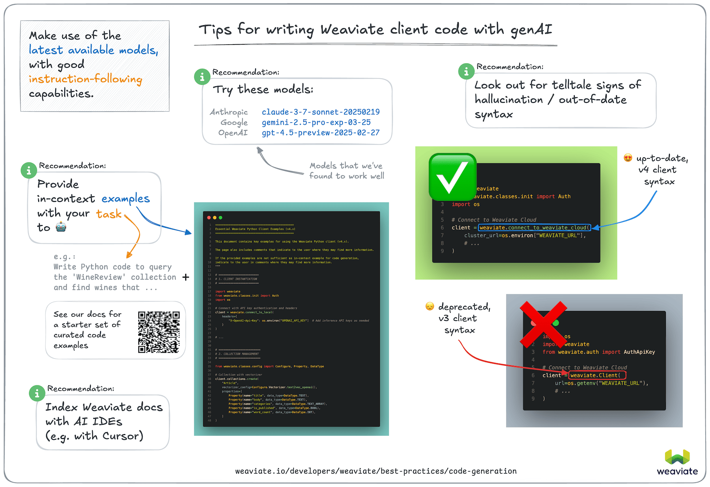

# AI-based Weaviate code generation (vibe-coding)

Generative AI models are becoming more capable at writing code. This practice is often referred to as "vibe-coding" or "AI-assisted coding". While this can speed up development, it is also subject to some pitfalls, such as hallucinations due to out-of-date, or missing information in the training data.

Here are some tips for writing Weaviate client library code with generative AI models and tooling, based on our anecdotal experience.

## Specific recommendations

### High-performing models

As of April 2025, we've seen these models perform well for code generation. (Assessed by the correctness of generated [Python v4 client library](/developers/weaviate/client-libraries/python/index.md) code.)

- Anthropic `claude-3-7-sonnet-20250219`
- Google `gemini-2.5-pro-exp-03-25`
- OpenAI `gpt-4.5-preview-2025-02-27` /

If you are using the Python client library, we recommend that you try out one of the above models to see if it performs well for your use case.

Although none of these models performed perfectly at zero-shot code generation tasks (i.e. with only a description of the task), they were able to generate correct code most of the time when provided with in-context examples.

### In-context code examples

We found that performances of the above LLMs improved significantly when provided with in-context examples. We suggest that you can get better results by providing in-context examples relevant to the task you are trying to accomplish.

As a starting point, we have curated a set of code examples below. Try copy and pasting this block of code into your prompt.

import CodeExamples from '!!raw-loader!/_includes/code/python/best-practices.python.ai.py';
import CodeBlock from '@theme/CodeBlock';

  <CodeBlock language="python">{CodeExamples}</CodeBlock>

 

If the above code examples are not sufficient, you can try the following:

- Collect code examples from relevant sections of the Weaviate Documentation.
- Use the `Ask AI` feature in the Weaviate Documentation to find examples of how to perform specific tasks. Then, use the provided code in your prompt.

:::tip Small models
Generally, smaller models don't perform as well at zero-shot code generation tasks. But we have found Anthropic's `claude-3-5-haiku-20241022` and OpenAI's `gpt-4.1` / `gpt-4.1-mini` models to be quite good at generating code when provided with in-context examples.
:::

## General tips

Along with the specific recommendations above, we also have the following general tips:

### Use the latest models

You may already have a preferred model provider. Try out the latest models to see if they perform better for your use case.

Later models will be trained on more recent data, and are likely to be better at zero-shot code generation tasks. This is particularly important where the code base has been significantly updated, such as with the Weaviate Python client, which was rewritten in 2024.

### Look for better instruction-following models

Some models are better at following instructions provided as in-context examples.

These models are more likely to respect up-to-date examples provided as in-context instructions.

### Review the generated code for signs of hallucination

It is important to review the generated code for signs of hallucination.

For the Weaviate Python client, a telltale sign of hallucination, or out-of-date code is the use of `weaviate.Client` class for connecting to Weaviate. This was used in the older, v3 version of the client library and is not present in the v4 version.

The latest version of the Weaviate Python client uses `weaviate.connect_to_xyz()` helper functions to connect to Weaviate, using the `WeaviateClient` class.

### Index further documentation

Some AI-powered code generation tools such as Cursor allow you to index further documentation. This can be a great way to get more context for the code generation task. Then, you could prompt the IDE to generate code based on the indexed documentation.

Review the documentation of your specific IDE to see if it has this feature, and how to use it.

### Consider using Weaviate Agents

[Weaviate Agents](/developers/agents) are pre-built agentic services designed for specific tasks, such as [querying](/developers/agents/query), [transforming data](/developers/agents/transformation/), and [personalizing content](/developers/agents/personalization).

Weaviate agents are available for Weaviate Cloud users to enable interacting with the Weaviate Cloud instance using natural language. For some use cases, this may be a better approach than using AI-powered code generation tools.

## Help us improve this page

The above recommendations are based on our experience using generative AI models for code generation.

In order to collect data for this page in a systematic way, we ran a series of evaluations through [this repository](https://github.com/weaviate-tutorials/weaviate-vibe-eval).

The test were carried out by generating code for the Weaviate Python client v4 using various LLMs, and assessing whether the code was able to run successfully. Each task was carried out multiple times, once as a zero-shot task, and at least once with in-context examples.

A sampling of the results are collected [in this directory](https://github.com/weaviate-tutorials/weaviate-vibe-eval/tree/main/example_results).

Please note that this was a small-scale evaluations for providing guidelines only. If you are interested in running your own evaluations, please check out the repository.

If you have any questions or feedback, please let us know by opening an issue on [GitHub](https://github.com/weaviate-tutorials/weaviate-vibe-eval/issues).

## Questions and feedback

import DocsFeedback from '/_includes/docs-feedback.mdx';

<DocsFeedback/>
