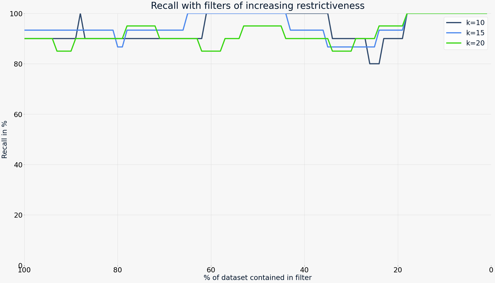
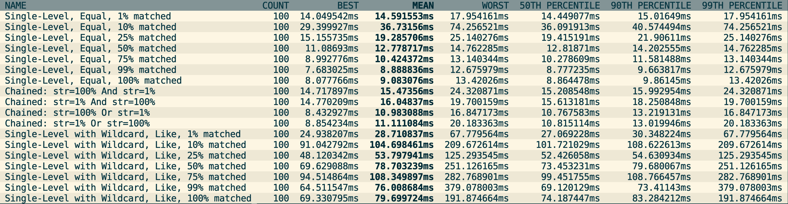

Weaviate provides powerful filtered vector search capabilities, allowing you to combine vector searches with structured, scalar filters. This enables you to find the closest vectors to a query vector that also match certain conditions.

Filtered vector search in Weaviate is based on the concept of pre-filtering. This means that the filter is constructed before the vector search is performed. Unlike some pre-filtering implementations, Weaviate's pre-filtering does not require a brute-force vector search and is highly efficient.

Starting in `v1.27`, Weaviate introduces its implementation of the [`ACORN`](#acorn) filter strategy. This filtering method significantly improves performance for large datasets, especially when the filter has low correlation with the query vector.

## Post-Filtering vs Pre-Filtering

Systems that cannot make use of pre-filtering typically have to make use of post-filtering. This is an approach where a vector search is performed first and then some results are removed which do not match the filter. This leads to two major disadvantages:

1. You cannot easily predict how many elements will be contained in the search, as the filter is applied to an already reduced list of candidates.
2. If the filter is very restrictive, i.e. it matches only a small percentage of data points relative to the size of the data set, there is a chance that the original vector search does not contain any match at all.

The limitations of post-filtering are overcome by pre-filtering. Pre-Filtering describes an approach where eligible candidates are determined before a vector search is started. The vector search then only considers candidates that are present on the "allow" list.

:::note
Some authors make a distinction between "pre-filtering" and "single-stage filtering" where the former implies a brute-force search and the latter does not. We do not make this distinction, as Weaviate does not have to resort to brute-force searches, even when pre-filtering due to the its combined inverted index and HNSW index.
:::

## Efficient Pre-Filtered Searches in Weaviate

In the section about Storage, [we have described in detail which parts make up a shard in Weaviate](./storage.md). Most notably, each shard contains an inverted index right next to the HNSW index. This allows for efficient pre-filtering. The process is as follows:

1. An inverted index (similar to a traditional search engine) is used to create an allow-list of eligible candidates. This list is essentially a list of `uint64` ids, so it can grow very large without sacrificing efficiency.
2. A vector search is performed where the allow-list is passed to the HNSW index. The index will move along any node's edges normally, but will only add ids to the result set that are present on the allow list. The exit conditions for the search are the same as for an unfiltered search: The search will stop when the desired limit is reached and additional candidates no longer improve the result quality.

## Filter strategy

As of `v1.27`, Weaviate supports two filter strategies: `sweeping` and `acorn` specifically for the HNSW index type.

### ACORN

:::info Added in `1.27`
:::

Weaviate `1.27` adds the a new filtering algorithm that is based on the [`ACORN`](https://arxiv.org/html/2403.04871v1) paper. We refer to this as `ACORN`, but the actual implementation in Weaviate is a custom implementation that is inspired by the paper. (References to `ACORN` in this document refer to the Weaviate implementation.)

The `ACORN` algorithm is designed to speed up filtered searches with the [HNSW index](./vector-index.md#hierarchical-navigable-small-world-hnsw-index) by the following:

- Objects that do not meet the filters are ignored in distance calculations.
- The algorithm reaches the relevant part of the HNSW graph faster, by using a multi-hop approach to evaluate the neighborhood of candidates.
- Additional entrypoints matching the filter are randomly seeded to speed up convergence to the filtered zone.

The `ACORN` algorithm is especially useful when the filter has low correlation with the query vector. In other words, when a filter excludes many objects in the region of the graph most similar to the query vector.

Our internal testing indicates that for lowly correlated, restrictive filters, the `ACORN` algorithm can be significantly faster, especially for large datasets. If this has been a bottleneck for your use case, we recommend enabling the `ACORN` algorithm.

As of `v1.27`, the `ACORN` algorithm can be enabled by setting the `filterStrategy` field for the relevant HNSW vector index [in the collection configuration](../manage-data/collections.mdx#set-vector-index-parameters).

### Sweeping

The existing and current default filter strategy in Weaviate is referred to as `sweeping`. This strategy is based on the concept of "sweeping" through the HNSW graph.

The algorithm starts at the root node and traverses the graph, evaluating the distance to the query vector at each node, while keeping the "allow list" of the filter as context. If the filter is not met, the node is skipped and the traversal continues. This process is repeated until the desired number of results is reached.

## `indexFilterable`

:::info Added in `1.18`
:::

Weaviate `v1.18.0` adds the `indexFilterable` index that speeds up match-based filtering through use of Roaring Bitmaps. Roaring Bitmaps employ various strategies to add efficiencies, whereby it divides data into chunks and applies an appropriate storage strategy to each one. This enables high data compression and set operations speeds, resulting in faster filtering speeds for Weaviate.

If you are dealing with a large dataset, this will likely improve your filtering performance significantly and we therefore encourage you to migrate and re-index.

In addition, our team maintains our underlying Roaring Bitmap library to address any issues and make improvements as needed.

#### `indexFilterable` for `text` properties

:::info Added in `1.19`
:::

A roaring bitmap index for `text` properties is available from `1.19` and up, and it is implemented using two separate (`filterable` & `searchable`) indexes, which replaces the existing single index. You can configure the new `indexFilterable` and `indexSearchable` parameters to determine whether to create the roaring set index and the BM25-suitable Map index, respectively. (Both are enabled by default.)

#### Migration to `indexFilterable`

If you are using Weaviate version `< 1.18.0`, you can take advantage of roaring bitmaps by migrating to `1.18.0` or higher, and going through a one-time process to create the new index. Once your Weaviate instance creates the Roaring Bitmap index, it will operate in the background to speed up your work.

This behavior is set through the <code>REINDEX<wbr />_SET_TO<wbr />_ROARINGSET<wbr />_AT_STARTUP</code> [environment variable](../config-refs/env-vars.md). If you do not wish for reindexing to occur, you can set this to `false` prior to upgrading.

:::info Read more
To learn more about Weaviate's roaring bitmaps implementation, see the [in-line documentation](https://pkg.go.dev/github.com/weaviate/weaviate/adapters/repos/db/lsmkv/roaringset).
:::

## `indexRangeFilters`

:::info Added in `1.26`
:::

Weaviate `1.26` introduces the `indexRangeFilters` index, which is a range-based index for filtering by numerical ranges. This index is available for `int`, `number`, or `date` properties. The index is not available for arrays of these data types.

Internally, rangeable indexes are implemented as [roaring bitmap slices](https://www.featurebase.com/blog/range-encoded-bitmaps). This data structure limits the index to values that can be stored as 64 bit integers.

`indexRangeFilters` is only available for new properties. Existing properties cannot be converted to use the rangeable index.

## Recall on Pre-Filtered Searches

Thanks to Weaviate's custom HNSW implementation, which persists in following all links in the HNSW graph normally and only applying the filter condition when considering the result set, graph integrity is kept intact. The recall of a filtered search is typically not any worse than that of an unfiltered search.

The graphic below shows filters of varying levels of restrictiveness. From left (100% of dataset matched) to right (1% of dataset matched) the filters become more restrictive without negatively affecting recall on `k=10`, `k=15` and `k=20` vector searches with filters.

<!-- TODO - replace this graph with ACORN test figures -->

## Flat-Search Cutoff

<!-- Need to update this section with ACORN figures. -->

Version `v1.8.0` introduces the ability to automatically switch to a flat (brute-force) vector search when a filter becomes too restrictive. This scenario only applies to combined vector and scalar searches. For a detailed explanation of why HNSW requires switching to a flat search on certain filters, see this article in [towards data science](https://towardsdatascience.com/effects-of-filtered-hnsw-searches-on-recall-and-latency-434becf8041c). In short, if a filter is very restrictive (i.e. a small percentage of the dataset is matched), an HNSW traversal becomes exhaustive. In other words, the more restrictive the filter becomes, the closer the performance of HNSW is to a brute-force search on the entire dataset. However, with such a restrictive filter, we have already narrowed down the dataset to a small fraction. So if the performance is close to brute-force anyway, it is much more efficient to only search on the matching subset as opposed to the entire dataset.

The following graphic shows filters with varying restrictiveness. From left (0%) to right (100%), the filters become more restrictive. The **cut-off is configured at ~15% of the dataset** size.  This means the right side of the dotted line uses a brute-force search.

As a comparison, with pure HNSW - without the cutoff - the same filters would look like the following:

The cutoff value can be configured as [part of the `vectorIndexConfig` settings in the schema](/developers/weaviate/config-refs/schema/vector-index.md#how-to-configure-hnsw) for each collection separately.

<!-- TODO - replace figures with updated post-roaring bitmaps figures -->

:::note Performance improvements from roaring bitmaps
From `v1.18.0` onwards, Weaviate implements 'Roaring bitmaps' for the inverted index which decreased filtering times, especially for large allow lists. In terms of the above graphs, the *blue* areas will be reduced the most, especially towards the left of the figures.
:::

<!-- ## Performance of vector searches with cached filters

The following was run single-threaded (i.e. you can add more CPU threads to increase throughput) on a dataset of 1M objects with random vectors of 384d with a warm filter cache (pre-`Roaring bitmap` implementation).

Each search uses a completely unique (random) search vector, meaning that only the filter portion is cached, but not the vector search portion, i.e. on `count=100`, 100 unique query vectors were used with the same filter. -->

<!-- TODO - replace table with updated post-roaring bitmaps figures -->

<!--  -->

<!-- :::note
Wildcard filters show considerably worse performance than exact match filters. This is because - even with caching - multiple rows need to be read from disk to make sure that no stale entries are served when using wildcards. See also "Automatic Cache Invalidation" below.
::: -->

<!-- ## Automatic Cache Invalidation

The cache is built in a way that it cannot ever serve a stale entry. Any write to the inverted index updates a hash for the specific row. This hash is used as part of the key in the cache. This means that if the underlying inverted index is changed, the new query would first read the updated hash and then run into a cache miss (as opposed to ever serving a stale entry). The cache has a fixed size and entries for stale hashes - which cannot be accessed anymore - are overwritten when it runs full. -->

## Further resources
:::info Related pages
- [References: GraphQL API](../api/graphql/index.md)
:::

## Questions and feedback

import DocsFeedback from '/_includes/docs-feedback.mdx';

<DocsFeedback/>
