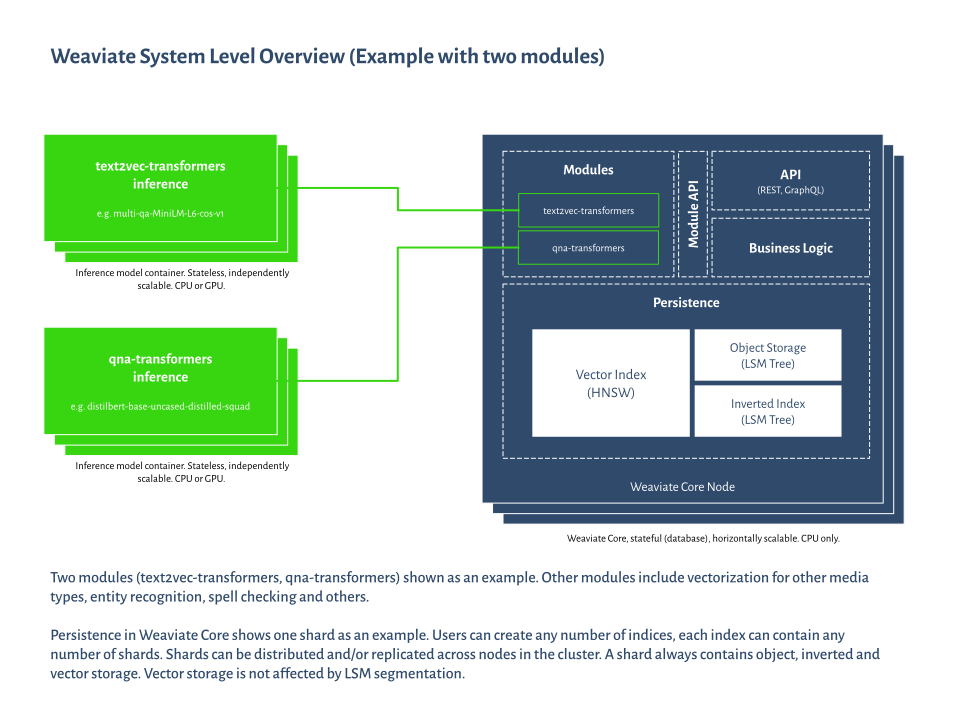

<!-- :::caution Migrated From:
- `Core knowledge`
  - `Data objects` from `Core knowledge/Basics`
  - `Modules`: Combines theoretical explanations from `Configuration/Modules` + `Modules/Index`
- `Architecture`
- `Vector indexing` from `Vector Index (ANN) Plugins:Index` + `HNSW`
  - Note: Configuration options from `HNSW` are now in `References: Configuration/Vector index#How to configure HNSW`
::: -->

## Overview

The **Concepts** section explains various aspects related to Weaviate and its architecture to help you get the most out of it. You can read these sections in any order.

:::info
If you are after a practical guide, try the [quickstart tutorial](/developers/weaviate/quickstart/index.md).
:::

## Core concepts

**[Data structure](./data.md)**

- How Weaviate deals with data objects, including how they are stored, represented, and linked to each other.

**[Modules](./modules.md)**

- An overview of Weaviate's module system, including what can be done with modules, existing module types, and custom modules.

**[Indexing](./indexing.md)**

- Read how data is indexed within Weaviate using inverted and ANN indices, and about configurable settings.

**[Vector indexing](./vector-index.md)**

- Read more about Weaviate's vector indexing architecture, such as the HNSW algorithm, distance metrics, and configurable settings.

## Weaviate Architecture

The figure below gives a 30,000 feet view of Weaviate's architecture.

You can learn more about the individual components in this figure by following these guides:

**[Learn about storage inside a shard](./storage.md)**
  * How Weaviate stores data
  * How Weaviate makes writes durable
  * How an inverted index, a vector index and an object store interact with each other

**[Ways to scale Weaviate horizontally](./cluster.md)**
  * Different motivations to scale
  * Sharding vs. Replication
  * Configuring a cluster
  * Consistency

**[How to plan resources](./resources.md)**
  * The roles of CPU, Memory and GPUs
  * How to size a cluster correctly
  * Speeding up specific processes
  * Preventing bottlenecks

**[Filtered vector search](./prefiltering.md)**
  * Combine vector search with filters
  * Learn how combining an HNSW with an inverted index leads to high-recall, high-speed filtered queries

**[User-facing interfaces](./interface.md)**
  * Design philosophy behind user-facing APIs
  * Role of the REST and GraphQL APIs

**[Replication architecture](./replication-architecture/index.md)**
  * About replication
  * Weaviate's implementation
  * Use cases

import DocsMoreResources from '/_includes/more-resources-docs.md';

<DocsMoreResources />
