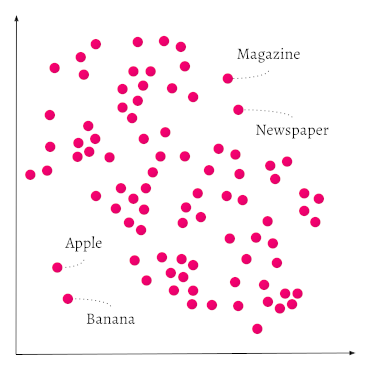

Weaviate is a vector database. Most objects in Weaviate collections have one or more vectors. Individual vectors can have thousands of dimensions. Collections can have millions of objects. The resulting vector space can be exceedingly large.

Weaviate uses vector indexes to [efficiently search](https://weaviate.io/blog/why-is-vector-search-so-fast) the vector space. Different vector index types offer trade-offs in resource use, speed, and accuracy.

import VectorIntro from '/_includes/indexes/vector-intro.mdx';

<VectorIntro/>

## Vector indexing

[Vector embeddings](https://weaviate.io/blog/vector-embeddings-explained) are arrays of elements that can capture meaning. The original data can come from text, images, videos, or other content types. A model transforms the underlying data into an embedding. The elements in the embedding are called dimensions. High dimension vectors, with thousands of elements, capture more information, but they are harder to work with.

Vector databases make it easier to work with high dimensional vector embeddings. Embeddings that capture similar meanings are closer to each other than embeddings that capture different meanings. To find objects that have similar semantics, vector databases must efficiently calculate the "distance" between the objects' embeddings.

In Weaviate, the [distance calculation method](/developers/weaviate/manage-data/collections#specify-a-distance-metric) is configurable. The [distance threshold](/developers/weaviate/search/similarity#set-a-similarity-threshold) is also configurable. A lower threshold returns more specific results.

### Example - relative dimensions in space

The elements in a vector define a point in a multi-dimensional space, similar to how the coordinates (X,Y) define a point on a graph and (X,Y,Z) define a point in three dimensional space.

Consider a very simple vector embedding that uses two elements to represent the meanings of some English words. Taken together, the vectors in the collection define a two dimensional space like this one:

Apples and bananas are both fruits. Newspapers and magazines are both publications. In the representation, the fruits are close to each other. The publications are also close to each other, but relatively far from the fruits. The vector distances are smaller between items with similar semantics and larger between objects that don't share similar meanings.

In a real example, the embeddings would have hundreds or thousands of elements. The vector space is difficult to visualize, but the concept is the same. Similar embeddings capture similar meanings and are closer to each other than to embeddings that capture different meanings.

For more details on this representation, see the [GloVe model](https://github.com/stanfordnlp/GloVe) from Stanford or our [vector embeddings blog post](https://weaviate.io/blog/vector-embeddings-explained#what-exactly-are-vector-embeddings).

### Example - supermarket layout

Consider how items are arranged in a supermarket. Similar products are close to each other. Apples and bananas are close to each other in the fruit section. Newspapers and magazines aren't fruit. They aren't even food. They are displayed in a different section of the supermarket.

If you walk into the supermarket to buy an apple, you move away from the publications and move towards the fruits. You minimize the distance from where you are to the object you are searching for.

Vector search works the same way. Weaviate turns search queries into vector embeddings and then searches the collection to find objects that are close to the query in the vector space.

## HNSW indexes

import HNSWIntro from '/_includes/indexes/hnsw-intro.mdx';

<HNSWIntro/>

HNSW indexes build a multi-layered object graph. The graph structure and HNSW algorithm result in fast, approximate nearest neighbor [(ANN)](https://en.wikipedia.org/wiki/Nearest_neighbor_search) searches.

The index and graph structure are stored in RAM memory. This makes HNSW indexes fast, but RAM is an expensive resource. Consider using [compression](/developers/weaviate/starter-guides/managing-resources/compression) to reduce the size of for your HNSW indexes.

Weaviate offers these methods to compress ("quantize") your HNSW index:

import CompressionAlgorithms from '/_includes/starter-guides/compression-types.mdx';

<CompressionAlgorithms/>

For more details, see [HNSW indexes](/developers/weaviate/concepts/indexing/hnsw-indexes).

## Flat indexes

import FlatIntro from '/_includes/indexes/flat-intro.mdx';

<FlatIntro/>

Flat indexes are best suited for collections that have relatively small object counts. If you expect the object count to grow significantly, consider using a [dynamic index](#dynamic-indexes).

[Binary quantization (BQ)](/developers/weaviate/configuration/compression/bq-compression) is a compression technique that also improves search speed for flat indexes. BQ reduces the amount of data the search engine reads. It also permits efficient binary calculations. These benefits of compression shorten the time needed to calculate vector distances during search.

For more details, see [flat indexes](/developers/weaviate/concepts/indexing/flat-indexes).

## Dynamic indexes

:::info Added in `v1.25`
:::

import DynamicIntro from '/_includes/indexes/dynamic-intro.mdx';

<DynamicIntro/>

For more details, see [dynamic indexes](/developers/weaviate/concepts/indexing/dynamic-indexes).

## Asynchronous indexing

:::info Added in `v1.22`
:::

Asynchronous indexing separates indexing and object creation. Weaviate creates new objects faster. The vector index updates in the background.

While the vector index is updating, Weaviate can search a maximum of 100,000 un-indexed objects by brute force. Brute force searches are slower, so search performance drops during indexing. The 100,000 object limit means that any un-indexed objects beyond the limit are not included in the search.

Asynchronous indexing is not enabled by default. [Enable asynchronous indexing](/developers/weaviate/configuration/indexing-vector/dynamic-indexes#asynchronous-indexing).

## Compression

Weaviate stores objects and vector representations of those objects (vectors). Vectors can be very large. Vector dimensions are stored as 32 bit floats. A single vector with 1536 dimensions uses about 6 KB of storage. When collections have millions of objects, the resulting size can lead to significant costs, especially where an in-memory vector index is used.

Consider [enabling compression](/developers/weaviate/configuration/compression) to manage system resources.

## Vector cache considerations

Weaviate uses an in-memory cache to hold vectors in RAM.

Each import requires multiple searches for indexing. By default, the cache is set to one trillion (`1e12`) objects when a new collection is created. During data import, set [`vectorCacheMaxObjects`](/developers/weaviate/configuration/indexing-vector) high enough that all of the vectors can be held in memory. Import performance drops drastically when there isn't enough memory to hold all of the vectors in the cache.

After import, when your workload is mostly querying, experiment with vector cache limits that are less than your total dataset size.

Vectors that aren't currently in cache are added to the cache until it reaches the maximum size. If the cache fills, Weaviate drops the whole cache. Subsequent queries force data to be read from disk until the cache fills up again.

Depending of query patterns, you may be able to tune the cache to hold frequently queried vectors in memory. Then, search only has to do slower disk lookups for less frequent queries.

## Benchmarks

The [ANN benchmark page](/developers/weaviate/benchmarks/ann.md) has a wide variety of vector search use cases and relative benchmarks.

Consult the page to find a dataset similar to yours. The benchmarks are a good starting point to learn to optimal configuration settings for each type of workload.

## Recommendations

- Large collections or tenants with more than 10,000 objects should use the HNSW index.

- Collections or tenants with less than 10,000 objects should use the flat index.

- Collections, especially multi-tenant collections with a variety of tenant sizes, should use a dynamic index.

## Other considerations

- If a collection consists of references between two other collections, don't index it.

- Duplicate vectors are expensive to import. Avoid importing duplicate vectors since import speeds are very slow.

- The vector index type specifies how vectors are indexed. The `vectorizer` parameter specifies how to create a vector embedding. See [model providers](/developers/weaviate/model-providers) or set `vectorizer` to `none` to import your own vectors.

## Further resources

- [Concepts: Inverted indexes](/developers/weaviate/concepts/indexing/inverted-indexes)
- [Concepts: Vector quantization (compression)](/developers/weaviate/concepts/vector-quantization)
- [Configuration: Vector index](/developers/weaviate/config-refs/schema/vector-index)
- [Configuration: Schema (Configure semantic indexing)](/developers/weaviate/config-refs/schema#configure-semantic-indexing)
- [Compression overview](/developers/weaviate/starter-guides/managing-resources/compression)
- [Blog post: Exploring ANN algorithms Part 1](https://weaviate.io/blog/ann-algorithms-vamana-vs-hnsw)

## Questions and feedback

import DocsFeedback from '/_includes/docs-feedback.mdx';

<DocsFeedback/>
