## Overview

Hybrid search combines [vector search](./vector-search.md) and [keyword search (BM25)](./keyword-search.md) to leverage the strengths of both approaches. This takes into account results' semantic similarity (vector search) and exact keyword relevance (BM25), providing more comprehensive search results.

A hybrid search runs both search types in parallel and combines their scores to produce a final ranking of results. This makes it versatile and robust, suitable for a wide range of search use cases.

## How Hybrid Search Works

In Weaviate, a hybrid search performs the following steps:

1. Executes both searches in parallel:
   - Vector search to find semantically similar content
   - BM25 search to find keyword matches
1. Combines the normalized scores using a [fusion method](#fusion-method)
1. Returns results ranked by the combined scores

```mermaid
%%{init: {
  'theme': 'base',
  'themeVariables': {
    'primaryColor': '#4a5568',
    'primaryTextColor': '#2d3748',
    'primaryBorderColor': '#718096',
    'lineColor': '#718096',
    'secondaryColor': '#f7fafc',
    'tertiaryColor': '#edf2f7',
    'fontFamily': 'Inter, system-ui, sans-serif',
    'fontSize': '14px',
    'lineHeight': '1.4',
    'nodeBorder': '1px',
    'mainBkg': '#ffffff',
    'clusterBkg': '#f8fafc'
  }
}}%%

flowchart LR
    %% Style definitions
    classDef systemBox fill:#f8fafc,stroke:#3182ce,stroke-width:1.5px,color:#2d3748,font-weight:bold
    classDef processBox fill:#f8fafc,stroke:gray,stroke-width:0.5px,color:#2d3748,font-weight:bold
    classDef component fill:white,stroke:#a0aec0,stroke-width:1px,color:#2d3748

    %% Main flow
    query["🔍 Query"] --> split["Query Processing"]

    %% Parallel processes
    split --> vector["Vector Search"]
    split --> bm25["BM25 Search"]

    %% Results combination
    vector --> fusion["Score Fusion"]
    bm25 --> fusion
    fusion --> results["📑 Ranked Results"]

    %% Parameters box
    subgraph params["Search Parameters"]
        alpha["Alpha: Balance between\nvector and keyword scores"]
        fusion_type["Fusion Strategy:\nrankedFusion or relativeScoreFusion"]
    end

    params --> fusion

    %% Apply styles
    class query,split,vector,bm25,fusion,results component
    class params processBox
    class alpha,fusion_type component

    %% Linkstyle for curved edges
    linkStyle default stroke:#718096,stroke-width:3px,fill:none,background-color:white
```



### Fusion Strategies

Weaviate supports two strategies (`relativeScoreFusion` and `rankedFusion`) for combining vector and keyword search scores:

With `relativeScoreFusion` (default from `v1.24`), each object is scored by *normalizing* the metrics output by the vector search and keyword search respectively. The highest value becomes 1, the lowest value becomes 0, and others end up in between according to this scale. The total score is thus calculated by a scaled sum of normalized vector distance and normalized BM25 score.

With `rankedFusion` (default for `v1.23` and lower), each object is scored according to its position in the results for the given search, starting from the highest score for the top-ranked object and decreasing down the order. The total score is calculated by adding these rank-based scores from the vector and keyword searches.

### Fusion Example

Let's say that a search returns **five objects** with **document id** (from 0 to 4), and **scores** from **keyword** and **vector search**, **ordered by score**:

<table>
  <tr>
    <th>Search Type</th>
    <th>(id): score</th><th>(id): score</th><th>(id): score</th><th>(id): score</th><th>(id): score</th>
  </tr>
  <tr>
    <td>Keyword</td>
    <td>(1): 5</td><td>(0): 2.6</td><td>(2): 2.3</td><td>(4): 0.2</td><td>(3): 0.09</td>
  </tr>
  <tr>
    <td>Vector</td>
    <td>(2): 0.6</td><td>(4): 0.598</td><td>(0): 0.596</td><td>(1): 0.594</td><td>(3): 0.009</td>
  </tr>
</table>

#### Ranked Fusion

The score depends on the rank of each result and is computed according to `1/(RANK + 60)`, resulting in:

<table>
  <tr>
    <th>Search Type</th>
    <th>(id): score</th><th>(id): score</th><th>(id): score</th><th>(id): score</th><th>(id): score</th>
  </tr>
  <tr>
    <td>Keyword</td>
    <td>(1): 0.0154</td><td>(0): 0.0160</td><td>(2): 0.0161</td><td>(4): 0.0167</td><td>(3): 0.0166</td>
  </tr>
  <tr>
    <td>Vector</td>
    <td>(2): 0.016502</td><td>(4): 0.016502</td><td>(0): 0.016503</td><td>(1): 0.016503</td><td>(3): 0.016666</td>
  </tr>
</table>

As you can see, the results for each rank are identical, regardless of the input score.

#### Relative Score Fusion

In relative score fusion, the largest score is set to 1 and the lowest to 0, and all entries in-between are scaled according to their **relative distance** to the **maximum** and **minimum values**.

<table>
  <tr>
    <th>Search Type</th>
    <th>(id): score</th><th>(id): score</th><th>(id): score</th><th>(id): score</th><th>(id): score</th>
  </tr>
  <tr>
    <td>Keyword</td>
    <td>(1): 1.0</td><td>(0): 0.511</td><td>(2): 0.450</td><td>(4): 0.022</td><td>(3): 0.0</td>
  </tr>
  <tr>
    <td>Vector</td>
    <td>(2): 1.0</td><td>(4): 0.996</td><td>(0): 0.993</td><td>(1): 0.986</td><td>(3): 0.0</td>
  </tr>
</table>

The scores therefore reflect the relative distribution of the original scores. For example, the vector search scores of the first 4 documents were almost identical, which is still the case for the normalized scores.

#### Comparison

For the vector search, the scores for the top 4 objects (**IDs 2, 4, 0, 1**) were almost identical, and all of them were good results. While for the keyword search, one object (**ID 1**) was much better than the rest.

This is captured in the final result of `relativeScoreFusion`, which identified the object **ID 1** the top result. This is justified because this document was the best result in the keyword search with a big gap to the next-best score and in the top group of vector search.

In contrast, for `rankedFusion`, the object **ID 2** is the top result, closely followed by objects **ID 1** and **ID 0**.

### Alpha Parameter

The alpha value determines the weight of the vector search results in the final hybrid search results. The alpha value can range from 0 to 1:

- `alpha = 0.5` (default): Equal weight to both searches
- `alpha > 0.5`: More weight to vector search
- `alpha < 0.5`: More weight to keyword search

### Further resources

- [How-to: Hybrid search](../../search/hybrid.md)
- [API References: Hybrid search](/developers/weaviate/api/graphql/search-operators#hybrid)
- [Blog: A deep dive into Weaviate's fusion algorithms](/blog/hybrid-search-fusion-algorithms)
```

## Questions and feedback

import DocsFeedback from '/_includes/docs-feedback.mdx';

<DocsFeedback/>
