## Overview

Keyword search is an exact matching-based search using "tokens", or strings of characters.

It uses the BM25 algorithm, which ranks matching documents according to their relevance to a given search query. At a high level, the BM25 algorithm uses the count of query terms in the document (term frequency) against the overall frequency of the term in the dataset (inverse document frequency) to calculate a relevance score.

More specifically, Weaviate uses the BM25F algorithm, which extends BM25 to support using multiple fields in the search index.

A keyword search determines the best matches based on the matches of exact tokens contained in the query against those of the stored objects. As a result, a keyword search is a good choice when exact matches (e.g. exact domain-specific language, precise categories or tags) are important. For example:

- Searching for documents containing specific technical terms
- Identifying articles by precise keywords or tags

This differs from vector search, which finds semantically similar content even when the exact words don't match. You might use keyword search when precision is more important than finding related concepts.

## Keyword search in Weaviate

In Weaviate, a keyword search will return the objects best matching the query, as measured by [BM25F](https://en.wikipedia.org/wiki/Okapi_BM25) "score".

:::info BM25F vs BM25
The "F" in BM25F stands for "field", indicating that it is a field-specific version of BM25. This allows for different weights for different fields, or properties, of the objects.
 

In Weaviate, they are used interchangeably, as the BM25F algorithm is used to calculate the scores for keyword searches. Here we will refer to it generally as BM25.
:::

A BM25 score is calculated based on the frequency of the query tokens in the object properties, as well as the length of the object properties and the query.

When an input string such as `"A red Nike shoe"` is provided as the query, Weaviate will:

1. [Tokenize](#tokenization) the input (e.g. to `["a", "red", "nike", "shoe"]`)
2. Remove any [stopwords](#stopwords) (e.g. remove `a`, to produce `["red", "nike", "shoe"]`)
3. Determine the BM25 scores against [selected properties](#selected-properties) of the database objects, based on the [BM25 parameters](#bm25-parameters) and any [property boosting](#property-boosting).
4. Return the objects with the highest BM25 scores as the search results

### Tokenization

Tokenization for keyword searches refers to how each source text is split up into individual "tokens" to be compared and matched.

The default tokenization method is `word`.

Other tokenization methods such as `whitespace`, `lowercase`, and `field` are available, as well as specialized ones such as `GSE` or `kagome_kr` for other languages ([more details](../../config-refs/schema/index.md#tokenization)).

Set the tokenization option [in the inverted index configuration](../../search/bm25.md#set-tokenization) for a collection.

:::info Tokenization in different contexts

The term "tokenization" is used in other contexts such as vectorization, or language generation. Note that each of these typically use different tokenizers to meet different requirements. This results in different sets of tokens, even from the same input text.

:::

### Stopwords

Stopwords are words that are filtered out before processing text.

Weaviate uses configurable stopwords in calculating the BM25 score. Any tokens that are contained in the stopword list will be ignored from the BM25 score calculation.

See the [reference page](../../config-refs/schema/index.md#stopwords-stopword-lists) for more details.

### BM25 Parameters

BM25 is a scoring function used to rank documents based on the query terms appearing in them. It has two main parameters that control its behavior:

- `k1` (default: 1.2): Controls term frequency saturation. Higher values mean that multiple occurrences of a term continue to increase the score more
- `b` (default: 0.75): Controls document length normalization. Values closer to 1 mean more normalization for document length

```mermaid
%%{init: {
  'theme': 'base',
  'themeVariables': {
    'primaryColor': '#4a5568',
    'primaryTextColor': '#2d3748',
    'primaryBorderColor': '#718096',
    'lineColor': '#718096',
    'secondaryColor': '#f7fafc',
    'tertiaryColor': '#edf2f7',
    'fontFamily': 'Inter, system-ui, sans-serif',
    'fontSize': '14px',
    'lineHeight': '1.4',
    'nodeBorder': '1px',
    'mainBkg': '#ffffff',
    'clusterBkg': '#f8fafc'
  }
}}%%

flowchart LR
    %% Style definitions
    classDef systemBox fill:#f8fafc,stroke:#3182ce,stroke-width:1.5px,color:#2d3748,font-weight:bold
    classDef processBox fill:#f8fafc,stroke:gray,stroke-width:0.5px,color:#2d3748,font-weight:bold
    classDef component fill:white,stroke:#a0aec0,stroke-width:1px,color:#2d3748
    classDef paramBox fill:white,stroke:#3182ce,stroke-width:1px,color:#2d3748

    %% Main flow
    query["🔍 Query Text"] --> tokenize["⚡ Tokenization"]
    tokenize --> stopwords["🚫 Stopword\nRemoval"]
    stopwords --> scoring["📊 BM25\nScoring"]

    %% Parameters section
    subgraph params["Parameter Configuration"]
        direction TB
        k1["k1: Term Frequency\nSaturation Control"]
        b["b: Document Length\nNormalization"]
    end

    params --> scoring
    scoring --> results["📑 Ranked\nResults"]

    %% Apply styles
    class query,tokenize,stopwords,scoring,results component
    class params processBox
    class k1,b paramBox

    %% Linkstyle for curved edges
    linkStyle default stroke:#718096,stroke-width:3px,fill:none,background-color:white
```

Set custom `k1` and `b` values [for a collection](../../manage-data/collections.mdx#set-inverted-index-parameters).

<!-- Set custom `k1` and `b` values [for a collection](../../manage-data/collections.mdx#set-inverted-index-parameters), or override values for each property. -->

### Selected properties

A BM25 query can optionally specify which object properties are to be included in the score calculations.

By default, all `text` properties are included in a BM25 calculation. There are two ways to vary this:

- In the collection configuration, [set `indexSearchable` for a property to `false`](../../manage-data/collections.mdx#property-level-settings). This property will then be ignored in all BM25 searches.
- [Specify which properties to search at query time](../../search/bm25.md#search-on-selected-properties-only). This will only apply for that particular query.

### Property Boosting

Property boosting allows a query apply different weights to different properties when calculating the final BM25 score.

This is useful when certain properties are more important for search than others.

For example, when searching an e-commerce catalog, you could boost the title property and its categories over the product description.

<!-- This would correspond with the intuition that token matches in the title or the categories would be more significant than matches in the description. -->

[Set the property weights](../../search/bm25.md#use-weights-to-boost-properties) at query time.

## Combining with Vector Search

Keyword search can be combined with vector search in Weaviate to perform a hybrid search. This allows you to leverage both:
- Exact matching capabilities of keyword search
- Semantic understanding of vector search

See [Hybrid Search](../hybrid.md) for more information.

## Notes and Best Practices

Here are some key considerations when using keyword search:

1. **Tokenization Choice**
   - Choose based on your data and search requirements. For example, use `word` tokenization for natural language text, but consider `field` for URLs or email addresses that need exact matching as a whole.
   - For multilingual content, consider specialized tokenizers like `GSE` for Chinese/Japanese or `kagome_kr` for Korean
   - Consider special characters and case sensitivity needs
   - Test your tokenization choice with subsets of your data and queries to ensure it handles special characters and case sensitivity as expected. You could perform these experiments with vectorization disabled to save resources/costs, as the two processes are independent.

2. **Performance Optimization**
   - Index only the properties you need for search
   - Consider combining keyword search with vector search (i.e. perform a [hybrid search](./hybrid-search.md)) as a starting point, especially where you cannot anticipate users' behavior

3. **Query Optimization**
   - Consider boosting properties that are more important for search (e.g. title, category) over others (e.g. description)
   - Only modify `k1` and `b` values if you have a good reason to do so, as the defaults are generally well-suited for most use cases

## Questions and feedback

import DocsFeedback from '/_includes/docs-feedback.mdx';

<DocsFeedback/>
