```mermaid
%%{init: {
  'theme': 'base',
  'themeVariables': {
    'primaryColor': '#4a5568',
    'primaryTextColor': '#2d3748',
    'primaryBorderColor': '#718096',
    'lineColor': '#718096',
    'secondaryColor': '#f7fafc',
    'tertiaryColor': '#edf2f7',
    'fontFamily': 'Inter, system-ui, sans-serif',
    'fontSize': '14px',
    'lineHeight': '1.4',
    'nodeBorder': '1px',
    'mainBkg': '#ffffff',
    'clusterBkg': '#f8fafc'
  }
}}%%

flowchart LR
    %% Style definitions
    classDef systemBox fill:#f8fafc,stroke:#3182ce,stroke-width:1.5px,color:#2d3748,font-weight:bold
    classDef weaviateBox fill:#f8fafc,stroke:gray,stroke-width:0.5px,color:#2d3748,font-weight:bold
    classDef component fill:white,stroke:#a0aec0,stroke-width:1px,color:#2d3748
    classDef edgeLabel fill:white,stroke:#e2e8f0,stroke-width:1px,color:#4a5568

    %% Weaviate section
    subgraph weaviate["Weaviate"]
        core["💾 Data &\nvector store"]
    end

    %% User System
    subgraph user["🖥️ User System"]
        data["📄 Data"]
    end

    %% Connections with curved edges
    data --->|"1. Insert objects\n(with vectors)"| core

    %% Apply styles
    class user systemBox
    class weaviate weaviateBox
    class cloud cloudBox
    class provider providerBox
    class data,core,vectorizer,inference component

    %% Linkstyle for curved edges
    linkStyle default stroke:#718096,stroke-width:3px,fill:none,background-color:white
```

## Overview

Vector search is a similarity-based search using [vector embeddings](#vector-embeddings). This method compares vector representations of the query against those of the stored objects to find the closest matches, based on a predefined [distance metric](../../config-refs/distances.md).

In Weaviate, you can perform vector searches in multiple ways. You can search for similar objects based on [a text input](../../search/similarity.md#search-with-text), [a vector input](../../search/similarity.md#search-with-a-vector), or [an exist object](../../search/similarity.md#search-with-an-existing-object). You can even search for similar objects with other modalities such as [with images](../../search/image.md).

A vector search will retrieve the most similar objects to the query, as determined by:

- The [distance metric](#distance-metrics) used to calculate the similarity between vectors.
- Any applicable [limit or threshold](#limiting-vector-search-results).
- Any [filtering](../filtering.md) specified.

## Vector embeddings and Weaviate

The model used to generate vectors is called a vectorizer model, or an embedding model.

### Vector embeddings

Vector embeddings are numerical representations of objects in a high-dimensional space. These vectors are generated by a model trained to represent the objects in a way that captures their semantic meaning.

A vector embedding may look like:

```json
[0, 1, 0, 0, 1]
```

or like:

```json
[0.158, 0.011, 0.840, 0.577, 0.897, ..., 0.144]
```

A vector embedding may be typically between 300 and 2048 dimensions, although the exact number varies depending on the model. The longer the vector, the more information it can capture about the object. On the other hand, they require more resources to store, index and search.

Vector embeddings that are produced by the same model are said to be "compatible", or that they are "in the same vector space".

:::tip Analog: Vector embeddings as language
An intuitive way to think of vector embeddings is as a language. Just as two people must speak the same language to communicate, two vectors must be in the same vector space to be compared. If two vectors are not in the same vector space, their values are meaningless when compared, even if they are the same length.
:::

### Bring your own vector

Weaviate can be used with embeddings from any vectorizer model, by directly uploading the vectors to Weaviate. We refer to this as a "bring your own vector" workflow.



### Model provider integration

Weaviate also supports [integration with popular vectorizer model providers](../../model-providers/index.md) such as [Cohere](../../model-providers/cohere/index.md), [Ollama](../../model-providers/ollama/index.md), [OpenAI](../../model-providers/openai/index.md), and more.

In this workflow, the user can [configure a vectorizer for a collection](../../manage-data/collections.mdx#specify-a-vectorizer), and Weaviate will automatically generate vectors for new objects added to the collection.

```mermaid
%%{init: {
  'theme': 'base',
  'themeVariables': {
    'primaryColor': '#4a5568',
    'primaryTextColor': '#2d3748',
    'primaryBorderColor': '#718096',
    'lineColor': '#718096',
    'secondaryColor': '#f7fafc',
    'tertiaryColor': '#edf2f7',
    'fontFamily': 'Inter, system-ui, sans-serif',
    'fontSize': '14px',
    'lineHeight': '1.4',
    'nodeBorder': '1px',
    'mainBkg': '#ffffff',
    'clusterBkg': '#f8fafc'
  }
}}%%

flowchart LR
    %% Style definitions
    classDef systemBox fill:#f8fafc,stroke:#3182ce,stroke-width:1.5px,color:#2d3748,font-weight:bold
    classDef weaviateBox fill:#f8fafc,stroke:gray,stroke-width:0.5px,color:#2d3748,font-weight:bold
    classDef cloudBox fill:white,stroke:#48bb78,stroke-width:2px,color:#553c9a,font-weight:bold
    classDef providerBox fill:#f8fafc,stroke:gray,stroke-width:0.5px,color:#2d3748,font-weight:bold
    classDef component fill:white,stroke:#a0aec0,stroke-width:1px,color:#2d3748
    classDef edgeLabel fill:white,stroke:#e2e8f0,stroke-width:1px,color:#4a5568

    %% Provider section
    subgraph provider["Vectorizer model provider"]
        inference["🤖 Inference API /\nLocal model"]
    end

    %% Weaviate section
    subgraph weaviate["Weaviate"]
        vectorizer["🔌 Model provider\nintegration"]
        core["💾 Data &\nvector store"]
    end

    %% User System
    subgraph user["🖥️ User System"]
        data["📄 Data"]
    end

    %% Connections with curved edges
    data --->|"1. Insert objects\n(no vector)"| core
    core --->|"2. Request\nvector"| vectorizer
    vectorizer --->|"3. Request\nvector"| inference
    inference --->|"4. Vector"| vectorizer
    vectorizer --->|"5. Vector"| core

    %% Apply styles
    class user systemBox
    class weaviate weaviateBox
    class cloud cloudBox
    class provider providerBox
    class data,core,vectorizer,inference component

    %% Linkstyle for curved edges
    linkStyle default stroke:#718096,stroke-width:3px,fill:none,background-color:white
```



:::info What happens if I provide a vector for an object in a collection with a vectorizer model?
If a vector is provided for an object, Weaviate will insert the object with the provided vector, regardless of whether a vectorizer model is configured for the collection. This allows you to import objects, for example, without having to re-generate the vectors.
:::

## Vector search in Weaviate

In Weaviate, you can perform vector searches using:

- A query vector (called `nearVector`),
- A query object (called `nearObject`),
- A query text (called `nearText`), or
- A query media (called `nearImage` or `nearVideo`).

In each of these cases, the search will return the most similar objects to the query, based on the vector embeddings of the query and the stored objects. However, they differ in how the query vector is specified to Weaviate.

### `nearVector`

In a `nearVector` query, the user provides a vector directly to Weaviate. This vector is compared to the vectors of the stored objects to find the most similar objects.

### `nearObject`

In a `nearObject` query, the user provides an object ID to Weaviate. Weaviate retrieves the vector of the object and compares it to the vectors of the stored objects to find the most similar objects.

### `nearText` (and `nearImage`, `nearVideo`)

In a `nearText` query, the user provides an input text to Weaviate. Weaviate uses the specified vectorizer model to generate a vector for the text, and compares it to the vectors of the stored objects to find the most similar objects.

As a result, a `nearText` query is only available for collections where a vectorizer model is configured.

A `nearImage` or `nearVideo` query works similarly to a `nearText` query, but with an image or video input instead of text.

## Vector index and search

Weaviate uses vector indexes to facilitate efficient vector searches. Like other types of indexes, a vector index organizes vector embeddings in a way that allows for fast retrieval while optimizing for other needs such as search quality (e.g. recall), search throughput, and resource use (e.g. memory).

In Weaviate, multiple types of vector indexes are available such as `hnsw`, `flat` and `dynamic` indexes.

Each [collection](../data.md#collections) or [tenant](../data.md#multi-tenancy) in Weaviate will have its own vector index. Additionally, each collection or tenant can have [multiple vector indexes](../data.md#multiple-vectors-named-vectors), each with different configurations.

:::info
Read more about:
- [Collections](../data.md#collections)
- [Multi-tenancy](../data.md#multi-tenancy)
- [Vector indexes](../vector-index.md)
- [Multiple named vectors](../data.md#multiple-vectors-named-vectors)
:::

## Vector distance

Vector distance indicates how close, or far apart, two vectors are in high-dimensional space. This is a measure of the object's "semantic" similarity to the query, based on their vector embeddings.

In a simple example, consider colors "SkyBlue", "LightSteelBlue", and "DarkOrange". These colors can be represented as vectors in a 3D space, with the RGB values as the vector components.

| Color          | Vector (R,G,B)  |
|----------------|-----------------|
| SkyBlue        | (135, 206, 235) |
| LightSteelBlue | (176, 196, 222) |
| DarkOrange     | (255, 140, 0)   |

The vectors for "SkyBlue" and "LightSteelBlue" are much closer to each other than either is to "DarkOrange", reflecting their similarity as light blue colors versus an orange color.

If you search a vector database containing vectors for "SkyBlue" and "DarkOrange" with a query vector for "LightSteelBlue", the search would return "SkyBlue" as the closest match.

Vector search for far more complex objects, such as text, images, or audio, is based on the same principle. The vectors are generated by a model trained to represent the objects in a high-dimensional space, where the distance between vectors reflects the similarity between the objects.

### Distance metrics

There are many ways to measure vector distances, such as cosine distance, dot product, and Euclidean distance. Weaviate supports a variety of these distance metrics, as listed on the [distance metrics](../../config-refs/distances.md) page. Each vectorizer model is trained with a specific distance metric, so it is important to use the same distance metric for search as was used for training the model.

Weaviate uses cosine distance as the default distance metric for vector searches, as this is the typical distance metric for vectorizer models.

:::tip Distance vs Similarity
In a "distance", the lower the value, the closer the vectors are to each other. In a "similarity", or "certainty" score, the higher the value, the closer the vectors are to each other. Some metrics, such as cosine distance, can also be expressed as a similarity score. Others, such as Euclidean distance, are only expressable as a distance.
:::

### Limiting vector search results

All compatible vectors are similar to some degree. Therefore, a vector search does not inherently exclude any objects.

As a result, Weaviate provides multiple ways to limit the search results:

- **Limit**: Specify the maximum number of results to return.
- **AutoCut**: Limit results based on discontinuities in result metrics such as vector distance or search score.
- **Threshold**: Specify a minimum similarity score (e.g. maximum cosine distance) for the results.

### Distance and search quality

All compatible vectors are similar to some degree search will have some "top" search results, even if the query is not similar to any objects in the dataset.

If you search a vector database containing vectors for colors "Red", "Crimson" and "LightCoral" with a query vector for "SkyBlue", the search will still return a result (e.g. "Red"), even if it is not semantically similar to the query. The search is simply returning the closest match, even if it is not a good match in the absolute sense.

To ensure that the search results are meaningful, consider the following strategies:

- **Use a threshold**: Set a minimum similarity score for the results. This will exclude results that are not similar enough to the query.
- **Apply filters**: Use [filters](../filtering.md) to exclude results based on other criteria, such as metadata or properties.

## Questions and feedback

import DocsFeedback from '/_includes/docs-feedback.mdx';

<DocsFeedback/>
