## Overview

Vector search is a similarity-based search using vector embeddings. A vector search compares vector embeddings of the query against embeddings of the stored objects to find the closest matches, before returning the top `n` results.

In Weaviate, you can perform vector searches in multiple ways. You can search for similar objects based on [a text input](../../search/similarity.md#search-with-text), [a vector input](../../search/similarity.md#search-with-a-vector), or [an exist object](../../search/similarity.md#search-with-an-existing-object). You can even search for similar objects with other modalities such as [with images](../../search/image.md).

A vector search will retrieve the most similar objects to the query, as determined by:

- The [distance metric](#distance-metrics) used to calculate the similarity between vectors.
- Any applicable [limit or threshold](#limit-vector-search-results).
- Any [filtering](../filtering.md) specified.

<!-- TODO: Link to Weaviate Academy -->

:::tip An introduction to vector search
New to vector search? Check out our blog, ["Vector Search Explained"](/blog/vector-search-explained) for an introduction to vector search concepts and use cases.
:::

## Vector embeddings and Weaviate

The model used to generate vectors is called a vectorizer model, or an embedding model. A user can use Weaviate's [vectorizer model provider integrations](#model-provider-integration) to generate vectors for objects, or can [provide vectors directly](#bring-your-own-vector).

### Model provider integration

Weaviate provides [first-party integrations with popular vectorizer model providers](../../model-providers/index.md) such as [Cohere](../../model-providers/cohere/index.md), [Ollama](../../model-providers/ollama/index.md), [OpenAI](../../model-providers/openai/index.md), and more.

In this workflow, the user can [configure a vectorizer for a collection](../../manage-data/collections.mdx#specify-a-vectorizer) and Weaviate will automatically generate vectors as needed, such as when inserting objects or performing searches.

```mermaid
%%{init: {
  'theme': 'base',
  'themeVariables': {
    'primaryColor': '#4a5568',
    'primaryTextColor': '#2d3748',
    'primaryBorderColor': '#718096',
    'lineColor': '#718096',
    'secondaryColor': '#f7fafc',
    'tertiaryColor': '#edf2f7',
    'fontFamily': 'Inter, system-ui, sans-serif',
    'fontSize': '14px',
    'lineHeight': '1.4',
    'nodeBorder': '1px',
    'mainBkg': '#ffffff',
    'clusterBkg': '#f8fafc'
  }
}}%%

flowchart LR
    %% Style definitions
    classDef systemBox fill:#f8fafc,stroke:#3182ce,stroke-width:1.5px,color:#2d3748,font-weight:bold
    classDef weaviateBox fill:#f8fafc,stroke:gray,stroke-width:0.5px,color:#2d3748,font-weight:bold
    classDef cloudBox fill:white,stroke:#48bb78,stroke-width:2px,color:#553c9a,font-weight:bold
    classDef providerBox fill:#f8fafc,stroke:gray,stroke-width:0.5px,color:#2d3748,font-weight:bold
    classDef component fill:white,stroke:#a0aec0,stroke-width:1px,color:#2d3748
    classDef edgeLabel fill:white,stroke:#e2e8f0,stroke-width:1px,color:#4a5568

    %% Provider section
    subgraph provider["Model provider"]
        inference["🤖 Inference API /\nLocal model"]
    end

    %% Weaviate section
    subgraph weaviate["Weaviate"]
        vectorizer["🔌 Model provider\nintegration"]
        core["💾 Data &\nvector store"]
    end

    %% User System
    subgraph user["🖥️ User System"]
        data["📄 Data"]
    end

    %% Connections with curved edges
    data --->|"1. Insert objects\n(no vector)"| core
    core --->|"2. Request\nvector"| vectorizer
    vectorizer --->|"3. Request\nvector"| inference
    inference --->|"4. Vector"| vectorizer
    vectorizer --->|"5. Vector"| core

    %% Apply styles
    class user systemBox
    class weaviate weaviateBox
    class cloud cloudBox
    class provider providerBox
    class data,core,vectorizer,inference component

    %% Linkstyle for curved edges
    linkStyle default stroke:#718096,stroke-width:3px,fill:none,background-color:white
```

This integration abstracts the vector generation process from the user, allowing the user to focus on building applications and performing searches without worrying about the vector generation process.

Once it is set, the vectorizer cannot be changed for a collection. This is to ensure that the vectors are generated consistently and that the search results are meaningful. If you need to change the vectorizer, you will need to create a new collection with the desired vectorizer, and [migrate the data to the new collection](../../manage-data/migrate.mdx).

:::info Named vectors and vectorizer models
Where [named vectors](../data.md#multiple-vectors-named-vectors) are used, each named vector can have its own vectorizer model.
:::

#### Manual vectors when vectorizer is configured

Even when a vectorizer model is configured for a collection, a user can still provide vectors directly when inserting objects or performing a query. In this case, Weaviate will use the provided vector instead of generating a new one.

This is useful when the user already has vectors generated by the same model, such as when importing objects from another system. Re-using the same vectors will save time and resources, as Weaviate will not need to generate new vectors.

### Bring your own vector

A user can directly upload vectors to Weaviate when inserting objects. This is useful when the user already has vectors generated by a model, or if the user wants to use a specific vectorizer model that does not have an integration with Weaviate.

```mermaid
%%{init: {
  'theme': 'base',
  'themeVariables': {
    'primaryColor': '#4a5568',
    'primaryTextColor': '#2d3748',
    'primaryBorderColor': '#718096',
    'lineColor': '#718096',
    'secondaryColor': '#f7fafc',
    'tertiaryColor': '#edf2f7',
    'fontFamily': 'Inter, system-ui, sans-serif',
    'fontSize': '14px',
    'lineHeight': '1.4',
    'nodeBorder': '1px',
    'mainBkg': '#ffffff',
    'clusterBkg': '#f8fafc'
  }
}}%%

flowchart LR
    %% Style definitions
    classDef systemBox fill:#f8fafc,stroke:#3182ce,stroke-width:1.5px,color:#2d3748,font-weight:bold
    classDef weaviateBox fill:#f8fafc,stroke:gray,stroke-width:0.5px,color:#2d3748,font-weight:bold
    classDef component fill:white,stroke:#a0aec0,stroke-width:1px,color:#2d3748
    classDef edgeLabel fill:white,stroke:#e2e8f0,stroke-width:1px,color:#4a5568

    %% Weaviate section
    subgraph weaviate["Weaviate"]
        core["💾 Data &\nvector store"]
    end

    %% User System
    subgraph user["🖥️ User System"]
        data["📄 Data"]
    end

    %% Connections with curved edges
    data --->|"1. Insert objects\n(with vectors)"| core

    %% Apply styles
    class user systemBox
    class weaviate weaviateBox
    class cloud cloudBox
    class provider providerBox
    class data,core,vectorizer,inference component

    %% Linkstyle for curved edges
    linkStyle default stroke:#718096,stroke-width:3px,fill:none,background-color:white
```

In this workflow, the user has the flexibility to use any vectorizer model and process independently of Weaviate.

If using your own model, we recommend explicitly setting the vectorizer as `none` in the vectorizer configuration, such that you do not accidentally generate incompatible vectors with Weaviate.

## Vector search in Weaviate

In Weaviate, you can perform vector searches using:

- A query vector (called `nearVector`),
- A query object (called `nearObject`),
- A query text (called `nearText`), or
- A query media (called `nearImage` or `nearVideo`).

In each of these cases, the search will return the most similar objects to the query, based on the vector embeddings of the query and the stored objects. However, they differ in how the query vector is specified to Weaviate.

### `nearVector`

In a `nearVector` query, the user provides a vector directly to Weaviate. This vector is compared to the vectors of the stored objects to find the most similar objects.

### `nearObject`

In a `nearObject` query, the user provides an object ID to Weaviate. Weaviate retrieves the vector of the object and compares it to the vectors of the stored objects to find the most similar objects.

### `nearText` (and `nearImage`, `nearVideo`)

In a `nearText` query, the user provides an input text to Weaviate. Weaviate uses the specified vectorizer model to generate a vector for the text, and compares it to the vectors of the stored objects to find the most similar objects.

As a result, a `nearText` query is only available for collections where a vectorizer model is configured.

A `nearImage` or `nearVideo` query works similarly to a `nearText` query, but with an image or video input instead of text.

## Vector index and search

Weaviate uses vector indexes to facilitate efficient vector searches. Like other types of indexes, a vector index organizes vector embeddings in a way that allows for fast retrieval while optimizing for other needs such as search quality (e.g. recall), search throughput, and resource use (e.g. memory).

In Weaviate, multiple types of vector indexes are available such as `hnsw`, `flat` and `dynamic` indexes.

Each [collection](../data.md#collections) or [tenant](../data.md#multi-tenancy) in Weaviate will have its own vector index. Additionally, each collection or tenant can have [multiple vector indexes](../data.md#multiple-vectors-named-vectors), each with different configurations.

:::info
Read more about:
- [Collections](../data.md#collections)
- [Multi-tenancy](../data.md#multi-tenancy)
- [Vector indexes](../vector-index.md)
- [Multiple named vectors](../data.md#multiple-vectors-named-vectors)
:::

### Distance metrics

There are many ways to measure vector distances, such as cosine distance, dot product, and Euclidean distance. Weaviate supports a variety of these distance metrics, as listed on the [distance metrics](../../config-refs/distances.md) page. Each vectorizer model is trained with a specific distance metric, so it is important to use the same distance metric for search as was used for training the model.

Weaviate uses cosine distance as the default distance metric for vector searches, as this is the typical distance metric for vectorizer models.

:::tip Distance vs Similarity
In a "distance", the lower the value, the closer the vectors are to each other. In a "similarity", or "certainty" score, the higher the value, the closer the vectors are to each other. Some metrics, such as cosine distance, can also be expressed as a similarity score. Others, such as Euclidean distance, are only expressable as a distance.
:::

## Notes and best practices

All compatible vectors are similar to some degree search.

This has two effects:

1. There will always be some "top" search results regardless of relevance.
1. The entire dataset is always returned.

If you search a vector database containing vectors for colors "Red", "Crimson" and "LightCoral" with a query vector for "SkyBlue", the search will still return a result (e.g. "Red"), even if it is not semantically similar to the query. The search is simply returning the closest match, even if it is not a good match in the absolute sense.

As a result, Weaviate provides multiple ways to limit the search results:

- **Limit**: Specify the maximum number of results to return.
    - If not provided, defaults to system-defined [`QUERY_DEFAULTS_LIMIT`](../../config-refs/env-vars.md#general) of 10.
- **AutoCut**: Limit results based on discontinuities in result metrics such as vector distance or search score.
- **Threshold**: Specify a minimum similarity score (e.g. maximum cosine distance) for the results.
- **Apply filters**: Use [filters](../filtering.md) to exclude results based on other criteria, such as metadata or properties.

Use a combination of these methods to ensure that the search results are meaningful and relevant to the user.

Generally, start with a `limit` to a maximum number of results to provide to the user, and adjust the `threshold` such that irrelevant results are unlikely to be returned.

This will cause the search to return up to the specified (`limit`) number of results, but only if they are above the specified (`threshold`) similarity score.

## Questions and feedback

import DocsFeedback from '/_includes/docs-feedback.mdx';

<DocsFeedback/>
