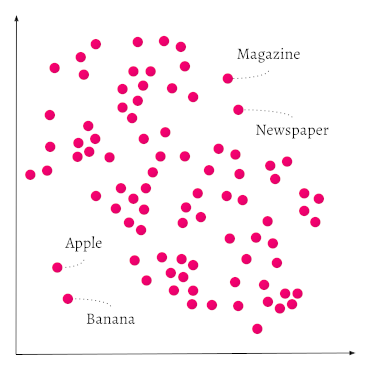
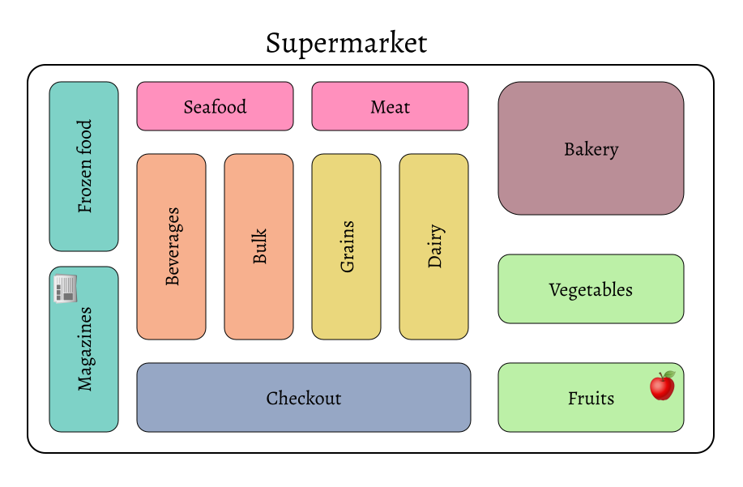
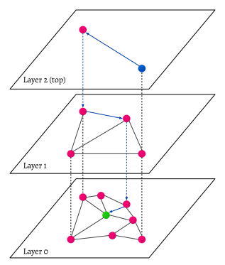
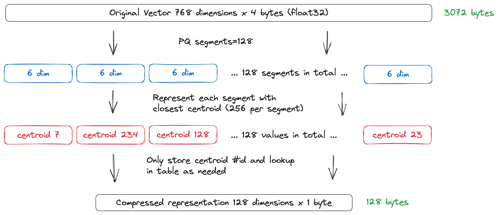

<!-- :::caution Migrated From:
- From `Vector Index (ANN) Plugins:Index` + `HNSW`
  - Note: Configuration options from `HNSW` are now in `References: Configuration/Vector index#How to configure HNSW`
::: -->

Vector indexing is a core concept in vector databases because it helps to [significantly increase the speed of the search process of similarity search](https://weaviate.io/blog/why-is-vector-search-so-fast) with only a minimal tradeoff in search accuracy.

## Overview

This page explains what vector indices are, and what purpose they serve in the Weaviate [vector database](https://weaviate.io/blog/what-is-a-vector-database).

:::info Related pages
- [Concepts: Indexing](./indexing.md)
- [Configuration: Vector index](../config-refs/schema/vector-index.md)
- [Configuration: Schema (Configure semantic indexing)](../config-refs/schema/index.md#configure-semantic-indexing)
:::

## Introduction

Weaviate's vector-first storage system takes care of all storage operations with a vector index. Storing data in a vector-first manner not only allows for semantic or context-based search, but also makes it possible to store *very* large amounts of data without decreasing performance (assuming scaled well horizontally or having sufficient shards for the indices).

## Why index data as vectors?

Vectors are a great way to represent meaning. Vectors are arrays of elements that can capture meaning from different data types, such as texts, images, videos, and other content. The elements are called dimensions. High dimension vectors capture more information, but they are harder to work with.

Vector databases make it easier to work with high dimensional vectors. Consider search; Vector databases efficiently measure [semantic similarity](https://en.wikipedia.org/wiki/Semantic_similarity) between data objects. When you run a similarity search, a vector database like Weaviate uses a vectorized version of the query to find objects in the database that have vectors similar to the query vector.

Vectors are like coordinates in a multi-dimensional space. A very simple vector might represent objects, *words* in this case, in a 2-dimensional space. If you use an algorithm that learned the relations of words or co-occurrence statistics between words from a corpus (like [GloVe](https://github.com/stanfordnlp/GloVe)), then single words can be given the coordinates (vectors or [vector embeddings](https://weaviate.io/blog/vector-embeddings-explained#what-exactly-are-vector-embeddings)) according to their similarity to other words. These algorithms are powered by Machine Learning and Natural Language Processing concepts. 

In the graph below, the words `Apple` and `Banana` are shown close to each other. `Newspaper` and `Magazine` are also close to each other, but they are far away from `Apple` and `Banana` in the same vector space.

Within each pair, the distance between words is small because the objects have similar vector representations. The distance between the pairs is larger because the difference between the vectors is larger. Intuitively, fruits are similar to each other, but fruits are not similar to reading material.

For more details of this representation, see: ([GloVe](https://github.com/stanfordnlp/GloVe)) and [vector embeddings](https://weaviate.io/blog/vector-embeddings-explained#what-exactly-are-vector-embeddings.



Another way to think of this is how products are placed in a supermarket. You'd expect to find `Apples` close to `Bananas`, because they are both fruit. But when you are searching for a `Magazine`, you would move away from the `Apples` and `Bananas`, more towards the aisle with, for example, `Newspapers`. This is how the semantics of concepts can be stored in Weaviate as well, depending on the module you're using to calculate the numbers in the vectors. Not only words or text can be indexed as vectors, but also images, video, DNA sequences, etc. Read more about which model to use [here](/developers/weaviate/modules/index.md).



## Which vector index is right for me?

Weaviate supports two index types:
* The `flat` index is a simple, lightweight index that is designed for small datasets.
* The `hnsw` index (default) is a more complex index that is slower to build, but it scales well to large datasets as queries have a logarithmic time complexity.

A simple heuristic is that for use cases such as SaaS products where each end user (i.e. tenant) has their own, isolated, dataset, the `flat` index is a good choice. For use cases with large collections, the `hnsw` index may be a better choice.

Note that the vector index type parameter only specifies how the vectors of data objects are *indexed*. The index is used for data retrieval and similarity search.

The `vectorizer` parameter determines how the data vectors are created (which numbers the vectors contain). `vectorizer` specifies a [module](/developers/weaviate/modules/index.md), such as `text2vec-contextionary`, that Weaviate uses to create the vectors. (You can also set to `vectorizer` to `none` if you want to import your own vectors).

To learn more about configuring the collection, see [this how-to page](../manage-data/collections.mdx).

### Distance metrics

All of [the distance metrics](/developers/weaviate/config-refs/distances.md), such as cosine similiarity, can be used with any vector index type.

## Set vector index type

The index type can be specified per data collection via the [collection definition](/developers/weaviate/manage-data/collections.mdx#set-vector-index-type) settings.


## What is Hierarchical Navigable Small World (HNSW)

Hierarchical Navigable Small World (HNSW) is an algorithm that works on multi-layered graphs. It is also an index type, and refers to vector indexes that are created using the HNSW algorithm. HNSW indexes enable very fast queries, but rebuilding the index when you add new vectors can be resource intensive.

Weaviate's `hnsw` index is a [custom implementation](../more-resources/faq.md#q-does-weaviate-use-hnswlib) of the Hierarchical Navigable Small World ([HNSW](https://arxiv.org/abs/1603.09320)) algorithm that offers full [CRUD-support](https://db-engines.com/en/blog_post/87).

At build time, the HNSW algorithm creates a series of layers. At query time, the HNSW algorithm uses the layers to build a list of approximate nearest neighbors (ANN) quickly and efficiently.

Consider this diagram of a vector search using HNSW.



An individual object can exist in more than one layer, but every object in the database is represented in the lowest layer (layer zero in the picture). The layer zero data objects are very well connected to each other. Each layer above the lowest layer has fewer data object, and fewer connections. The data objects in the higher layers correspond to the objects in the lower layers, but each higher layer has exponentially fewer objects than the layer below. The HNSW algorithm takes advantage of the layers to efficiently process large amounts of data.

When a search query comes in, the HNSW algorithm finds the closest matching data points in the highest layer. Then, HNSW goes one layer deeper, and finds the closest data points in that layer to the ones in the higher layer. These are the nearest neighbors. The algorithm searches the lower layer to create a new list of nearest neighbors. Then, HNSW uses the new list and repeats the process on the next layer down. When it gets to the deepest layer, the HNSW algorithm returns the data objects closest to the search query.

Since there are relatively few data objects on the higher layers, HNSW has to search fewer objects. This means HNSW 'jumps' over large amounts of data that it doesn't need to search. When a data store has only one layer, the search algorithm can't skip unrelated objects. It has to search significantly more data objects even though they are unlikely to match.

HNSW is very fast, memory efficient, approach to similarity search. The memory cache only stores the highest layer instead of storing all of the data objects in the lowest layer. When the search moves from a higher layer to a lower one, HNSW only adds the data objects that are closest to the search query. This means HNSW uses a relatively small amount of memory compared to other search algorithms.

Have another look at the diagram; it demonstrates how the HNSW algorithm searches. The blue search vector in the top layer connects to a partial result in layer one. The objects in layer one lead HNSW to the result set in layer zero. HNSW makes three hops through the layers (the dotted blue lines) and skips objects that are unrelated to the search query.

If your use case values fast data upload higher than super fast query time and high scalability, then other vector index types may be a better solution (e.g. [Spotify's Annoy](https://github.com/spotify/annoy)).

## Managing search quality vs speed tradeoffs

HNSW parameters can be adjusted to adjust search quality against speed.

The `ef` parameter is a critical setting for balancing the trade-off between search speed and quality.

The `ef` parameter dictates the size of the dynamic list used by the HNSW algorithm during the search process. A higher `ef` value results in a more extensive search, enhancing accuracy but potentially slowing down the query.

In contrast, a lower `ef` makes the search faster but might compromise on accuracy. This balance is crucial in scenarios where either speed or accuracy is a priority. For instance, in applications where rapid responses are critical, a lower `ef` might be preferable, even at the expense of some accuracy. Conversely, in analytical or research contexts where precision is paramount, a higher `ef` would be more suitable, despite the increased query time.

`ef` can be configured explicitly or dynamically. This feature is particularly beneficial in environments with varying query patterns. When `ef` is configured dynamically, Weaviate optimizes the balance between speed and recall based on real-time query requirements.

To enable dynamic `ef`, set `ef`: -1. Weaviate adjusts the size of the ANN list based on the query response limit. The calculation also takes into account the values of `dynamicEfMin`, `dynamicEfMax`, and `dynamicEfFactor`.

### Dynamic ef

The `ef` parameter controls the size of the ANN list at query time. You can configure a specific list size or else let Weaviate configure the list dynamically. If you choose dynamic `ef`, Weaviate provides several options to control the size of the ANN list.

The length of the list is determined by the query response limit that you set in your query. Weaviate uses the query limit as an anchor and modifies the size of ANN list according to the values you set for the `dynamicEf` parameters.

- `dynamicEfMin` sets a lower bound on the list length.
- `dynamicEfMax` sets an upper bound on the list length.
- `dynamicEfFactor` sets a range for the list.

To keep search recall high, the actual dynamic `ef` value stays above `dynamicEfMin` even if the query limit is small enough to suggest a lower value.

To keep search speed reasonable even when retrieving large result sets, the dynamic `ef` value is limited to `dynamicEfMax`. Weaviate doesn't exceed `dynamicEfMax` even if the query limit is large enough to suggest a higher value. If the query limit is higher than `dynamicEfMax`, `dynamicEfMax` does not have any effect. In this case, dynamic `ef` value is equal to the query limit.

To determine the length of the ANN list, Weaviate multiples the query limit by `dynamicEfFactor`. The list range is modified by `dynamicEfMin` and `dynamicEfMax`.

Consider this GraphQL query that sets a limit of 4.

```graphql
{
  Get {
    JeopardyQuestion(limit: 4) {
      answer
      question
    }
  }
}
```

Imagine the collection has dynamic `ef` configured.

```json
  "vectorIndexConfig": {
     "ef": -1,
     "dynamicEfMin": 5
     "dynamicEfMax": 25
     "dynamicEfFactor": 10
  }
```

The resulting search list has these characteristics.

- A potential length of 40 objects ( ("dynamicEfFactor": 10) * (limit: 4) ).
- A minimum length of 5 objects ("dynamicEfMin": 5).
- A maximum length of 25 objects ("dynamicEfMax": 25).
- An actual size of 5 to 25 objects.

If you use the [`docker-compose.yml` file from Weavaite](/developers/weaviate/installation/docker-compose) to run your local instance, the `QUERY_DEFAULTS_LIMIT` environment variable sets a reasonable default query limit. To prevent out of memory errors,`QUERY_DEFAULTS_LIMIT` is significantly lower than `QUERY_MAXIMUM_RESULTS`.

To change the default limit, edit the value for `QUERY_DEFAULTS_LIMIT` when you configure your Weaviate instance.


## HNSW Index with Compression

HNSW uses memory efficiently. However, you can also use compression to reduce memory requirements even more. [Product quantization (PQ)](#what-is-product-quantization) is a technique Weaviate offers that lets you compress a vector so it uses fewer bytes. Since HNSW stores vectors in memory, PQ compression lets you use larger datasets without increasing your system memory.

import PQTradeoffs from '/_includes/pq-compression/tradeoffs.mdx' ;

<PQTradeoffs />

To configure HNSW, see [Configuration: Vector index](../config-refs/schema/vector-index.md).

To configure PQ, see [Compression](/developers/weaviate/configuration/pq-compression.md).

### What is Product Quantization?

[Product quantization](https://ieeexplore.ieee.org/document/5432202) is a multi-step quantization technique that is available for use with `hnsw` indexes. Quantization techniques represent numbers with lower precision numbers. A familiar example is rounding a number to the nearest integer.

In PQ, the original vector is represented as a product of smaller vectors that are called 'segments' or 'subspaces.' Then, each segment is quantized independently to create a compressed vector representation.



After the segments are created, there is a training step to calculate 'centroids' for each segment. By default, Weaviate clusters each segment into 256 centroids. The centroids make up a codebook that Weaviate uses in later steps to compress the vectors.

Once the codebook is ready, Weaviate uses the id of the closest centroid to compress each vector segment. The new vector representation reduces memory consumption significantly. Imagine a collection where each vector has 768 four byte elements. Before PQ compression, each vector requires `768 x 4 = 3072` bytes of storage. After PQ compression, each vector requires `128 x 1 = 128` bytes of storage. The original representation is almost 24 times as large as the PQ compressed version. (It is not exactly 24x because there is a small amount of overhead for the codebook.)

To enable PQ compression, see [Enable PQ compression](/developers/weaviate/configuration/pq-compression#enable-pq-compression)

### Distance calculation and rescoring

With product quantization distances are then calculated asymmetrically with a query vector with the goal being to keep all the original information in the query vector when calculating distances.

Additionally as Weaviate has the original vectors stored on disk, rescoring will occur when using product quantization. After HNSW PQ has produced the candidate vectors from a search the original vectors will be fetched from disk improving recall. Rescoring occurs by default.

### Segments

The PQ `segments` controls the tradeoff between memory and recall. A larger `segments` parameter means higher memory usage and recall. An important thing to note is that the segments must divide evenly the original vector dimension.

Below is a list segment values for common vectorizer modules:

| Module      | Model                                   | Dimensions | Segments               |
|-------------|-----------------------------------------|------------|------------------------|
| openai      | text-embedding-ada-002                  | 1536       | 512, 384, 256, 192, 96 |
| cohere      | multilingual-22-12                      | 768        | 384, 256, 192, 96      |
| huggingface | sentence-transformers/all-MiniLM-L12-v2 | 384        | 192, 128, 96           |

### Configure an existing collection to use PQ

:::caution Important
PQ is available starting in v1.18, however we recommend using Weaviate 1.23.0 or later.
:::

To configure an existing collection (class) to use PQ, update the vector index configuration. If your collection is used in production, [backup](../configuration/backups.md) your configuration before making changes.

PQ has a training stage where it creates a codebook. When you convert an existing collection, there is some data already present. PQ needs 10,000 to 100,100,000 records per shard to create the codebook. If you have a smaller collection, consider using binary quantization (BQ) instead. If your collection is very large, PQ will reduce the memory requirements to store the collection but there is some additional overhead while PQ processes the uncompressed vectors.

To enable PQ, set `"enabled": True`. For additional configuration settings, see [Configuration: Vector index](../config-refs/schema/vector-index.md).

```python
client.schema.update_config("DeepImage", {
  "vectorIndexConfig": {
    "pq": {
      "enabled": True,
      "trainingLimit": 100000,
      "segments": 0 # see above section for recommended values
    }
  }
})
```

The command returns immediately. A background job converts the index. While the conversion is running, the index is read-only. Shard status returns to `READY` when the conversion finishes.

```python
client.schema.get_class_shards("DeepImage")

[{'name': '1Gho094Wev7i', 'status': 'READONLY'}]
```

After the PQ conversion completes, query and write to the index as normal. Distances may be slightly different due to the effects of quantization.

```python
client.query.get("DeepImage", ["i"]) \
	.with_near_vector({"vector": vector}) \
	.with_additional(["distance"]) \
	.with_limit(10).do()

{'data': {'Get': {'DeepImage': [{'_additional': {'distance': 0.18367815},
     'i': 64437},
    {'_additional': {'distance': 0.18895388}, 'i': 97342},
    {'_additional': {'distance': 0.19454134}, 'i': 14852},
    {'_additional': {'distance': 0.20019263}, 'i': 84393},
    {'_additional': {'distance': 0.20580399}, 'i': 71091},
    {'_additional': {'distance': 0.2110992}, 'i': 15182},
    {'_additional': {'distance': 0.2117207}, 'i': 92370},
    {'_additional': {'distance': 0.21241724}, 'i': 98583},
    {'_additional': {'distance': 0.21241736}, 'i': 8064},
    {'_additional': {'distance': 0.21257097}, 'i': 537}]}}}
```

### Encoders

In the configuration above you can see that you can set the `encoder` object to specify how the codebook centroids are generated. Weaviate’s PQ supports using two different encoders. The default is `kmeans` which maps to the traditional approach used for creating centroid.

Alternatively, there is also the `tile` encoder. This encoder is currently experimental but does have faster import times and better recall on datasets like SIFT and GIST. The `tile` encoder has an additional `distribution` parameter that controls what distribution to use when generating centroids. You can configure the encoder by setting `type` to `tile` or `kmeans` the encoder creates the codebook for product quantization. For more details about configuration please refer to [Configuration: Vector index](../config-refs/schema/vector-index.md).


## Flat index

:::info Added in `v1.23`
:::

The `flat` index is a simple, lightweight index that is fast to build and has a very small memory footprint. This index type is a good choice for use cases where each end user (i.e. tenant) has their own, isolated, dataset, such as in a SaaS product for example, or a database of isolated record sets.

As the name suggests, the flat index is a single layer of data objects. This provides an additional benefit of a small size. It is disk-backed, thus minimizing memory usage.

A drawback of the flat index is that it does not scale well to large collections as it has a linear time complexity as a function of the number of data objects, unlike the `hnsw` index which has a logarithmic time complexity.

### Binary quantization

Binary quantization (BQ) is a technique that can speed up vector search. BQ is available for the `flat` index type.

BQ works by converting each vector to a binary representation. The binary representation is much smaller than the original vector. For example, each vector dimension requires 4 bytes, but the binary representation only requires 1 bit, representing a 32x reduction in storage requirements. This works to speed up vector search by reducing the amount of data that needs to be read from disk, and simplifying the distance calculation.

The tradeoff is that BQ is lossy. The binary representation by nature omits a significant amount of information, and as a result the distance calculation is not as accurate as the original vector.

Some vectorizers work better with BQ than others. Anecdotally, we have seen encouraging recall with Cohere's V3 models (e.g. `embed-multilingual-v3.0` or `embed-english-v3.0`), and OpenAI's `ada-002` model with BQ enabled. We advise you to test BQ with your own data and preferred vectorizer to determine if it is suitable for your use case.

Note that when BQ is enabled, a vector cache can be used to improve query performance. The vector cache is used to speed up queries by reducing the number of disk reads for the quantized vectors. Note that it must be balanced with memory usage considerations, with each vector taking up `n_dimensions` bits.

#### Over-fetching / re-scoring

When using BQ, Weaviate will conditionally over-fetch and then re-score the results. This is because the distance calculation is not as accurate as the original vector.

This is done by fetching the higher of the specified query limit, or the rescore limit objects, and then re-score them using the full vector. As a concrete example, if a query is made with a limit of 10, and a rescore limit of 200, Weaviate will fetch `max(10, 500) = 200` objects, and then re-score the top 10 objects using the full vector. This works to offset some of the loss in search quality (recall) caused by compression.


## Asynchronous indexing

:::caution Experimental
Available starting in `v1.22`. This is an experimental feature. Please use with caution.
:::

Starting in Weaviate `1.22`, you can use asynchronous indexing by opting in.

Asynchronous indexing decouples object creation from vector index updates. Objects are created faster, and the vector index updates in the background. Asynchronous indexing is especially useful for importing large amounts of data.

While the vector index is updating, Weaviate can search a maximum of 100,000 un-indexed objects by brute force, that is, without using the vector index. This means that the search performance is slower until the vector index has been fully updated. Also, any additional new objects beyond the first 100,000 in the queue are not include in the search.


## Vector cache considerations

For optimal search and import performance, previously imported vectors need to be in memory. A disk lookup for a vector is orders of magnitudes slower than memory lookup, so the disk cache should be used sparingly. However, Weaviate can limit the number of vectors in memory. By default, this limit is set to one trillion (`1e12`) objects when a new collection is created.

During import set `vectorCacheMaxObjects` high enough that all vectors can be held in memory. Each import requires multiple searches. Import performance drops drastically when there isn't enough memory to hold all of the vectors in the cache.

After import, when your workload is mostly querying, experiment with vector cache limits that are less than your total dataset size.

Vectors that aren't currently in cache are added to the cache if there is still room. If the cache fills, Weaviate drops the whole cache. All future vectors have to be read from disk for the first time. Then, subsequent queries run against the cache until it fills again and the procedure repeats. Note that the cache can be a very valuable tool if you have a large dataset, and a large percentage of users only query a specific subset of vectors. In this case you might be able to serve the largest user group from cache while requiring disk lookups for "irregular" queries.

## Deletions

Cleanup is an async process runs that rebuilds the HNSW graph after deletes and updates. Prior to cleanup, objects are marked as deleted, but they are still connected to the HNSW graph. During cleanup, the edges are reassigned and the objects are deleted for good.

## When to skip indexing

There are situations where it doesn't make sense to vectorize a collection. For example, if the collection consists solely of references between two other collections, or if the collection contains mostly duplicate elements.

Importing duplicate vectors into HNSW is very expensive. The import algorithm checks early on if a candidate vector's distance is greater than the worst candidate's distance. When there are lots of duplicate vectors, this early exit condition is never met so each import or query results in an exhaustive search.

To avoid indexing a collection, set `"skip"` to `"true"`. By default, collections are indexed.


import DocsMoreResources from '/_includes/more-resources-docs.md';

<DocsMoreResources />
