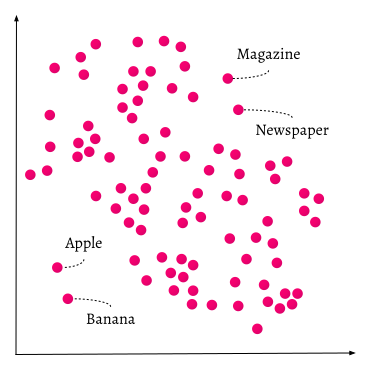

import Badges from '/_includes/badges.mdx';

<Badges/>

<!-- :::caution Migrated From:
- From `Vector Index (ANN) Plugins:Index` + `HNSW`
  - Note: Configuration options from `HNSW` are now in `References: Configuration/Vector index#How to configure HNSW`
::: -->

## Overview

This page explains what vector indices are, and what purpose they serve in Weaviate.

:::info Related pages
- [Concepts: Indexing](./indexing.md)
- [Configuration: Indexes](../configuration/indexes.md)
- [Configuration: Schema (Configure semantic indexing)](../configuration/schema-configuration.md#configure-semantic-indexing)
:::

## Introduction

Weaviate's vector-first storage system takes care of all storage operations with a vector index. Storing data in a vector-first manner not only allows for semantic or context-based search, but also makes it possible to store *very* large amounts of data without decreasing performance (assuming scaled well horizontally or having sufficient shards for the indices).

## Why index data as vectors?
Now, a long list of numbers does not carry any meaning by itself. But if the numbers in this list are chosen to indicate the [semantic similarity](https://en.wikipedia.org/wiki/Semantic_similarity) between the data objects represented by other vectors, then the new vector contains information about the data object's meaning and relation to other data.

To make this concept more tangible, think of vectors as coordinates in a *n*-dimensional space. For example, we can represent *words* in a 2-dimensional space. If you use an algorithm that learned the relations of words or co-occurrence statistics between words from a corpus (like [GloVe](https://github.com/stanfordnlp/GloVe)), then single words can be given the coordinates (vectors) according to their similarity to other words. These algorithms are powered by Machine Learning and Natural Language Processing concepts. In the picture below, you see how this concept looks (simplified). The words `Apple` and `Banana` are close to each other. The distance between those words, given by the distance between the vectors, is small. But these two fruits are further away from the words `Newspaper` and `Magazine`.



Another way to think of this is how products are placed in a supermarket. You'd expect to find `Apples` close to `Bananas`, because they are both fruit. But when you are searching for a `Magazine`, you would move away from the `Apples` and `Bananas`, more towards the aisle with, for example, `Newspapers`. This is how the semantics of concepts can be stored in Weaviate as well, depending on the module you're using to calculate the numbers in the vectors. Not only words or text can be indexed as vectors, but also images, video, DNA sequences, etc. Read more about which model to use [here](/developers/weaviate/modules/index.md).


## How to choose the right vector index type
The first vector-storage type Weaviate supports is [HNSW](./vector-index.md#hnsw), which is also the default vector index type. Typical for HNSW is that this index type is super fast at query time, but more costly when it comes to the building process (adding data with vectors). If your use case values fast data upload higher than super fast query time and high scalability, then other vector index types may be a better solution (e.g. [Spotify's Annoy](https://github.com/spotify/annoy)). If you want to contribute to a new index type, you can always contact us or make a pull request to Weaviate and build your own index type. Stay tuned for updates!

## Configuration of vector index type
The index type can be specified per data class. Currently the only index type is HNSW, so all data objects will be indexed using the HNSW algorithm unless you specify otherwise in your [data schema](/developers/weaviate/configuration/schema-configuration.md).

Example of a class [vector index configuration in your data schema](/developers/weaviate/configuration/schema-configuration.md):
```json
{
  "class": "Article",
  "description": "string",
  "properties": [
    {
      "name": "title",
      "description": "string",
      "dataType": ["text"]
    }
  ],
  "vectorIndexType": " ... ",
  "vectorIndexConfig": { ... }
}
```

Note that the vector index type only specifies how the vectors of data objects are *indexed* and this is used for data retrieval and similarity search. How the data vectors are determined (which numbers the vectors contain) is specified by the `"vectorizer"` parameter which points to a [module](/developers/weaviate/modules/index.md) such as `"text2vec-contextionary"` (or to `"none"` if you want to import your own vectors). Learn more about all parameters in the data schema [here](/developers/weaviate/configuration/schema-configuration.md).

## Can Weaviate support multiple vector index (ANN) types?

* The short answer: _yes_
* The longer answer: currently, we have a [custom implementation](../more-resources/faq.md#q-does-weaviate-use-hnswlib) of HNSW to have [full CRUD-support](https://db-engines.com/en/blog_post/87) in Weaviate. In principle, if an ANN algorithm allows for full CRUD support, Weaviate can support it. If you have ideas, suggestions, or plans (e.g., for a research project) for another ANN index type besides HNSW, please let us know in our [Slack channel](https://weaviate.io/slack).


## HNSW
[HNSW](https://arxiv.org/abs/1603.09320) is the first vector index type supported by Weaviate.

### What is HNSW?
HNSW stands for Hierarchical Navigable Small World, a multilayered graph. Every object that is in the database, are captured in the lowest layer (layer 0 in the picture). These data objects are very well connected. On each layer on top of the lowest layer, there are fewer data points represented. These datapoints match with lower layers, but there are exponentially fewer points in each higher layer. If a search query comes in, the closest datapoints will be found in the highest layer. In the example below that is only one more datapoint. Then it goes one layer deeper, and finds the closest datapoints from the first found datapoint in the highest layer, and searches nearest neighbors from there. In the deepest layer, the actual closest data object to the search query will be found.

If there were no hierarchical layers in this approach, only the deepest layer (0) would be present and significantly more datapoints would have needed to be explored from the search query, since all data objects are present there. In higher layers, with less datapoints, fewer hops between datapoints need to be made, over larger distances. HNSW is a very fast and memory efficient approach of similarity search, because only the highest layer (top layer) is kept in cache instead of all the datapoints in the lowest layer. Only the datapoints that are closest to the search query are loaded once they are requested by a higher layer, which means that only a small amount of memory needs to be reserved.

The picture shows how a HNSW algorithm is used to go from a search query vector (blue) on the top layer to the closes search result (green) in the lowest layer. Only three data hops are made (indicated by blue solid arrows), whereas more data objects would have need to be search through when this layering was not present (the closest datapoint of *all* datapoints in each layer needs to be found).h


### Distance metrics

All [distance metrics supported in Weaviate](/developers/weaviate/config-refs/distances.md) are also supported with the HNSW index type.

:::warning
Please note that HNSW+PQ is an experimental feature released with Weaviate 1.18.
:::

## HNSW with Product Quantization(PQ)
When using HNSW you can also choose to use product quantization(PQ) to compress vector representations to help reduce memory requirments. Product quantization is a technique allowing for Weaviate’s HNSW vector index to store vectors using fewer bytes. As HNSW stores vectors in memory, this allows for running larger datasets on a given amount of memory.

An important point to note is that product quantization is a tradeoff between recall and memory saving. This means that configuration settings reducing memory will also reduce recall. This is similar to how HNSW can be tuned to lower latency at the cost of recall by configuring its search parameters (`ef` and `maxConnections`). Please refer to [Configuration: Indexes](../configuration/indexes.md) for more information around how to configure PQ.

### What is PQ?

Product quantization is an approach to reduce the memory usage of vectors stored in Weaviate. Quantization is the approach of representing a range of vectors to a finite smaller set of vectors. A familiar example for a single numeric value is rounding the number to the nearest integer.

With [Product quantization](https://ieeexplore.ieee.org/document/5432202) in the context of nearest neighbour search, the vector is first split into segments (also named subspaces) and then each segment is quantized independently.

So assume we have a vector of floats with 256 dimensions and 8 segments:

[ 256 dimensions ]

This would be first segmented and represented as follows:

[ 32 ] [ 32 ] [ 32 ] [ 32 ] [ 32 ] [ 32 ] [ 32 ] [ 32 ]

We then quantize each segment using a codebook. The codebook has for each segment a set of centroids which each segment is mapped to. For instance if the first segment was closest to centroid 1 it would be represented by the id 1.

The number of possible centroids is set to 256, so this means that instead of storing 32 floats (128 bytes) we are now just storing 1 byte of information plus the overhead of the codebook.

[ id 1 ] [ id 23 ] [ id 195 ] [ id 128 ] [ id 1 ] [ id 43 ] [ id 7 ] [ id 50 ]

Distances are then calculated asymmetrically with a query vector. This means we calculate the distance as follows: `distance_pq(query_vector, quantized(store_vector))` with the goal being to keep all the information in the query vector when calculating distances.

Weaviate’s HNSW implementation assumes that product quantization will occur after some data has already been loaded. The reason for this is that the centroids found in the codebook need to be trained on existing data.

:::tip
A good recommendation is to have 10,000 to 100,000 vectors per shard loaded before enabling product quantization.
:::

### Conversion of an existing Class to use PQ
You can convert an existing class to use product quantization by changing the schema as follows. *It is recommended to run a backup first before enabling.*

```python
client.schema.update_config("DeepImage", {
    "vectorIndexConfig": {
        "pq": {
            "enabled": True,
        }
    }
})
```

:::tip
To learn more about other configuration settings for PQ refer to the documentation in [Configuration: Indexes](../configuration/indexes.md)
:::

The command will return immediately and a job will run in the background to convert an index. During this time the index will be read only. Shard status will return to `READY` after converted.

```python
client.schema.get_class_shards("DeepImage")

[{'name': '1Gho094Wev7i', 'status': 'READONLY'}]
```

You can now query and write to the index as normal. The original vectors will be returned if using _additional { vector } but the distances will be slightly different due to the effects of quantization.

```python
client.query.get("DeepImage", ["i"]) \
	.with_near_vector({"vector": vector}) \
	.with_additional(["vector", "distance"]) \
	.with_limit(10).do()

{'data': {'Get': {'DeepImage': [{'_additional': {'distance': 0.18367815},
     'i': 64437},
    {'_additional': {'distance': 0.18895388}, 'i': 97342},
    {'_additional': {'distance': 0.19454134}, 'i': 14852},
    {'_additional': {'distance': 0.20019263}, 'i': 84393},
    {'_additional': {'distance': 0.20580399}, 'i': 71091},
    {'_additional': {'distance': 0.2110992}, 'i': 15182},
    {'_additional': {'distance': 0.2117207}, 'i': 92370},
    {'_additional': {'distance': 0.21241724}, 'i': 98583},
    {'_additional': {'distance': 0.21241736}, 'i': 8064},
    {'_additional': {'distance': 0.21257097}, 'i': 537}]}}}
```

As an example please refer to example below for the different parameters that can be set to further configure PQ:

```python
client.schema.update_config("DeepImage", {
    "vectorIndexConfig": {
        "pq": {
            "enabled": True, # defaults to False
            "segments": 32, # defaults to the number of dimensions
						"encoder": {
								"type": "kmeans"  # defaults to kmeans
            }
        }
    }
})
```

### Encoders
In the configuration above you can see that you can set the `encoder` object to specify how the codebook centroids are generated. Weaviate’s PQ supports using two different encoders. The default is `kmeans` which maps to the traditional approach used for creating centroid.

Alternatively, there is also the `tile` encoder. This encoder is currently experimental but does have faster import times and better recall on datasets like SIFT and GIST. The `tile` encoder has an additional `distribution` parameter which controls what distribution to use when generating centroids. You can configure the encoder by setting `type` to `tile` or `kmeans` the encoder creates the codebook for product quantization. For more details around configuration please refer to [Configuration: Indexes](../configuration/indexes.md).

## More Resources

import DocsMoreResources from '/_includes/more-resources-docs.md';

<DocsMoreResources />
