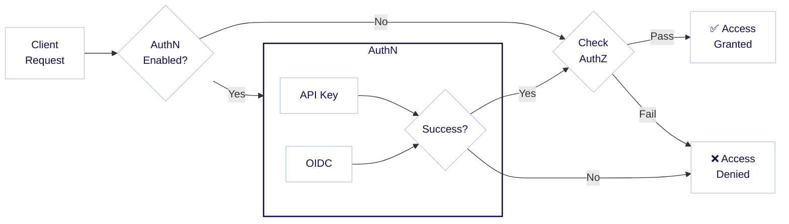

:::info Authentication and authorization
Authentication and authorization are closely related concepts, and sometimes abbreviated as `AuthN` and `AuthZ`. Authentication (`AuthN`) is the process of verifying the identity of a user, while authorization (`AuthZ`) is the process of determining what permissions the user has.
:::

Weaviate controls access through user authentication via API keys or OpenID Connect (OIDC), with an option for anonymous access. Users can then be assigned different [authorization](./authorization.md) levels, as shown in the diagram below.



For example, a user logging in with the API key `jane-secret` may be granted administrator permissions, while another user logging in with the API key `ian-secret` may be granted read-only permissions.

In summary, Weaviate allows the following authentication methods:

- API key
- OpenID Connect (OIDC)
- Anonymous access (no authentication, strongly discouraged except for development or evaluation)

Note that API key and OIDC authentication can be both enabled at the same time.

The way to configure authentication differs by your deployment method, depending on whether you are running Weaviate in Docker or Kubernetes. Below, we provide examples for both.

:::info What about Weaviate Cloud (WCD)?
For Weaviate Cloud (WCD) instances, authentication is pre-configured with OIDC and API key access. You can [authenticate against Weaviate](../connections/connect-cloud.mdx) with your WCD credentials using OIDC, or [with API keys](/developers/wcs/platform/manage-api-keys).
:::

## API Key Authentication

API key authentication is a simple and effective way to authenticate users. Each user is assigned a unique API key, which is used to authenticate the user.

### API keys: Database users

When [creating database users programatically](./rbac/manage-users.mdx#create-a-user), each user is assigned a distinct API key at creation time. These API keys can also be [regenerated (rotated)](./rbac/manage-users.mdx#rotate-user-api-key). 

### API keys: Docker

API key authentication can be configured using environment variables. In Docker Compose, set them in the configuration file (`docker-compose.yml`) such as in the following example:

```yaml
services:
  weaviate:
    ...
    environment:
      ...
      # Disable anonymous access.
      AUTHENTICATION_ANONYMOUS_ACCESS_ENABLED: 'false'

      # Enables API key authentication.
      AUTHENTICATION_APIKEY_ENABLED: 'true'

      # List one or more keys in plaintext separated by commas. Each key corresponds to a specific user identity below.
      AUTHENTICATION_APIKEY_ALLOWED_KEYS: 'user-a-key,user-b-key'

      # List one or more user identities, separated by commas. Each identity corresponds to a specific key above.
      AUTHENTICATION_APIKEY_USERS: 'user-a,user-b'
```

This configuration:
- Disables anonymous access
- Enables API key authentication
- Defines plaintext API keys in `AUTHENTICATION_APIKEY_ALLOWED_KEYS`
- Associates users with the API keys in `AUTHENTICATION_APIKEY_USERS`

These users can now be assigned permissions based on the authorization settings.

import DynamicUserManagement from '/_includes/configuration/dynamic-user-management.mdx';

<DynamicUserManagement />

:::note

Note that you can either:
- Set one user for all API keys, or
- Define one user per API key (the number of users must match the number of API keys)

Make sure all listed users are also configured in the authorization settings.

:::

### API keys: Kubernetes

For Kubernetes deployments using Helm, API key authentication can be configured in the `values.yaml` file under the `authentication` section. Here's an example configuration:

```yaml
authentication:
  anonymous_access:
    # Disable anonymous access.
    enabled: false

  apikey:
    # Enables API key authentication.
    enabled: true

    # List one or more keys in plaintext separated by commas. Each key corresponds to a specific user identity below.
    allowed_keys:
      - user-a-key
      - user-b-key

    # List one or more user identities, separated by commas. Each identity corresponds to a specific key above.
    users:
      - user-a
      - user-b
```

This configuration:
- Disables anonymous access
- Enables API key authentication
- Defines plaintext API keys in `allowed_keys`
- Associates users with the API keys in `users`

:::warning Environment Variables Take Precedence
If you configure API keys using environment variables, those settings will take precedence over the values in `values.yaml`. To use the Helm values configuration, ensure you have not set the corresponding environment variables.
:::

For enhanced security in production environments, you can store API keys in Kubernetes secrets and reference them using environment variables instead of storing them as plaintext in the Helm values.

## OIDC Authentication

OIDC authentication requires the resource (Weaviate) to validate tokens issued by an identity provider. The identity provider authenticates the user and issues tokens, which are then validated by Weaviate.

In an example setup, a Weaviate instance acts as the resource, Weaviate Cloud (WCD) acts as the identity provider, and the Weaviate client acts on behalf of the user.

Any "OpenID Connect" compatible token issuer that implements OpenID Connect Discovery is compatible with Weaviate.

This document discusses how to configure Weaviate as the resource.

<details>
  <summary>
    More about OIDC
  </summary>

With [OpenID Connect](https://openid.net/connect/) (based on OAuth2), an
external identity provider and token issuer ('token issuer' hereafter) is responsible for managing users.

OIDC authentication requires obtaining a valid token from the token issuer so that it can be sent in the header of any request to Weaviate. This applies to both REST and GraphQL requests.

When Weaviate receives a token (JSON Web Token or JWT), it verifies
that it was indeed signed by the configured token issuer. If the signature is
correct, all contents of the token are trusted, which authenticates the user based on the information in the token.

</details>

:::tip TIP: OIDC and RBAC

The [user mmanagement API](./rbac/manage-users.mdx#oidc-user-permissions-management) allows you to assign cuton roles and permissions to OIDC users via [Role-Based Access Control (RBAC)](./rbac/index.mdx).

:::

### OIDC: Docker

To configure Weaviate for OIDC-based authentication, add the following environment variables to your configuration file.

An example `docker-compose.yml` file looks like this:

```yaml
services:
  weaviate:
    ...
    environment:
      ...
      # enabled (optional - defaults to false) turns OIDC auth on. All other fields in
      # this section will only be validated if enabled is set to true.
      AUTHENTICATION_OIDC_ENABLED: 'true'

      # issuer (required) tells weaviate how to discover the token issuer. This
      # endpoint must implement the OpenID Connect Discovery spec, so that weaviate
      # can retrieve the issuer's public key.
      #
      # The example URL below uses the path structure commonly found with keycloak
      # where an example realm 'my-weaviate-usecase' was created. The exact
      # path structure depends on the token issuer. See the token issuer's documentation
      # about which endpoint implements OIDC Discovery.
      AUTHENTICATION_OIDC_ISSUER: 'http://my-token-issuer/auth/realms/my-weaviate-usecase'

      # client_id (required unless skip_client_id_check is set to true) tells
      # Weaviate to check for a particular OAuth 2.0 client_id in the audience claim.
      # This is to prevent that a token which was signed by the correct issuer
      # but never intended to be used with Weaviate can be used for authentication.
      #
      # For more information on what clients are in OAuth 2.0, see
      # https://tools.ietf.org/html/rfc6749#section-1.1
      AUTHENTICATION_OIDC_CLIENT_ID: 'my-weaviate-client'

      # username_claim (required) tells Weaviate which claim in the token to use for extracting
      # the username. The username will be passed to the authorization plugin.
      AUTHENTICATION_OIDC_USERNAME_CLAIM: 'email'

      # skip_client_id_check (optional, defaults to false) skips the client_id
      # validation in the audience claim as outlined in the section above.
      # Not recommended to set this option as it reduces security, only set this
      # if your token issuer is unable to provide a correct audience claim
      AUTHENTICATION_OIDC_SKIP_CLIENT_ID_CHECK: 'false'

      # scope (optional) these will be used by clients as default scopes for authentication
      AUTHENTICATION_OIDC_SCOPES: ''
```

:::info OIDC and Azure
As of November 2022, we were aware of some differences in Microsoft Azure's OIDC implementation compared to others. If you are using Azure and experiencing difficulties, [this external blog post](https://xsreality.medium.com/making-azure-ad-oidc-compliant-5734b70c43ff) may be useful.
:::

### OIDC: Kubernetes

For Kubernetes deployments using Helm, OIDC authentication can be configured in the `values.yaml` file under the `authentication` section. Here's an example configuration:

```yaml
authentication:
  anonymous_access:
    # Disable anonymous access.
    enabled: false
  oidc:
    # enabled (optional - defaults to false) turns OIDC auth on. All other fields in
    # this section will only be validated if enabled is set to true.
    enabled: true

    # issuer (required) tells weaviate how to discover the token issuer. This
    # endpoint must implement the OpenID Connect Discovery spec, so that weaviate
    # can retrieve the issuer's public key.
    #
    # The example URL below uses the path structure commonly found with keycloak
    # where an example realm 'my-weaviate-usecase' was created. The exact
    # path structure depends on the token issuer. See the token issuer's documentation
    # about which endpoint implements OIDC Discovery.
    issuer: 'http://my-token-issuer/auth/realms/my-weaviate-usecase'

    # client_id (required unless skip_client_id_check is set to true) tells
    # Weaviate to check for a particular OAuth 2.0 client_id in the audience claim.
    # This is to prevent that a token which was signed by the correct issuer
    # but never intended to be used with Weaviate can be used for authentication.
    #
    # For more information on what clients are in OAuth 2.0, see
    # https://tools.ietf.org/html/rfc6749#section-1.1
    client_id: 'my-weaviate-client'

    # username_claim (required) tells Weaviate which claim in the token to use for extracting
    # the username. The username will be passed to the authorization plugin.
    username_claim: 'email'

    # skip_client_id_check (optional, defaults to false) skips the client_id
    # validation in the audience claim as outlined in the section above.
    # Not recommended to set this option as it reduces security, only set this
    # if your token issuer is unable to provide a correct audience claim
    skip_client_id_check: 'false'

    # scope (optional) these will be used by clients as default scopes for authentication
    scopes: ''

    # groups_claim: ''
```

### Note: Configuring the OIDC token issuer

Configuring the OIDC token issuer is outside the scope of this document, but here are a few options as a starting point:

- For simple use-cases such as for a single user, you can use Weaviate Cloud (WCD) as the OIDC token issuer. To do so:
    - Make sure you have a WCD account (you can [sign up here](https://console.weaviate.cloud/)).
    - In the Docker Compose file (e.g. `docker-compose.yml`), specify:
      - `https://auth.wcs.api.weaviate.io/auth/realms/SeMI` as the issuer (in `AUTHENTICATION_OIDC_ISSUER`),
      - `wcs` as the client id (in `AUTHENTICATION_OIDC_CLIENT_ID`), and
      - enable the adminlist (`AUTHORIZATION_ADMINLIST_ENABLED: 'true'`) and add your WCD account email as the user (in `AUTHORIZATION_ADMINLIST_USERS`) .
      - `email` as the username claim (in `AUTHENTICATION_OIDC_USERNAME_CLAIM`).

- If you need a more customizable setup you can use commercial OIDC providers like [Okta](https://www.okta.com/).
- As another alternative, you can run your own OIDC token issuer server, which may be the most complex but also configurable solution. Popular open-source solutions include Java-based [Keycloak](https://www.keycloak.org/) and Golang-based [dex](https://github.com/dexidp/dex).

:::info
By default, Weaviate validates that the token includes a specified client id in the audience claim. If your token issuer does not support this feature, you can turn it off as outlined in the configuration section below.
:::

## Anonymous Access

Weaviate can be configured to accept anonymous requests. This is strongly discouraged except for development or evaluation purposes.

Users that send requests without explicit authentication are authenticated as `user: anonymous`.

You can use the authorization plugin to specify which permissions to apply to this `anonymous` user. If anonymous access is disabled altogether, any request without an allowed authentication scheme returns `401 Unauthorized`.

### Anonymous access: Docker

To enable anonymous access in Docker Compose, add the following environment variable to your configuration file:

```yaml
services:
  weaviate:
    ...
    environment:
      ...
      AUTHENTICATION_ANONYMOUS_ACCESS_ENABLED: 'true'
```

### Anonymous access: Kubernetes

To enable anonymous access in Kubernetes, add the following configuration to your `values.yaml` file:

```yaml
authentication:
  anonymous_access:
    enabled: true
```

## Client-side Usage

### API key

import APIKeyUsage from '/_includes/clients/api-token-usage.mdx';

<APIKeyUsage />

We recommend using a client library to authenticate against Weaviate. See [How-to: Connect](../connections/index.mdx) pages for more information.

### OIDC

The OIDC standard allows for many different methods *(flows)* of obtaining tokens. The appropriate method can vary depending on your situation, including configurations at the token issuer, and your requirements.

OIDC authentication flows are outside the scope of this documentation, but here are some options to consider:
1. Use the `client credentials flow` for machine-to-machine authorization. (Note that this authorizes an app, not a user.)
    - Validated using Okta and Azure as identity providers; GCP does not support client credentials grant flow (as of December 2022).
    - Weaviate's Python client directly supports this method.
    - Client credential flows usually do not come with a refresh token and the credentials are saved in the respective clients to acquire a new access token on expiration of the old one.
1. Use the `resource owner password flow` for trusted applications like [Weaviate Cloud](/developers/wcs/manage-clusters/connect).
1. Use `hybrid flow` if Azure is your token issuer or if you would like to prevent exposing passwords.

### Support for Weaviate clients

If Weaviate core is configured to use the `client credentials grant` flow or the `resource owner password flow`, a Weaviate client can instantiate a connection to Weaviate core that incorporates the authentication flow.

import OIDCExamples from '/_includes/code/connections/oidc-connect.mdx';

<OIDCExamples/>

### Get and pass tokens manually

<details>
  <summary>
    Manually obtaining and passing tokens
  </summary>

For cases or workflows where you may wish to manually obtain a token, we outline below the steps to do so, for the resource owner password flow and hybrid flow.

#### Resource owner password flow

1. Send a GET request to `WEAVIATE_INSTANCE_URL/v1/.well-known/openid-configuration` to fetch Weaviate's OIDC configuration (`wv_oidc_config`). Replace WEAVIATE_INSTANCE_URL with your instance URL.
1. Parse the `clientId` and `href` from `wv_oidc_config`.
1. Send a GET request to `href` to fetch the token issuer's OIDC configuration (`token_oidc_config`).
1. If `token_oidc_config` includes the optional `grant_types_supported` key, check that `password` is in the list of values.
    - If `password` is not in the list of values, the token issuer is likely not configured for `resource owner password flow`. You may need to reconfigure the token issuer or use another method.
    - If the `grant_types_supported` key is not available, you may need to contact the token issuer to see if `resource owner password flow` is supported.
1. Send a POST request to the `token_endpoint` of `token_oidc_config` with the body:
    - `{"grant_type": "password", "client_id": client_id, "username": USERNAME, "password": PASSWORD`. Replace `USERNAME` and `PASSWORD` with the actual values.
1. Parse the response (`token_resp`), and look for `access_token` in `token_resp`. This is your Bearer token.

#### Hybrid flow

1. Send a GET request to `WEAVIATE_INSTANCE_URL/v1/.well-known/openid-configuration` to fetch Weaviate's OIDC configuration (`wv_oidc_config`). Replace WEAVIATE_INSTANCE_URL with your instance URL.
2. Parse the `clientId` and `href` from `wv_oidc_config`
3. Send a GET request to `href` to fetch the token issuer's OIDC configuration (`token_oidc_config`)
4. Construct a URL (`auth_url`) with the following parameters, based on `authorization_endpoint` from `token_oidc_config`. This will look like the following:
    - `{authorization_endpoint}`?client_id=`{clientId}`&response_type=code%20id_token&response_mode=fragment&redirect_url=`{redirect_url}`&scope=openid&nonce=abcd
    - the `redirect_url` must have been [pre-registered](https://openid.net/specs/openid-connect-core-1_0.html#AuthRequest) with your token issuer.
5. Go to the `auth_url` in your browser, and log in if prompted. If successful, the token issuer will redirect the browser to the `redirect_url`, with additional parameters that include an `id_token` parameter.
6. Parse the `id_token` parameter value. This is your Bearer token.

#### Code example

This example demonstrate how to obtain an OIDC token.

```python
import requests
import re

url = "http://localhost:8080"  # <-- Replace with your actual Weaviate URL

# Get Weaviate's OIDC configuration
weaviate_open_id_config = requests.get(url + "/v1/.well-known/openid-configuration")
if weaviate_open_id_config.status_code == "404":
    print("Your Weaviate instance is not configured with openid")

response_json = weaviate_open_id_config.json()
client_id = response_json["clientId"]
href = response_json["href"]

# Get the token issuer's OIDC configuration
response_auth = requests.get(href)

if "grant_types_supported" in response_auth.json():
    # For resource owner password flow
    assert "password" in response_auth.json()["grant_types_supported"]

    username = "username"  # <-- Replace with the actual username
    password = "password"  # <-- Replace with the actual password

    # Construct the POST request to send to 'token_endpoint'
    auth_body = {
        "grant_type": "password",
        "client_id": client_id,
        "username": username,
        "password": password,
    }
    response_post = requests.post(response_auth.json()["token_endpoint"], auth_body)
    print("Your access_token is:")
    print(response_post.json()["access_token"])
else:
    # For hybrid flow
    authorization_url = response_auth.json()["authorization_endpoint"]
    parameters = {
        "client_id": client_id,
        "response_type": "code%20id_token",
        "response_mode": "fragment",
        "redirect_url": url,
        "scope": "openid",
        "nonce": "abcd",
    }
    # Construct 'auth_url'
    parameter_string = "&".join([key + "=" + item for key, item in parameters.items()])
    response_auth = requests.get(authorization_url + "?" + parameter_string)

    print("To login, open the following url with your browser:")
    print(authorization_url + "?" + parameter_string)
    print(
        "After the login you will be redirected, the token is the 'id_token' parameter of the redirection url."
    )

    # You could use this regular expression to parse the token
    resp_txt = "Redirection URL"
    token = re.search("(?<=id_token=).+(?=&)", resp_txt)[0]

print("Set as bearer token in the clients to access Weaviate.")
```

#### Token lifetime

The token has a configurable expiry time that is set by the token issuer. We suggest establishing a workflow to periodically obtain a new token before expiry.

</details>

### Add a Bearer to a Request

<APIKeyUsage />

For example, the cURL command looks like this:

```bash
curl https://localhost:8080/v1/objects -H "Authorization: Bearer ${WEAVIATE_API_KEY}" | jq
```

## Further resources

- [Configuration: Authorization and RBAC](./authorization.md)
- [References: Environment variables / Authentication and Authorization](../config-refs/env-vars/index.md#authentication-and-authorization)

## Questions and feedback

import DocsFeedback from '/_includes/docs-feedback.mdx';

<DocsFeedback/>
