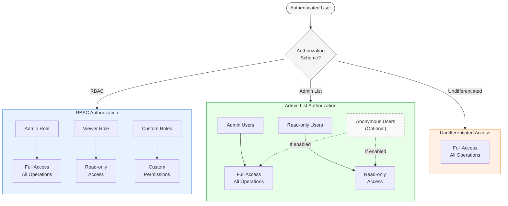

:::info Authentication and authorization
Authentication and authorization are closely related concepts, and sometimes abbreviated as `AuthN` and `AuthZ`. Authentication (`AuthN`) is the process of verifying the identity of a user, while authorization (`AuthZ`) is the process of determining what permissions the user has.
:::

Weaviate provides differentiated access through [authorization](./authorization.md) levels, based on the user's [authentication](./authentication.md) status. A user can be granted admin permission, read-only permission, or no permission at all. From `v1.28.0`, Weaviate also supports Role-Based Access Control (RBAC) for more fine-grained control over user permissions.

The following diagram illustrates the flow of a user request through the authentication and authorization process:



## Available authorization schemes

The following authorization schemes are available in Weaviate:

- [Role-Based Access Control (RBAC)](#role-based-access-control-rbac)
- [Admin list](#admin-list)
- [Undifferentiated access](#undifferentiated-access)

In the Admin list authorization scheme, [anonymous users](#anonymous-users) can be granted permissions.

The way to configure authorization differs by your deployment method, depending on whether you are running Weaviate in Docker or Kubernetes. Below, we provide examples for both.

:::info What about Weaviate Cloud (WCD)?
For Weaviate Cloud (WCD) instances, authorization is pre-configured with Admin list access. You can [authenticate against Weaviate](../connections/connect-cloud.mdx) with your WCD credentials using OIDC, or [with admin or read-only API keys](/developers/wcs/platform/manage-api-keys).
<br/>

RBAC access will be available in WCD in a future release.
:::

## Role-Based Access Control (RBAC)

:::caution RBAC technical preview
Role-based access control (RBAC) is added `v1.28` as a **technical preview**. This means that the feature is still under development and may change in future releases, including potential breaking changes. **We do not recommend using this feature in production environments at this time.**
<br/>

We appreciate [your feedback](https://forum.weaviate.io/) on this feature.
:::

Role-based access control (RBAC) is a method of restricting access to resources based on the roles of users. In Weaviate, RBAC allows you to define [roles](./roles.md) and assign permissions to those roles. Users can then be assigned to roles, and inherit the permissions associated with those roles.

Weaviate comes with a set of predefined roles. These roles are:

- `admin`: The admin role has full access to all resources in Weaviate.
- `viewer`: The viewer role has read-only access to all resources in Weaviate.

They are assigned to users based on the Weaviate configuration file. Once a user is assigned a predefined role, their permissions are set accordingly. These roles cannot be modified, and these users cannot have additional roles assigned to them.

For more information on roles and permissions, see [this page](./roles.md).

:::tip At least one admin user required
When using RBAC, you must specify at least one user with the build-in admin role. This user will have full permissions to perform all actions in Weaviate. Otherwise, Weaviate will not start.
:::

### Discussions: RBAC and performance

RBAC is a powerful feature that allows you to define fine-grained access control policies. However, it can also have an impact on performance as each operation must be checked against the user's permissions.

The exact performance impact will depend on your set up and use case. In our internal testing, the most significant performance impact was seen for object creation operations.

We did not observe additional performance penalities for using custom roles over the built-in roles.

Here are some tips to optimize performance when using RBAC:
- Monitor object creation performance
- Use a high availability (i.e. 3+ nodes) setup to distribute the load

### RBAC: Docker

RBAC authorization can be configured using environment variables. In Docker Compose, set them in the configuration file (`docker-compose.yml`) such as in the following example:

```yaml
services:
  weaviate:
    ...
    environment:
      ...
      # Example authentication configuration using API keys
      # OIDC access can also be used with RBAC
      AUTHENTICATION_ANONYMOUS_ACCESS_ENABLED: 'false'
      AUTHENTICATION_APIKEY_ENABLED: 'true'
      AUTHENTICATION_APIKEY_ALLOWED_KEYS: 'user-b-key,user-a-key,user-c-key'
      AUTHENTICATION_APIKEY_USERS: 'user-b,user-a,user-c'

      # Authorization configuration
      # Enable RBAC
      AUTHORIZATION_ENABLE_RBAC: 'true'

      # Provide pre-configured roles to users
      # This assumes that the relevant user has been authenticated and identified
      #
      # You MUST define at least one admin user
      AUTHORIZATION_ADMIN_USERS: 'user-a'
      AUTHORIZATION_VIEWER_USERS: 'user-b'
```

This configuration:
- Enables RBAC
- Configures `user-a` as a user with built-in admin permissions
- Configures `user-b` as a user with built-in viewer permissions
- Configures `user-c` as a user with no built-in permissions

The `user-c` can now be assigned custom roles and permissions using the [RBAC Roles API](./roles.md).

### RBAC: Kubernetes

For Kubernetes deployments using Helm, API key authentication can be configured in the `values.yaml` file under the `authorization` section. Here's an example configuration:

```yaml
# Example authentication configuration using API keys
authentication:
  anonymous_access:
    enabled: false
  apikey:
    enabled: true
    allowed_keys:
      - user-a-key
      - user-b-key
      - user-c-key
    users:
      - user-a
      - user-b
      - user-c

# Authorization configuration
authorization:
  rbac:
    # Enable RBAC
    enabled: true
    # Provide pre-configured roles to users
    # This assumes that the relevant user has been authenticated and identified
    #
    # You MUST define at least one admin user
    admins:
    - user-a
    viewers:
    - user-b
```

This configuration:
- Enables RBAC
- Configures `user-a` as a user with built-in admin permissions
- Configures `user-b` as a user with built-in viewer permissions
- Configures `user-c` as a user with no built-in permissions

The `user-c` can now be assigned custom roles and permissions using the [RBAC Roles API](./roles.md).

## Admin list

The "Admin list" authorization scheme allows you to specify a list of admin users with full permissions to perform all actions in Weaviate, and a list of read-only users with permissions to perform only read operations.

These permissions cannot be customized or extended. For more fine-grained control over user permissions, use [RBAC](#role-based-access-control-rbac) instead.

Admin list authorization scheme cannot be used in combination with RBAC.

### Admin list: Docker

Admin list authorization can be configured using environment variables. In Docker Compose, set them in the configuration file (`docker-compose.yml`) such as in the following example:

```yaml
services:
  weaviate:
    ...
    environment:
      ...
      # Example authentication configuration using API keys
      # OIDC access can also be used with RBAC
      AUTHENTICATION_ANONYMOUS_ACCESS_ENABLED: 'false'
      AUTHENTICATION_APIKEY_ENABLED: 'true'
      AUTHENTICATION_APIKEY_ALLOWED_KEYS: 'user-b-key,user-a-key,user-c-key'
      AUTHENTICATION_APIKEY_USERS: 'user-b,user-a,user-c'

      # Authorization configuration
      # Enable admin list
      AUTHORIZATION_ADMINLIST_ENABLED: 'true'

      # Provide pre-configured roles to users
      # This assumes that the relevant user has been authenticated and identified
      #
      # You MUST define at least one admin user
      AUTHORIZATION_ADMINLIST_USERS: 'user-a'
      AUTHORIZATION_ADMINLIST_READONLY_USERS: 'user-b'
```

This configuration:
- Enables Admin list authorization
- Configures `user-a` as a user with built-in admin permissions
- Configures `user-b` as a user with built-in viewer permissions

Note that in this configuration, `user-c` has no permissions.

### Admin list: Kubernetes

For Kubernetes deployments using Helm, API key authentication can be configured in the `values.yaml` file under the `authorization` section. Here's an example configuration:

```yaml
# Example authentication configuration using API keys
authentication:
  anonymous_access:
    enabled: false
  apikey:
    enabled: true
    allowed_keys:
      - user-a-key
      - user-b-key
      - user-c-key
    users:
      - user-a
      - user-b
      - user-c

# Authorization configuration
authorization:
  admin_list:
    # Enable admin list
    enabled: true

    # Provide pre-configured roles to users
    # This assumes that the relevant user has been authenticated and identified
    #
    # You MUST define at least one admin user
    users:
    - user-a
    read_only_users:
    - user-b
```

### Anonymous users

Anonymous users are identified as `anonymous` in Weaviate. In the Admin list authorization scheme, you can apply permissions to anonymous users. The RBAC authorization scheme is not compatible with anonymous users.

To confer permissions to anonymous users in the Admin list scheme, you can use the `anonymous` keyword in the configuration as shown below.

import Tabs from '@theme/Tabs';
import TabItem from '@theme/TabItem';

<Tabs groupId="platforms">

  <TabItem value="docker" label="Docker">

```yaml
services:
  weaviate:
    ...
    environment:
      ...
      # Enable anonymous access
      AUTHENTICATION_ANONYMOUS_ACCESS_ENABLED: 'true'

      # Configure admin user API key
      AUTHORIZATION_ADMINLIST_ENABLED: 'true'
      AUTHENTICATION_APIKEY_ALLOWED_KEYS: 'user-a-key'
      AUTHENTICATION_APIKEY_USERS: 'user-a'

      # Enable admin list and provide admin access to "user-a" only
      AUTHORIZATION_ADMINLIST_USERS: 'user-a'
      # Provide read-only access to anonymous users
      AUTHORIZATION_ADMINLIST_READONLY_USERS: 'anonymous'
```

  </TabItem>

  <TabItem value="kubernetes" label="Kubernetes">

```yaml
# Example authentication configuration using API keys
authentication:
  # Enable anonymous access
  anonymous_access:
    enabled: true

  # Enable admin list and configure admin user API key
  apikey:
    enabled: true
    allowed_keys:
      - user-a-key
    users:
      - user-a

authorization:
  # Enable admin list and provide admin access to "user-a" only
  admin_list:
    # Enable admin list
    enabled: true
    users:
    - user-a
    # Provide read-only access to anonymous users
    read_only_users:
    - anonymous
```

  </TabItem>

</Tabs>

## Undifferentiated access

Weaviate can be configured to provide undifferentiated access, by disabling authentication for example and enabling anonymous access. This configuration is strongly discouraged except for development or evaluation purposes.

## Further resources

- [Configuration: Authentication](./authentication.md)
- [Configuration: RBAC Roles](./roles.md)
- [References: Environment variables / Authentication and Authorization](../config-refs/env-vars.md#authentication-and-authorization)

## Questions and feedback

import DocsFeedback from '/_includes/docs-feedback.mdx';

<DocsFeedback/>
