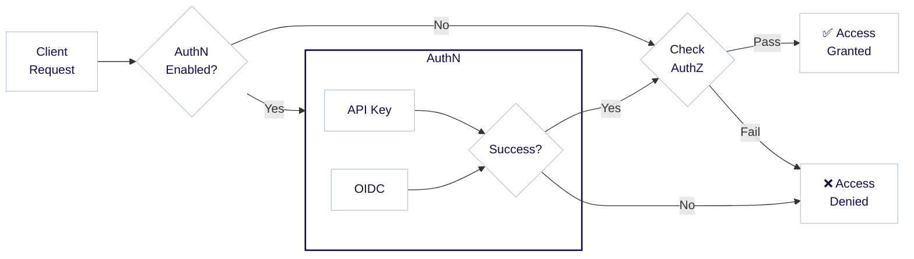

:::info Authentication and authorization
Authentication and authorization are closely related concepts, and sometimes abbreviated as `AuthN` and `AuthZ`. Authentication (`AuthN`) is the process of verifying the identity of a user, while authorization (`AuthZ`) is the process of determining what permissions the user has.
:::

Weaviate provides differentiated access through [authorization](./authorization.md) levels, based on the user's [authentication](./authentication.md) status. A user can be granted admin permission, read-only permission, or no permission at all. From `v1.28.0`, Weaviate also supports Role-Based Access Control (RBAC) for more fine-grained control over user permissions.

The following diagram illustrates the flow of a user request through the authentication and authorization process:



For example, a user logging in with the API key `jane-secret` may be granted administrator permissions, while another user logging in with the API key `ian-secret` may be granted read-only permissions.

## Available authorization schemes

The following authorization schemes are available in Weaviate:

- [Role-Based Access Control (RBAC)](#role-based-access-control-rbac)
- [Admin list](#admin-list)
- [Undifferentiated access](#undifferentiated-access)

Additionally, [anonymous users](#anonymous-users) can be granted permissions in Weaviate using either the RBAC or Admin list authorization schemes.

The way to configure authorization differs by your deployment method, depending on whether you are running Weaviate in Docker or Kubernetes. Below, we provide examples for both.

## Role-Based Access Control (RBAC)

:::info Added in `v1.28` as a preview feature
Role-Based Access Control (RBAC) is in technical preview in Weaviate `v1.28`. This feature is still under development and may change in future versions.
:::

Role-based access control (RBAC) is a method of restricting access to resources based on the roles of users. In Weaviate, RBAC allows you to define roles and assign permissions to those roles. Users can then be assigned to roles, and inherit the permissions associated with those roles.

:::caution At least one admin user required
When using RBAC, you must specify at least one user with the build-in admin role. This user will have full permissions to perform all actions in Weaviate. Otherwise, Weaviate will not start.
:::

### RBAC: Docker

RBAC authorization can be configured using environment variables. In Docker Compose, set them in the configuration file (`docker-compose.yml`) such as in the following example:

```yaml
services:
  weaviate:
    ...
    environment:
      ...
      # Example authentication configuration using API keys
      # OIDC access can also be used with RBAC
      AUTHENTICATION_ANONYMOUS_ACCESS_ENABLED: 'false'
      AUTHENTICATION_APIKEY_ENABLED: 'true'
      AUTHENTICATION_APIKEY_ALLOWED_KEYS: 'viewer-key,admin-key,other-key'
      AUTHENTICATION_APIKEY_USERS: 'viewer-user,admin-user,other-user'

      # Authorization configuration
      # Enable RBAC
      AUTHORIZATION_ENABLE_RBAC: 'true'

      # Provide pre-configured roles to users
      # This assumes that the relevant user has been authenticated and identified
      #
      # You MUST define at least one admin user
      AUTHORIZATION_ADMIN_USERS: 'admin-user'
      AUTHORIZATION_VIEWER_USERS: 'viewer-user'
```

This configuration:
- Enables RBAC
- Configures `admin-user` as a user with built-in admin permissions
- Configures `viewer-user` as a user with built-in viewer permissions
- Configures `other-user` as a user with no built-in permissions

The `other-user` can now be assigned custom roles and permissions using the [RBAC Roles API](./roles.md).

### RBAC: Kubernetes

For Kubernetes deployments using Helm, API key authentication can be configured in the `values.yaml` file under the `authorization` section. Here's an example configuration:

```yaml
# Example authentication configuration using API keys
authentication:
  anonymous_access:
    enabled: false
  apikey:
    enabled: true
    allowed_keys:
      - admin-key
      - viewer-key
      - other-key
    users:
      - admin-user
      - viewer-user
      - other-user

# Authorization configuration
authorization:
  rbac:
    # Enable RBAC
    enabled: true
    # Provide pre-configured roles to users
    # This assumes that the relevant user has been authenticated and identified
    #
    # You MUST define at least one admin user
    admins:
    - admin-user
    viewers:
    - viewer-user
```

This configuration:
- Enables RBAC
- Configures `admin-user` as a user with built-in admin permissions
- Configures `viewer-user` as a user with built-in viewer permissions
- Configures `other-user` as a user with no built-in permissions

The `other-user` can now be assigned custom roles and permissions using the [RBAC Roles API](./roles.md).

## Admin list

The "Admin list" authorization scheme allows you to specify a list of admin users with full permissions to perform all actions in Weaviate, and a list of read-only users with permissions to perform only read operations.

These permissions cannot be customized or extended. For more fine-grained control over user permissions, use [RBAC](#role-based-access-control-rbac) instead.

Admin list authorization scheme cannot be used in combination with RBAC.

### Admin list: Docker

Admin list authorization can be configured using environment variables. In Docker Compose, set them in the configuration file (`docker-compose.yml`) such as in the following example:

```yaml
services:
  weaviate:
    ...
    environment:
      ...
      # Example authentication configuration using API keys
      # OIDC access can also be used with RBAC
      AUTHENTICATION_ANONYMOUS_ACCESS_ENABLED: 'false'
      AUTHENTICATION_APIKEY_ENABLED: 'true'
      AUTHENTICATION_APIKEY_ALLOWED_KEYS: 'viewer-key,admin-key,other-key'
      AUTHENTICATION_APIKEY_USERS: 'viewer-user,admin-user,other-user'

      # Authorization configuration
      # Enable admin list
      AUTHORIZATION_ADMINLIST_ENABLED: 'true'

      # Provide pre-configured roles to users
      # This assumes that the relevant user has been authenticated and identified
      #
      # You MUST define at least one admin user
      AUTHORIZATION_ADMINLIST_USERS: 'admin-user'
      AUTHORIZATION_ADMINLIST_READONLY_USERS: 'viewer-user'
```

This configuration:
- Enables Admin list authorization
- Configures `admin-user` as a user with built-in admin permissions
- Configures `viewer-user` as a user with built-in viewer permissions

Note that in this configuration, `other-user` has no permissions.

### Admin list: Kubernetes

For Kubernetes deployments using Helm, API key authentication can be configured in the `values.yaml` file under the `authorization` section. Here's an example configuration:

```yaml
# Example authentication configuration using API keys
authentication:
  anonymous_access:
    enabled: false
  apikey:
    enabled: true
    allowed_keys:
      - admin-key
      - viewer-key
      - other-key
    users:
      - admin-user
      - viewer-user
      - other-user

# Authorization configuration
authorization:
  admin_list:
    # Enable admin list
    enabled: true

    # Provide pre-configured roles to users
    # This assumes that the relevant user has been authenticated and identified
    #
    # You MUST define at least one admin user
    users:
    - admin-user
    read_only_users:
    - viewer-user
```

## Anonymous users

Anonymous users are identified as `anonymous` in Weaviate. To confer permissions to anonymous users, you can use the `anonymous` keyword in the configuration.

For example, to allow anonymous read-only access with the Admin list authorization scheme, add the following line to the respective configuration:

import Tabs from '@theme/Tabs';
import TabItem from '@theme/TabItem';

<Tabs groupId="platforms">

  <TabItem value="docker" label="Docker">

```yaml
services:
  weaviate:
    ...
    environment:
      ...
      # Enable anonymous access
      AUTHENTICATION_ANONYMOUS_ACCESS_ENABLED: 'true'

      # Configure admin user API key
      AUTHORIZATION_ADMINLIST_ENABLED: 'true'
      AUTHENTICATION_APIKEY_ALLOWED_KEYS: 'admin-key'
      AUTHENTICATION_APIKEY_USERS: 'admin-user'

      # Enable admin list and provide admin access to "admin-user" only
      AUTHORIZATION_ADMINLIST_USERS: 'admin-user'
      # Provide read-only access to anonymous users
      AUTHORIZATION_ADMINLIST_READONLY_USERS: 'anonymous'
```

  </TabItem>

  <TabItem value="kubernetes" label="Kubernetes">

```yaml
# Example authentication configuration using API keys
authentication:
  # Enable anonymous access
  anonymous_access:
    enabled: true

  # Enable admin list and configure admin user API key
  apikey:
    enabled: true
    allowed_keys:
      - admin-key
    users:
      - admin-user

authorization:
  # Enable admin list and provide admin access to "admin-user" only
  admin_list:
    # Enable admin list
    enabled: true
    users:
    - admin-user
    # Provide read-only access to anonymous users
    read_only_users:
    - anonymous
```

  </TabItem>

</Tabs>

## Undifferentiated access

Weaviate can be configured to provide undifferentiated access, by disabling authentication for example and enabling anonymous access. This configuration is strongly discouraged except for development or evaluation purposes.

## Further resources

- [Configuration: Authentication](./authentication.md)
- [References: Environment variables / Authentication and Authorization](../config-refs/env-vars.md#authentication-and-authorization)

## Questions and feedback

import DocsFeedback from '/_includes/docs-feedback.mdx';

<DocsFeedback/>
