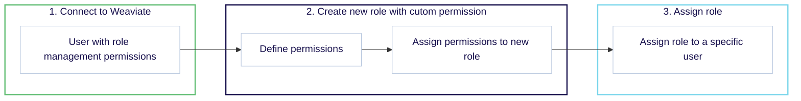

import Link from '@docusaurus/Link';
import Tabs from '@theme/Tabs';
import TabItem from '@theme/TabItem';
import FilteredTextBlock from '@site/src/components/Documentation/FilteredTextBlock';
import PyCode from '!!raw-loader!/_includes/code/python/howto.configure.rbac.permissions.py';
import RolePyCode from '!!raw-loader!/_includes/code/python/howto.configure.rbac.roles.py';

:::info Available from `v1.29`
Role-based access control (RBAC) was added in Weaviate version `v1.29`.
:::

Weaviate provides differentiated access through [authorization](/developers/weaviate/configuration/authorization) levels, based on the [authenticated](/developers/weaviate/configuration/authentication) user identity.

If role-based access control (RBAC) is enabled, access can be further restricted based on the roles of users. In Weaviate, RBAC allows you to define roles and assign permissions to those roles. Users can then be assigned to roles, and inherit the permissions associated with those roles.

Roles and permissions can be managed through the Weaviate **[REST API](/developers/weaviate/api/rest#tag/authz)** directly, or through a **[client library](/developers/weaviate/configuration/rbac/manage-roles-users)** programmatically.

## Roles

### Predefined roles

Weaviate comes with a set of predefined roles. These roles are:

- `root`: The root role has **full access** to all resources in Weaviate.
- `viewer`: The viewer role has **read-only access** to all resources in Weaviate.

The `root` role can be assigned through the Weaviate configuration file using the [`AUTHORIZATION_RBAC_ROOT_USERS`](/developers/weaviate/config-refs/env-vars#rbac-authorization) environment variable. A predefined role cannot be modified. The user can, however, be assigned additional roles through the Weaviate API.

All roles can also be assigned through the Weaviate API, including the predefined role. The predefined roles cannot be modified, but they can be assigned to or revoked from users.

Refer to the [RBAC: Configuration](/developers/weaviate/configuration/rbac/configuration) page for more information on how to assign predefined roles to users.

### Custom roles

Any authenticated user that is not assigned a predefined role has no roles or permissions by default.

These users' permissions can be modified through Weaviate by those with the appropriate permissions for **managing roles**. This allows for the creation of custom roles, which can be assigned to users as needed.

Role management can be performed with a [predefined `root` role](/developers/weaviate/configuration/rbac/configuration) or a custom role with [`manage_roles` permissions](/developers/weaviate/configuration/rbac/manage-roles-users#role-management-permissions).

:::caution Role Management Permissions
Be careful when assigning permissions to roles that manage roles. These permissions can be used to escalate privileges by assigning additional roles to users. Only assign these permissions to trusted users.
:::

## Permissions

Permissions in Weaviate define what actions users can perform on specific resources. Each permission consists of:

- A resource type (e.g., collections, objects)
- Access levels (read, write, update, delete, manage)
- Optional resource-specific constraints

### Available permissions

Permissions can be defined with the following resources, access levels and optional constraints:

<!-- TODO: Potentially replace with a React component -->
<table class="rbac-table">
  <colgroup>
    <col style={{ width: '25%' }} />
    <col style={{ width: '35%' }} />
    <col style={{ width: '40%' }} />
  </colgroup>
  <thead>
    <tr>
      <th>Resource type</th>
      <th>Access levels</th>
      <th>Optional resource‑specific constraints</th>
    </tr>
  </thead>
  <tbody>
    <tr>
      <td>
        <Link to="/developers/weaviate/configuration/rbac/manage-roles-users#role-management-permissions">
          <strong>Role Management</strong>
        </Link>
      </td>
      <td class="access-cell">
        <div class="access-level">Read roles</div>
        <div class="access-level">Manage roles</div>
      </td>
      <td class="constraints-cell">
        <div class="constraints-level">
          <p>Role name filter:</p>
          <ul>
            <li>
              <code>string or regex</code>: specifies which roles can be managed
            </li>
          </ul>
        </div>
        <div class="constraints-level">
          <p>Role scope:</p>
          <ul>
            <li>
              <code>all</code>: Allow role management with all permissions
            </li>
            <li>
              <code>match</code>: Only allow role management with the current
              user's permission level
            </li>
          </ul>
        </div>
      </td>
    </tr>
    <tr>
      <td>
        <Link to="/developers/weaviate/configuration/rbac/manage-roles-users#collections-permissions">
          <strong>Collections</strong>
        </Link>
        <br />
        <small>
          (collection definitions only, data object permissions are separate)
        </small>
      </td>
      <td class="access-cell">
        <div class="access-level">Create collections</div>
        <div class="access-level">Read collection definitions</div>
        <div class="access-level">Update collection definitions</div>
        <div class="access-level">Delete collections</div>
      </td>
      <td>
        <p>Collection name filter:</p>
        <ul>
          <li>
            <code>string or regex</code>: specifies which collections can be
            managed
          </li>
        </ul>
      </td>
    </tr>
    <tr>
      <td>
        <Link to="/developers/weaviate/configuration/rbac/manage-roles-users#tenants-permissions">
          <strong>Tenants</strong>
        </Link>
      </td>
      <td>
        <div class="access-level">Create tenants</div>
        <div class="access-level">Read tenant info</div>
        <div class="access-level">Update tenants</div>
        <div class="access-level">Delete tenants</div>
      </td>
      <td>
        <p>Tenant name filter:</p>
        <ul>
          <li>
            <code>string or regex</code>: specifies which tenants can be managed
          </li>
        </ul>
      </td>
    </tr>
    <tr>
      <td>
        <Link to="/developers/weaviate/configuration/rbac/manage-roles-users#data-permissions">
          <strong>Data Objects</strong>
        </Link>
      </td>
      <td>
        <div class="access-level">Create objects</div>
        <div class="access-level">Read objects</div>
        <div class="access-level">Update objects</div>
        <div class="access-level">Delete objects</div>
      </td>
      <td>
        <p>Collection name filter:</p>
        <ul>
          <li>
            <code>string or regex</code>: specifies which collections' objects
            can be managed
          </li>
        </ul>
      </td>
    </tr>
    <tr>
      <td>
        <Link to="/developers/weaviate/configuration/rbac/manage-roles-users#backups-permissions">
          <strong>Backups</strong>
        </Link>
      </td>
      <td>Manage backups</td>
      <td>
        <p>Collection name filter:</p>
        <ul>
          <li>
            <code>string or regex</code>: specifies which collections' backups
            can be managed
          </li>
        </ul>
      </td>
    </tr>
    <tr>
      <td>
        <Link to="/developers/weaviate/configuration/rbac/manage-roles-users#clusters-permissions">
          <strong>Cluster Data Access</strong>
        </Link>
      </td>
      <td>Read cluster metadata</td>
      <td></td>
    </tr>
    <tr>
      <td>
        <Link to="/developers/weaviate/configuration/rbac/manage-roles-users#nodes-permissions">
          <strong>Node Data Access</strong>
        </Link>
      </td>
      <td>Read node metadata at a specified verbosity level</td>
      <td class="constraints-cell">
        <div class="constraints-level">
          <p>Verbosity level:</p>
          <ul>
            <li>
              <code>minimal</code>: Minimal read permission for all collections.
            </li>
            <li>
              <code>verbose</code>: Verbose read permission for specified
              collections.
            </li>
          </ul>
        </div>
        <div class="constraints-level">
          <p>
            Collection name filter (only for <code>verbose</code>):
          </p>
          <ul>
            <li>
              <code>string or regex</code>: specifies which collections can be
              managed
            </li>
          </ul>
        </div>
      </td>
    </tr>
  </tbody>
</table>

### Permission behavior

When defining permissions, setting a permission to `False` indicates that the permission is _not set_, rather than explicitly denying access. This means that if a user has multiple roles, and one role grants a permission while another sets it to `False`, the user will still have that permission through the role that grants it.

For example, if a user has two roles:

- Role A sets `read` to `False` for Collection X
- Role B sets `read` to `True` for Collection X

The user will have read access to Collection X because Role B grants the permission, while Role A's `False` value simply indicates no permission is set rather than blocking access.

### Name filters in permissions

Some permissions require a collection name filter to specify which collections the permission applies to.

In this case, `"*"` acts as a multi-character wildcard. As an example, setting a permission with `"Test*"` as the collection name filter would apply that permission to all collections that start with `Test`. Or, setting a permission with `"*"` as the collection filter would apply that permission to all available collections.

### Collection and tenant permissions

A collection permission is independent of tenant permissions.

To have permissions to operate on a tenant that belongs to a collection, the user must have the appropriate tenant-level permissions for that collection. Collection-level permissions, such as that to create collections, do not grant the equivalent tenant-level permissions, such as that to create tenants for that collection.

For example, to create a tenant in a collection called `TestCollection`, the user must have permission to "create" tenants in that collection. This is separate from the permission to create a collection called `TestCollection`.

## Examples

Follow these general steps to configure RBAC:



### Example: Read and write permissions

#### Step 1: Connect to Weaviate

Ensure you are connected to Weaviate with a user possessing sufficient permissions to manage roles. You can achieve this by either using the predefined `root` role during [Weaviate configuration](/developers/weaviate/configuration/rbac/configuration) or by granting a user the  [`manage_roles` permission](/developers/weaviate/configuration/rbac/manage-roles-users#role-management-permissions).

<Tabs groupId="languages">
  <TabItem value="py" label="Python Client v4">
    <FilteredTextBlock
      text={RolePyCode}
      startMarker="# START AdminClient"
      endMarker="# END AdminClient"
      language="py"
    />
  </TabItem>
  <TabItem value="js" label="JS/TS Client v3">

```ts
// TS support coming soon
```

  </TabItem>
  <TabItem value="go" label="Go">

```go
// Go support coming soon
```

  </TabItem>
  <TabItem value="java" label="Java">

```java
// Java support coming soon
```

  </TabItem>
</Tabs>

#### Step 2: Create a new permission

This grants read and write permissions for collections starting with `TargetCollection`, and read permissions to nodes and cluster metadata.

<Tabs groupId="languages">
  <TabItem value="py" label="Python Client v4">
    <FilteredTextBlock
      text={PyCode}
      startMarker="# START ReadWritePermissionDefinition"
      endMarker="# END ReadWritePermissionDefinition"
      language="py"
    />
  </TabItem>
  <TabItem value="js" label="JS/TS Client v3">

```ts
// TS support coming soon
```

  </TabItem>
  <TabItem value="go" label="Go">

```go
// Go support coming soon
```

  </TabItem>
  <TabItem value="java" label="Java">

```java
// Java support coming soon
```

  </TabItem>
</Tabs>

#### Step 3: Assign the role to a user

<Tabs groupId="languages">
  <TabItem value="py" label="Python Client v4">
    <FilteredTextBlock
      text={PyCode}
      startMarker="# START ReadWritePermissionAssignment"
      endMarker="# END ReadWritePermissionAssignment"
      language="py"
    />
  </TabItem>
  <TabItem value="js" label="JS/TS Client v3">

```ts
// TS support coming soon
```

  </TabItem>
  <TabItem value="go" label="Go">

```go
// Go support coming soon
```

  </TabItem>
  <TabItem value="java" label="Java">

```java
// Java support coming soon
```

  </TabItem>
</Tabs>

### Example: Viewer permissions

#### Step 1: Connect to Weaviate

Ensure you are connected to Weaviate with a user possessing sufficient permissions to manage roles. You can achieve this by either using the predefined `root` role during [Weaviate configuration](/developers/weaviate/configuration/rbac/configuration) or by granting a user the  [`manage_roles` permission](/developers/weaviate/configuration/rbac/manage-roles-users#role-management-permissions).

<Tabs groupId="languages">
  <TabItem value="py" label="Python Client v4">
    <FilteredTextBlock
      text={RolePyCode}
      startMarker="# START AdminClient"
      endMarker="# END AdminClient"
      language="py"
    />
  </TabItem>
  <TabItem value="js" label="JS/TS Client v3">

```ts
// TS support coming soon
```

  </TabItem>
  <TabItem value="go" label="Go">

```go
// Go support coming soon
```

  </TabItem>
  <TabItem value="java" label="Java">

```java
// Java support coming soon
```

  </TabItem>
</Tabs>

#### Step 2: Create a new permission

This grants viewer permissions for collections starting with `TargetCollection`.

<Tabs groupId="languages">
  <TabItem value="py" label="Python Client v4">
    <FilteredTextBlock
      text={PyCode}
      startMarker="# START ViewerPermissionDefinition"
      endMarker="# END ViewerPermissionDefinition"
      language="py"
    />
  </TabItem>
  <TabItem value="js" label="JS/TS Client v3">

```ts
// TS support coming soon
```

  </TabItem>
  <TabItem value="go" label="Go">

```go
// Go support coming soon
```

  </TabItem>
  <TabItem value="java" label="Java">

```java
// Java support coming soon
```

  </TabItem>
</Tabs>

#### Step 3: Assign the role to a user

<Tabs groupId="languages">
  <TabItem value="py" label="Python Client v4">
    <FilteredTextBlock
      text={PyCode}
      startMarker="# START ViewerPermissionAssignment"
      endMarker="# END ViewerPermissionAssignment"
      language="py"
    />
  </TabItem>
  <TabItem value="js" label="JS/TS Client v3">

```ts
// TS support coming soon
```

  </TabItem>
  <TabItem value="go" label="Go">

```go
// Go support coming soon
```

  </TabItem>
  <TabItem value="java" label="Java">

```java
// Java support coming soon
```

  </TabItem>
</Tabs>

### Example: Tenant permissions

#### Step 1: Connect to Weaviate

Ensure you are connected to Weaviate with a user possessing sufficient permissions to manage roles. You can achieve this by either using the predefined `root` role during [Weaviate configuration](/developers/weaviate/configuration/rbac/configuration) or by granting a user the  [`manage_roles` permission](/developers/weaviate/configuration/rbac/manage-roles-users#role-management-permissions).

<Tabs groupId="languages">
  <TabItem value="py" label="Python Client v4">
    <FilteredTextBlock
      text={RolePyCode}
      startMarker="# START AdminClient"
      endMarker="# END AdminClient"
      language="py"
    />
  </TabItem>
  <TabItem value="js" label="JS/TS Client v3">

```ts
// TS support coming soon
```

  </TabItem>
  <TabItem value="go" label="Go">

```go
// Go support coming soon
```

  </TabItem>
  <TabItem value="java" label="Java">

```java
// Java support coming soon
```

  </TabItem>
</Tabs>

#### Step 2: Create a new permission

This grants permissions to manage collections starting with `TargetCollection`, and to create, read, and update tenants in the same collection.

<Tabs groupId="languages">
  <TabItem value="py" label="Python Client v4">
    <FilteredTextBlock
      text={PyCode}
      startMarker="# START MTPermissionsExample"
      endMarker="# END MTPermissionsExample"
      language="py"
    />
  </TabItem>
  <TabItem value="js" label="JS/TS Client v3">

```ts
// TS support coming soon
```

  </TabItem>
  <TabItem value="go" label="Go">

```go
// Go support coming soon
```

  </TabItem>
  <TabItem value="java" label="Java">

```java
// Java support coming soon
```

  </TabItem>
</Tabs>

#### Step 3: Assign the role to a user

<Tabs groupId="languages">
  <TabItem value="py" label="Python Client v4">
    <FilteredTextBlock
      text={PyCode}
      startMarker="# START MTPermissionsAssignment"
      endMarker="# END MTPermissionsAssignment"
      language="py"
    />
  </TabItem>
  <TabItem value="js" label="JS/TS Client v3">

```ts
// TS support coming soon
```

  </TabItem>
  <TabItem value="go" label="Go">

```go
// Go support coming soon
```

  </TabItem>
  <TabItem value="java" label="Java">

```java
// Java support coming soon
```

  </TabItem>
</Tabs>

## Additional resources

- [RBAC: Configuration](/developers/weaviate/configuration/rbac/configuration)
- [RBAC: Manage roles & users](/developers/weaviate/configuration/rbac/manage-roles-users)

## Questions and feedback

import DocsFeedback from '/_includes/docs-feedback.mdx';

<DocsFeedback/>
