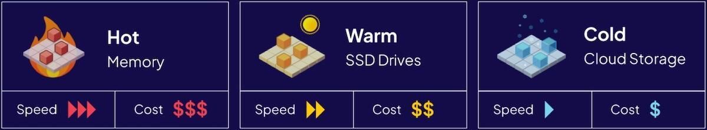

import Tabs from '@theme/Tabs';
import TabItem from '@theme/TabItem';
import FilteredTextBlock from '@site/src/components/Documentation/FilteredTextBlock';
import PyCode from '!!raw-loader!/_includes/code/howto/manage-data.multi-tenancy.py';
import TSCode from '!!raw-loader!/_includes/code/howto/manage-data.multi-tenancy.ts';

## Overview

<!-- TODO: change it so that we first list the types storage-tiers, before moving to changing -->
<!-- Weaviate uses different resources  -->

Resources used in Weaviate can be divided in three storage tiers:
* `Hot` (RAM) - fast and expensive,
* `Warm` (Disk) - medium speed and medium price,
* `Cold` (Cloud Storage) - cheap, but slow.

In multi-tenant collections, you can change tenant states (`Active`, `Inactive`, `Offloaded`) and move the data between the storage tiers. <!--This way you can manage performance and cost.-->

<!-- In multi-tenant collections, you can change tenant states to move the key resources (`vector index` and `data`) between `Hot` (RAM), `Warm` (Disk) and `Cold` (Cloud Storage) storage-tiers. -->

### Vector index temperature

When `active`, each `vector index type` uses different resources.

* [`HNSW` index (default)](/developers/academy/py/vector_index/hnsw) - stores the vector index in RAM, using **Hot** resouces.
* [`Flat` index](/developers/academy/py/vector_index/flat) - stores the vector index on disk, using **Warm** resouces.
* [`Dynamic` index](/developers/academy/py/vector_index/dynamic) - starts as a Flat index (using **Warm** resources), then when it grows bigger, it turns into an HNSW index (using **Hot** resources).

:::info HNSW index is HOT
An active `HNSW index` uses **Hot** resources.
:::

:::info Flat index is WARM
An active `Flat index` uses **Warm** resources.
:::

:::info Dynamic index is WARM=>HOT
An active `Dynamic index` uses **Warm** resources when small, and **Hot** when it gets bigger. 
:::

<!-- 
:::info HNSW index is HOT
`HNSW index` uses `Hot` resources.

Weaviate collections using [HNSW](/developers/academy/py/vector_index/hnsw) (the default vector index), store the vector index in RAM. 
:::

:::info Flat index is WARM
`Flat index` uses `Warm` resources.

Weaviate collections using [Flat](/developers/academy/py/vector_index/flat) index, store the vector index on disk. 
::: -->

## Tenant States Overview

<!-- There are three tenant states: `Active`, `Inactive` and `Offloaded`. -->

<!-- 
There are three tenant states:
* `Active` (default) - you can query and modify tenant data (CRUD).
* `Inactive` - you can't query or modify the tenant data.
  * The vector index and the data is stored locally
  * Activating the tenant is relatively fast (depending on number of objects).
* `Offloaded` - you can't query or modify the tenant data.
  * The vector index and the data is moved to a cloud storage.
  * Onloading and activating the tenant is slower than activating.  -->

<!-- You can move tenants between three different states:
* `Active` (default) - tenant is ready for queries and data manipulation.
    * `vector index` - uses `hot` resouces (with HNSW) or `warm` with (with Flat)
    * `object data` - uses `warm` resources.
* `Inactive` - tenenat can't be queried and data can't be modified.
    * `vectors index` – removed from `hot` storage, reducing the need for RAM.
    * `object data` - uses `warm` resources.
    * Activating tenant is relatively fast.
* `Offloaded` - all tenant data and vectors are moved to a cloud storage. Tenant cannot be querried, data can't be modified:
    * all resources, including vector index and object data – moved to `cold` storage. No `hot` or `warm` resources used.
    * Onloading a tenant from cloud . -->

:::info Every tenants starts Active
By default, all tenenats start as active.
:::

* `Active` (default) - you can query and modify tenant data (CRUD).
* `Inactive` - you can't query or modify tenant data.
* `Offloaded` - tenant is moved to cloud storage, you can't query or modify tenant data.

### Active Tenant Overview

:::info Active tenant requires Hot and Warm resources
:::

An `Active` tenant keeps an active `vector index` (which is required for vector search). 
Depending on the [vector index type](#vector-index-temperature) it uses either **hot** or **warm** resources.

The `object data` is stored on disk, using `warm resources.

<!-- An `Active` tenant is ready for queries and CRUD operations.

* The `vector index` is kept `active` (which is required for vector search) - depending on the [vector index type](#vector-index-temperature) it uses either hot or warm resources.
* The `object data` is stored on disk, using `warm resources. -->

<!-- An `Active` tenant uses the following resources:
* `vector index` - uses `hot` resouces (with HNSW) or `warm` with (with Flat)
* `object data` - uses `warm` resources. -->

### Inactive Tenant Overview
<!--
`Inactive` - tenenat can't be queried and data can't be modified.
* `vectors index` – removed from `hot` storage, reducing the need for RAM.
* `object data` - uses `warm` resources.
* Activating tenant is relatively fast. -->

<!-- An `Inactive` tenenat can't be queried and data can't be modified.
* The `vector index` is `inactive`, so only a copy of the vectors are kept on disk (using **Warm** resources), but no **Hot** resources are used.
* The `object data` is stored on disk, using `warm resources. -->

:::info Inactive tenant only uses Warm resources
:::

An `Inactive` tenant moves the vector index offline, which no longer requires **hot** resources (RAM), as the tenant vectors are only stored on disk.

The `object data` is stored on disk, using **warm** resources.

Since the tenant is stored locally, activating an inactive tenant is relatively fast (depending on the number of objects and vectors).  

<!-- :::info Activate to query or modify data of an `Inactive` tenant  -->
:::tip Activate to query or modify data 
To query or modify data of an `Inactive` tenant, you need to [activate the tenant](#activate-tenant).

Activating an inactive tenant is relatively fast, as it mostly needs to activate the vector index.
:::

### Offloaded Tenant Overview

:::info Offloaded tenant only uses Cold resources
:::

An `Offloaded` tenant moves all tenant data and vectors to a cloud storage, which only uses **cold** resources. No **hot** or **warm** resorces are used.

While offloaded, you cannot query or modify the data.

:::tip Activate to query or modify data 
To query or modify data of an `Offloaded` tenant, you need to [activate the tenant](#activate-tenant), which will onload the tenant data and vector and put the vector index online.

Activating an offload tenant is slower than activating an inactive tenant, as the data needs to be downloaded from the cloud.
:::

:::tip Offload tenant to save warm resources 
To save resources, you can [offload a tenant](#offload-tenant) to a cloud storage.
:::

<!-- You can move tenants between three different states:
* `Active` (default) - tenant is ready for queries and data manipulation:
    * with [HNSW Vector index](/developers/academy/py/vector_index/hnsw) - use Hot resources for the Vector Index. Data 
    * with  [Flat index](/developers/academy/py/vector_index/flat) - use Warm resources for the vectors
* `Inactive` - tenenat cannot be queried and data can't be modified -->

<!-- <Tabs groupId="indexType">
<TabItem value="hnsw" label="HNSW">

HNSW

</TabItem>
<TabItem value="flat" label="Flat">

FLAT

</TabItem>
</Tabs> -->

## Activate tenant

:::info Activating Inactive tenant
Activating an inactive tenant with HNSW index will move the vector index back to **Hot** storage.

Needs Hot (vector index) resorces
:::

:::info Activating Offloaded tenant
Activating an offloaded tenant - will load all the resources back from the cloud.

Needs Hot (HNSW) and Warm (object data) resources.
:::
<!-- > Move vector index to Hot resources -->

To activate an `INACTIVE` tenant from disk, or to onload and activate an `OFFLOADED` tenant from cloud, call:

<Tabs groupId="languages">
  <TabItem value="py" label="Python Client v4">
    <FilteredTextBlock
      text={PyCode}
      startMarker="# START ActivateTenants"
      endMarker="# END ActivateTenants"
      language="py"
    />
  </TabItem>

  <TabItem value="js" label="JS/TS Client v3">
    <FilteredTextBlock
      text={TSCode}
      startMarker="// START ActivateTenants"
      endMarker="// END ActivateTenants"
      language="ts"
    />
  </TabItem>
</Tabs>

## Deactivate tenant

:::info Added in v1.21.0
:::

To deactivate an `ACTIVE`, or to onload an `OFFLOADED` tenant from cloud (without activating it), call:

<Tabs groupId="languages">
  <TabItem value="py" label="Python Client v4">
    <FilteredTextBlock
      text={PyCode}
      startMarker="# START DeactivateTenants"
      endMarker="# END DeactivateTenants"
      language="py"
    />
  </TabItem>

  <TabItem value="js" label="JS/TS Client v3">
    <FilteredTextBlock
      text={TSCode}
      startMarker="// START DeactivateTenants"
      endMarker="// END DeactivateTenants"
      language="ts"
    />
  </TabItem>
</Tabs>

## Offload tenant

:::info Added in v1.26.0
:::

To offload an `ACTIVE` or `INACTIVE` tenant to cloud, call:

<Tabs groupId="languages">
  <TabItem value="py" label="Python Client v4">
    <FilteredTextBlock
      text={PyCode}
      startMarker="# START OffloadTenants"
      endMarker="# END OffloadTenants"
      language="py"
    />
  </TabItem>

  <TabItem value="js" label="JS/TS Client v3">
    <FilteredTextBlock
      text={TSCode}
      startMarker="// START OffloadTenants"
      endMarker="// END OffloadTenants"
      language="ts"
    />
  </TabItem>
</Tabs>

:::warning Requires Offload Module 
Tenant offloading requires and Offload module.

To configure tenant offloading, see the [modules page](../configuration/modules.md#tenant-offload-modules)
:::

## Automatically activate tenants

:::info Added in `v1.25.2`
:::

Enable this to automatically activate `INACTIVE` tenants if a read-or-write request comes. This is disabled by default.

<Tabs groupId="languages">
  <TabItem value="py" label="Python Client v4">
    <FilteredTextBlock
      text={PyCode}
      startMarker="# START EnableAutoActivation"
      endMarker="# END EnableAutoActivation"
      language="py"
    />
  </TabItem>

  <TabItem value="js" label="JS/TS Client v3">
    <FilteredTextBlock
      text={TSCode}
      startMarker="// START EnableAutoActivation"
      endMarker="// END EnableAutoActivation"
      language="ts"
    />
  </TabItem>

</Tabs>