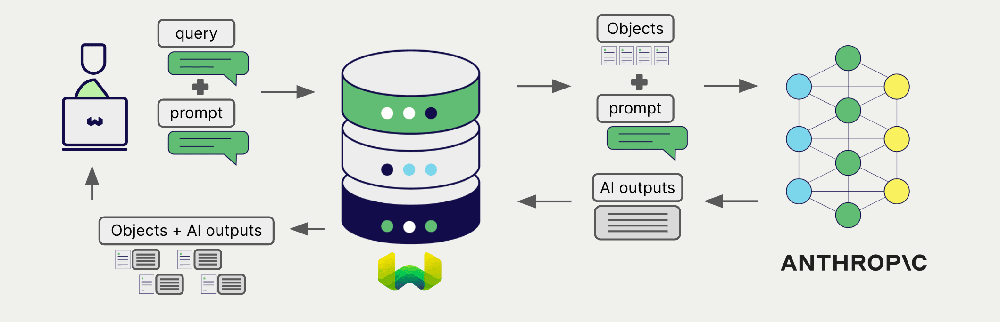
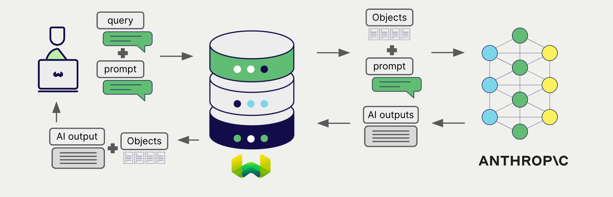

# Anthropic Generative AI with Weaviate

import BetaPageNote from '../_includes/beta_pages.md';

<BetaPageNote />

import Tabs from '@theme/Tabs';
import TabItem from '@theme/TabItem';
import FilteredTextBlock from '@site/src/components/Documentation/FilteredTextBlock';
import PyConnect from '!!raw-loader!../_includes/provider.connect.py';
import TSConnect from '!!raw-loader!../_includes/provider.connect.ts';
import PyCode from '!!raw-loader!../_includes/provider.generative.py';
import TSCode from '!!raw-loader!../_includes/provider.generative.ts';

Weaviate's integration with Anthropic's APIs allows you to access their models' capabilities directly from Weaviate.

[Configure a Weaviate collection](#configure-collection) to use an Anthropic generative AI model, and Weaviate will perform retrieval augmented generation (RAG) using the specified model and your Anthropic API key.

More specifically, Weaviate will perform a search, retrieve the most relevant objects, and then pass them to the Anthropic generative model to generate outputs.

## Requirements

### Weaviate configuration

Your Weaviate instance must be configured with the Anthropic generative AI integration (`generative-anthropic`) module.

  
For Weaviate Cloud (WCD) users

This integration is enabled by default on Weaviate Cloud (WCD) serverless instances.

  
For self-hosted users

- Check the [cluster metadata](../../config-refs/meta.md) to verify if the module is enabled.
- Follow the [how-to configure modules](../../configuration/modules.md) guide to enable the module in Weaviate.

### API credentials

You must provide a valid Anthropic API key to Weaviate for this integration. Go to [Anthropic](https://www.anthropic.com/api) to sign up and obtain an API key.

Provide the API key to Weaviate using one of the following methods:

- Set the `ANTHROPIC_APIKEY` environment variable that is available to Weaviate.
- Provide the API key at runtime, as shown in the examples below.

<Tabs groupId="languages">

 <TabItem value="py" label="Python API v4">
    <FilteredTextBlock
      text={PyConnect}
      startMarker="# START AnthropicInstantiation"
      endMarker="# END AnthropicInstantiation"
      language="py"
    />
  </TabItem>

 <TabItem value="js" label="JS/TS API v3">
    <FilteredTextBlock
      text={TSConnect}
      startMarker="// START AnthropicInstantiation"
      endMarker="// END AnthropicInstantiation"
      language="ts"
    />
  </TabItem>

</Tabs>

## Configure collection

[Configure a Weaviate collection](../../manage-data/collections.mdx#specify-a-generative-module) to use an Anthropic generative AI model as follows:

<Tabs groupId="languages">
  <TabItem value="py" label="Python API v4">
    <FilteredTextBlock
      text={PyCode}
      startMarker="# START BasicGenerativeAnthropic"
      endMarker="# END BasicGenerativeAnthropic"
      language="py"
    />
  </TabItem>

  <TabItem value="js" label="JS/TS API v3">
    <FilteredTextBlock
      text={TSCode}
      startMarker="// START BasicGenerativeAnthropic"
      endMarker="// END BasicGenerativeAnthropic"
      language="ts"
    />
  </TabItem>

</Tabs>

You can [specify](#generative-parameters) one of the [available models](#available-models) for Weaviate to use. The [default model](#available-models) is used if no model is specified.

### Select a model

You can specify one of the [available models](#available-models) for Weaviate to use, as shown in the following configuration example:

<Tabs groupId="languages">
  <TabItem value="py" label="Python API v4">
    <FilteredTextBlock
      text={PyCode}
      startMarker="# START GenerativeAnthropicCustomModel"
      endMarker="# END GenerativeAnthropicCustomModel"
      language="py"
    />
  </TabItem>

  <TabItem value="js" label="JS/TS API v3">
    <FilteredTextBlock
      text={TSCode}
      startMarker="// START GenerativeAnthropicCustomModel"
      endMarker="// END GenerativeAnthropicCustomModel"
      language="ts"
    />
  </TabItem>

</Tabs>

## Retrieval augmented generation

After configuring the generative AI integration, perform RAG operations, either with the [single prompt](#single-prompt) or [grouped task](#grouped-task) method.

### Single prompt

To generate text for each object in the search results, use the single prompt method.

The example below generates outputs for each of the `n` search results, where `n` is specified by the `limit` parameter.

When creating a single prompt query, use braces `{}` to interpolate the object properties you want Weaviate to pass on to the language model. For example, to pass on the object's `title` property, include `{title}` in the query.

<Tabs groupId="languages">

 <TabItem value="py" label="Python API v4">
    <FilteredTextBlock
      text={PyCode}
      startMarker="# START SinglePromptExample"
      endMarker="# END SinglePromptExample"
      language="py"
    />
  </TabItem>

 <TabItem value="js" label="JS/TS API v3">
    <FilteredTextBlock
      text={TSCode}
      startMarker="// START SinglePromptExample"
      endMarker="// END SinglePromptExample"
      language="ts"
    />
  </TabItem>

</Tabs>

### Grouped task

To generate one text for the entire set of search results, use the grouped task method.

In other words, when you have `n` search results, the generative model generates one output for the entire group.

<Tabs groupId="languages">

 <TabItem value="py" label="Python API v4">
    <FilteredTextBlock
      text={PyCode}
      startMarker="# START GroupedTaskExample"
      endMarker="# END GroupedTaskExample"
      language="py"
    />
  </TabItem>

 <TabItem value="js" label="JS/TS API v3">
    <FilteredTextBlock
      text={TSCode}
      startMarker="// START GroupedTaskExample"
      endMarker="// END GroupedTaskExample"
      language="ts"
    />
  </TabItem>

</Tabs>

## References

### Generative parameters

Configure the following generative parameters to customize the model behavior.

<Tabs groupId="languages">
  <TabItem value="py" label="Python API v4">
    <FilteredTextBlock
      text={PyCode}
      startMarker="# START FullGenerativeAnthropic"
      endMarker="# END FullGenerativeAnthropic"
      language="py"
    />
  </TabItem>

  <TabItem value="js" label="JS/TS API v3">
    <FilteredTextBlock
      text={TSCode}
      startMarker="// START FullGenerativeAnthropic"
      endMarker="// END FullGenerativeAnthropic"
      language="ts"
    />
  </TabItem>

</Tabs>

For further details on model parameters, see the [Anthropic API documentation](https://www.anthropic.com/docs).

#### Maximum output tokens

Use the `maxTokens` parameter to set the maximum number of output tokens for the Anthropic Generative AI models. This parameter is separate from the maximum allowable input tokens, also called a "context window".

For most models, the default `maxTokens` value is `4096`, which is the maximum, and the input (context window) size is `200,000`. The specific allowable values may vary between models. Refer to the [Anthropic documentation](https://docs.anthropic.com/en/docs/about-claude/models#model-comparison) for the latest information.

#### Base URL

Note that for Anthropic, you can provide a custom base URL for the API endpoint. This is useful for users who have a dedicated API endpoint, or is behind a proxy.

The custom base URL can be provided via the collection configuration as shown above, or in the header of the request. To provide it in the header, instantiate the Weaviate client using the `X-Anthropic-Baseurl` key and the custom base URL as the value.

The default base URL is `https://api.anthropic.com`.

### Available models

Any model available in the Anthropic API can be used with Weaviate. As of July 2024, the following models are available:

- `claude-3-5-sonnet-20240620` (default)
- `claude-3-opus-20240229`
- `claude-3-sonnet-20240229`
- `claude-3-haiku-20240307`

See the [Anthropic API documentation](https://docs.anthropic.com/en/docs/about-claude/models#model-names) for the most up-to-date list of available models.

## Further resources

### Code examples

Once the integrations are configured at the collection, the data management and search operations in Weaviate work identically to any other collection. See the following model-agnostic examples:

- The [how-to: manage data](../../manage-data/index.md) guides show how to perform data operations (i.e. create, update, delete).
- The [how-to: search](../../search/index.md) guides show how to perform search operations (i.e. vector, keyword, hybrid) as well as retrieval augmented generation.

### References

- Anthropic [API documentation](https://www.anthropic.com/docs)

import DocsFeedback from '/_includes/docs-feedback.mdx';

<DocsFeedback/>
